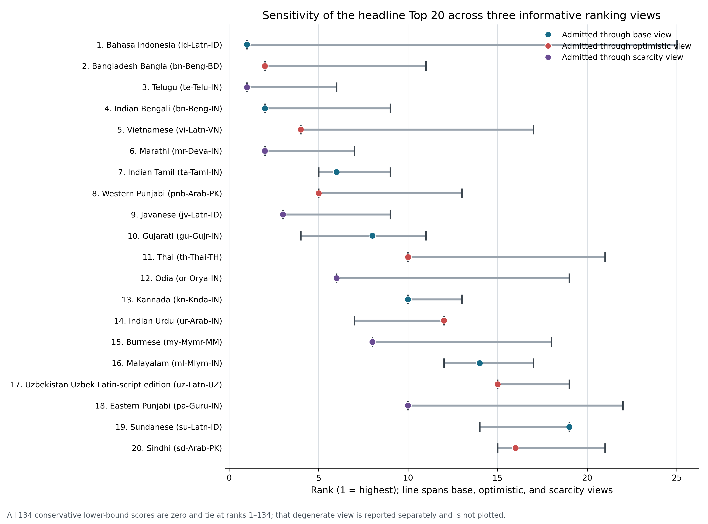

# Allocating AI Translation Compute for Marginal Educational Access

## A global language, interlanguage, accessibility, and open-curriculum portfolio model

**Research report**  
**Date:** 2026-08-30 (revised)

## Abstract

Artificial intelligence sharply reduces some costs of adapting open educational
resources, but “translate into the largest language” is not an adequate allocation
rule. A useful portfolio must ask how many people gain *new, comfortable, usable*
access; which content is absent; whether another edition or academic lingua franca
already serves the same readers; whether the output works in the relevant script,
device, bandwidth, and disability context; and how much source preparation,
terminology work, mathematical checking, correction, and maintenance the edition
requires. This paper constructs a reproducible global allocation model around that
marginal-access question. It joins dated language-population observations to exact
language/variety/script/territory interventions, local Open Logic and OpenStax
workloads, advanced-material scarcity proxies, accessibility requirements, and
evidence-bounded interlanguage architectures. The common language-priority
comparator is a 210-unit, 120,083-source-token formal-reasoning curriculum; larger
OpenStax portfolios are costed separately so that useful breadth is not mistaken for
inefficiency. A population-specific needs layer then separates foundational numeracy
recovery, bilingual academic-register transfer, secondary-to-tertiary bridging,
coherent undergraduate sequences, and advanced/reference work: population rank does
not select the same textbook for everyone. Gross demographic ceilings,
evidence-backed marginal floors, and
wide neutral sensitivities are reported separately. Constructed bridges receive no
blanket family reach; shared semantic cores receive compute savings only through
explicitly named localized outputs. The corrected source register contains 475
population observations and 81 registered source records from 58 distinct authority
labels; 143 exact natural-language/profile
interventions were scored and 134 passed the cardinal eligibility gate. No intervention
has a positive registered cardinal lower bound because at least one access or non-
overlap factor remains unbounded; this fail-closed accounting floor is not evidence of
zero educational benefit. The headline portfolio therefore alternates explicitly
labelled base, optimistic, and scarcity sensitivities rather than fabricating a strict
conservative order. An earlier build wrongly excluded Bahasa Indonesia because existing
work placed it in a completion-only bookkeeping class. On the same ex-ante basis used
for every other natural-language candidate, the official 2022 BPS functional-language
ceiling places Bahasa Indonesia first in the base and optimistic views. The corrected
Top 10 is Bahasa Indonesia, Bangladesh Bangla, Telugu, Indian Bengali, Vietnamese,
Marathi, Indian Tamil, Western Punjabi, Javanese, and Gujarati. The first
needs-audited products range from an exact-gap audit of the existing Indonesian program and
Bangla/Tamil/Gujarati foundational-recovery packages to a Vietnamese
precalculus-to-undergraduate spine; Japanese school algebra is a negative control,
while advanced Japanese algebra and geometry remain a legitimate targeted lane.
Costing the 100 selected language positions against the fixed Formal Reasoning Core
comparator yields 91.274 million, 407.305 million, or 1.866 billion gross tokens under
the low, base, and high workflows; these are workload comparators, not the needs-
optimal first packages. An empirical Indonesian audit confirms the distinction: over
a defined 2026-08-20 to 2026-08-29 root-event window, 33 user-visible roots recorded
83.639 billion total tokens, 97.714% of gross input was
cached, and a broader 6,726-thread descendant closure recorded 10.253 trillion
cumulative total tokens. Those nested boundaries and a separate 88.493-million-token
pursuit-goal attribution ledger are reported without addition or price conversion. Four
shared-core package models with complete component joins show modeled base-scenario
savings of 25%-37.5%,
but remain noncardinal because their frozen population-link controls do not authorize
additive package unions. This lack of a registered demographic multiplier is not a
finding of zero mathematical usefulness: formal density and reader expertise make
receptive interlanguage use more plausible in advanced mathematics than in novice
exposition, and the paper specifies how to measure that breakpoint. Eleven
accessibility interventions are preserved in a
separate safeguard backlog because their linguistic and disability/connectivity
population ceilings overlap. The result is a grant-oriented commissioning order
with exact production identities, machine-readable provenance, open-license and
one-download offline eligibility, and uncertainty that remains visible rather than
being converted into invented precision.

**Keywords:** educational access; language of instruction; open educational
resources; machine translation; low-resource languages; interlanguages; OpenStax;
Open Logic Project; accessibility; cost-effectiveness

## 1. Introduction

The relevant optimization problem is not how many translated files an AI system can
produce. It is how much *additional usable educational access* a finite amount of
compute can create. Those quantities diverge whenever a nominal language edition is
not readable in the relevant variety or script, duplicates comfortable access through
another language, contains content above the learner's current level, fails to reach
low-bandwidth or disabled readers, or remains detached from instruction and actual
use.

Two widely cited global language-of-education statistics illustrate why the
denominator must be defined before it is optimized. Walter and Benson's (2012)
Table 14.2 (p. 283) estimated that 3,741,110,588 people belonged to languages used in formal
education and 2,300,263,716 to languages not used, yielding 61.9% and 38.1% of their
covered global population. The same table reported 97 languages with more than ten
million speakers: 52 used in education and 45 not used. Those 45 accounted for
1,120,220,125 people, almost half of the population in the table's “not used” side.
The chapter prints size bands, not a list of the 97 languages. It therefore supports
a concentration argument - large neglected languages matter - but cannot identify a
modern target list.

The World Bank's later estimate is different. It reports that approximately 37% of
students in low- and middle-income countries, about 370 million of roughly one
billion students, are taught in a language other than their first language or the
language they best speak and understand (World Bank, 2021). This is a student and
instructional-language estimate, not Walter and Benson's global language-population
calculation. Neither percentage can be multiplied by every named language population
to manufacture the number a translation would reach.

The underlying distribution nevertheless makes allocation consequential. In Walter
and Benson's (2012) table, the 45 noneducation languages above ten million and the 662 in
the 250,000-9,999,999 band together represented 2,088,576,471 people - 90.8% of the
population assigned to languages not used in education. A compute program can thus
combine two aims rather than choose between them: large exact-language editions can
deliver enormous aggregate reach, while smaller endangered, signed, Indigenous, and
minoritized-language editions can expand public function, regional depth, and
prestige domains that a population-only ranking erases.

AI changes the feasible frontier but not the definition of access. Multilingual
models, terminology constraints, deterministic source pipelines, independent model
critique, and formula/structure checks make many editions cheaper and more auditable.
Yet low-resource model performance, corpus quality, dialect coverage, and specialist
terminology remain uneven (Blasi et al., 2022; Dinu et al., 2019; Kantharuban et al.,
2023; Kreutzer et al., 2022; NLLB Team, 2024; Robinson et al., 2023). A global
portfolio therefore needs exact target identities, an explicit overlap model, and
uncertainty that remains visible rather than being compressed into an opaque score.

## 2. Research questions

The study asks:

1. Which exact language, variety, script, territory, and accessibility interventions
   have the largest dated source-population ceilings among communities not already
   represented by the local Open Logic/OpenStax portfolio?
2. How do those ceilings change after directly evidenced or bounded deductions for
   literacy/modality access, academic-lingua-franca access, and existing editions?
3. Which open curriculum package provides the most defensible first educational
   intervention for each population, using Open Logic and OpenStax as measured
   baselines rather than as an exhaustive source universe?
4. How many low/base/high inference tokens and API-equivalent dollars would those
   packages require under a reproducible multi-pass translation and audit workflow?
5. When can an interlanguage, pluricentric semantic core, dual-script package, or
   natural-intercomprehension workflow improve reach per compute relative to separate
   editions?
6. Which exact natural-language or shared-core interventions form a deduplicated Top
   10 and Top 100 under reach-first, scarcity, and overlap sensitivities, and which
   accessibility mechanisms must be retained as separate horizontal safeguards because
   their residual beneficiary counts cannot yet be ranked cardinally?

## 3. Conceptual framework

### 3.1 Access is not learning, but it is a necessary input

Language adaptation can remove a barrier without guaranteeing learning. A translated
edition must still be instructionally appropriate, delivered, used, and integrated
with practice. This paper therefore ranks **expected marginal educational access**
rather than test-score effects. Learning-adjusted benefits require a specified
deployment and appear only as a later scenario.

This choice also follows comparative cost-effectiveness practice: a common numerator
is useful only when its outcome definition and cost boundary remain explicit
(Angrist et al., 2025; Dhaliwal et al., 2013). Here the common numerator is access
created, not a synthetic learning-effect estimate.

For population cell \(c\), intervention \(i\), and curriculum unit \(k\):

\[
EMA_{cik}=N_c D_{ck} C_{ci} P_{ci} U_{ci} R_{ck},
\]

where \(N\) is a dated source population; \(D\) is the missing-content share;
\(C\) is comprehension of the proposed linguistic surface; \(P\) is practical
written, signed, device, bandwidth, and disability access; \(U\) is residual
non-overlap; and \(R\) is relevance of the fixed curriculum to the specified learner
stratum. Scarcity, vitality/equity, prestige-domain value, production feasibility,
and dialect-flattening risk remain separate views rather than invisible multipliers
of people.

This extends the recovered local marginal-intelligibility formalism
(*Crosswalk to earlier local marginal-intelligibility research*, n.d.;
*Marginal-intelligibility opportunity heuristic for OpenLogic*, n.d.). Its core
opportunity dimensions are newly comfortable readers (R), scarcity (S), practical
accessibility (A), and non-overlap (N), with vitality/prestige/feasibility/risk kept
separate. Numeric intervals refine those bands without redefining them.

### 3.2 Three quantities that must not be conflated

Every language table distinguishes:

- **source observation:** exactly what the source counted, including year, unit, and
  measure type;
- **new-edition access ceiling:** the compatible written or modality population for
  an exact target; and
- **marginal comfortable-access range:** the residual after access through existing
  editions and academic lingua francas is deducted.

A mother-tongue census count, a household-language count, self-reported speaking
ability, an ethnic-group population, a refugee caseload, and school enrolment are not
interchangeable. Aggregate Quechua, Nahuatl, Maya, Cree, Ojibwe, Inuktut, Fula,
Kurdish, Amazigh, or Romani labels are not assigned to a single edition surface.

### 3.3 Interlanguage mechanisms

“Interlanguage” covers mechanisms with different numerators and denominators:

1. A **constructed bridge surface** seeks receptive comprehension across named
   communities. It earns reach only from evidence for that surface, script, cohort,
   and task.
2. A **pluricentric shared semantic core** generates explicitly named localized
   outputs. Reach belongs to each native-language output; the shared source reduces
   compute.
3. **Natural intercomprehension reuse** shares terminology, source structure, and QA
   across related languages while preserving separate editions.
4. A **dual-script/register package** produces synchronized outputs for one language
   continuum without adding script populations twice.
5. An **accessibility derivative** removes a format, device, register, or disability
   barrier within a language population and never substitutes for linguistic access.

This taxonomy prevents a family name from turning into hundreds of millions of
unsupported readers. The current Interslavic evidence includes an approximately .84
pooled result on a seven-gap short written cloze task, but no low/high interval and no
demonstration of sustained mathematical reading. The pooled point is retained as an
upper-bound research sensitivity; it is not inherited by Russian, Ukrainian, Polish,
Czech, Slovak, South Slavic, or minority-language leaves (Merunka et al., 2019).

### 3.4 Mathematics changes the interlanguage prior

The absence of a registered population multiplier is not evidence that an
interlanguage is useless. Mathematics is a mixed semiotic system: prose, symbols,
diagrams, layout, and previously learned formal structures jointly carry meaning.
Expert mathematicians reading unfamiliar advanced material use disciplinary
knowledge, examples, self-checks, and structural expectations differently from less
experienced readers (Shepherd & van de Sande, 2014). Neurocognitive evidence also
separates high-level mathematical reasoning from ordinary-language processing in
important respects (Amalric & Dehaene, 2016). These findings make cross-language or
interlanguage reading more plausible in mathematically expert, symbol-dense settings
than it would be for ordinary expository prose.

The effect cannot be generalized downward. Mathematical textbooks continually ask
readers to switch between words and symbols; in a 180-page stratified textbook sample,
4,242 symbolic structures were coded in 180 randomly selected textbook pages, and 82%
were connected to natural language (Wikström Hultdin et al., 2023). Symbolic
mathematical text can itself be difficult for students to comprehend (Österholm,
2006), and word problems,
definitions, motivation, and error explanations remain linguistically dense.
Accordingly, the model uses an **expertise x formal-density prior**:

- foundational and remedial material receives no assumed cross-language benefit;
- secondary and undergraduate material is task-dependent;
- advanced/reference material receives a higher research prior for receptive
  interlanguage usefulness, but only measured task evidence can turn that prior into
  a cardinal beneficiary count.

This breakpoint makes interlanguages a serious mathematical research and production
hypothesis without turning a family name into automatic comprehension.

## 4. Evidence from education, OER, AI, and accessibility

### 4.1 Familiar-language instruction can help, with heterogeneous effects

Nakamura et al.'s (2023) systematic review included 45 studies and found positive
pooled effects for several literacy outcomes: letter knowledge, sentence reading,
reading comprehension, and national-language reading comprehension. Word reading
was near zero, and writing evidence rested on one study. The result supports language
as an enabling condition, not one transportable effect size.

Setting-specific evidence shows both upside and implementation risk. A Kom-medium
program in 24 Cameroonian schools reported large early gains and persistent later
gains after transition to English (Laitin et al., 2019). South African administrative
panel evidence associated early transition to English with lower later English
achievement than three years of home-language instruction (Taylor & von Fintel,
2016). Conversely, a Kenyan trial adding Lubukusu or Kikamba literacy to an
English/Kiswahili package did not improve the wider-language outcomes and produced
lower mathematics results in that implementation; limited classroom use, teacher
language mismatch, and resistance mattered (Piper, Zuilkowski, Kwayumba, et al.,
2018).

One official language-specific administrative example shows why the global 37%-40%
figures cannot simply be assigned to every language. South Africa's 2016 school
tabulation reported 2,402,540 Foundation Phase learners whose school offered a
language of learning and teaching matching home language and 540,484 whose school did
not; in Intermediate Phase the corresponding counts were 585,808 and 1,844,086
(Department of Basic Education, 2023). These are phase-specific principal-reported
EMIS cells with verification warnings, not a global causal estimate or a count that
can be multiplied by the 2022 census. They do, however, identify a concrete cohort and
show how medium-of-instruction mismatch can rise sharply after the early grades.

The allocation consequence is precise: familiar-language evidence justifies a
linguistic-usability term and exact cohort research. It does not justify multiplying a
static PDF by a generic standardized-effect coefficient.

### 4.2 Teacher-independent packages and classroom packages are complementary

The target user is not assumed to have a teacher. A motivated learner who can obtain
the package once should be able to place themselves, follow a prerequisite path,
study worked examples, attempt exercises, diagnose errors, and check complete public
solutions offline. Worked examples can reduce unnecessary search while learners
acquire algebraic schemas (Sweller & Cooper, 1985). Direct learner-facing digital
mathematics interventions have also produced gains in settings with limited
resources, including a randomized tablet intervention in Malawi (Pitchford, 2015).
Neither result proves that a book alone teaches everyone; it supports treating
diagnostics, examples, practice, and feedback as part of the product rather than
assuming a teacher supplies them.

Classroom adoption remains a complementary route. In a Kenyan randomized evaluation,
professional development, coaching, student books, and structured teacher guides
operated as a package and produced large gains; teacher guides added little cost
relative to the other components in that setting (Piper, Zuilkowski, Dubeck, et al.,
2018). McEwan's (2015) meta-analysis found positive average effects across several
intervention classes but also showed that composite treatments and sparse cost data
complicate category rankings.

Input-only failures matter. Textbooks in 100 Kenyan schools had no average effect and
benefited mainly higher-performing pupils; the books were in English and pitched to
a demanding curriculum (Glewwe et al., 2009). In Sierra Leone, many supplied books
remained stored and no learning effect was detected (Sabarwal et al., 2014). The
Global Education Evidence Advisory Panel (2023) accordingly treats structured
pedagogy and teaching at the right level more favorably than unintegrated inputs.

Each recommended edition therefore names a bounded curriculum and derivative set:
editable source, preserved examples/exercises, diagnostic placement, hints, public
answers, worked solutions and misconception explanations, accessible HTML/MathML,
visually checked screen and print PDFs, and one-download offline distribution. A
teacher guide can be added for classroom reuse; it is not the missing engine that
makes the learner edition coherent.

### 4.3 Openness is an eligibility condition for a global translation program

Open textbook meta-analysis finds little average achievement difference between open
and commercial textbooks, with some evidence of lower withdrawal and strong access
and cost advantages (Clinton & Khan, 2019). Reviews and observational studies are
generally compatible with “no worse learning, lower access barriers,” but most are
not randomized and are concentrated in North American higher education (Colvard et
al., 2018; Hilton, 2016).

Grimaldi et al. (2019) formalize the access hypothesis: when only students previously
unable to obtain a commercial text benefit, whole-class averages dilute the effect.
That mechanism motivates the present numerator - newly usable access rather than all
speakers, downloads, or enrolments. For the present program, lawful openness is not a
minor predictive factor: it is an eligibility condition. A global many-language
workflow must be able to translate, adapt, correct, redistribute, print, preserve,
and revise the source without charging the learner or renegotiating each edition.
UNESCO's (2019) OER Recommendation explicitly supports open licensing, adaptation,
translation, redistribution, accessible formats, and offline/printed access.

This is compatible with the empirical finding that open and commercial textbooks
often have similar average classroom outcomes. The claim is operational, not magical:
openness removes price and permission barriers, permits one source improvement to
propagate across languages, and prevents schools or independent learners from being
locked into a purchase. “Free to view” is recorded as existing supply but is not
treated as reusable OER unless the exact artifact license permits the required work.

### 4.4 The translating model must also understand the mathematics

NLLB demonstrates the engineering value of multilingual transfer, but aggregate
benchmark gains coexist with large resource-level disparities (NLLB Team, 2024;
Robinson et al., 2023). Corpus audits show why nominal data volume can mislead:
Kreutzer et al. (2022) found that many web-crawled language corpora contained less
than half usable text and some contained no in-language material in the audited
sample. Dialect performance gaps are substantial and inconsistent (Kantharuban et
al., 2023); relatively small dialect-specific parallel corpora have produced large
improvements over standard-language-oriented systems in earlier MT settings (Zbib
et al., 2012).

The relevant intervention is not a cheap general machine-translation call. It is a
reasoning model capable of reconstructing the mathematics, detecting whether a
definition, quantifier, implication, index, or formula has changed, and revising the
target prose in light of that semantic check. Scientific-paper translation studies
show that LLM workflows can preserve a high proportion of tested source details while
still producing terminology and overtranslation errors (Kleidermacher & Zou, 2025).
MathMist likewise finds substantial cross-language degradation in mathematical
reasoning, especially for lower-resource languages (E Sobhani et al., 2026).
Capability therefore changes the workflow, not the need for evidence.

Terminology constraints raise exact term-use rates but do not guarantee grammar,
semantics, or mathematical fidelity (Bergmanis & Pinnis, 2021; Dinu et al., 2019).
The compute model budgets a mathematically capable translation pass, an independent
model critique/reconstruction pass, terminology reconciliation, literal source and
formula comparison, structural QA, build/render inspection, correction cycles,
accessibility derivation, and retry recovery. Symbolic-equivalence and semantic-
consistency selection can improve mathematical autoformalization (Li et al., 2024),
so formalizable fragments receive additional deterministic checks. Human feedback can
inform later revisions, but no human-dependent approval gate is required for a
reversible, source-audited release.

### 4.5 Accessibility and low bandwidth are separate marginal-access axes

WCAG 2.2, EPUB Accessibility 1.1, and MathML Core provide machine-testable and
judgment-dependent requirements for web, publication, and mathematical structure
(W3C Math Working Group, 2025; World Wide Web Consortium, 2024a, 2024b). Conformance
is not the same as successful use across every assistive-technology stack, but native
semantic source avoids repeatedly remediating inaccessible PDFs.

Low-tech evidence again emphasizes intervention design. Phone tutoring plus SMS
improved numeracy in Botswana, while SMS alone did not (Angrist et al., 2022). A
Sierra Leone phone-tutoring intervention did not improve language or mathematics amid
limited fidelity and take-up (Crawfurd et al., 2023). Offline HTML/EPUB, downloadable
packages, audio, plain language, Braille, and signed-language video are therefore
costed as specific derivatives, not credited merely because a file can be sent over a
low-bandwidth channel.

The baseline distribution hypothesis is intermittent rather than continuous access:
someone with a phone and one successful connection should be able to acquire the
course. The package therefore avoids login, streaming, and live-link dependencies;
supports shared devices, low storage and resumable chapter downloads; and carries its
answers, fonts, glossary, prerequisite map and version information locally. SMS/USSD
can support placement, reminders, and short drills, but cannot carry the diagrams,
fractions, derivations, and proofs that define a complete mathematics course.

## 5. Data

### 5.1 Population observations

The population master preserves source labels, years, measure definitions, units,
territories, exact counts or source intervals, nesting, and alternative-measure
groups. Official censuses and statistical reports are preferred. Where an official
source lacks direct language measurement, an ethnic group is retained only as a
proxy/context row and cannot enter the language ranking. Survey case frequencies are
not national populations. Same-name Indian C-16 mother-tongue components are used in
preference to broader scheduled-language categories; C-17 English/Hindi knowledge
remains a category-level overlap sensitivity.

Where a direct national count was not registered, selected large-language ceilings
use the pinned CLDR 48.2 population XML and transparent derivation chain. CLDR's
heterogeneous estimates have unspecified component vintages and intervals, so these
rows remain secondary ceilings rather than census observations (Unicode Consortium
CLDR Technical Committee, n.d., 2025, 2026b).

The final frozen inventory and region/source counts are inserted by the build:

*Table 1. Frozen analytical inventory and cardinal treatment.*

| Registered layer | Rows | Cardinal treatment |
|---|---:|---|
| Dated population observations | 475 | Source facts; heterogeneous measures are never summed globally |
| Registered population-source records | 81 | 58 distinct authority labels; provenance and limitation register |
| Candidate intervention hypotheses | 210 | Discovery universe, including unrankable hypotheses |
| Scored exact natural-language/profile rows | 143 | Prior rows plus globally balanced expansion and the equal-basis Bahasa Indonesia correction |
| Eligible exact natural-language interventions | 134 | Headline cardinal inventory |
| Richly served negative controls | 4 | Excluded from generic translation priority |
| Unresolved or D0 profile exclusions | 5 | Three unresolved profiles and two population/profile mismatches |
| Intervention-matrix rows | 104 | 80 interlanguage plus 24 accessibility rows; not automatically cardinal |
| Interlanguage population links | 113 | All remain nonadditive under the frozen upstream gate |
| Package × token × reuse sensitivity rows | 135 | Engineering comparison only; zero packages enter the headline ranking |
| Accessibility safeguard interventions | 11 | Separate noncardinal backlog; zero numbered linguistic positions |

*Note.* Row counts describe registered records, not unique people. The 104
intervention-matrix rows include both interlanguage and accessibility mechanisms; the
80-row interlanguage subset is summarized separately in Appendix H.

### 5.2 Existing local editions and work in progress

The bounded successor-state census verifies complete Open Logic baselines for
zh-Hans-CN, hi-Deva-IN, tr-TR, Modern Standard Arabic, fa-Arab-IR, Spanish, pt-BR,
and Bahasa Indonesia; the Chinese lane also has all 94 *Algebra and Trigonometry 2e*
modules and three of 55 *Calculus Volume 1* modules at its pinned state. The public
Indonesian Open Logic repository independently identifies the frozen closure as
722/722 editable content units and its linked reader as 1,116 pages. The canonical
reader reaches 642 modules; the other 80 translated targets are non-reader source
modules retained in the editable package rather than missing translations
(OpenLogic-id, 2026). It therefore
distinguishes complete Indonesian coverage from partial Interslavic work and from
provisional or nonadmitted bridge artifacts. A complete exact edition is baseline
coverage, not a new intervention: for any forward Open Logic allocation to Indonesian,
the content deficit is (D=0), and the already delivered units must not be counted as
future benefit or future translation workload.

Two estimands are now kept separate. The **ex-ante equal-treatment language
opportunity** asks whether an exact Bahasa Indonesia edition belonged in the original
candidate set before any local work existed; for that comparison (D=1), exactly as
for every other then-missing FR-2 edition. The **forward allocation** asks what useful
content or access layer remains after the existing Indonesian program. That second
question starts from (D=0) for Open Logic and applies unit-level deficits only to
specific, demonstrably absent curriculum or accessibility components. Treating prior
work as a reason to exclude Bahasa Indonesia from the first comparison was a
classification error; treating the completed 722-unit edition as unfinished would be
the opposite error.

The Indonesian work is an established mathematics program, not a pilot. At the pinned
public program commit audited for this revision, all 40 course roles have a selected
corpus or frozen original specification. Applying the repository's executable live
publication overlay to its base course map yields 27 published roles and 13 production
roles: 67.5% complete by course-role count, with no planned or unresolved roles
(Program Matematika Indonesia, 2026). Page counts require a stricter distinction. The
central evidence ledger records 19,745 measured teaching-package pages, 20,763
selected-corpus working pages, and a 27,705-page documented rendered universe that
includes 306 donor pages and 7,654 Stacks reference pages. A separate pinned-public-
artifact reconstruction yields 26,031 de-duplicated rendered course/checkpoint pages.
These figures establish the program's scale, but none is a final translated-page total;
“about 25,000 pages” is therefore retained only as an order-of-magnitude description
whose exact page universe must be named.
The public catalog also records a complete 82/82-module *Elementary Algebra 2e*
edition, so neither another Prealgebra translation nor the formerly recommended
Elementary-Algebra bridge is a valid next commission. The correct forward rule is to
inventory the live program against the needs layer, finish only the exact missing or
in-production roles, and improve placement, solution coverage, offline delivery, and
accessibility where the existing edition evidence shows a real gap. This does not
change the ex-ante result: Bahasa Indonesia still ranks first in the equal-treatment
language opportunity set.

### 5.3 Curriculum denominators

The principal comparator is the complete **FR-2 Formal Reasoning Core** at D3:
210 editable units and 120,083 measured source alpha tokens. Independent
remeasurement verified every one of 722 Open Logic source units and the complete
367,220-token closure. The pinned source identity is OpenLogic commit
`1e960beff9ed7835bf3e3f1335e21af3439cd107`, licensed CC BY 4.0 unless a component
states otherwise (Open Logic Project, 2026).

OpenStax supplies concrete expansion portfolios rather than a vague content category.
The locally available measured set comprises 257 modules and 1,017,337 source tokens:
Algebra and Trigonometry 2e (94 modules; 394,473), Calculus Volume 1 (55; 195,458),
Calculus Volume 2 (54; 180,155), and Calculus Volume 3 (54; 247,251). Four further
books have exact module counts but only planning token intervals and are never
misrepresented as measured. Fixed-source compute comparators choose among a minimum
viable quantitative gateway, statistics/business, science bridge, undergraduate STEM,
and formal-reasoning portfolios, plus accessibility derivatives. The needs
recommendations are selected separately from learner-stage evidence; Appendix F's
common-book mapping is not relabelled as a local-needs finding. Appendices A and F identify
the exact collection commits, licenses, row-level curriculum measurements, and compute
artifacts behind every denominator (OpenStax, n.d.-a, n.d.-b, n.d.-c, n.d.-d,
n.d.-e, n.d.-f, n.d.-g, n.d.-h).

### 5.4 Scarcity, digital context, and model support

OpenAlex counts of mathematical works and open-access books are retained as a
bibliographic scarcity proxy (OpenAlex, 2026). Wikimedia project counts provide broad
digital-presence context (Numberof bot, 2026). Country internet, electricity,
literacy, and enrolment indicators provide delivery sensitivities (World Bank, 2026).
FLORES/SONAR and NLLB resource levels provide model-support context (Duquenne et al.,
2023; NLLB Team, 2024).
None of these is relabelled as an inventory of usable advanced teaching material, a
language-specific accessibility rate, or proof of translation quality.

### 5.5 Population-specific mathematics-needs register

The content-needs unit is language x territory x learner stage x delivery context.
The audited register combines primary or official mathematics outcomes with known
curriculum/OER supply and delivery constraints for the corrected Top 10 plus a
Japanese calibration case. It distinguishes four first-product tiers:

1. foundational recovery: diagnostic number sense, operations, fractions,
   proportional reasoning and prealgebra with complete feedback;
2. secondary bridge: algebra, functions, trigonometry, data and transition into a
   later academic language where relevant;
3. undergraduate spine: coherent precalculus, calculus, linear algebra, discrete
   mathematics and proof rather than disconnected modules; and
4. advanced/reference: a documented dependency ladder for a specialist cohort.

The first three tiers can coexist within one language; the model selects the lowest
binding prerequisite for each observed cohort rather than branding a whole population
“foundational.” ASER state figures are rural territorial proxies, PISA covers enrolled
15-year-olds with explicit coverage rates, and Indonesia's national outcomes are not
Javanese-specific. Those scope limits are preserved row by row in
`population_mathematics_needs_register.csv`.

Japan supplies a useful negative control on generic recommendations. PISA 2022 reports
that 88% of represented Japanese 15-year-olds reached mathematics Level 2 or higher
and 23% reached Levels 5-6 (Organisation for Economic Co-operation and Development,
2023c); the national government supplies compulsory-school textbooks free of charge
(Ministry of Education, Culture, Sports, Science and Technology, n.d.). Duplicating
mainstream school algebra therefore has low marginal priority. That does not make
Japanese mathematical translation useless: a proof-to-abstract-algebra-to-commutative-
algebra-to-algebraic-geometry sequence addresses a different, narrower advanced and
reference gap. The distinction is content-specific, not a verdict on the language.

## 6. Methods

### 6.1 Exact intervention edge construction

Machine joins use exact ISO/code crosswalks, normalized explicit aliases, target
territory, and source measure. Code-only matches between distinct profiles - for
example Tetun Prasa and Tetun Terik - are routed to review and never accepted
automatically. Parent/child alternatives, bilingual categories, script variants,
household measures, oral ability, and proficiency measures retain nonadditive overlap
groups. Every final Top 10 and Top 100 entry requires a rankable exact production
target and a registered person observation copied from a dated authority or calculated
by a fully exposed derivation from dated inputs. The population measure need not equal
the production audience: where a census label pools standards, communities, or
orthographies, the count is retained once as a ceiling and the mismatch is stated.
Unresolved macro-targets appear in a separate research appendix.

### 6.2 Factor assignment

For a missing exact natural-language FR-2 edition, \(D=1\). For an exact named
surface, \(C=1\) is a target-definition identity conditional on literacy in that
standard - not a claim that every speaker understands mathematics. Language-specific
literacy is used where reported; otherwise a national literacy value appears only in
a wide proxy sensitivity with low 0 and high 1. Internet and electricity select
delivery modes rather than comprehension.

The equal-treatment ranking freezes the decision date before candidate-specific
production and therefore applies the same (D=1) comparator to Bahasa Indonesia and
every other language. A separate forward-looking table starts from current coverage
and substitutes the exact remaining-content share and incremental compute. This
counterfactual/current split prevents successful programs from being penalized merely
because work already exists, while still preventing completed bytes from being counted
twice as future benefit.

Non-overlap is factored into existing-edition, academic-lingua-franca, and selected-
portfolio residuals. India C-17 supports a disclosed sensitivity (Office of the
Registrar General & Census Commissioner, India, 2018): the low scenario
treats every reported English-or-Hindi speaker as already served, the base treats half
as comfortably served, and the high treats one fifth as served. Elsewhere, unknown
academic overlap is [0, 1]; a value of .5 appears only in a neutral sensitivity, not as
observed evidence.

The implemented paper consequently reports five views: exact gross ceiling per
common compute; the direct-evidence marginal floor; base and optimistic factor-model
sensitivities; a scarcity-adjusted sensitivity; and fail-closed interlanguage
architecture comparisons. Vitality/equity, prestige, feasibility, and dialect risk
remain descriptive or eligibility evidence; the frozen selector does not manufacture
numeric portfolio objectives for them.

### 6.3 Compute scenarios

The workload ledger separately counts uncached input, cached input, and output. It
does not recover or model cache-write tokens as a separate category; the
API-equivalent dollar scenarios therefore exclude any cache-write surcharge. Gross,
fresh, cached, weekly-plan, and monetary quantities are not interchangeable.
For FR-2 D3, the low/base/high scenarios are:

*Compute comparator. One exact FR-2/D3 edition under the three planning workflows.*

| Scenario | Gross tokens | API-equivalent USD | Status |
|---|---:|---:|---|
| Low | 912,737 | 5.19 | Planning workflow |
| Base | 4,073,049 | 16.77 | Planning workflow |
| High | 18,664,571 | 65.43 | Stress workflow |

These dated dollar values are API-equivalent comparisons under the recorded
GPT-5.6 Sol prices - $4 per million uncached input tokens, $0.40 per million cached
input tokens, and $20 per million output tokens - accessed August 25, 2026 (OpenAI,
2026). They are not measured weekly Codex-plan consumption. The base scenario gives every
unit an independent critique and allows substantial correction; the high scenario
adds multiple broad passes and retry allowance. The full 722-unit Open Logic corpus
costs 2.679/11.666/53.200 million gross tokens in the same low/base/high model.

The earlier Indonesian “remainder” estimate is retired: the public Indonesian Open
Logic closure is complete at 722/722, so its forward translation workload is zero.
Program-scale compute must instead be measured against specific unfinished course or
accessibility components. The empirical task-accounting subsection below distinguishes
pursuit-accounting tokens, gross input, cached input, uncached input, output, reasoning,
requests, and monetary cost. It reports only fields actually preserved by the tasks and
does not invent a component split or price conversion.

#### 6.3.1 Empirical Indonesian production accounting

A central audit of the manager plus 32 user-visible owner roots covers root events from
2026-08-20T10:40:19Z through 2026-08-29T23:33:38.559Z. All 33 final rollout totals
match the corresponding `state_5.sqlite` counters. At this boundary, gross input is
83,386,749,267 tokens, of which 81,480,422,656 (97.714%) is cached and
1,906,326,611 (2.286%) is fresh/uncached; output is 251,883,504, including
70,812,538 reasoning tokens that are already a subset of output. Total usage is
83,638,632,771 tokens. Cache-write input is reported as zero. Reasoning is not added a
second time.

| Thirty-three-root field | Exact tokens | Accounting rule |
|---|---:|---|
| Gross input | 83,386,749,267 | Cached plus fresh input |
| Cached input | 81,480,422,656 | 97.714% of gross input |
| Fresh/uncached input | 1,906,326,611 | 2.286% of gross input |
| Cache-write input | 0 | Exact reported field at this boundary |
| Output | 251,883,504 | Includes reasoning output |
| Reasoning output | 70,812,538 | Subset of output; never added again |
| **Total** | **83,638,632,771** | **Gross input plus output** |

The descendant-inclusive closure is much larger: 6,726 thread records and an exact
cumulative total-token counter of **10,253,232,856,362** through
2026-08-29T23:34:32Z. Its historical cached/fresh/cache-write/output/reasoning split
and full request count are unavailable. A bounded final-rollout scan finds 7,970
distinct cumulative-token progressions, which is only a request/progression lower
bound. The sanitized audit receipt proves that the recursive closure begins with and
therefore already contains the 33 roots. It is an inclusive accounting boundary: it
may be compared with the 33-root subtotal but is never added to it, and no descendant-
exclusive remainder is asserted.

This measurement is not the whole historical Indonesian program. Open Logic work
before 2026-08-20 is excluded because registry 152 does not map it to a canonical
task ID; auxiliary audit and research tasks outside the selected 33 roots are
excluded; and requests without surviving counters are excluded. These omissions are
an unknown positive remainder, not zero.

A separate bounded audit of surviving pursuit-goal receipts attributes
**88,493,496 Codex pursuit-accounting tokens** to nine nonoverlapping phases. Of that amount,
87,035,193 belongs to edition production, translation, mathematical/terminological QA,
build, and publication goals; 1,458,303 belongs to separately identified deployment,
maintenance, and durable-state correction goals. This is a strict measured lower bound:
it is a narrow workflow-attribution ledger inside the larger program activity, not a
program total. Central coordination, most other course tasks, work outside an active
pursuit goal, and several known helper/revision phases have no surviving comparable
goal counter.

| Measured task phase | Exact output boundary | Pursuit-accounting tokens | Elapsed counter | Classification |
|---|---|---:|---:|---|
| *Methods in Algebra, Volume 2* complete edition | 146 units; 864 pages; public commit `8dbaeb4443978aef6d89365149e28a6ba06e005a` | 31,014,565 | approximately 49 h 21 min | Edition production |
| Same edition, later Pages deployment | 31 reader files; deployment-only commit `7aacf53215171cfc734e963bdc40ac8f3eddfe13` | 586,587 | 30 min 28 s | Support; no corpus change |
| *Elementary Algebra 2e* owner checkpoint | 82/82 modules; current 2,158-page release boundary | 38,663,209 | 69 h 40 min | Live lower bound for edition production |
| *Elementary Algebra 2e* 17-module helper | 17-module packet; 869 files independently replayed | 2,022,997 | approximately 3 h 13 min | Edition-production helper |
| *Applied Combinatorics* production | Public commit `50cb1c9eae0273d7235494c747555be2b4e9f910` | 10,838,830 | 16 h 39 min 8 s | Edition production |
| *Applied Combinatorics* maintenance/publication | Same public lineage; separate later goal | 832,315 | 1 h 23 min 40 s | Support |
| CLP4 Indonesian helper | 316-page text plus 486-page problem book; 4,477 files | 2,683,906 | 4 h 21 min 21 s | Edition-production helper |
| *Elementary Algebra 2e* 15-module replacement helper | 15-module packet; 843 retained files checksum-closed | 1,811,686 | 54 min 58 s | Edition-production helper |
| *Elementary Algebra 2e* durable-goal correction | Cursor/handoff reseal; no translation change | 39,401 | 4 min 6 s | Support |
| **Measured lower bound** | **Nine nonoverlapping task-goal phases** | **88,493,496** | **Not summed: work ran in parallel** | **Known remainder is positive** |

The Codex goal implementation defines the pursuit counter as input tokens minus cached-input
tokens plus output tokens, and descendant-agent usage rolls into the root pursuit
(OpenAI Codex, 2026). It is therefore neither gross input nor a separate sum of parent
and subagent counters. The pursuit receipts do not preserve the component totals needed
to reconstruct gross input or API-equivalent cost; the 33-root audit supplies a split
for a different, wider boundary, while the 6,726-thread closure supplies only total
tokens. None of the three views is an invoice, a weekly-plan percentage, or a
token-per-page conversion rule, and they are never added. Token totals are workload
and accounting proxies, not FLOPs, hardware time, or energy. Together they demonstrate that the
paper's source-length planning scenarios are far below observed end-to-end program
workflows once mathematical checking, terminology, deterministic replay, accessible
reader/PDF/backend construction, repair, and publication are included.

#### 6.3.2 Role-count rescaling and next-language sensitivity (not a forecast)

The current public role boundary is 27 published of 40, but the observed counters
already include activity from both published and production roles, and the 13
production roles have consumed unknown compute and differ sharply in size. There is
therefore no matched completed-role denominator from which to estimate remaining
compute. Multiplying the counters by 40/27 is retained only as a deliberately crude
arithmetic replay-scale screen: it gives 123.909 billion tokens at the 33-root total
boundary, 3.197 billion at the derived root fresh-input-plus-output boundary, and
15.190 trillion at the descendant-closure total boundary. These are not completion
estimates, remaining-work estimates, or second-language forecasts; they simply expose
the consequence of an explicitly arbitrary role-count assumption.

For a second language using the same selected corpora and build infrastructure, the
share of reusable non-language-specific work is unknown. Table 4 therefore applies a
reuse sensitivity to the deliberately crude 40/27 replay scale. It assumes no
language-difficulty adjustment and is not a price, promise, completion estimate, or
forecast.

*Table 4. Pure arithmetic replay-scale sensitivity for a subsequent language.*

| Shared-pipeline reuse sensitivity | Descendant-total-token scale | Root fresh-input-plus-output scale | Interpretation |
|---:|---:|---:|---|
| 0% | 15,189,974,602,018 | 3,197,348,319 | Full replay sensitivity; no reuse credit |
| 25% | 11,392,480,951,513 | 2,398,011,239 | Limited source/build reuse |
| 50% | 7,594,987,301,009 | 1,598,674,159 | Half of measured workflow treated as reusable |
| 75% | 3,797,493,650,504 | 799,337,080 | Aggressive reuse stress case |

The correct next-language forecast must replace this table with task-stage
instrumentation: source preparation, semantic translation, mathematical/terminological
QA, repair, accessibility, build, and publication counters kept separately. Language-
specific difficulty can increase the residual even when source and backend work are
reused. Until those stage counters exist, the defensible claim is an observed scale and
a sensitivity band, not a single “tokens per page” coefficient.

### 6.4 Portfolio selection and double counting

The selector operates on canonical intervention cells rather than adding every
available language count. Upstream overlap groups choose one observation when a parent
category and same-name component are alternative measures. A shared-core package can
replace enumerated natural-edition rows only if the validated population-link and
intervention-matrix layers explicitly authorize their union. The current frozen
interlanguage model authorizes none: all raw package links remain nonadditive and all
candidate matrix rows remain nonrankable. The headline portfolio therefore retains the
natural-edition rows and reports package aggregation separately as an engineering
sensitivity. Multilingual speaker totals, multiple-response language counts, pooled
script or orthography audiences, and accessibility strata retain explicit
nonadditivity rules. No unobserved cross-language audience is subtracted or added
dynamically.

The conservative efficiency view is reported even when every candidate has a zero
floor. Because that view is then a complete tie and supplies no ordering information,
admission cycles deterministically through three informative views: base marginal
access per million base tokens, optimistic access per million low-scenario tokens, and
scarcity-adjusted base access per million base tokens. Ties receive rank intervals.
The cycle repeats until every eligible intervention is exposed; the first 10 and first
100 positions form the headline portfolios. Accessibility mechanisms remain in a
separate safeguard backlog until a residual population gain can be bounded, rather
than filling linguistic positions with global or nested ceilings.

### 6.5 Interlanguage compute comparison

A constructed surface receives no demographic reach merely from a family name. It can
enter a future cardinal comparison only after an exact target/task comprehension gain
is registered; under the present conservative rule, constructed Interslavic therefore
has a **zero registered cardinal lower bound**. That is an accounting floor, not an
estimate of zero mathematical usefulness or zero receptive readability. A shared
semantic core is different: it can produce a
fully named native-language or script-localized output for every constituent, but
shared-source reuse changes compute rather than readership. The analysis therefore
compares complete named-output bundles with their independent-production counterparts
while preserving each constituent population cell separately. Arithmetic reconciliation
of those cells is necessary but not sufficient for a cardinal union; the frozen
upstream nonadditivity controls keep every bundle outside the headline Top 10 and Top
100. The paper varies the adaptation fraction widely because no complete
category-resolved local usage ledger establishes one universal reuse rate.

## 7. Results

### 7.1 Which populations are most affected?

Table 2 reports all 134 canonical natural-language interventions as source-bounded gross ceilings. These values retain each source's territory, year, age universe, question, and measure; they are not interchangeable estimates of people harmed by language mismatch. The largest base ceilings in the frozen candidate set are:

*Table 2. Ten largest source-bounded gross ceilings in the eligible candidate set.*

| Display order | Intervention | Profile(s) | Gross base ceiling | Measure | Year(s) | Source ID(s) |
|---:|---|---|---:|---|---|---|
| 1 | Bahasa Indonesia | id-Latn-ID | 248,501,794 | official_long_form_census_able_to_speak_indonesian_persons_age5plus | 2022 | PM-S021 |
| 2 | Bangladesh Bangla | bn-Beng-BD | 165,323,060 | derived_cldr_territory_functional_language_users | 2026-03-17 CLDR release; component estimate year not stated | ASSEC-S006 |
| 3 | Indian Bengali | bn-Beng-IN | 96,177,835 | census_same_name_mother_tongue_component_persons | 2011 | PM-S001 |
| 4 | Vietnamese | vi-Latn-VN | 89,000,000 | peer_reviewed_published_lower_bound_speakers | 2016 publication; population estimate vintage not stated | ASSEC-S007 |
| 5 | Western Punjabi | pnb-Arab-PK | 88,915,544 | census_mother_tongue_persons | 2023 | PM-S003 |
| 6 | Marathi | mr-Deva-IN | 82,801,140 | census_same_name_mother_tongue_component_persons | 2011 | PM-S001 |
| 7 | Telugu | te-Telu-IN | 80,912,459 | census_same_name_mother_tongue_component_persons | 2011 | PM-S001 |
| 8 | Indian Tamil | ta-Taml-IN | 68,888,839 | census_same_name_mother_tongue_component_persons | 2011 | PM-S001 |
| 9 | Javanese | jv-Latn-ID | 68,044,660 | daily_language_at_home_age5plus_persons | 2010 | PM-S005 |
| 10 | Thai | th-Thai-TH | 64,080,191 | derived_union_of_mutually_exclusive_census_strata_persons | 2010-09-01 | TH-S001 |

The gross ceilings cannot answer how many readers newly gain comfortable access. The machine-readable `table3_marginal_access_sensitivity_ranges.csv` therefore keeps low, base, and high marginal-access values separate. The base and optimistic columns are factor-model sensitivities, not observed harmed-population counts. All 134 low values are zero because at least one access or non-overlap factor lacks a positive direct lower bound. The conservative efficiency view is consequently degenerate: every intervention ties on the interval [1, 134], and that view is reported but not used to fill portfolio positions.

### 7.2 Top 10 interventions

The selector alternates base, optimistic, and scarcity sensitivity lanes. Under the fail-closed rule, no shared-core package substitutes for its constituent natural-language rows. This is a portfolio order, not a claim of a uniquely identified welfare ranking.

*Table 5a. Corrected Top 10 natural-language intervention portfolio.*

| Position | Intervention | Profile(s) | Gross base ceiling | Base marginal sensitivity | Base gross tokens | Informative rank range | Demonstrated-needs first package |
|---:|---|---|---:|---:|---:|---:|---|
| 1 | Bahasa Indonesia | id-Latn-ID | 248,501,794 | 119,280,861 | 4,073,049 | 1-25 | Close only verified gaps in the existing 40-course program; do not duplicate complete Open Logic, Prealgebra, or Elementary Algebra editions |
| 2 | Bangladesh Bangla | bn-Beng-BD | 165,323,060 | 65,302,609 | 4,073,049 | 2-11 | Bangla Grade 2-5 foundational numeracy kit |
| 3 | Telugu | te-Telu-IN | 80,912,459 | 57,833,869 | 4,073,049 | 1-6 | Telugu-English Grades 3-10 mastery bridge |
| 4 | Indian Bengali | bn-Beng-IN | 96,177,835 | 69,699,712 | 4,073,049 | 2-9 | Indian Bangla Grades 3-8 arithmetic-to-algebra catch-up |
| 5 | Vietnamese | vi-Latn-VN | 89,000,000 | 42,777,849 | 4,073,049 | 4-17 | Precalculus-to-calculus-to-linear-algebra self-study spine |
| 6 | Marathi | mr-Deva-IN | 82,801,140 | 50,316,309 | 4,073,049 | 2-7 | Marathi Grade 8-to-first-year-STEM bridge |
| 7 | Indian Tamil | ta-Taml-IN | 68,888,839 | 48,387,709 | 4,073,049 | 5-9 | Tamil Grades 2-8 teacher-independent numeracy recovery |
| 8 | Western Punjabi | pnb-Arab-PK | 88,915,544 | 26,167,845 | 4,073,049 | 5-13 | Shahmukhi Punjabi-to-Urdu/English secondary-to-UG bridge |
| 9 | Javanese | jv-Latn-ID | 68,044,660 | 32,661,437 | 4,073,049 | 3-9 | Bilingual Javanese-to-Bahasa foundational/academic-register scaffold |
| 10 | Gujarati | gu-Gujr-IN | 55,036,204 | 34,089,878 | 4,073,049 | 4-11 | Gujarati Grades 2-6 diagnostic numeracy remediation |

*Figure 1. Informative-rank sensitivity for the headline Top 20. The point marks the view that admitted each intervention to the portfolio; the horizontal interval spans its best and worst rank across the three informative views. The conservative lower-bound view is omitted because all 134 interventions tie at zero.*

### 7.3 What mathematics does the Top 10 actually need?

Population rank does not select content. The audited needs layer distinguishes foundational recovery, bilingual transfer, secondary-to-tertiary bridging, a coherent undergraduate spine, and advanced/reference work. OpenStax and Open Logic remain concrete reusable source baselines, but no project title is assigned merely because its source-token denominator is convenient.

*Table 5b. Directly audited Top-10 mathematics needs and first useful open packages.*

| Intervention | Measured need or best available proxy | First useful open package | Evidence / package confidence |
|---|---|---|---|
| Bahasa Indonesia | PISA: 18% of represented 15-year-old students reached mathematics Level 2 or higher; the live public program already spans 40 selected course roles and includes complete Open Logic and Elementary Algebra baselines | Audit the live prerequisite map; finish exact incomplete foundation/bridge roles and missing placement, solution, offline, or accessibility layers without duplicating completed books | high / medium |
| Bangladesh Bangla | NSA 2022: 39% of Grade 3 and 30% of Grade 5 students met grade-level mathematics standards; the report states about two thirds had not achieved grade-level foundational skills | Bangla Grade 2-5 foundational numeracy kit | high / high |
| Telugu | ASER rural 2024: Andhra Pradesh Grade 3 at least subtraction 44.1% and Grade 5 division 36.2%; Telangana 30.9% and 25.2% | Telugu-English Grades 3-10 mastery bridge | high / medium |
| Indian Bengali | ASER rural West Bengal 2024: 40.9% of Grade 3 children could do at least subtraction and 35.0% of Grade 5 children could divide | Indian Bangla Grades 3-8 arithmetic-to-algebra catch-up | high / medium |
| Vietnamese | PISA 2022: 72% of represented 15-year-old students reached mathematics Level 2 or higher and 5% reached Levels 5-6 | Precalculus-to-calculus-to-linear-algebra self-study spine | high / medium |
| Marathi | ASER rural Maharashtra 2024: 31.3% of Grade 3 children could do at least subtraction and 27.7% of Grade 5 children could divide | Marathi Grade 8-to-first-year-STEM bridge | high / medium |
| Indian Tamil | ASER rural Tamil Nadu 2024: 27.8% of Grade 3 children could do at least subtraction and 20.8% of Grade 5 children could divide | Tamil Grades 2-8 teacher-independent numeracy recovery | high / medium_high |
| Western Punjabi | ASER Pakistan 2023: 60.5% of rural Punjab Grade 5 children solved two-digit division; 2023 census counted 85,309,591 Punjabi mother-tongue residents in Punjab province | Shahmukhi Punjabi-to-Urdu/English secondary-to-UG bridge | high / medium |
| Javanese | No Javanese-specific large-scale mathematics assessment located; Indonesia PISA gives only a national proxy and BPS 2010 counted 68,044,660 age-5+ daily home users | Bilingual Javanese-to-Bahasa foundational/academic-register scaffold | medium / medium |
| Gujarati | ASER rural Gujarat 2024: 19.1% of Grade 3 children could do at least subtraction and 14.3% of Grade 5 children could divide | Gujarati Grades 2-6 diagnostic numeracy remediation | high / high |

The Indian rows use rural state proxies and therefore do not turn one state percentage into a whole-language learning rate. Western Punjabi is the Pakistan/Shahmukhi profile, not Indian Gurmukhi Punjabi. Indonesia's PISA evidence is not Javanese-specific. Those limits change the confidence label and product form; they do not justify replacing unknowns with zero.

*Table 5b sources.* Bangladesh: Directorate of Primary Education (2023);
Indian state proxies: ASER Centre (2025); Western Punjabi: ASER Pakistan
Secretariat (2024) and Pakistan Bureau of Statistics (2023b); Indonesia and Viet
Nam: Organisation for Economic Co-operation and Development (2023a, 2023b);
Javanese home use: BPS-Statistics Indonesia (2010). Exact URLs and scope caveats
are also retained in `population_mathematics_needs_register.csv`.

### 7.4 Top 100 portfolio

The numbered Top 100 contains 100 natural-language interventions and 100 separately named localized outputs; no package occupies a cardinal position. Accessibility remains a separate, non-cardinal safeguard backlog and does not consume a linguistic position. The frozen FR-2 workload sums to 91,273,700 low, 407,304,900 base, and 1,866,457,100 high gross tokens. These compute totals are additive; the heterogeneous population measures are not summed as a count of unique people.

| Portfolio lane | Interventions | Localized outputs | Base / optimistic / scarcity admissions | FR-2 base gross tokens |
|---|---:|---:|---:|---:|
| high_reach_underserved | 35 | 35 | 12 / 13 / 10 | 142,556,715 |
| regional_depth | 49 | 49 | 21 / 21 / 7 | 199,579,401 |
| small_population_prestige_domain_screen | 16 | 16 | 7 / 6 / 3 | 65,168,784 |

### 7.5 Interlanguage and shared-core comparisons

No package replaces a natural-language row in the fail-closed cardinal portfolio. IL-PUNJABI, IL-HU, IL-NGUNI, and IL-SOTHO retain complete component joins and positive modeled savings, but their upstream population unions are not admissible. Their displayed population values are diagnostic component subtotals only: they are nonadditive, noncardinal, and not unique-person, family-level, or constructed-bridge comprehension reach. Base reuse is an unobserved sensitivity, not an empirical production saving.

*Table 6a. Shared-core package sensitivity models with complete component joins.*

| Architecture | Named outputs | Profiles | Diagnostic component subtotal (noncardinal) | Independent base tokens | Shared-core base sensitivity | Modeled saving sensitivity |
|---|---:|---|---:|---:|---:|---:|
| IL-HU | 2 | ur-Arab-PK;ur-Arab-IN | 72,975,069 | 8,146,098 | 6,109,574 | 2,036,524 |
| IL-NGUNI | 4 | zu-Latn-ZA;xh-Latn-ZA;ss-Latn-ZA;nr-Latn-ZA | 27,137,226 | 16,292,196 | 10,182,623 | 6,109,573 |
| IL-PUNJABI | 2 | pa-Guru-IN;pnb-Arab-PK | 120,059,639 | 8,146,098 | 6,109,574 | 2,036,524 |
| IL-SOTHO | 3 | nso-Latn-ZA;tn-Latn-ZA;st-Latn-ZA | 15,624,006 | 12,219,147 | 8,146,098 | 4,073,049 |

The other 11 package proposals are excluded because planned named-output coverage, exact population joins, constituent score joins, or interval reconciliation is incomplete. Constructed Interslavic has a zero registered cardinal lower bound because no exact sustained mathematical-reading population result is available; that is not a substantive estimate of zero mathematical usefulness. Mathematical formalism can reduce prose dependence for expert readers, while novice word problems and explanations remain language-heavy. The paper therefore treats expertise and formal density as a stage-specific interlanguage prior to be measured, not as a blanket family multiplier or a reason to dismiss the architecture. Reuse fractions remain modeled sensitivities rather than observed production savings.

#### Top-100 exact-profile crosswalk

The ordered Top 100 was joined to the registered interlanguage matrix without
fuzzy family matching. Sixteen rows have exact target-profile matches; four more
match an exact language/script cell whose named territory contains the target
country; one Belarusian-Interslavic relation remains hypothesis-only because its
territory is unresolved; and 79 rows have no exact current matrix relation. The 20
exact or country-compatible rows can therefore enter shared-core engineering
analysis, but none receives additional readership automatically. All 100 current
cross-language demographic reach credits remain zero, and every row remains
non-rankable on interlanguage evidence alone.

*Table 6b. Exact Top-100-to-interlanguage overlap-control crosswalk.*

| Architecture | Relation class | Top-100 positions and exact targets |
|---|---|---|
| IL-IDMS | exact profile | 1 Bahasa Indonesia (`id-Latn-ID`) |
| IL-PUNJABI | exact profile | 8 Western Punjabi (`pnb-Arab-PK`); 18 Eastern Punjabi (`pa-Guru-IN`) |
| IL-HU | exact profile | 14 Indian Urdu (`ur-Arab-IN`); 24 Pakistani Urdu (`ur-Arab-PK`) |
| IL-TURKIC | exact profile | 17 Uzbekistan Uzbek (`uz-Latn-UZ`); 33 Turkmen (`tk-Latn-TM`); 35 Kazakh (`kk-Cyrl-KZ`); 42 Kyrgyz (`ky-Cyrl-KG`) |
| IL-PDT | exact profile | 23 Dari (`prs-Arab-AF`); 38 Tajik (`tg-Cyrl-TJ`) |
| IL-NGUNI | exact profile | 31 isiZulu (`zu-Latn-ZA`); 37 isiXhosa (`xh-Latn-ZA`); 75 isiNdebele (`nr-Latn-ZA`) |
| IL-MANDING | exact profile | 41 Mali Bamanankan (`bm-Latn-ML`) |
| IL-SOTHO | exact profile | 47 Sepedi (`nso-Latn-ZA`) |
| IL-NGUNI; IL-SOTHO; IL-GERM | exact language/script plus named country | 68 siSwati (`ss-Latn-ZA`); 49 Setswana (`tn-Latn-ZA`); 50 Sesotho (`st-Latn-ZA`); 84 Pennsylvania German (`pdc-Latn-US`) |
| IL-ISV | hypothesis only | 57 official-standard Belarusian (`be-Cyrl-BY`); territory unresolved |

The crosswalk separates direct localized coverage, possible reuse of source
alignment or terminology work, and additional people reached across languages.
Shared-core reuse is plausible for the 20 matched rows but unquantified because no
empirical token-savings coefficient exists. Indonesian is the limiting control:
its exact Open Logic component is complete at 722/722 units, so its forward deficit
is `D=0`. It can seed later adaptations, but it is existing own-language coverage
and supplies no automatic Malaysian, Bruneian, Javanese, Sundanese, or other
cross-language reach. The remaining 79 rows are unmapped under the current exact
matrix; that is not evidence that interlanguage engineering is impossible.

### 7.6 Fixed-source OpenStax and Open Logic compute comparators

FR-2 at D3 (210 editable units; 120,083 measured source alpha tokens) remains the common language-priority compute comparator. The older territory-proxy rule also groups the 100 rows into fixed OpenStax scenarios. These are reproducible workload counterfactuals, not claims that all populations need Formal Reasoning Core first or that the listed OpenStax bundle is locally missing. Actual commissioning follows Table 5b and `top100_needs_assignment_v2.csv`: all 100 rows now carry an explicit first-product or bounded-audit assignment, while the 90 rows outside the directly audited Top 10 retain lower-confidence territory-proxy or audit-required status rather than fabricated language-specific findings.

*Table 7. Fixed-source OpenStax comparator allocations for the Top 100.*

| Next portfolio | Depth | Interventions | Outputs | Low tokens | Base tokens | High tokens |
|---|---|---:|---:|---:|---:|---:|
| MV-1 | D2 | 36 | 36 | 39,137,220 | 156,816,432 | 670,681,044 |
| MV-1 | D3 | 43 | 43 | 69,334,447 | 235,382,774 | 906,173,443 |
| SB-1 | D3 | 21 | 21 | 62,944,707 | 238,856,625 | 989,359,497 |

Table 7 costs only the 100 cardinal natural-language interventions under fixed-source comparator scenarios. Architecture sensitivities remain in Table 6a and are not transferred into OpenStax compute or cardinal output totals. These totals must not be relabeled as the needs-optimal curriculum.

### 7.7 Sensitivity and negative controls

The informative rank range spans the base, optimistic, and scarcity views. The conservative zero floor is disclosed separately and does not manufacture an arbitrary strict order. Richly served controls remain available for non-overlap, subgroup, and accessibility tests but are not generic translation priorities. Unresolved profiles and D0 profile/population mismatches are exclusions, not evidence that their communities are already served.

*Table 8. Richly served negative controls and profile exclusions.*

| Target | Profile | Territory | Gross base population | Measure | Year | Source ID | Classification |
|---|---|---|---:|---|---|---|---|
| Polish | pl-Latn-PL | Poland | 37,868,618 | census_languages_used_at_home_multiple_response_persons | 2021-03-31 | GRG-S006 | richly_served_negative_control |
| German | de-Latn | Poland | 216,342 | census_languages_used_at_home_multiple_response_persons | 2021-03-31 | GRG-S006 | richly_served_negative_control |
| Ukrainian | uk-Cyrl-UA | Poland | 55,104 | census_languages_used_at_home_multiple_response_persons | 2021-03-31 | GRG-S006 | richly_served_negative_control |
| Czech | cs-Latn-CZ | Poland | 5,328 | census_languages_used_at_home_multiple_response_persons | 2021-03-31 | GRG-S006 | richly_served_negative_control |

Table 8 also preserves 5 non-control exclusions: three unresolved localized-output profiles and two D0 profile/population mismatches. They are not counted as negative controls and must not be silently converted into recommendations.

The complete machine-readable tables preserve exact population measures, years, observation IDs, source IDs, factor statuses, compute scenarios, package exclusions, and tie-aware ranks.

## 8. Grant and implementation program

The recommended program is staged by reusable infrastructure and diagnosed learner
need rather than by isolated PDFs or one universal book assignment.

1. **Open source and production eligibility.** Pin legally reusable editable Open
   Logic, OpenStax, and other open units; preserve formula identity, semantic
   structure, examples, exercises, public answers, attribution, tests, and
   deterministic builds. A source that cannot be translated, corrected, redistributed,
   printed, and preserved at zero learner price is not a program source.
2. **Population-specific needs audit.** For each exact language/variety/script/
   territory profile, distinguish foundational numeracy, arithmetic-to-algebra
   recovery, bilingual academic-register transfer, secondary-to-tertiary bridging,
   coherent undergraduate sequencing, and advanced/reference scarcity. Language
   rank and curriculum rank are separate decisions.
3. **High-reach commissioning wave.** Start the corrected Top 10 with the first
   products in Table 5b - not ten copies of the same course. Continue or bridge existing
   work rather than duplicating it: Indonesian commissioning starts from the existing
   40-course program and closes only proven gaps; Bangla, Tamil, and Gujarati begin
   lower in the prerequisite ladder; Vietnam begins higher.
4. **Shared-core and interlanguage wave.** Where related varieties support semantic,
   terminology, notation, or QA reuse, maintain one aligned core and release named
   localized outputs. In advanced, symbol-dense mathematics, instrument receptive
   interlanguage comprehension separately by expertise and task instead of assuming
   either blanket family coverage or blanket uselessness.
5. **Regional-depth and prestige-domain wave.** Fund smaller exact profiles whose
   scarcity, vitality, regional function, or serious-mathematics public function would
   be erased by population ranking. Japan's advanced algebraic-geometry lane belongs
   here as a content-gap intervention, not as generic school-algebra remediation.
6. **Teacher-independent access baseline.** Every learner package includes placement,
   prerequisite routing, worked examples, exercises, complete public answers,
   misconception explanations, semantic HTML/MathML, reflowable EPUB, checked screen
   and print PDFs, local fonts/assets, and a one-download offline bundle. Classroom
   guides and signed/audio/Braille derivatives extend the same source; they do not
   replace the independent learner edition.
7. **Maintenance and evaluation.** Preserve source hashes, terminology decisions,
   formula/structure checks, build evidence, model-audit results, corrections, and
   privacy-preserving usage indicators. New comprehension or usage evidence updates
   the next portfolio without making human availability a release prerequisite.

*Table 9. Grant-scale fixed-source inference comparators.*

| Scope | Workflow | Cardinal interventions | Modeled outputs | Task bundle | Gross tokens | API-equivalent USD |
|---|---|---:|---:|---|---:|---:|
| Top-10 first-wave comparison | Low | 10 | 10 | 10 x FR-2/D3 | 9,127,370 | $51.90 |
| Top-10 first-wave comparison | Base | 10 | 10 | 10 x FR-2/D3 | 40,730,490 | $167.70 |
| Top-10 first-wave comparison | High | 10 | 10 | 10 x FR-2/D3 | 186,645,710 | $654.30 |
| Headline Top 100 | Low | 100 | 100 | 100 x FR-2/D3 | 91,273,700 | $519.00 |
| Headline Top 100 | Base | 100 | 100 | 100 x FR-2/D3 | 407,304,900 | $1,677.00 |
| Headline Top 100 | High | 100 | 100 | 100 x FR-2/D3 | 1,866,457,100 | $6,543.00 |
| Top 100 plus fixed-source OpenStax comparator | Low | 100 | 200 | FR-2 plus 36 x MV-1/D2, 43 x MV-1/D3, 21 x SB-1/D3 | 262,690,074 | $1,963.61 |
| Top 100 plus fixed-source OpenStax comparator | Base | 100 | 200 | FR-2 plus 36 x MV-1/D2, 43 x MV-1/D3, 21 x SB-1/D3 | 1,038,360,731 | $5,978.52 |
| Top 100 plus fixed-source OpenStax comparator | High | 100 | 200 | FR-2 plus 36 x MV-1/D2, 43 x MV-1/D3, 21 x SB-1/D3 | 4,432,671,084 | $22,397.84 |
| All 134 eligible natural-language interventions | Low | 134 | 137 | 137 x FR-2/D3 | 125,044,969 | $711.03 |
| All 134 eligible natural-language interventions | Base | 134 | 137 | 137 x FR-2/D3 | 558,007,713 | $2,297.49 |
| All 134 eligible natural-language interventions | High | 134 | 137 | 137 x FR-2/D3 | 2,557,046,227 | $8,963.91 |

*Note.* Table 9 is deliberately a source-fixed compute comparator, not the budget for
the needs-optimal curriculum. All 100 rows carry an explicit first-product or bounded-
audit assignment; the first 10 use the directly audited needs layer in Table 5b, while
the other 90 preserve lower-confidence territory-proxy or audit-required status rather
than being represented as equally strong language-specific findings. Three eligible interventions
each require two explicitly named localized outputs, so 134 interventions produce 137
modeled outputs in the full eligible set. A grant budget should replace each comparator with the exact selected
source package and its measured token, figure, formula, exercise, accessibility, and
maintenance burden. Dollar values use one convention throughout: each bundle's frozen
two-decimal per-output planning cost is multiplied by its modeled output count and the
bundle groups are summed. They are not aggregate-token repricing values. The planning
comparator does not model a cache-write surcharge. Separately, the bounded empirical
33-root receipt reports its cache-write field as exactly zero; that observation is not
projected beyond the receipt's scope. Non-API program costs are excluded, not zero.

Budget requests should separate inference, edition, and delivery costs. A low API
bill does not imply low all-in cost where source acquisition, terminology, typography,
accessibility, print/offline distribution, or maintenance dominate. Conversely,
openly licensed semantic infrastructure is the condition that makes cumulative reuse,
zero-price learner access, correction, and future-language expansion possible.

## 9. Limitations

Population sources differ in year, age universe, language question, and territorial
coverage. Exact counts are exact only to their printed measure; they are not all
current L1-speaker estimates. Many censuses measure ethnicity rather than language,
speaking rather than reading, or household use rather than individual ability.

Academic-lingua-franca comfort is the largest unresolved factor. Official status,
school exposure, or self-reported subsidiary-language knowledge does not prove
comfortable advanced reading. Wide ranges are therefore a feature, not an error.

Scarcity proxies can miss unindexed, offline, paywalled, or locally hosted resources,
and can overcount research works that are not teaching material. Model benchmarks are
general-domain and may not represent specialist mathematics or the target variety.

The compute model is reproducible but scenario-based. It is calibrated to exact local
source tokens and planned workflow stages; its coefficients are not fitted to the
empirical 33-root cached/fresh/output boundary, and the broader 6,726-thread closure
lacks a historical category split.
API-equivalent prices are date- and model-specific and should not be treated as weekly
subscription accounting or complete program cost.

Interlanguage evidence is especially sparse, but the evidentiary gap must be named
correctly. A zero in the cardinal register means **no demographic reach has yet been
credited**; it is not a substantive estimate that the surface has zero mathematical
utility. Short-task comprehension, linguistic relatedness, or a family label cannot
alone establish sustained mathematical usability, while symbol density, prior subject
knowledge, and the reader's ability to reconstruct formal structure may make advanced
mathematics unusually receptive to partial linguistic comprehension. The present
portfolio therefore withholds unmeasured population multiplication, credits shared-
core production savings where auditable, and treats expertise-by-formal-density
comprehension as a high-priority measurement program.

Finally, access is not learning, but this distinction does not reduce the product to a
bare text or assume that a teacher must supply the rest. The ranking identifies where
an open, exercise-rich, answer-bearing, offline-capable course can remove a barrier.
Learning-adjusted causal claims still require a defined package, exposure, and outcome
measure; access claims require proof that the usable package exists and can be
obtained.

## 10. Conclusion

Efficient use of AI compute for educational access is a portfolio-design problem, not
a speaker-count sort and not a race to maximize translated file totals. The central
unit must be an exact production profile - language or variety, script, orthography,
territory, register, and curriculum - joined to a dated population observation and an
explicit non-overlap model. The revised analysis also makes a second distinction that
the first paper missed: **the population that should be served and the mathematics it
most needs are two different optimization questions**.

On the equal ex-ante comparison used for other natural-language candidates, Bahasa
Indonesia ranks first. Its official 2022 BPS measure counts 248,501,794 people aged
five or older reported able to understand spoken Indonesian and produce Indonesian
words intelligible to another person; this is a functional-language
ceiling, not a literacy or academic-readiness count. Including it corrects a
classification error: completed Indonesian work made the language more feasible and
reduced the next marginal cost, but the earlier model treated that evidence as a reason
to omit the population opportunity. Bangladesh Bangla, Telugu, Indian Bengali,
Vietnamese, Marathi, Indian Tamil, Western Punjabi, Javanese, and Gujarati complete
the corrected Top 10 under the disclosed alternating base/optimistic/scarcity rule.
The list records a reproducible allocation view rather than pretending that one
uncertain scalar identifies global welfare.

Those ten populations should not receive ten identical first books. For Indonesian,
the first operation is no longer another book title: it is an exact needs-to-program
crosswalk across the existing 40-course curriculum, whose public overlay records 27
published roles and 13 production roles, followed by closure of only the unfinished
prerequisite, solution, delivery, or accessibility components. Its page evidence is
reported as distinct teaching-package, selected-corpus, rendered-universe, and public-
artifact totals rather than one false final translated-page count. The other
first-wave packages are foundational Grade 2-5 numeracy for Bangladesh Bangla;
arithmetic-to-algebra catch-up for Telugu, Indian Bengali, Tamil, and Gujarati; a
secondary-to-tertiary bridge for Marathi and Western Punjabi; a coherent precalculus,
calculus, linear-algebra, and proof spine for Vietnamese; and a bilingual
Javanese-to-Bahasa academic-register scaffold whose outcome evidence is explicitly
weaker. Japanese generic school algebra is deprioritized because national
achievement and textbook supply are strong, while advanced proof, abstract algebra,
commutative algebra, and algebraic geometry in Japanese remain a legitimate high-level
scarcity and prestige-domain program. “What is missing?” must therefore be audited at
the population, territory, stage, and subject level before compute is committed.

The 210-unit Formal Reasoning Core and the fixed OpenStax bundles remain useful because
they make token comparisons reproducible, not because they are universal curricular
prescriptions. Producing the 100 selected FR-2 comparison editions is estimated at
91.274 million gross tokens in the low workflow, 407.305 million in the base workflow,
and 1.866 billion in the high workflow. The larger 100-language OpenStax comparison
uses 36 MV-1/D2, 43 MV-1/D3, and 21 SB-1/D3 workloads. Actual grants should replace
those fixed denominators with the measured source burden of the needs-audited package;
all 100 Top-100 rows now carry a territory- and stage-specific first-product or bounded-
audit assignment, with confidence and caveats explicit. The Indonesian implementation
also shows why source-length estimates cannot be presented as observed program cost:
33 user-visible roots recorded 83.639 billion total tokens with 97.714% of gross input
cached, while the broader 6,726-thread closure recorded 10.253 trillion cumulative
total tokens without a historical component split. A narrower nine-goal ledger
attributes 88.493 million pursuit-accounting tokens to named phases. These boundaries
are not added or priced; they motivate instrumentation that preserves scope, cached and
fresh input, output, reasoning-subset, retries, and workflow stage for future grants.

Interlanguage work has two potentially large mathematical advantages. First, a shared
semantic/terminology core can reduce production compute while preserving separately
named localized editions; Punjabi, dual-territory Urdu, Nguni, and Sotho architectures
show modeled base savings of 25%-37.5%. Second, advanced mathematics may permit more
receptive cross-language or constructed-bridge reading than ordinary prose because
notation, formal structure, diagrams, examples, and prior disciplinary knowledge carry
part of the meaning. The effect should be strongest for expert readers and symbol-dense
material and weakest for foundational explanation and word problems. Constructed
Interslavic therefore receives no **unmeasured demographic multiplier** from a short
cloze result, but neither Interslavic nor interlanguages generally are rated useless.
They receive an explicit mathematics-specific research design: compare comprehension,
error detection, and problem solving across expertise levels and prose/formal-density
bands, then incorporate measured reach without double counting readers already served
by native-language editions.

The program's baseline artifact is not a streaming portal and not a teacher-dependent
promise. It is a lawful open source, a mathematically capable model translation and
semantic-audit pipeline, preserved exercises and public worked answers, and a package
that can be downloaded once to a phone or shared device and used offline. Classroom
adoption, print, MathML/HTML, reflowable EPUB, plain-language, audio/Braille, and signed-
language products expand that baseline. The separate accessibility safeguard backlog
keeps those nested access axes visible without pretending that their global population
ceilings are additive.

The resulting grant strategy is concrete: fund reusable open and formula-preserving
source infrastructure; commission the corrected Top 10 according to demonstrated
content need; extend to a needs-audited Top 100; test shared-core and receptive
interlanguage mathematics as separately instrumented workflows; and publish offline
and accessible derivatives alongside the language edition. As better literacy,
academic-comfort, comprehension, production, and usage evidence arrives, the same open
model can be rerun without discarding prior editions or converting uncertainty into
zero.

## Model and contributor provenance

The research questions, program-design considerations, corrections, and publication
direction were supplied by the commissioning researcher. Literature retrieval,
evidence reconciliation, quantitative analysis, drafting, source-to-formula checks,
document construction, and revision assistance were performed with **OpenAI Codex
gpt-5.6-sol, Ultra**. This identification describes the computational production
environment; it does not replace the authorship, licensing, or contributor credit of
any source work. Every reused source retains its stated author, publisher, license,
and attribution, and the machine-readable evidence register preserves the authority
and limitation attached to each quantitative claim.

## References

Amalric, M., & Dehaene, S. (2016). Origins of the brain networks for advanced
mathematics in expert mathematicians. *Proceedings of the National Academy of
Sciences of the United States of America, 113*(18), 4909-4917.
https://doi.org/10.1073/pnas.1603205113

Angrist, N., Bergman, P., & Matsheng, M. (2022). Experimental evidence on
learning using low-tech when school is out. *Nature Human Behaviour, 6*, 941-950.
https://doi.org/10.1038/s41562-022-01381-z

Angrist, N., Evans, D. K., Filmer, D., Glennerster, R., Rogers, F. H., &
Sabarwal, S. (2025). How to improve education outcomes most efficiently? A review
of the evidence using a unified metric. *Journal of Development Economics, 172*,
103382. https://doi.org/10.1016/j.jdeveco.2024.103382

ASER Centre. (2025, January 28). *Annual Status of Education Report (Rural)
2024* (Provisional). Pratham Education Foundation.
https://asercentre.org/wp-content/uploads/2022/12/ASER_2024_Final-Report_13_2_24-1.pdf

ASER Pakistan Secretariat. (2024, March 8). *Annual Status of Education Report
(ASER) Pakistan 2023: National (Rural)* (Provisional). Idara-e-Taleem-o-Aagahi.
https://aserpakistan.org/document/2024/aser_national_2023.pdf

Bergmanis, T., & Pinnis, M. (2021). Facilitating terminology translation with
target lemma annotations. In *Proceedings of the 16th Conference of the European
Chapter of the Association for Computational Linguistics* (pp. 3105-3111).
Association for Computational Linguistics. https://doi.org/10.18653/v1/2021.eacl-main.271

Blasi, D. E., Anastasopoulos, A., & Neubig, G. (2022). Systematic inequalities in
language technology performance across the world's languages. In *Proceedings of
the 60th Annual Meeting of the Association for Computational Linguistics* (Vol. 1,
pp. 5486-5505). Association for Computational Linguistics.
https://doi.org/10.18653/v1/2022.acl-long.376

BPS-Statistics Indonesia. (2010). *Kewarganegaraan, suku bangsa, agama, dan
bahasa sehari-hari penduduk Indonesia: Hasil Sensus Penduduk 2010*.
https://www.bps.go.id/en/publication/2012/05/23/55eca38b7fe0830834605b35/nationality--ethnicity--religion--and-dailylanguage-of-indonesian-population.html

BPS-Statistics Indonesia. (2022). *Jumlah penduduk berumur 5 tahun ke atas
menurut wilayah, jenis kelamin, dan kemampuan berbahasa Indonesia, Indonesia,
2022* [Long Form Population Census 2020 data table].
https://sensus.bps.go.id/topik/tabular/sp2022/196/0/0

Clinton, V., & Khan, S. (2019). Efficacy of open textbook adoption on learning
performance and course withdrawal rates: A meta-analysis. *AERA Open, 5*(3).
https://doi.org/10.1177/2332858419872212

Colvard, N. B., Watson, C. E., & Park, H. (2018). The impact of open educational
resources on various student success metrics. *International Journal of Teaching
and Learning in Higher Education, 30*(2), 262-276.
https://files.eric.ed.gov/fulltext/EJ1184998.pdf

Crawfurd, L., Evans, D. K., Hares, S., & Sandefur, J. (2023). Live tutoring calls
did not improve learning during the COVID-19 pandemic in Sierra Leone. *Journal of
Development Economics, 164*, 103114. https://doi.org/10.1016/j.jdeveco.2023.103114

*Crosswalk to earlier local marginal-intelligibility research*. (n.d.).
[Unpublished internal methodology artifact].

Department of Basic Education. (n.d.). *Curriculum Assessment Policy Statements:
Foundation phase.* Retrieved August 25, 2026, from
https://www.education.gov.za/Curriculum/CurriculumAssessmentPolicyStatements/CAPSFoundation/tabid/571/Default.aspx

Department of Basic Education. (2015). *Official languages: Home language:
Examination guidelines, Senior Certificate, Grade 12.*
https://www.education.gov.za/LinkClick.aspx?fileticket=4bgvpFIDeso%3D&mid=2506&portalid=0&tabid=631

Department of Basic Education. (2023). *The status of the language of learning and
teaching in schools: A quantitative overview, 2008-2016.*
https://www.education.gov.za/Portals/0/Documents/Reports/The%20Status%20of%20LoLT%20In%20Schools%202023.pdf

Dhaliwal, I., Duflo, E., Glennerster, R., & Tulloch, C. (2013). Comparative
cost-effectiveness analysis to inform policy in developing countries: A general
framework with applications for education. In P. Glewwe (Ed.), *Education policy in
developing countries* (pp. 285-338). University of Chicago Press.
https://doi.org/10.7208/chicago/9780226078854.003.0008

Dinu, G., Mathur, P., Federico, M., & Al-Onaizan, Y. (2019). Training neural
machine translation to apply terminology constraints. In *Proceedings of the 57th
Annual Meeting of the Association for Computational Linguistics* (pp. 3063-3068).
Association for Computational Linguistics. https://doi.org/10.18653/v1/P19-1294

Directorate of Primary Education. (2023, June). *The National Student Assessment
2022: Grades 3 and 5* (Main report). Monitoring and Evaluation Division,
Ministry of Primary and Mass Education, Government of the People's Republic of
Bangladesh.
https://dpe.portal.gov.bd/sites/default/files/files/dpe.portal.gov.bd/publications/27a08801_1d5d_4e08_8fdb_25a4a693a2f3/NSA-2022%20Final%20Report.pdf

Duquenne, P.-A., Schwenk, H., & Sagot, B. (2023). *SONAR: Sentence-level
multimodal and language-agnostic representations*. arXiv.
https://arxiv.org/abs/2308.11466

E Sobhani, M., Sayeedi, M. F. A., Mohiuddin, T., Islam, M. M., & Shatabda, S.
(2026). MathMist: A parallel multilingual benchmark dataset for mathematical
problem solving and reasoning. In *Findings of the Association for Computational
Linguistics: EACL 2026* (pp. 2524-2550). Association for Computational
Linguistics. https://doi.org/10.18653/v1/2026.findings-eacl.131

Glewwe, P., Kremer, M., & Moulin, S. (2009). Many children left behind? Textbooks
and test scores in Kenya. *American Economic Journal: Applied Economics, 1*(1),
112-135. https://doi.org/10.1257/app.1.1.112

Global Education Evidence Advisory Panel. (2023). *2023 cost-effective approaches
to improve global learning: What does recent evidence tell us are “smart buys” for
improving learning in low- and middle-income countries?* World Bank Group.
https://documents1.worldbank.org/curated/en/099420106132331608/pdf/IDU-977f73d7-22b1-4777-980c-c5a14598eef8.pdf

Grimaldi, P. J., Basu Mallick, D., Waters, A. E., & Baraniuk, R. G. (2019). Do
open educational resources improve student learning? Implications of the access
hypothesis. *PLOS ONE, 14*(3), e0212508.
https://doi.org/10.1371/journal.pone.0212508

Hilton, J. (2016). Open educational resources and college textbook choices: A
review of research on efficacy and perceptions. *Educational Technology Research
and Development, 64*, 573-590. https://doi.org/10.1007/s11423-016-9434-9

Kantharuban, A., Vulić, I., & Korhonen, A. (2023). Quantifying the dialect gap and
its correlates across languages. In *Findings of the Association for Computational
Linguistics: EMNLP 2023* (pp. 7226-7245). Association for Computational Linguistics.
https://doi.org/10.18653/v1/2023.findings-emnlp.481

Kleidermacher, H. C., & Zou, J. (2025). *Science across languages: Assessing LLM
multilingual translation of scientific papers* [Preprint]. arXiv.
https://doi.org/10.48550/arXiv.2502.17882

Kreutzer, J., Caswell, I., Wang, L., Wahab, A., van Esch, D., Ulzii-Orshikh, N.,
Tapo, A., Subramani, N., Sokolov, A., Sikasote, C., Setyawan, M., Sarin, S., Samb,
S., Sagot, B., Rivera, C., Rios, A., Papadimitriou, I., Osei, S., Ortiz Suárez,
P. J., ... Adeyemi, M. (2022). Quality at a glance: An audit of web-crawled
multilingual datasets. *Transactions of the Association for Computational
Linguistics, 10*, 50-72. https://doi.org/10.1162/tacl_a_00447

Laitin, D. D., Ramachandran, R., & Walter, S. L. (2019). The legacy of colonial
language policies and their impact on student learning: Evidence from an experimental
program in Cameroon. *Economic Development and Cultural Change, 68*(1), 239-272.
https://doi.org/10.1086/700617

Li, Z., Wu, Y., Li, Z., Wei, X., Yang, F., Zhang, X., & Ma, X. (2024).
Autoformalize mathematical statements by symbolic equivalence and semantic
consistency. In A. Globerson, L. Mackey, D. Belgrave, A. Fan, U. Paquet, J.
Tomczak, & C. Zhang (Eds.), *Advances in Neural Information Processing Systems*
(Vol. 37, pp. 53598-53625). Curran Associates.
https://doi.org/10.52202/079017-1697

*Marginal-intelligibility opportunity heuristic for OpenLogic*. (n.d.).
[Unpublished internal methodology artifact].

McEwan, P. J. (2015). Improving learning in primary schools of developing
countries: A meta-analysis of randomized experiments. *Review of Educational
Research, 85*(3), 353-394. https://doi.org/10.3102/0034654314553127

Ministry of Education, Culture, Sports, Science and Technology. (n.d.). *Japan's
school textbook*.
https://www.mext.go.jp/en/policy/education/elsec/title02/detail02/sdetail02/1383719.html

Merunka, V., van Steenbergen, J., Yordanova, L., & Kocór, M. (2019). The
Interslavic language as a tool for supporting e-democracy in Central and Eastern
Europe. *International Journal of Electronic Governance, 11*(3/4), 260-288.
https://doi.org/10.1504/IJEG.2019.103710

Nakamura, P., Molotsky, A., Castro Zarzur, R., Ranjit, V., Haddad, Y., & De Hoop,
T. (2023). Language of instruction in schools in low- and middle-income countries: A
systematic review. *Campbell Systematic Reviews, 19*(4), e1351.
https://doi.org/10.1002/cl2.1351

NLLB Team. (2024). Scaling neural machine translation to 200 languages. *Nature,
630*, 841-846. https://doi.org/10.1038/s41586-024-07335-x

Numberof bot. (2026, August 24). *Wikipedia site statistics* [Data set].
Wikimedia Commons.
https://commons.wikimedia.org/wiki/Data:Wikipedia_statistics/data.tab

Office of the Registrar General & Census Commissioner, India. (2018). *C-17:
Population by bilingualism and trilingualism, India, 2011* [Data set].
https://censusindia.gov.in/nada/index.php/catalog/10262/download/13374/DDW-C17-0000.XLSX

Organisation for Economic Co-operation and Development. (2023a, December 5).
*PISA 2022 results (Volume I and II) - Country notes: Indonesia*.
https://www.oecd.org/en/publications/pisa-2022-results-volume-i-and-ii-country-notes_ed6fbcc5-en/indonesia_c2e1ae0e-en.html

Organisation for Economic Co-operation and Development. (2023b, December 5).
*PISA 2022 results (Volume I and II) - Country notes: Viet Nam*.
https://www.oecd.org/en/publications/pisa-2022-results-volume-i-and-ii-country-notes_ed6fbcc5-en/viet-nam_a727c3a8-en.html

Organisation for Economic Co-operation and Development. (2023c, December 5).
*PISA 2022 results (Volume I and II) - Country notes: Japan*.
https://www.oecd.org/en/publications/pisa-2022-results-volume-i-and-ii-country-notes_ed6fbcc5-en/japan_f7d7daad-en.html

OpenAI. (2026). *GPT-5.6 Sol model* [Documentation]. Retrieved August 25, 2026,
from https://developers.openai.com/api/docs/models/gpt-5.6-sol

OpenAI Codex. (2026). *Goal token-accounting implementation* [Source code;
`accounting.rs` and `extension.rs`]. GitHub.
https://github.com/openai/codex/tree/main/codex-rs/ext/goal/src

OpenAlex. (2026). *OpenAlex works API* [Data set]. Retrieved August 25, 2026,
from https://api.openalex.org/works

Open Logic Project. (2026). *OpenLogic* [Source repository snapshot; commit
`1e960beff9ed7835bf3e3f1335e21af3439cd107`]. GitHub.
https://github.com/OpenLogicProject/OpenLogic

OpenLogic-id. (2026). *OpenLogic Bahasa Indonesia* [Complete 722-target source
edition and 1,116-page linked reader; published release snapshot at commit
`34af65419e4c5c5580dae60a48454c485ddf504c`; later repository audit snapshot
`07b25e1329a95a0ace266533f32f3671c2cef95e`]. GitHub.
https://github.com/KokunoYumeto/OpenLogic-id

OpenStax. (n.d.-a). *Algebra and Trigonometry 2e* [CNXML collection; repository
snapshot at commit `789b54099106b071d1d32bfcee454fed72eb4768`]. GitHub.
https://github.com/openstax/osbooks-college-algebra-bundle

OpenStax. (n.d.-b). *Biology 2e* [CNXML collection; repository snapshot at commit
`63f8b6f8d129dd1582989bb755011e9a6d523471`]. GitHub.
https://github.com/openstax/osbooks-biology-bundle

OpenStax. (n.d.-c). *Calculus Volume 1* [CNXML collection; repository snapshot at
commit `8dbc2ce19e804924b2517b89ac72ee45be949d15`]. GitHub.
https://github.com/openstax/osbooks-calculus-bundle

OpenStax. (n.d.-d). *Calculus Volume 2* [CNXML collection; repository snapshot at
commit `8dbc2ce19e804924b2517b89ac72ee45be949d15`]. GitHub.
https://github.com/openstax/osbooks-calculus-bundle

OpenStax. (n.d.-e). *Calculus Volume 3* [CNXML collection; repository snapshot at
commit `8dbc2ce19e804924b2517b89ac72ee45be949d15`]. GitHub.
https://github.com/openstax/osbooks-calculus-bundle

OpenStax. (n.d.-f). *Chemistry 2e* [CNXML collection; repository snapshot at commit
`3be4b60ff501f29a445f0cacf003e5f5cc16244d`]. GitHub.
https://github.com/openstax/osbooks-chemistry-bundle

OpenStax. (n.d.-g). *College Physics 2e* [CNXML collection; repository snapshot at
commit `fd1b25dfd5d8c6580c6e2b2b34a19e29cc69ada9`]. GitHub.
https://github.com/openstax/osbooks-college-physics-bundle

OpenStax. (n.d.-h). *Introductory Statistics 2e* [CNXML collection; repository
snapshot at commit `1f6a35825395bb4aa2834cf1eca37512655f920c`]. GitHub.
https://github.com/openstax/osbooks-introductory-statistics-bundle

Program Matematika Indonesia. (2026). *Program Matematika Indonesia* [40-role
public curriculum hub; v0.62.6 content snapshot at commit
`e0bd0f8affbec5ab2eee91deee1ab1898c984397`; receipt snapshot
`a6ae2e3c9a1abb77132a0028414780c9976e48e4`]. GitHub.
https://github.com/KokunoYumeto/program-matematika-indonesia

Österholm, M. (2006). Characterizing reading comprehension of mathematical
texts. *Educational Studies in Mathematics, 63*(3), 325-346.
https://doi.org/10.1007/s10649-005-9016-y

Pakistan Bureau of Statistics. (2023a). *Table 11: Population by mother tongue,
sex and rural/urban, Census-2023 - National* [Data table].
https://www.pbs.gov.pk/wp-content/uploads/census_tables/tables/table_11_national.pdf

Pakistan Bureau of Statistics. (2023b). *Table 11: Population by mother tongue,
sex and rural/urban, Census-2023 - Punjab Province* [Data table].
https://www.pbs.gov.pk/wp-content/uploads/census_tables/tables/table_11_punjab_province.pdf

Piper, B., Zuilkowski, S. S., Dubeck, M. M., Jepkemei, E., & King, S. J. (2018).
Identifying the essential ingredients to literacy and numeracy improvement: Teacher
professional development and coaching, student textbooks, and structured teachers'
guides. *World Development, 106*, 324-336.
https://doi.org/10.1016/j.worlddev.2018.01.018

Piper, B., Zuilkowski, S. S., Kwayumba, D., & Oyanga, A. (2018). Examining the
secondary effects of mother-tongue literacy instruction in Kenya: Impacts on student
learning in English, Kiswahili, and mathematics. *International Journal of
Educational Development, 59*, 110-127.
https://doi.org/10.1016/j.ijedudev.2017.10.002

Pitchford, N. J. (2015). Development of early mathematical skills with a tablet
intervention: A randomized control trial in Malawi. *Frontiers in Psychology, 6*,
Article 485. https://doi.org/10.3389/fpsyg.2015.00485

Robinson, N. R., Ogayo, P., Mortensen, D. R., & Neubig, G. (2023). ChatGPT MT:
Competitive for high- (but not low-) resource languages. In *Proceedings of the
Eighth Conference on Machine Translation* (pp. 392-418). Association for
Computational Linguistics. https://doi.org/10.18653/v1/2023.wmt-1.40

Sabarwal, S., Evans, D. K., & Marshak, A. (2014). *The permanent input
hypothesis: The case of textbooks and (no) student learning in Sierra Leone* (Policy
Research Working Paper 7021). World Bank. https://doi.org/10.1596/1813-9450-7021

Shepherd, M. D., & van de Sande, C. (2014). Reading mathematics for
understanding - From novice to expert. *The Journal of Mathematical Behavior, 35*,
74-86. https://doi.org/10.1016/j.jmathb.2014.06.003

Sweller, J., & Cooper, G. A. (1985). The use of worked examples as a substitute
for problem solving in learning algebra. *Cognition and Instruction, 2*(1),
59-89. https://doi.org/10.1207/s1532690xci0201_3

Taylor, S., & von Fintel, M. (2016). Estimating the impact of language of
instruction in South African primary schools: A fixed effects approach. *Economics
of Education Review, 50*, 75-89. https://doi.org/10.1016/j.econedurev.2016.01.003

UNESCO. (2019). *Recommendation on open educational resources (OER).*
https://www.unesco.org/en/legal-affairs/recommendation-open-educational-resources-oer

Unicode Consortium CLDR Technical Committee. (n.d.). *Requesting additions or
updates to CLDR language and population data* [Official methodology page]. Retrieved
August 25, 2026, from
https://cldr.unicode.org/index/requesting-additionsupdates-to-cldr-languagepopulation-data

Unicode Consortium CLDR Technical Committee. (2025, October 29). *CLDR 48
territory-language information chart* [Data set chart and measure definition].
https://www.unicode.org/cldr/charts/48/supplemental/territory_language_information.html

Unicode Consortium CLDR Technical Committee. (2026a, March 17). *CLDR releases and
downloads* [Release metadata]. https://cldr.unicode.org/index/downloads

Unicode Consortium CLDR Technical Committee. (2026b, March 17). *Unicode CLDR 48.2
supplemental territory and language population data* [XML data set].
https://raw.githubusercontent.com/unicode-org/cldr/release-48-2/common/supplemental/supplementalData.xml

Unicode Consortium CLDR Technical Committee. (2026c, March 17). *Unicode CLDR 48.2
likely-subtag mappings* [XML data set].
https://raw.githubusercontent.com/unicode-org/cldr/release-48-2/common/supplemental/likelySubtags.xml

Walter, S. L., & Benson, C. (2012). Language policy and medium of instruction in
formal education. In B. Spolsky (Ed.), *The Cambridge handbook of language policy*
(pp. 278-300). Cambridge University Press.
https://doi.org/10.1017/CBO9780511979026.017

Wikström Hultdin, U., Bergqvist, E., Bergqvist, T., Vingsle, L., & Österholm,
M. (2023). Applying a new framework of connections between mathematical symbols
and natural language. *The Journal of Mathematical Behavior, 72*, Article 101097.
https://doi.org/10.1016/j.jmathb.2023.101097

World Bank. (2021). *Loud and clear: Effective language of instruction policies
for learning.* World Bank Group.
https://documents.worldbank.org/curated/en/517851626203470278/pdf/Effective-Language-of-Instruction-Policies-for-Learning.pdf

World Bank. (2026). *World Development Indicators API* [Data set]. Retrieved
August 25, 2026, from https://api.worldbank.org/v2/

World Wide Web Consortium. (2024a). *EPUB Accessibility 1.1* (W3C
Recommendation, 17 October 2024). https://www.w3.org/TR/epub-a11y-11/

World Wide Web Consortium. (2024b). *Web Content Accessibility Guidelines (WCAG)
2.2* (W3C Recommendation, 12 December 2024). https://www.w3.org/TR/WCAG22/

W3C Math Working Group. (2025). *Mathematical Markup Language (MathML) Core*
(Candidate Recommendation Snapshot, 24 June 2025). World Wide Web Consortium.
https://www.w3.org/TR/mathml-core/

Zbib, R., Malchiodi, E., Devlin, J., Stallard, D., Matsoukas, S., Schwartz, R.,
Makhoul, J., Zaidan, O. F., & Callison-Burch, C. (2012). Machine translation of
Arabic dialects. In *Proceedings of the 2012 Conference of the North American
Chapter of the Association for Computational Linguistics: Human Language
Technologies* (pp. 49-59). Association for Computational Linguistics.
https://aclanthology.org/N12-1006/

# Appendix A. Reproducibility and computational provenance

Research synthesis, deterministic modeling, drafting, and document production used **OpenAI Codex gpt-5.6-sol, Ultra**. This model identity does not replace the authorities in the evidence register. Exact source labels, measures, dates, locators, caveats, and hashes remain attached to the corresponding machine-readable rows.

The table identifies the principal current inputs and derived tables. The release `MANIFEST.sha256` records the complete final public-file inventory; the paper deliberately does not attempt to hash itself inside this self-referential table.

| Artifact | Data rows | Bytes | SHA-256 |
|---|---:|---:|---|
| population_observations_master.csv | 475 | 387,613 | B43B4B3A48AC2BE647F4ED4446D566822F713351A7361D8F663D802A7990F3EF |
| population_source_register_public.csv | 81 | 63,578 | FE3AA4257E8FA8CC742DBA53FEF5414174975C93D6D4C262E034FFD2FDF3E4DF |
| candidate_interventions_master.csv | 210 | 123,913 | AEE2224E139FF346C459024A42BAC7C3F4B7D718A5CFF5D9691A59100762761B |
| natural_language_scores_v3.csv | 106 | 138,598 | 096976FD45EB9B5EFC0D4D2C71730F861D51F6B18131AA56CD94876886A48BFD |
| candidate_expansion_scores.csv | 37 | 50,444 | B97383E20E9FAD2791BD4883082CF3985C66F08158670A466B9D82597BD43291 |
| staging/interlanguage_bundle_model/interlanguage_intervention_matrix.csv | 104 | 84,793 | DD6BD32BCEC92FD2DE3111DBC584EBC7455E4C707241AF647B62F500318D8B33 |
| staging/interlanguage_bundle_model/interlanguage_population_links.csv | 113 | 49,082 | 8743D37ACB11EC2942EB3BE07AC9C4F884FD07DA8FCFF320E89B6775EC5A6DEB |
| interlanguage_package_scores.csv | 135 | 88,114 | 5B943C3CDF2C2454F21ADD46B8897F1F61CFE32F06CA81E1561378D8C855BAE2 |
| portfolio_compute_scenarios.csv | 60 | 18,067 | 6FCFBE82135F0671BF30F03FE1F404FF8E9E9C054992A4445AA8ACA0016A4961 |
| curriculum_units.csv | 29 | 7,074 | 0F7A958D7C19F989A1C95F673456B3667ED23F41B64208100EA1CB5C3360E204 |
| curriculum_portfolios.csv | 13 | 3,404 | 2E4CC460C4CB343A092C5A8A4C11EC09EEF091A93807D983B74E258A698B5049 |
| openstax_workload_measurements.csv | 94 | 26,411 | ECF9E83428CFCBA41600AE070F970A9685E2C5F7E6E2F2045C07B1DB319A86A2 |
| portfolio_linguistic_candidates.csv | 134 | 164,909 | 0B99C00FC987F57C893BA8B0B1B91843D2CAEC0852F383249983904BC1945A9B |
| TOP_10.csv | 10 | 12,533 | E7287B63C063E21200F0D0C12E3C9E12828222ABF365563B4A6CF1BD1582FC48 |
| TOP_100.csv | 100 | 117,712 | BB5894B135A77FA7EC6FBD854477025D0BF3ABA1FE476EA0F5430D6A9DF3CDE3 |
| table2_exact_gross_ceilings.csv | 134 | 97,622 | 3E655674420B1D5D25E4584FD5D88134E86FE5EFFBEE53671A16588A55937BB0 |
| table3_marginal_access_sensitivity_ranges.csv | 134 | 125,306 | 8225CA538A409B27402F5A4830DB94B2155415A6F3BFAA61262DAF120A84E7D3 |
| table4_top10.csv | 10 | 10,687 | 7768FF21264C79D6F075D143B2C61F5E9FBA8D82BFC2572793369D47AA80BFD3 |
| table5_top100_grouped_lanes.csv | 3 | 5,333 | C8A01350D97C0A24FD09332DC1D2E3A6849FAEB977BFD5C167DA9473EEF27348 |
| table5_top100_members.csv | 100 | 65,610 | 5EE9376D77C392FD0C628A8ED1CD3F9091477090EC1108FC0DA281833C6B92D9 |
| table6_package_exclusions_noncardinal.csv | 11 | 13,407 | 40D2BF237CC9FED66CD20FBA0C71ABEB6DCFCB32C6422DF6885858CA1A2AC282 |
| table6a_architecture_sensitivity_noncardinal.csv | 4 | 10,163 | A6A5A9B26F82F91B82CC5EB5E759F1065C745D64277E181E2C60890E5D804CD0 |
| table7_curriculum_allocation_summary.csv | 4 | 3,545 | 34C83D6F7A93E30C8AACA980EBFC7246719956D791EB1AFA548148DF95F7D376 |
| table8_negative_controls_and_exclusions.csv | 9 | 5,584 | B7CC8F6DCA3BFE006FA1104E6E6B6ED8849D72B67D23E76178EE76C2A61AAFC5 |
| population_mathematics_needs_register.csv | 11 | 14,695 | 0E070BE5F4660EDFA6F47FA1F6CD6309F253FCCE8BF1B9197C0A8895C606634C |
| top100_needs_assignment_v2.csv | 100 | 175,234 | A34A4C10F9CF84522A7CEB49A50EC59D727AD9C1086E025D0C09C4ECAF33CBB0 |
| indonesian_equal_basis_and_forward_allocation.csv | 2 | 2,132 | 2B142F64FC663A5B7917CCD0A0E85F8D311CF53101A665A07FC0EB14705454EB |
| appendix_a_existing_work_reconciliation.csv | 210 | 115,956 | C6B7B53F1D13D6C24A42B37A0CA43D60D360EFCFD06D14BFB17AFBAAF7C65C5F |
| appendix_b_global_gap_map.csv | 134 | 258,714 | 398EFBDF645F54E400F11D348201C5C7348011F70F69F0F70536F6BCA1FF3813 |
| appendix_b_regional_gap_summary.csv | 21 | 5,373 | 996DD1EA51C22962D445C8E5211296F57CDC8AE695A7A08FE06FC845D39E8F50 |
| appendix_c_accessibility_safeguards.csv | 11 | 14,637 | 43355270FD730CD6A36DBC265142DE07D1AFD9D7C618962877B4CDC2337AFA2C |
| appendix_d_top100_curriculum_mapping.csv | 100 | 51,148 | D64CC56ED243CC4D842531D73C3D0DA32AA4A3E35246F6012136D9BC8169889C |
| appendix_f_interlanguage_matrix_summary.csv | 15 | 19,555 | BA41972EC17E027A6C3DB1E589B8070525845A1DD9D9492061A0A42FAF6A5F1C |
| top100_interlanguage_overlap_crosswalk.csv | 100 | 114,561 | ED88A556E1055655E3635AAA64C793A684E1C655713BA4F86AD50B851CC1A380 |
| TOP100_INTERLANGUAGE_CROSSWALK_METHOD_20260830.md |  -  | 3,982 | BF59C23B002F8ED7ECE9FDEC16CE624BED28D27ACA44044A5642404C48354AE8 |
| TOP100_INTERLANGUAGE_CROSSWALK_VALIDATION_RECEIPT_20260830.md |  -  | 2,489 | 1D8F4E0EE5F531D39059C86074A5A3334094FAF6BD15C3415B483D6F14311BDD |
| compute_token_audit_33_roots_20260830.json |  -  | 6,620 | 1DAFEAC9EB161204DF470D247811F4E29415EE8AB3A297E412DBDD619CC0911C |
| INDONESIAN_TASK_TOKEN_AUDIT_20260830.md |  -  | 9,863 | 6EA38C1684E3D2C9C1420DCE1C67A90DCCDBF6217D9503F2FA7D957CB87E5108 |
| INDONESIAN_PROGRAM_COMPUTE_AND_PAGE_RECONCILIATION_PUBLIC_20260830.md |  -  | 4,635 | 9472BE4077C60AF35C37B6615719B51425C1F555022F9DB55A96F6EF50B1A458 |
| INDONESIAN_PUBLIC_PROGRAM_AUDIT_20260830.md |  -  | 20,920 | 5C34C78E6E9BEF9E7B75E9179DD31CDE98995D70CEFF7DDD82DA98ECBFBB6E0D |

# Appendix B. Full ordered Top 100

Every row is one exact named natural-language edition. Population values retain the source's own measure and date; they are not summed as unique people. `Base access` is a labelled sensitivity, not an observed harmed-population count. All 100 rows carry an explicit first-product or bounded-audit assignment. The Top 10 use directly audited primary or official evidence; the other 90 retain lower-confidence territory-proxy or audit-required status rather than fabricated language-specific findings.

| Pos. | Intervention | Production profile | Territory | Gross base population | Base access | Portfolio lane | Needs-audited first product/status | Source ID |
|---:|---|---|---|---:|---:|---|---|---|
| 1 | Bahasa Indonesia | id-Latn-ID | Indonesia | 248,501,794 | 119,280,861 | high_reach_underserved | Use the verified 27-published/13-production catalog to commission only an exact remaining course or format gap | PM-S021 |
| 2 | Bangladesh Bangla | bn-Beng-BD | Bangladesh | 165,323,060 | 65,302,609 | high_reach_underserved | Bangla Grade 2-5 number sense, operations, place value, fractions, measurement and pattern kit with diagnostics and complete worked answers | ASSEC-S006 |
| 3 | Telugu | te-Telu-IN | India | 80,912,459 | 57,833,869 | high_reach_underserved | Telugu-English Grades 3-10 mastery bridge with placement, error-specific explanations and full solutions | PM-S001 |
| 4 | Indian Bengali | bn-Beng-IN | India | 96,177,835 | 69,699,712 | high_reach_underserved | Bangla Grades 3-8 arithmetic/fractions-to-algebra catch-up with placement tests, short mastery units and full answers | PM-S001 |
| 5 | Vietnamese | vi-Latn-VN | Vietnam | 89,000,000 | 42,777,849 | high_reach_underserved | Vietnamese precalculus-to-calculus-to-linear-algebra self-study spine, reusing suitable open local modules before retranslating | ASSEC-S007 |
| 6 | Marathi | mr-Deva-IN | India | 82,801,140 | 50,316,309 | high_reach_underserved | Marathi Grade 8-to-first-year-STEM bridge with embedded fractions/algebra diagnostic, functions, trigonometry, precalculus and proof introduction | PM-S001 |
| 7 | Indian Tamil | ta-Taml-IN | India | 68,888,839 | 48,387,709 | high_reach_underserved | Tamil Grades 2-8 numeracy recovery course with placement, mastery units, full answers and worked misconception explanations | PM-S001 |
| 8 | Western Punjabi | pnb-Arab-PK | Pakistan | 88,915,544 | 26,167,845 | high_reach_underserved | Shahmukhi Punjabi-to-Urdu/English algebra, functions, trigonometry, precalculus and proof bridge | PM-S003 |
| 9 | Javanese | jv-Latn-ID | Indonesia | 68,044,660 | 32,661,437 | high_reach_underserved | Oral/bilingual Javanese-to-Bahasa number-sense through prealgebra/algebra scaffold with audio and deliberate terminology transfer | PM-S005 |
| 10 | Gujarati | gu-Gujr-IN | India | 55,036,204 | 34,089,878 | high_reach_underserved | Gujarati Grades 2-6 diagnostic remediation in place value, operations, fractions and proportional reasoning | PM-S001 |
| 11 | Thai | th-Thai-TH | Thailand | 64,080,191 | 29,188,527 | high_reach_underserved | Audit local algebra/statistics and tertiary supply before choosing a secondary-data or undergraduate bridge. | TH-S001 |
| 12 | Odia | or-Orya-IN | India | 34,059,266 | 23,106,806 | high_reach_underserved | Audit local algebra/statistics and tertiary supply before choosing a secondary-data or undergraduate bridge. | PM-S001 |
| 13 | Kannada | kn-Knda-IN | India | 43,506,272 | 31,535,081 | high_reach_underserved | Audit local algebra/statistics and tertiary supply before choosing a secondary-data or undergraduate bridge. | PM-S001 |
| 14 | Indian Urdu | ur-Arab-IN | India | 50,725,762 | 30,600,888 | high_reach_underserved | Audit local algebra/statistics and tertiary supply before choosing a secondary-data or undergraduate bridge. | PM-S001 |
| 15 | Burmese | my-Mymr-MM | Myanmar | 36,817,344 | 17,217,151 | high_reach_underserved | Audit local secondary supply, then commission a complete algebra/functions/trigonometry bridge only where it is the binding gap. | ASSEC-S006 |
| 16 | Malayalam | ml-Mlym-IN | India | 34,776,533 | 23,946,869 | high_reach_underserved | Audit local algebra/statistics and tertiary supply before choosing a secondary-data or undergraduate bridge. | PM-S001 |
| 17 | Uzbekistan Uzbek Latin-script edition | uz-Latn-UZ | Uzbekistan | 35,700,000 | 17,850,000 | high_reach_underserved | Audit local algebra/statistics and tertiary supply before choosing a secondary-data or undergraduate bridge. | ALG-S018 |
| 18 | Eastern Punjabi | pa-Guru-IN | India | 31,144,095 | 17,886,376 | high_reach_underserved | Audit local algebra/statistics and tertiary supply before choosing a secondary-data or undergraduate bridge. | PM-S001 |
| 19 | Sundanese | su-Latn-ID | Indonesia | 32,412,752 | 15,558,121 | high_reach_underserved | Audit local algebra/statistics and tertiary supply before choosing a secondary-data or undergraduate bridge. | PM-S005 |
| 20 | Sindhi | sd-Arab-PK | Pakistan | 34,401,564 | 10,124,380 | high_reach_underserved | Diagnose foundational readiness first; commission a numeracy-to-algebra recovery path only if the local corpus audit confirms the gap. | PM-S003 |
| 21 | Amharic | am-Ethi-ET | Ethiopia | 21,634,396 | 6,540,078 | high_reach_underserved | Diagnose foundational readiness first; commission a numeracy-to-algebra recovery path only if the local corpus audit confirms the gap. | PM-S020 |
| 22 | Cebuano | ceb-Latn-PH | Philippines | 20,697,364 | 10,190,347 | high_reach_underserved | Audit local algebra/statistics and tertiary supply before choosing a secondary-data or undergraduate bridge. | ASSEC-S008 |
| 23 | Dari | prs-Arab-AF | Afghanistan | 30,083,114 | 5,605,988 | high_reach_underserved | Diagnose foundational readiness first; commission a numeracy-to-algebra recovery path only if the local corpus audit confirms the gap. | ASSEC-S018 |
| 24 | Pakistani Urdu | ur-Arab-PK | Pakistan | 22,249,307 | 6,547,971 | high_reach_underserved | Diagnose foundational readiness first; commission a numeracy-to-algebra recovery path only if the local corpus audit confirms the gap. | PM-S003 |
| 25 | Assamese | as-Beng-IN | India | 14,816,414 | 10,118,381 | high_reach_underserved | Audit local algebra/statistics and tertiary supply before choosing a secondary-data or undergraduate bridge. | PM-S001 |
| 26 | Saraiki | skr-Arab-PK | Pakistan | 28,849,579 | 8,490,431 | high_reach_underserved | Diagnose foundational readiness first; commission a numeracy-to-algebra recovery path only if the local corpus audit confirms the gap. | PM-S003 |
| 27 | Sinhala | si-Sinh-LK | Sri Lanka | 14,948,168 | 6,931,465 | high_reach_underserved | Audit local secondary supply, then commission a complete algebra/functions/trigonometry bridge only where it is the binding gap. | ASSEC-S006 |
| 28 | India Maithili Devanagari edition | mai-Deva-IN | India | 13,353,347 | 7,644,770 | high_reach_underserved | Audit local algebra/statistics and tertiary supply before choosing a secondary-data or undergraduate bridge. | PM-S001 |
| 29 | Afghanistan Pashto Arabic-script edition | ps-Arab-AF | Afghanistan | 18,753,110 | 3,494,642 | high_reach_underserved | Diagnose foundational readiness first; commission a numeracy-to-algebra recovery path only if the local corpus audit confirms the gap. | ASSEC-S018 |
| 30 | Nepali | ne-Deva-NP | Nepal | 13,084,457 | 5,502,014 | high_reach_underserved | Diagnose foundational readiness first; commission a numeracy-to-algebra recovery path only if the local corpus audit confirms the gap. | PM-S004 |
| 31 | isiZulu | zu-Latn-ZA | South Africa | 14,613,202 | 6,659,967 | high_reach_underserved | Audit local secondary supply, then commission a complete algebra/functions/trigonometry bridge only where it is the binding gap. | ZA-S001 |
| 32 | Khmer | km-Khmr-KH | Cambodia | 14,893,134 | 5,356,316 | high_reach_underserved | Audit local secondary supply, then commission a complete algebra/functions/trigonometry bridge only where it is the binding gap. | ALG-S011 |
| 33 | Turkmen | tk-Latn-TM | Turkmenistan | 6,297,965 | 3,145,834 | regional_depth | Audit local secondary supply, then commission a complete algebra/functions/trigonometry bridge only where it is the binding gap. | ALG-S009 |
| 34 | Shona | sn-Latn-ZW | Zimbabwe | 11,251,734 | 5,244,996 | high_reach_underserved | Diagnose foundational readiness first; commission a numeracy-to-algebra recovery path only if the local corpus audit confirms the gap. | PM-S011 |
| 35 | Kazakh | kk-Cyrl-KZ | Kazakhstan | 13,380,107 | 3,345,027 | high_reach_underserved | Audit local algebra/statistics and tertiary supply before choosing a secondary-data or undergraduate bridge. | ALG-S007 |
| 36 | Lao | lo-Laoo-LA | Laos | 5,487,956 | 2,075,545 | regional_depth | Diagnose foundational readiness first; commission a numeracy-to-algebra recovery path only if the local corpus audit confirms the gap. | ASSEC-S006 |
| 37 | isiXhosa | xh-Latn-ZA | South Africa | 9,786,928 | 4,460,393 | regional_depth | Audit local secondary supply, then commission a complete algebra/functions/trigonometry bridge only where it is the binding gap. | ZA-S001 |
| 38 | Tajik | tg-Cyrl-TJ | Tajikistan | 10,394,100 | 2,598,525 | high_reach_underserved | Audit local algebra/statistics and tertiary supply before choosing a secondary-data or undergraduate bridge. | ASSEC-S006 |
| 39 | Ethiopia Somali Latin-script edition | so-Latn-ET | Ethiopia | 4,609,274 | 1,393,384 | regional_depth | Diagnose foundational readiness first; commission a numeracy-to-algebra recovery path only if the local corpus audit confirms the gap. | PM-S020 |
| 40 | Indonesia Madurese Latin-script edition | mad-Latn-ID | Indonesia | 7,743,533 | 3,716,896 | regional_depth | Audit local secondary supply, then commission a complete algebra/functions/trigonometry bridge only where it is the binding gap. | PM-S005 |
| 41 | Mali Bamanankan Latin-script edition | bm-Latn-ML | Mali | 9,551,561 | 1,701,611 | regional_depth | Diagnose foundational readiness first; commission a numeracy-to-algebra recovery path only if the local corpus audit confirms the gap. | AFG-S008 |
| 42 | Kyrgyz | ky-Cyrl-KG | Kyrgyzstan | 5,527,168 | 1,381,792 | regional_depth | Audit local secondary supply, then commission a complete algebra/functions/trigonometry bridge only where it is the binding gap. | ALG-S008 |
| 43 | Ilocano | ilo-Latn-PH | Philippines | 7,098,503 | 3,494,948 | regional_depth | Audit local secondary supply, then commission a complete algebra/functions/trigonometry bridge only where it is the binding gap. | ASSEC-S008 |
| 44 | Wolof | wo-Latn-SN | Senegal | 8,786,892 | 2,212,539 | regional_depth | Diagnose foundational readiness first; commission a numeracy-to-algebra recovery path only if the local corpus audit confirms the gap. | AFG-S009 |
| 45 | Sri Lankan Tamil | ta-Taml-LK | Sri Lanka | 3,297,390 | 1,529,000 | regional_depth | Audit local secondary supply, then commission a complete algebra/functions/trigonometry bridge only where it is the binding gap. | ASSEC-S006 |
| 46 | Hiligaynon | hil-Latn-PH | Philippines | 6,073,883 | 2,990,476 | regional_depth | Audit local secondary supply, then commission a complete algebra/functions/trigonometry bridge only where it is the binding gap. | ASSEC-S008 |
| 47 | South Africa Sepedi Latin-script edition | nso-Latn-ZA | South Africa | 5,972,255 | 2,721,855 | regional_depth | Audit local secondary supply, then commission a complete algebra/functions/trigonometry bridge only where it is the binding gap. | ZA-S001 |
| 48 | Mongolian | mn-Cyrl-MN | Mongolia | 3,051,962 | 1,505,228 | regional_depth | Audit local secondary supply, then commission a complete algebra/functions/trigonometry bridge only where it is the binding gap. | ASSEC-S006 |
| 49 | South Africa Setswana Latin-script edition | tn-Latn-ZA | South Africa | 4,972,787 | 2,266,348 | regional_depth | Audit local secondary supply, then commission a complete algebra/functions/trigonometry bridge only where it is the binding gap. | ZA-S001 |
| 50 | South Africa Sesotho Latin-script edition | st-Latn-ZA | South Africa | 4,678,964 | 2,132,438 | regional_depth | Audit local secondary supply, then commission a complete algebra/functions/trigonometry bridge only where it is the binding gap. | ZA-S001 |
| 51 | Maori | mi-Latn-NZ | New Zealand | 213,849 | 53,462 | regional_depth | Audit local secondary supply, then commission a complete algebra/functions/trigonometry bridge only where it is the binding gap. | PM-S014 |
| 52 | Indonesia Minangkabau Latin-script edition | min-Latn-ID | Indonesia | 4,232,226 | 2,031,468 | regional_depth | Audit local secondary supply, then commission a complete algebra/functions/trigonometry bridge only where it is the binding gap. | PM-S005 |
| 53 | Ethiopia Tigrinya Ethiopic-script edition | ti-Ethi-ET | Ethiopia | 4,324,933 | 1,307,427 | regional_depth | Diagnose foundational readiness first; commission a numeracy-to-algebra recovery path only if the local corpus audit confirms the gap. | PM-S020 |
| 54 | Ireland Irish Latin-script daily-use edition | ga-Latn-IE | Ireland | 71,968 | 17,992 | small_population_prestige_domain_screen | Audit local secondary supply, then commission a complete algebra/functions/trigonometry bridge only where it is the binding gap. | PM-S016 |
| 55 | Indonesia Banjar Latin-script edition | bjn-Latn-ID | Indonesia | 3,651,626 | 1,752,780 | regional_depth | Audit local secondary supply, then commission a complete algebra/functions/trigonometry bridge only where it is the binding gap. | PM-S005 |
| 56 | Senegal Pulaar, official Latin orthography | fuc-Latn-SN | Senegal | 4,314,509 | 1,086,393 | regional_depth | Diagnose foundational readiness first; commission a numeracy-to-algebra recovery path only if the local corpus audit confirms the gap. | AFG-S009 |
| 57 | Official-standard Belarusian | be-Cyrl-BY | Poland | 17,325 | 4,331 | small_population_prestige_domain_screen | Audit local secondary supply, then commission a complete algebra/functions/trigonometry bridge only where it is the binding gap. | GRG-S006 |
| 58 | Waray | war-Latn-PH | Philippines | 2,694,135 | 1,326,457 | regional_depth | Audit local secondary supply, then commission a complete algebra/functions/trigonometry bridge only where it is the binding gap. | ASSEC-S008 |
| 59 | Ethiopia Sidama Latin-script edition | sid-Latn-ET | Ethiopia | 2,981,471 | 901,299 | regional_depth | Diagnose foundational readiness first; commission a numeracy-to-algebra recovery path only if the local corpus audit confirms the gap. | PM-S020 |
| 60 | Standard Lithuanian | lt-Latn-LT | Poland | 5,422 | 1,356 | small_population_prestige_domain_screen | Audit local secondary supply, then commission a complete algebra/functions/trigonometry bridge only where it is the binding gap. | GRG-S006 |
| 61 | Indonesia Sasak Latin-script edition | sas-Latn-ID | Indonesia | 2,691,127 | 1,291,741 | regional_depth | Audit local secondary supply, then commission a complete algebra/functions/trigonometry bridge only where it is the binding gap. | PM-S005 |
| 62 | South Africa Xitsonga Latin-script edition | ts-Latn-ZA | South Africa | 2,784,279 | 1,268,935 | regional_depth | Audit local secondary supply, then commission a complete algebra/functions/trigonometry bridge only where it is the binding gap. | ZA-S001 |
| 63 | Indonesia Acehnese Latin-script edition | ace-Latn-ID | Indonesia | 2,550,055 | 1,224,026 | regional_depth | Audit local secondary supply, then commission a complete algebra/functions/trigonometry bridge only where it is the binding gap. | PM-S005 |
| 64 | Brahui | brh-Arab-PK | Pakistan | 2,778,670 | 817,763 | regional_depth | Diagnose foundational readiness first; commission a numeracy-to-algebra recovery path only if the local corpus audit confirms the gap. | PM-S003 |
| 65 | Kirundi | rn-Latn-BI | Burundi | 2,261,931 | 1,130,966 | regional_depth | Diagnose foundational readiness first; commission a numeracy-to-algebra recovery path only if the local corpus audit confirms the gap. | AFG-S011 |
| 66 | Indonesia Betawi Latin-script edition | bew-Latn-ID | Indonesia | 2,244,648 | 1,077,431 | regional_depth | Audit local secondary supply, then commission a complete algebra/functions/trigonometry bridge only where it is the binding gap. | PM-S005 |
| 67 | Maithili Nepal profile | mai-Deva-NP | Nepal | 3,222,389 | 1,105,279 | regional_depth | Diagnose foundational readiness first; commission a numeracy-to-algebra recovery path only if the local corpus audit confirms the gap. | PM-S004 |
| 68 | South Africa siSwati Latin-script edition | ss-Latn-ZA | South Africa | 1,692,719 | 771,457 | regional_depth | Audit local secondary supply, then commission a complete algebra/functions/trigonometry bridge only where it is the binding gap. | ZA-S001 |
| 69 | Zimbabwean Ndebele | nd-Latn-ZW | Zimbabwe | 1,599,324 | 745,525 | regional_depth | Diagnose foundational readiness first; commission a numeracy-to-algebra recovery path only if the local corpus audit confirms the gap. | PM-S011 |
| 70 | Ethiopia Wolaytta Latin-script edition | wal-Latn-ET | Ethiopia | 1,627,955 | 492,131 | regional_depth | Diagnose foundational readiness first; commission a numeracy-to-algebra recovery path only if the local corpus audit confirms the gap. | PM-S020 |
| 71 | South Africa Tshivenda Latin-script edition | ve-Latn-ZA | South Africa | 1,480,565 | 674,768 | regional_depth | Audit local secondary supply, then commission a complete algebra/functions/trigonometry bridge only where it is the binding gap. | ZA-S001 |
| 72 | Bhojpuri Nepal profile | bho-Deva-NP | Nepal | 1,820,795 | 627,264 | regional_depth | Diagnose foundational readiness first; commission a numeracy-to-algebra recovery path only if the local corpus audit confirms the gap. | PM-S004 |
| 73 | Mauritius Mauritian Creole Latin-script edition | mfe-Latn-MU | Mauritius | 1,045,558 | 492,917 | regional_depth | Audit local secondary supply, then commission a complete algebra/functions/trigonometry bridge only where it is the binding gap. | PM-S013 |
| 74 | Ethiopia Hadiyya Latin-script edition | hdy-Latn-ET | Ethiopia | 1,253,894 | 379,052 | regional_depth | Diagnose foundational readiness first; commission a numeracy-to-algebra recovery path only if the local corpus audit confirms the gap. | PM-S020 |
| 75 | South Africa isiNdebele Latin-script edition | nr-Latn-ZA | South Africa | 1,044,377 | 475,975 | regional_depth | Audit local secondary supply, then commission a complete algebra/functions/trigonometry bridge only where it is the binding gap. | ZA-S001 |
| 76 | Standard Haitian Creole | ht-Latn-HT | United States | 867,500 | 216,875 | regional_depth | Audit local secondary supply, then commission a complete algebra/functions/trigonometry bridge only where it is the binding gap. | GRG-S001 |
| 77 | Indonesia Nias Latin-script edition | nia-Latn-ID | Indonesia | 747,168 | 358,641 | regional_depth | Audit local secondary supply, then commission a complete algebra/functions/trigonometry bridge only where it is the binding gap. | PM-S005 |
| 78 | Avadhi Nepal profile | awa-Deva-NP | Nepal | 864,276 | 276,568 | regional_depth | Diagnose foundational readiness first; commission a numeracy-to-algebra recovery path only if the local corpus audit confirms the gap. | PM-S004 |
| 79 | Zimbabwe Ndau Latin-script edition | ndc-Latn-ZW | Zimbabwe | 372,607 | 173,691 | regional_depth | Diagnose foundational readiness first; commission a numeracy-to-algebra recovery path only if the local corpus audit confirms the gap. | PM-S011 |
| 80 | Silesian in ślabikŏrzowy szrajbōnek | szl-Latn-PL | Poland | 467,145 | 116,786 | regional_depth | Audit local secondary supply, then commission a complete algebra/functions/trigonometry bridge only where it is the binding gap. | GRG-S006 |
| 81 | Tetum Prasa | tet-Latn-TL | Timor-Leste | 361,027 | 125,276 | regional_depth | Diagnose foundational readiness first; commission a numeracy-to-algebra recovery path only if the local corpus audit confirms the gap. | ALG-S014 |
| 82 | Senegal Mandinka (Màndienka), official Latin profile | mnk-Latn-SN | Senegal | 465,052 | 117,100 | regional_depth | Diagnose foundational readiness first; commission a numeracy-to-algebra recovery path only if the local corpus audit confirms the gap. | AFG-S009 |
| 83 | YIVO Standard Yiddish edition for the explicitly named YIVO-reading audience | ydd-Hebr-US | United States | 194,800 | 48,700 | regional_depth | Audit local secondary supply, then commission a complete algebra/functions/trigonometry bridge only where it is the binding gap. | GRG-S001 |
| 84 | English-oriented Pennsylvania German spelling used by Vitt Du Deitsh Shvetza / Di Heilich Shrift / Ich Kann PA Deitsh Shreiva | pdc-Latn-US | United States | 185,200 | 46,300 | regional_depth | Audit local secondary supply, then commission a complete algebra/functions/trigonometry bridge only where it is the binding gap. | GRG-S001 |
| 85 | Timor-Leste Makasai Latin-script edition | mkz-Latn-TL | Timor-Leste | 123,840 | 42,972 | regional_depth | Diagnose foundational readiness first; commission a numeracy-to-algebra recovery path only if the local corpus audit confirms the gap. | ALG-S014 |
| 86 | Diné Bizaad in Navajo Nation school orthography | nv-Latn-US | United States | 161,200 | 40,300 | regional_depth | Audit local secondary supply, then commission a complete algebra/functions/trigonometry bridge only where it is the binding gap. | GRG-S001 |
| 87 | Peru Ashaninka Latin-script edition | cni-Latn-PE | Peru | 73,567 | 34,451 | small_population_prestige_domain_screen | Diagnose foundational readiness first; commission a numeracy-to-algebra recovery path only if the local corpus audit confirms the gap. | PM-S007 |
| 88 | New Zealand Samoan Latin-script edition | sm-Latn-NZ | New Zealand | 110,541 | 27,635 | regional_depth | Audit local secondary supply, then commission a complete algebra/functions/trigonometry bridge only where it is the binding gap. | PM-S014 |
| 89 | Peru Awajun Latin-script edition | agr-Latn-PE | Peru | 56,584 | 26,498 | small_population_prestige_domain_screen | Diagnose foundational readiness first; commission a numeracy-to-algebra recovery path only if the local corpus audit confirms the gap. | PM-S007 |
| 90 | School-standard Kashubian | csb-Latn-PL | Poland | 89,198 | 22,300 | small_population_prestige_domain_screen | Audit local secondary supply, then commission a complete algebra/functions/trigonometry bridge only where it is the binding gap. | GRG-S006 |
| 91 | Timor-Leste Kemak Latin-script edition | kem-Latn-TL | Timor-Leste | 68,995 | 23,941 | small_population_prestige_domain_screen | Diagnose foundational readiness first; commission a numeracy-to-algebra recovery path only if the local corpus audit confirms the gap. | ALG-S014 |
| 92 | Jamaican Creole in Cassidy/JLU orthography | jam-Latn-JM | United States | 72,000 | 18,000 | small_population_prestige_domain_screen | Audit local secondary supply, then commission a complete algebra/functions/trigonometry bridge only where it is the binding gap. | GRG-S001 |
| 93 | Timor-Leste Bunak Latin-script edition | bfn-Latn-TL | Timor-Leste | 64,686 | 22,446 | small_population_prestige_domain_screen | Diagnose foundational readiness first; commission a numeracy-to-algebra recovery path only if the local corpus audit confirms the gap. | ALG-S014 |
| 94 | Timor-Leste Tokodede Latin-script edition | tkd-Latn-TL | Timor-Leste | 46,784 | 16,234 | small_population_prestige_domain_screen | Diagnose foundational readiness first; commission a numeracy-to-algebra recovery path only if the local corpus audit confirms the gap. | ALG-S014 |
| 95 | Peru Shipibo-Konibo Latin-script edition | shp-Latn-PE | Peru | 34,152 | 15,993 | small_population_prestige_domain_screen | Diagnose foundational readiness first; commission a numeracy-to-algebra recovery path only if the local corpus audit confirms the gap. | PM-S007 |
| 96 | Fataluku | ddg-Latn-TL | Timor-Leste | 41,500 | 14,401 | small_population_prestige_domain_screen | Diagnose foundational readiness first; commission a numeracy-to-algebra recovery path only if the local corpus audit confirms the gap. | ALG-S014 |
| 97 | Standard ʻŌlelo Hawaiʻi with ʻokina and kahakō | haw-Latn-US | United States | 32,730 | 8,182 | small_population_prestige_domain_screen | Audit local secondary supply, then commission a complete algebra/functions/trigonometry bridge only where it is the binding gap. | GRG-S001 |
| 98 | Standard Marshallese under the 2010 Orthography Act | mh-Latn-MH | United States | 27,160 | 6,790 | small_population_prestige_domain_screen | Audit local secondary supply, then commission a complete algebra/functions/trigonometry bridge only where it is the binding gap. | GRG-S001 |
| 99 | Timor-Leste Waima'a Latin-script edition | wmh-Latn-TL | Timor-Leste | 21,227 | 7,366 | small_population_prestige_domain_screen | Diagnose foundational readiness first; commission a numeracy-to-algebra recovery path only if the local corpus audit confirms the gap. | ALG-S014 |
| 100 | Standard Central Alaskan Yup'ik | esu-Latn-US | United States | 16,120 | 4,030 | small_population_prestige_domain_screen | Audit local secondary supply, then commission a complete algebra/functions/trigonometry bridge only where it is the binding gap. | GRG-S001 |

# Appendix C. Ordered accessibility safeguard portfolio

Only safeguard 1 has foundational priority. Items 2-11 retain the deterministic registered backlog order and are not evidence-based cardinal ranks. Every access-gain interval has a conservative zero floor or no defensible denominator. Token increments are FR-2 reference sensitivities, not observed usage, billing, or whole-programme cost.

| Order | Safeguard | Barrier | Stratum | Source ceiling | Gain status | FR-2 base-token increment | Product | Nonadditivity | Population source |
| --- | --- | --- | --- | --- | --- | --- | --- | --- | --- |
| 1 | Semantic HTML with accessible math | visual_disability | India | 771288 | zero_to_nested_ceiling_only | 610957 | Born-accessible localized HTML; semantic headings tables language metadata MathML intent/structure skip links keyboard navigation and tested screen-reader reading order | ACCPOP-VIS-INDIA-5-19-2011; all intervention edges in VIS-INDIA-5-19-2011 | ACC-S004 |
| 2 | Formula narration and synchronized audio | visual_disability | India | 771288 | zero_to_nested_ceiling_only | 1425567 | Deterministic language-specific symbol and formula narration synchronized with navigable text; diagrams require separate descriptions | ACCPOP-VIS-INDIA-5-19-2011; all intervention edges in VIS-INDIA-5-19-2011 | ACC-S004 |
| 3 | English mathematical Braille derivative | braille_math | United States and Canada |  | unbounded_unknown |  | Source-linked BRF using the jurisdictionally correct UEB technical or UEB-with-Nemeth policy; tactile/diagram alternatives; round-trip formula QA | visual impairment and screen-reader populations | ACC-S012 |
| 4 | Localized British Sign Language instructional video and interactive glossary | signed_language | Scotland | 117349 | zero_to_language_ability_ceiling_only |  | Native BSL presentation with captions transcript downloadable low-bandwidth video glossary diagrams and source-aligned segment identifiers | none | ACC-S006 |
| 5 | Logic figure and proof-tree remediation | visual_disability | India | 771288 | zero_to_nested_ceiling_only | 346209 | Programmatic proof structure with explicit subproof starts ends indentation rule names symbol pronunciation and linearized fallback | ACCPOP-VIS-INDIA-5-19-2011; all intervention edges in VIS-INDIA-5-19-2011 | ACC-S004 |
| 6 | Mathematics figure remediation | visual_disability | India | 771288 | zero_to_nested_ceiling_only | 610957 | Structured data plus concise alt text and adjacent long descriptions; non-colour-only encodings; downloadable data where meaningful | ACCPOP-VIS-INDIA-5-19-2011; all intervention edges in VIS-INDIA-5-19-2011 | ACC-S004 |
| 7 | Localized New Zealand Sign Language instructional video and interactive glossary | signed_language | New Zealand | 24680 | zero_to_language_ability_ceiling_only |  | Native NZSL presentation with captions transcript downloadable low-bandwidth video glossary diagrams and source-aligned segment identifiers | none | ACC-S005 |
| 8 | Offline HTML EPUB or SCORM package | connectivity | Global | 2200000000 | zero_to_global_ceiling_only | 346209 | Dependency-free static HTML plus conformant EPUB; local assets search navigation checksums and print profile; no mandatory account analytics CDN font or runtime requests | every language territory and learner cell; all other delivery-axis interventions | ACC-S002 |
| 9 | Tagged searchable screen and print PDF | visual_disability | India | 771288 | zero_to_nested_ceiling_only | 305479 | Tagged reading order bookmarks language metadata embedded fonts searchable text black-and-white print profile and formula alternatives | ACCPOP-VIS-INDIA-5-19-2011; all intervention edges in VIS-INDIA-5-19-2011 | ACC-S004 |
| 10 | Plain-language companion | cognitive_access_proxy | India | 257755 | zero_to_nested_proxy_ceiling_only | 1934698 | Aligned summaries definitions one-idea steps worked examples explicit goals consistent vocabulary and source links; preserve mathematical truth conditions | ACCPOP-COG-INDIA-5-19-2011; AX-PLAIN edges | ACC-S004 |
| 11 | Localized Peruvian Sign Language instructional video and interactive glossary | signed_language | Peru | 10447 | zero_to_childhood_language_ceiling_only |  | Native Peruvian Sign Language presentation with Spanish captions transcript downloadable low-bandwidth video glossary diagrams and source-aligned segment identifiers | none | ACC-S007 |

# Appendix D. Existing-work reconciliation and deficit effect

## D1. Exact current local baselines

The table below is the bounded successor-state census used to avoid commissioning a
duplicate full Open Logic edition. It is separate from the 210-row candidate register:
the single `covered` record is an explicit completed-baseline sentinel, while the other
complete local editions remain baseline evidence rather than new ranked interventions.

| Exact profile or architecture | Current bounded state | Marginal treatment | Controlling asset / SHA-256 |
|---|---|---|---|
| zh-Hans-CN | Complete Open Logic; OpenStax Algebra and Trigonometry 2e 94/94; Calculus Volume 1 3/55 at the frozen state | No duplicate Open Logic commission; remaining OpenStax scope only | ACE-A006 / 89B03BB2854AE28DCBA29B73887FA20B46296DC94B8077C21CF90866439D331D |
| hi-Deva-IN | Complete, published Open Logic with public-byte readback | Baseline for Hindi; never credited to Urdu or other South Asian profiles | ACE-A007 / C155255517CA9B57B9556ABD18CADB8A4E31E52725934F8A090C25D8C7D3B1C5 |
| tr-TR | Complete Open Logic | Baseline for Turkish only; no automatic Turkic-family coverage | ACE-A008 / 8119903A18489AFEBEB18A1A787020869BB4F11E32C008C8849D351392B77834 |
| ar (Modern Standard Arabic formal edition) | Complete, published Open Logic with public-byte readback | Baseline formal Arabic coverage; dialect, Amazigh, Kurdish, Nubian, South Arabian, signed, and accessibility needs remain separate | ACE-A009 / 8F0DB97861BE0777A49359E865531AC2E6DBF42B1BFA4D550A8817A000CC914B |
| fa-Arab-IR | Complete, published Iranian Persian Open Logic with public-byte readback | Baseline for Iranian Persian only; Dari, Tajik, Hazaragi, and other Iranic profiles remain separate | ACE-A009 / 8F0DB97861BE0777A49359E865531AC2E6DBF42B1BFA4D550A8817A000CC914B |
| es | Complete local Open Logic QA state | Baseline for exact Spanish output; no pan-Romance reach | ACE-A010 / F2A940018EB87B959112B71EE8435D23C24469925728CBFDDB8AF15717B4AFD0 |
| pt-BR | Complete local Open Logic QA state | Baseline for Brazilian Portuguese only; no European/African Portuguese or pan-Romance reach | ACE-A010 / F2A940018EB87B959112B71EE8435D23C24469925728CBFDDB8AF15717B4AFD0 |
| id-ID | Complete Open Logic: 722/722 editable targets; 1,116-page public linked reader | Residual Open Logic deficit D = 0; no duplicate completion workload or reach | OpenLogic-id published release commit 34af65419e4c5c5580dae60a48454c485ddf504c; reader SHA-256 BF538D5E1994A7A7600703C9D24616696F77E43E9312FB51078095FF0C963C0A |
| isv-Latn / isv-Cyrl programme | Seven accepted Open Logic units of 722; no finished reader | Unit progress only; no scalar token deficit or cross-language demographic reach inferred | ACE-A012 / 8515634D615773223074590F0DB4F2612BDF564BDDEC8E8015A6D6BB7815D3FB |
| Proposed Romance constructed surface | 722 provisional files but zero canon-admitted units | Research/architecture hypothesis only; zero cardinal reach | ACE-A010 / F2A940018EB87B959112B71EE8435D23C24469925728CBFDDB8AF15717B4AFD0 |

The `id-ID` row is a completed Open Logic baseline, not a proxy for the whole Indonesian
program. The pinned public overlay finds 27 of 40 course roles published and 13 in
production. Its 26,031-page de-duplicated public-artifact reconstruction is distinct
from the central ledger's 19,745 teaching-package pages, 20,763 selected-corpus working
pages, and 27,705-page rendered universe; none is a final translated-page total.
Consequently, Indonesian forward allocation begins with a course-by-course and
format-by-format gap audit. It does not prescribe another Open Logic, Prealgebra, or
Elementary Algebra translation and does not infer a new missing book merely from a
population-level learning deficit.

## D2. Candidate-register reconciliation states

| State | Rows | Registered meaning | Deficit effect | Boundary |
| --- | ---: | --- | --- | --- |
| covered | 1 | Exact declared target scope is registered as delivered and verifiable. | D=0 only for the exact verified target × unit × format; any uncovered curriculum or format remains D=1. | Classification uses only existing_local_status and the declared scope in candidate_interventions_master.csv. |
| partial | 18 | At least one exact unit/component is registered, but the declared target scope is incomplete or inconsistent. | D=0 only on verified covered units/components and D=1 on the residual; no scalar is assigned without a common exact denominator. | Classification uses only existing_local_status and the declared scope in candidate_interventions_master.csv. |
| researched | 2 | Research exists, but no delivered target coverage is registered. | Research without delivered target bytes does not reduce the content deficit; D=1 for the missing comparator. | Classification uses only existing_local_status and the declared scope in candidate_interventions_master.csv. |
| dormant | 0 | A prior item is registered as dormant and lacks current usable/build evidence. | A dormant item is not credited without verified usable current bytes and build identity; D=1 pending that registered evidence. | No rows in the current 210-row register meet this state; retained as an explicit fail-closed rule. |
| duplicated | 0 | The same usable target coverage is registered more than once; only a canonical copy may count. | The canonical item counts once; a duplicate adds no marginal coverage and produces no further reduction in D. | No rows in the current 210-row register meet this state; retained as an explicit fail-closed rule. |
| missing | 189 | No exact target coverage is registered in the bounded local census. | No registered target coverage: D=1 for the declared target × unit × format. | Classification uses only existing_local_status and the declared scope in candidate_interventions_master.csv. |

Indonesian Open Logic is a complete 722/722 baseline: verified coverage is 722 units, the residual is zero, and D=0 for that exact corpus. It is covered rather than partial and cannot be counted again as forward translation gain. Interslavic has seven accepted units but no comparable accepted-source-token denominator, so this paper does not convert those local units into demographic bridge reach. All other partial rows remain component-level. The detailed 210-row reconciliation is machine-readable in `appendix_a_existing_work_reconciliation.csv`.

# Appendix E. Global regional, source, measure, and confidence gap map

| Region | Subregion | Cardinal rows | Top100 | Sources | Measures | High | Medium | Aggregation rule |
| --- | --- | ---: | ---: | ---: | --- | ---: | ---: | --- |
| Africa | Eastern Africa | 1 | 1 | 1 | derived_census_any_kirundi_read_and_written_persons_age_10_plus | 1 | 0 | not summed: measures, years, territories, and overlap universes may differ |
| Africa | Horn of Africa | 6 | 6 | 1 | census_mother_tongue_persons | 6 | 0 | not summed: measures, years, territories, and overlap universes may differ |
| Africa | Indian Ocean | 1 | 1 | 1 | language_usually_spoken_at_home_persons | 1 | 0 | not summed: measures, years, territories, and overlap universes may differ |
| Africa | Southern Africa | 12 | 12 | 2 | census_language_most_often_spoken_in_household_persons_age_1_plus \|\| census_mother_tongue_persons | 12 | 0 | not summed: measures, years, territories, and overlap universes may differ |
| Africa | Western Africa | 4 | 4 | 2 | census_mother_tongue_persons_age_3_plus \|\| census_principal_language_commonly_spoken_persons_age_3_plus | 3 | 1 | not summed: measures, years, territories, and overlap universes may differ |
| Americas | Arctic | 1 | 0 | 1 | acs_2017_2021_estimated_persons_age5plus_language_spoken_at_home | 1 | 0 | not summed: measures, years, territories, and overlap universes may differ |
| Americas | North America | 13 | 2 | 1 | acs_2017_2021_estimated_persons_age5plus_language_spoken_at_home | 13 | 0 | not summed: measures, years, territories, and overlap universes may differ |
| Americas | North America (Caribbean and Central American diaspora) | 1 | 0 | 1 | acs_2017_2021_estimated_persons_age5plus_language_spoken_at_home | 1 | 0 | not summed: measures, years, territories, and overlap universes may differ |
| Americas | North America (Caribbean diaspora) | 3 | 2 | 1 | acs_2017_2021_estimated_persons_age5plus_language_spoken_at_home | 3 | 0 | not summed: measures, years, territories, and overlap universes may differ |
| Americas | North America (Central American Indigenous diaspora) | 4 | 0 | 1 | acs_2017_2021_estimated_persons_age5plus_language_spoken_at_home | 4 | 0 | not summed: measures, years, territories, and overlap universes may differ |
| Americas | North America (European nonterritorial diaspora) | 2 | 2 | 1 | acs_2017_2021_estimated_persons_age5plus_language_spoken_at_home | 2 | 0 | not summed: measures, years, territories, and overlap universes may differ |
| Americas | North America (Pacific diaspora) | 8 | 2 | 1 | acs_2017_2021_estimated_persons_age5plus_language_spoken_at_home | 8 | 0 | not summed: measures, years, territories, and overlap universes may differ |
| Americas | South America | 3 | 3 | 1 | census_language_learned_in_childhood_age3plus_persons | 3 | 0 | not summed: measures, years, territories, and overlap universes may differ |
| Asia | Central Asia | 5 | 5 | 5 | census_mother_tongue_persons \|\| census_native_language_of_own_nationality_persons \|\| census_native_language_persons \|\| derived_cldr_territory_functional_language_users \|\| preliminary_census_mother_tongue_persons_rounded | 4 | 1 | not summed: measures, years, territories, and overlap universes may differ |
| Asia | East Asia | 1 | 1 | 1 | derived_cldr_territory_functional_language_users | 0 | 1 | not summed: measures, years, territories, and overlap universes may differ |
| Asia | South Asia | 26 | 26 | 5 | census_mother_tongue_persons \|\| census_same_name_mother_tongue_component_persons \|\| derived_2020_total_speakers_from_official_secondary_share_and_world_bank_denominator \|\| derived_cldr_territory_functional_language_users | 21 | 5 | not summed: measures, years, territories, and overlap universes may differ |
| Asia | Southeast Asia | 26 | 26 | 8 | census_mother_tongue_persons \|\| CLEAR_normalized_main_language_weighted_persons_from_IPUMS_2010_census_extract \|\| daily_language_at_home_age5plus_persons \|\| derived_cldr_territory_functional_language_users \|\| derived_union_of_mutually_exclusive_census_strata_persons \|\| official_long_form_census_able_to_speak_indonesian_persons_age5plus \|\| peer_reviewed_published_lower_bound_speakers | 23 | 3 | not summed: measures, years, territories, and overlap universes may differ |
| Europe | Central Europe | 4 | 4 | 1 | census_languages_used_at_home_multiple_response_persons | 4 | 0 | not summed: measures, years, territories, and overlap universes may differ |
| Europe | Northern Europe | 1 | 1 | 1 | self_reported_daily_use_outside_education_persons | 1 | 0 | not summed: measures, years, territories, and overlap universes may differ |
| Oceania | Australia | 10 | 0 | 4 | census_language_used_at_home_persons | 10 | 0 | not summed: measures, years, territories, and overlap universes may differ |
| Oceania | Polynesia | 2 | 2 | 1 | census_languages_spoken_multiple_response_persons | 2 | 0 | not summed: measures, years, territories, and overlap universes may differ |

The global detail table has one row for each of the 134 cardinal natural-language interventions and an exact join to one population observation and its registered source. The source/measure/confidence table preserves source-level groupings. Counts in this appendix describe records and coverage strata; they are not summed population claims.

# Appendix F. Curriculum portfolios, adaptation depths, and needs assignment

## F1. Exact curriculum portfolios

| ID | Portfolio | Project | Exact content | Units | Source tokens | Preferred depth | Prerequisite | Sources | Caveat |
| --- | --- | --- | --- | ---: | ---: | --- | --- | --- | --- |
| MV-1 | Minimum viable quantitative curriculum | OpenStax | Algebra and Trigonometry 2e | 94 |  -  | D2 |  -  | ACE-E002;ACE-E003 | Whole book retained because later statistics physics and calculus reuse its sequence and vocabulary. |
| SB-1 | Secondary data bridge | OpenStax | MV-1 plus Introductory Statistics 2e | 196 |  -  | D2 | MV-1 | ACE-E002;ACE-E003 | Statistics chapters are not fully independent; partial extracts must be labeled as packets. |
| SB-2 | Secondary STEM bridge | OpenStax | SB-1 plus College Physics 2e | 479 |  -  | D2_then_D3 | SB-1 | ACE-E002;ACE-E003 | College Physics is algebra based and does not require calculus. |
| UG-1 | Undergraduate STEM breadth | OpenStax | SB-2 plus Chemistry 2e and Biology 2e | 887 |  -  | D2 | SB-2 | ACE-E002;ACE-E003 | Terminology figure and alt-text burden rises substantially. |
| UG-2 | Complete undergraduate STEM core | OpenStax | UG-1 plus Calculus Volumes 1 through 3 | 1050 |  -  | D2_then_D3 | UG-1 | ACE-E002;ACE-E003 | Calculus volumes must be sequenced 1 then 2 then 3. |
| FR-1 | Formal-reasoning foundation | Open Logic Project | methods plus sets-functions-relations plus propositional | 87 | 50330 | D2 |  -  | ACE-A013;ACE-E004;ACE-E005 | Compact mathematical-reasoning route. |
| FR-2 | Formal-reasoning core | Open Logic Project | FR-1 plus first-order-logic | 210 | 120083 | D2 | FR-1 | ACE-A013;ACE-E004;ACE-E005 | Preferred main Open Logic educational intervention. |
| FR-3 | Logic and computation bridge | Open Logic Project | FR-2 plus computability plus turing-machines | 276 | 157048 | D2 | FR-2 | ACE-A013;ACE-E004 | Suitable as a logic/computer-science bridge. |
| FR-4 | Advanced formal-reasoning portfolio | Open Logic Project | full canonical reader | 642 | 318916 | D1_or_D2 | FR-2 | ACE-A013;ACE-E004 | Select by official remix rather than repository order. |
| FR-5 | Complete archival corpus | Open Logic Project | canonical plus supplements | 722 | 367220 | D1_unless_selected | FR-4 | ACE-A013;ACE-E004 | Not automatically a teachable sequence. |
| AX-1 | Core accessibility package | Cross-project | semantic HTML or MathML plus screen PDF print PDF and offline package |  -  |  -  | parallel_to_D2 |  -  | ACE-E003;ACE-E005 | Apply to every selected language and curriculum tier rather than deferring. |
| AX-2 | Enhanced nonvisual access | Cross-project | formula narration diagram descriptions and audio or TTS-ready text |  -  |  -  | separate_derivative | AX-1 | ACE-E003;ACE-E005 | Requires deterministic mathematical and chemistry reading conventions. |
| AX-3 | Plain-language companion | Cross-project | definitions summaries and worked-example explanations |  -  |  -  | separate_derivative | AX-1 | ACE-E003;ACE-E005 | Supplement only; never silently replaces the source-faithful edition. |

## F2. Exact adaptation depths

| ID | Depth | Included components | Low | Base | High | Status | Caveat |
| --- | --- | --- | ---: | ---: | ---: | --- | --- |
| D0 | Terminology and structure | TOC metadata learning objectives key-term graph notation registry attribution | 0.05 | 0.075 | 0.10 | infrastructure | Not an educational edition. |
| D1 | Reading edition | Expository narrative definitions summaries captions and a small worked-example set | 0.30 | 0.375 | 0.45 | reference_or_early_reach | Bulk assessment and practice architecture omitted. |
| D2 | Course-ready core | Complete exposition definitions worked examples checkpoints representative exercises and answers figures and alt text | 0.60 | 0.70 | 0.80 | minimum_course_intervention | Default first educational production depth. |
| D3 | Complete public edition | Every public module component exercise public answer caption glossary reference and attribution | 1.00 | 1.00 | 1.00 | complete_public_source | Does not include restricted instructor-only ancillaries. |
| D4 | Local pedagogical adaptation | D3 plus locally appropriate data units software instructions examples and explanatory scaffolding | 1.20 | 1.40 | 1.60 | localized_complete | Separate from source-faithful translation and requires explicit adaptation labeling. |

## F3. Legacy fixed-source Top100 workload mapping

This mapping preserves the older uniform curriculum assignment solely as a reproducible compute sensitivity. It is **not** a claim that the named book is the first missing product in every population. The distribution is MV-1/D2 = 36, MV-1/D3 = 43, and SB-1/D3 = 21. SB-1 means **MV-1 plus Introductory Statistics 2e**.

| Pos. | ID | Target | Profile | Lane | First comparator | First depth | Next comparator | Next depth | Next exact content | Population source |
| ---: | --- | --- | --- | --- | --- | --- | --- | --- | --- | --- |
| 1 | NAT-121 | Bahasa Indonesia | id-Latn-ID | high_reach_underserved | FR-2 | D2 | SB-1 | D3 | MV-1 plus Introductory Statistics 2e | PM-S021 |
| 2 | NAT-001 | Bangladesh Bangla | bn-Beng-BD | high_reach_underserved | FR-2 | D2 | MV-1 | D3 | Algebra and Trigonometry 2e | ASSEC-S006 |
| 3 | NAT-003 | Telugu | te-Telu-IN | high_reach_underserved | FR-2 | D2 | SB-1 | D3 | MV-1 plus Introductory Statistics 2e | PM-S001 |
| 4 | NAT-002 | Indian Bengali | bn-Beng-IN | high_reach_underserved | FR-2 | D2 | SB-1 | D3 | MV-1 plus Introductory Statistics 2e | PM-S001 |
| 5 | NAT-028 | Vietnamese | vi-Latn-VN | high_reach_underserved | FR-2 | D2 | SB-1 | D3 | MV-1 plus Introductory Statistics 2e | ASSEC-S007 |
| 6 | NAT-006 | Marathi | mr-Deva-IN | high_reach_underserved | FR-2 | D2 | SB-1 | D3 | MV-1 plus Introductory Statistics 2e | PM-S001 |
| 7 | NAT-004 | Indian Tamil | ta-Taml-IN | high_reach_underserved | FR-2 | D2 | SB-1 | D3 | MV-1 plus Introductory Statistics 2e | PM-S001 |
| 8 | NAT-015 | Western Punjabi | pnb-Arab-PK | high_reach_underserved | FR-2 | D2 | MV-1 | D2 | Algebra and Trigonometry 2e | PM-S003 |
| 9 | NAT-038 | Javanese | jv-Latn-ID | high_reach_underserved | FR-2 | D2 | SB-1 | D3 | MV-1 plus Introductory Statistics 2e | PM-S005 |
| 10 | NAT-007 | Gujarati | gu-Gujr-IN | high_reach_underserved | FR-2 | D2 | SB-1 | D3 | MV-1 plus Introductory Statistics 2e | PM-S001 |
| 11 | NAT-029 | Thai | th-Thai-TH | high_reach_underserved | FR-2 | D2 | SB-1 | D3 | MV-1 plus Introductory Statistics 2e | TH-S001 |
| 12 | NAT-010 | Odia | or-Orya-IN | high_reach_underserved | FR-2 | D2 | SB-1 | D3 | MV-1 plus Introductory Statistics 2e | PM-S001 |
| 13 | NAT-008 | Kannada | kn-Knda-IN | high_reach_underserved | FR-2 | D2 | SB-1 | D3 | MV-1 plus Introductory Statistics 2e | PM-S001 |
| 14 | NAT-013 | Indian Urdu | ur-Arab-IN | high_reach_underserved | FR-2 | D2 | SB-1 | D3 | MV-1 plus Introductory Statistics 2e | PM-S001 |
| 15 | NAT-030 | Burmese | my-Mymr-MM | high_reach_underserved | FR-2 | D2 | MV-1 | D3 | Algebra and Trigonometry 2e | ASSEC-S006 |
| 16 | NAT-009 | Malayalam | ml-Mlym-IN | high_reach_underserved | FR-2 | D2 | SB-1 | D3 | MV-1 plus Introductory Statistics 2e | PM-S001 |
| 17 | EXP-003 | Uzbekistan Uzbek Latin-script edition | uz-Latn-UZ | high_reach_underserved | FR-2 | D2 | SB-1 | D3 | MV-1 plus Introductory Statistics 2e | ALG-S018 |
| 18 | NAT-014 | Eastern Punjabi | pa-Guru-IN | high_reach_underserved | FR-2 | D2 | SB-1 | D3 | MV-1 plus Introductory Statistics 2e | PM-S001 |
| 19 | NAT-039 | Sundanese | su-Latn-ID | high_reach_underserved | FR-2 | D2 | SB-1 | D3 | MV-1 plus Introductory Statistics 2e | PM-S005 |
| 20 | NAT-018 | Sindhi | sd-Arab-PK | high_reach_underserved | FR-2 | D2 | MV-1 | D2 | Algebra and Trigonometry 2e | PM-S003 |
| 21 | NAT-065 | Amharic | am-Ethi-ET | high_reach_underserved | FR-2 | D2 | MV-1 | D2 | Algebra and Trigonometry 2e | PM-S020 |
| 22 | NAT-034 | Cebuano | ceb-Latn-PH | high_reach_underserved | FR-2 | D2 | SB-1 | D3 | MV-1 plus Introductory Statistics 2e | ASSEC-S008 |
| 23 | NAT-058 | Dari | prs-Arab-AF | high_reach_underserved | FR-2 | D2 | MV-1 | D2 | Algebra and Trigonometry 2e | ASSEC-S018 |
| 24 | NAT-012 | Pakistani Urdu | ur-Arab-PK | high_reach_underserved | FR-2 | D2 | MV-1 | D2 | Algebra and Trigonometry 2e | PM-S003 |
| 25 | NAT-011 | Assamese | as-Beng-IN | high_reach_underserved | FR-2 | D2 | SB-1 | D3 | MV-1 plus Introductory Statistics 2e | PM-S001 |
| 26 | NAT-019 | Saraiki | skr-Arab-PK | high_reach_underserved | FR-2 | D2 | MV-1 | D2 | Algebra and Trigonometry 2e | PM-S003 |
| 27 | NAT-027 | Sinhala | si-Sinh-LK | high_reach_underserved | FR-2 | D2 | MV-1 | D3 | Algebra and Trigonometry 2e | ASSEC-S006 |
| 28 | EXP-004 | India Maithili Devanagari edition | mai-Deva-IN | high_reach_underserved | FR-2 | D2 | SB-1 | D3 | MV-1 plus Introductory Statistics 2e | PM-S001 |
| 29 | EXP-001 | Afghanistan Pashto Arabic-script edition | ps-Arab-AF | high_reach_underserved | FR-2 | D2 | MV-1 | D2 | Algebra and Trigonometry 2e | ASSEC-S018 |
| 30 | NAT-022 | Nepali | ne-Deva-NP | high_reach_underserved | FR-2 | D2 | MV-1 | D2 | Algebra and Trigonometry 2e | PM-S004 |
| 31 | NAT-073 | isiZulu | zu-Latn-ZA | high_reach_underserved | FR-2 | D2 | MV-1 | D3 | Algebra and Trigonometry 2e | ZA-S001 |
| 32 | NAT-031 | Khmer | km-Khmr-KH | high_reach_underserved | FR-2 | D2 | MV-1 | D3 | Algebra and Trigonometry 2e | ALG-S011 |
| 33 | NAT-055 | Turkmen | tk-Latn-TM | regional_depth | FR-2 | D2 | MV-1 | D3 | Algebra and Trigonometry 2e | ALG-S009 |
| 34 | NAT-075 | Shona | sn-Latn-ZW | high_reach_underserved | FR-2 | D2 | MV-1 | D2 | Algebra and Trigonometry 2e | PM-S011 |
| 35 | NAT-047 | Kazakh | kk-Cyrl-KZ | high_reach_underserved | FR-2 | D2 | SB-1 | D3 | MV-1 plus Introductory Statistics 2e | ALG-S007 |
| 36 | NAT-032 | Lao | lo-Laoo-LA | regional_depth | FR-2 | D2 | MV-1 | D2 | Algebra and Trigonometry 2e | ASSEC-S006 |
| 37 | NAT-074 | isiXhosa | xh-Latn-ZA | regional_depth | FR-2 | D2 | MV-1 | D3 | Algebra and Trigonometry 2e | ZA-S001 |
| 38 | NAT-049 | Tajik | tg-Cyrl-TJ | high_reach_underserved | FR-2 | D2 | SB-1 | D3 | MV-1 plus Introductory Statistics 2e | ASSEC-S006 |
| 39 | EXP-013 | Ethiopia Somali Latin-script edition | so-Latn-ET | regional_depth | FR-2 | D2 | MV-1 | D2 | Algebra and Trigonometry 2e | PM-S020 |
| 40 | EXP-005 | Indonesia Madurese Latin-script edition | mad-Latn-ID | regional_depth | FR-2 | D2 | MV-1 | D3 | Algebra and Trigonometry 2e | PM-S005 |
| 41 | EXP-018 | Mali Bamanankan Latin-script edition | bm-Latn-ML | regional_depth | FR-2 | D2 | MV-1 | D2 | Algebra and Trigonometry 2e | AFG-S008 |
| 42 | NAT-048 | Kyrgyz | ky-Cyrl-KG | regional_depth | FR-2 | D2 | MV-1 | D3 | Algebra and Trigonometry 2e | ALG-S008 |
| 43 | NAT-035 | Ilocano | ilo-Latn-PH | regional_depth | FR-2 | D2 | MV-1 | D3 | Algebra and Trigonometry 2e | ASSEC-S008 |
| 44 | NAT-081 | Wolof | wo-Latn-SN | regional_depth | FR-2 | D2 | MV-1 | D2 | Algebra and Trigonometry 2e | AFG-S009 |
| 45 | NAT-005 | Sri Lankan Tamil | ta-Taml-LK | regional_depth | FR-2 | D2 | MV-1 | D3 | Algebra and Trigonometry 2e | ASSEC-S006 |
| 46 | NAT-036 | Hiligaynon | hil-Latn-PH | regional_depth | FR-2 | D2 | MV-1 | D3 | Algebra and Trigonometry 2e | ASSEC-S008 |
| 47 | EXP-019 | South Africa Sepedi Latin-script edition | nso-Latn-ZA | regional_depth | FR-2 | D2 | MV-1 | D3 | Algebra and Trigonometry 2e | ZA-S001 |
| 48 | NAT-050 | Mongolian | mn-Cyrl-MN | regional_depth | FR-2 | D2 | MV-1 | D3 | Algebra and Trigonometry 2e | ASSEC-S006 |
| 49 | EXP-020 | South Africa Setswana Latin-script edition | tn-Latn-ZA | regional_depth | FR-2 | D2 | MV-1 | D3 | Algebra and Trigonometry 2e | ZA-S001 |
| 50 | EXP-021 | South Africa Sesotho Latin-script edition | st-Latn-ZA | regional_depth | FR-2 | D2 | MV-1 | D3 | Algebra and Trigonometry 2e | ZA-S001 |
| 51 | NAT-105 | Maori | mi-Latn-NZ | regional_depth | FR-2 | D2 | MV-1 | D3 | Algebra and Trigonometry 2e | PM-S014 |
| 52 | EXP-006 | Indonesia Minangkabau Latin-script edition | min-Latn-ID | regional_depth | FR-2 | D2 | MV-1 | D3 | Algebra and Trigonometry 2e | PM-S005 |
| 53 | EXP-014 | Ethiopia Tigrinya Ethiopic-script edition | ti-Ethi-ET | regional_depth | FR-2 | D2 | MV-1 | D2 | Algebra and Trigonometry 2e | PM-S020 |
| 54 | EXP-037 | Ireland Irish Latin-script daily-use edition | ga-Latn-IE | small_population_prestige_domain_screen | FR-2 | D2 | MV-1 | D3 | Algebra and Trigonometry 2e | PM-S016 |
| 55 | EXP-007 | Indonesia Banjar Latin-script edition | bjn-Latn-ID | regional_depth | FR-2 | D2 | MV-1 | D3 | Algebra and Trigonometry 2e | PM-S005 |
| 56 | OBS-POP-SN-AFG-002 | Senegal Pulaar, official Latin orthography | fuc-Latn-SN | regional_depth | FR-2 | D2 | MV-1 | D2 | Algebra and Trigonometry 2e | AFG-S009 |
| 57 | OBS-GRG-PL-007 | Official-standard Belarusian | be-Cyrl-BY | small_population_prestige_domain_screen | FR-2 | D2 | MV-1 | D3 | Algebra and Trigonometry 2e | GRG-S006 |
| 58 | NAT-037 | Waray | war-Latn-PH | regional_depth | FR-2 | D2 | MV-1 | D3 | Algebra and Trigonometry 2e | ASSEC-S008 |
| 59 | EXP-015 | Ethiopia Sidama Latin-script edition | sid-Latn-ET | regional_depth | FR-2 | D2 | MV-1 | D2 | Algebra and Trigonometry 2e | PM-S020 |
| 60 | OBS-GRG-PL-010 | Standard Lithuanian | lt-Latn-LT | small_population_prestige_domain_screen | FR-2 | D2 | MV-1 | D3 | Algebra and Trigonometry 2e | GRG-S006 |
| 61 | EXP-008 | Indonesia Sasak Latin-script edition | sas-Latn-ID | regional_depth | FR-2 | D2 | MV-1 | D3 | Algebra and Trigonometry 2e | PM-S005 |
| 62 | EXP-022 | South Africa Xitsonga Latin-script edition | ts-Latn-ZA | regional_depth | FR-2 | D2 | MV-1 | D3 | Algebra and Trigonometry 2e | ZA-S001 |
| 63 | EXP-009 | Indonesia Acehnese Latin-script edition | ace-Latn-ID | regional_depth | FR-2 | D2 | MV-1 | D3 | Algebra and Trigonometry 2e | PM-S005 |
| 64 | NAT-021 | Brahui | brh-Arab-PK | regional_depth | FR-2 | D2 | MV-1 | D2 | Algebra and Trigonometry 2e | PM-S003 |
| 65 | NAT-079 | Kirundi | rn-Latn-BI | regional_depth | FR-2 | D2 | MV-1 | D2 | Algebra and Trigonometry 2e | AFG-S011 |
| 66 | EXP-010 | Indonesia Betawi Latin-script edition | bew-Latn-ID | regional_depth | FR-2 | D2 | MV-1 | D3 | Algebra and Trigonometry 2e | PM-S005 |
| 67 | NAT-023 | Maithili Nepal profile | mai-Deva-NP | regional_depth | FR-2 | D2 | MV-1 | D2 | Algebra and Trigonometry 2e | PM-S004 |
| 68 | EXP-023 | South Africa siSwati Latin-script edition | ss-Latn-ZA | regional_depth | FR-2 | D2 | MV-1 | D3 | Algebra and Trigonometry 2e | ZA-S001 |
| 69 | NAT-076 | Zimbabwean Ndebele | nd-Latn-ZW | regional_depth | FR-2 | D2 | MV-1 | D2 | Algebra and Trigonometry 2e | PM-S011 |
| 70 | EXP-016 | Ethiopia Wolaytta Latin-script edition | wal-Latn-ET | regional_depth | FR-2 | D2 | MV-1 | D2 | Algebra and Trigonometry 2e | PM-S020 |
| 71 | EXP-024 | South Africa Tshivenda Latin-script edition | ve-Latn-ZA | regional_depth | FR-2 | D2 | MV-1 | D3 | Algebra and Trigonometry 2e | ZA-S001 |
| 72 | NAT-024 | Bhojpuri Nepal profile | bho-Deva-NP | regional_depth | FR-2 | D2 | MV-1 | D2 | Algebra and Trigonometry 2e | PM-S004 |
| 73 | EXP-029 | Mauritius Mauritian Creole Latin-script edition | mfe-Latn-MU | regional_depth | FR-2 | D2 | MV-1 | D3 | Algebra and Trigonometry 2e | PM-S013 |
| 74 | EXP-017 | Ethiopia Hadiyya Latin-script edition | hdy-Latn-ET | regional_depth | FR-2 | D2 | MV-1 | D2 | Algebra and Trigonometry 2e | PM-S020 |
| 75 | EXP-025 | South Africa isiNdebele Latin-script edition | nr-Latn-ZA | regional_depth | FR-2 | D2 | MV-1 | D3 | Algebra and Trigonometry 2e | ZA-S001 |
| 76 | OBS-GRG-US-025 | Standard Haitian Creole | ht-Latn-HT | regional_depth | FR-2 | D2 | MV-1 | D3 | Algebra and Trigonometry 2e | GRG-S001 |
| 77 | EXP-011 | Indonesia Nias Latin-script edition | nia-Latn-ID | regional_depth | FR-2 | D2 | MV-1 | D3 | Algebra and Trigonometry 2e | PM-S005 |
| 78 | NAT-026 | Avadhi Nepal profile | awa-Deva-NP | regional_depth | FR-2 | D2 | MV-1 | D2 | Algebra and Trigonometry 2e | PM-S004 |
| 79 | EXP-030 | Zimbabwe Ndau Latin-script edition | ndc-Latn-ZW | regional_depth | FR-2 | D2 | MV-1 | D2 | Algebra and Trigonometry 2e | PM-S011 |
| 80 | OBS-GRG-PL-002 | Silesian in ślabikŏrzowy szrajbōnek | szl-Latn-PL | regional_depth | FR-2 | D2 | MV-1 | D3 | Algebra and Trigonometry 2e | GRG-S006 |
| 81 | NAT-041 | Tetum Prasa | tet-Latn-TL | regional_depth | FR-2 | D2 | MV-1 | D2 | Algebra and Trigonometry 2e | ALG-S014 |
| 82 | OBS-POP-SN-AFG-005 | Senegal Mandinka (Màndienka), official Latin profile | mnk-Latn-SN | regional_depth | FR-2 | D2 | MV-1 | D2 | Algebra and Trigonometry 2e | AFG-S009 |
| 83 | OBS-GRG-US-030 | YIVO Standard Yiddish edition for the explicitly named YIVO-reading audience | ydd-Hebr-US | regional_depth | FR-2 | D2 | MV-1 | D3 | Algebra and Trigonometry 2e | GRG-S001 |
| 84 | OBS-GRG-US-029 | English-oriented Pennsylvania German spelling used by Vitt Du Deitsh Shvetza / Di Heilich Shrift / Ich Kann PA Deitsh Shreiva | pdc-Latn-US | regional_depth | FR-2 | D2 | MV-1 | D3 | Algebra and Trigonometry 2e | GRG-S001 |
| 85 | EXP-031 | Timor-Leste Makasai Latin-script edition | mkz-Latn-TL | regional_depth | FR-2 | D2 | MV-1 | D2 | Algebra and Trigonometry 2e | ALG-S014 |
| 86 | OBS-GRG-US-003 | Diné Bizaad in Navajo Nation school orthography | nv-Latn-US | regional_depth | FR-2 | D2 | MV-1 | D3 | Algebra and Trigonometry 2e | GRG-S001 |
| 87 | EXP-026 | Peru Ashaninka Latin-script edition | cni-Latn-PE | small_population_prestige_domain_screen | FR-2 | D2 | MV-1 | D2 | Algebra and Trigonometry 2e | PM-S007 |
| 88 | EXP-036 | New Zealand Samoan Latin-script edition | sm-Latn-NZ | regional_depth | FR-2 | D2 | MV-1 | D3 | Algebra and Trigonometry 2e | PM-S014 |
| 89 | EXP-027 | Peru Awajun Latin-script edition | agr-Latn-PE | small_population_prestige_domain_screen | FR-2 | D2 | MV-1 | D2 | Algebra and Trigonometry 2e | PM-S007 |
| 90 | OBS-GRG-PL-004 | School-standard Kashubian | csb-Latn-PL | small_population_prestige_domain_screen | FR-2 | D2 | MV-1 | D3 | Algebra and Trigonometry 2e | GRG-S006 |
| 91 | EXP-032 | Timor-Leste Kemak Latin-script edition | kem-Latn-TL | small_population_prestige_domain_screen | FR-2 | D2 | MV-1 | D2 | Algebra and Trigonometry 2e | ALG-S014 |
| 92 | OBS-GRG-US-026 | Jamaican Creole in Cassidy/JLU orthography | jam-Latn-JM | small_population_prestige_domain_screen | FR-2 | D2 | MV-1 | D3 | Algebra and Trigonometry 2e | GRG-S001 |
| 93 | EXP-033 | Timor-Leste Bunak Latin-script edition | bfn-Latn-TL | small_population_prestige_domain_screen | FR-2 | D2 | MV-1 | D2 | Algebra and Trigonometry 2e | ALG-S014 |
| 94 | EXP-034 | Timor-Leste Tokodede Latin-script edition | tkd-Latn-TL | small_population_prestige_domain_screen | FR-2 | D2 | MV-1 | D2 | Algebra and Trigonometry 2e | ALG-S014 |
| 95 | EXP-028 | Peru Shipibo-Konibo Latin-script edition | shp-Latn-PE | small_population_prestige_domain_screen | FR-2 | D2 | MV-1 | D2 | Algebra and Trigonometry 2e | PM-S007 |
| 96 | NAT-044 | Fataluku | ddg-Latn-TL | small_population_prestige_domain_screen | FR-2 | D2 | MV-1 | D2 | Algebra and Trigonometry 2e | ALG-S014 |
| 97 | OBS-GRG-US-023 | Standard ʻŌlelo Hawaiʻi with ʻokina and kahakō | haw-Latn-US | small_population_prestige_domain_screen | FR-2 | D2 | MV-1 | D3 | Algebra and Trigonometry 2e | GRG-S001 |
| 98 | OBS-GRG-US-017 | Standard Marshallese under the 2010 Orthography Act | mh-Latn-MH | small_population_prestige_domain_screen | FR-2 | D2 | MV-1 | D3 | Algebra and Trigonometry 2e | GRG-S001 |
| 99 | EXP-035 | Timor-Leste Waima'a Latin-script edition | wmh-Latn-TL | small_population_prestige_domain_screen | FR-2 | D2 | MV-1 | D2 | Algebra and Trigonometry 2e | ALG-S014 |
| 100 | OBS-GRG-US-001 | Standard Central Alaskan Yup'ik | esu-Latn-US | small_population_prestige_domain_screen | FR-2 | D2 | MV-1 | D3 | Algebra and Trigonometry 2e | GRG-S001 |

## F4. Needs-audited assignment layer

`top100_needs_assignment_v2.csv` replaces F3 for commissioning decisions. It contains a source-backed, territory- and stage-specific first-product or audit assignment for all 100 ranked rows, with confidence and caveats kept explicit. A row can recommend a bounded gap audit rather than a translation when current supply is already substantial or insufficiently inventoried. `population_mathematics_needs_register.csv` preserves the assessment population, indicator, source, curricular interpretation, confidence, and caveat behind the directly audited assignments.

# Appendix G. Unresolved output profiles and D0 exclusions

| ID | Issue | Target | Profile | Source population | Measure | Year | Population source | Why excluded | Evidence sought |
| --- | --- | --- | --- | --- | --- | --- | --- | --- | --- |
| EXP-002 | D0_profile_population_mismatch | Pakistani Pashto | ps-Arab-PK | 43633946 | census_mother_tongue_persons | 2023 | PM-S003 | exclude_D0_profile_population_mismatch; Pakistan census label Pushto is broader than an exact production variety | Exact production-variety/standard mapping within the PBS Pushto umbrella and a population-to-profile join that does not assign the whole category to one variety. |
| EXP-012 | D0_profile_population_mismatch | Oromo | om-Latn-ET | 24930424 | census_mother_tongue_persons | 2007 | PM-S020 | exclude_D0_profile_population_mismatch; census Oromigna category is broad and its editorial identifier is orm:CSA; exact variety reach is unresolved | Exact production-variety/standard mapping within the CSA Oromigna category, with cross-border populations excluded unless separately and disjointly evidenced. |
| OBS-GRG-US-004 | unresolved_localized_output_profile | Eastern Keres | kee-Zzzz-US target profile; script unresolved by population source | 12540 | acs_2017_2021_estimated_persons_age5plus_language_spoken_at_home | 2017-2021 | GRG-S001 | not rankable as one edition; split into community profiles first | Community-specific Eastern Keres variety, script, orthography, educational-standard authority, and a nonmultiplying population-to-output join. |
| OBS-GRG-US-012 | unresolved_localized_output_profile | Tewa | tew-Zzzz-US target profile; script unresolved by population source | 5105 | acs_2017_2021_estimated_persons_age5plus_language_spoken_at_home | 2017-2021 | GRG-S001 | not rankable as one edition; split into community profiles first | Pueblo-specific Tewa variety, script, orthography, educational-standard authority, and a nonmultiplying population-to-output join. |
| OBS-GRG-US-027 | unresolved_localized_output_profile | Guyanese Creole English | gyn-Latn-GY | 4603 | acs_2017_2021_estimated_persons_age5plus_language_spoken_at_home | 2017-2021 | GRG-S001 | rank shared core and localized profiles separately; do not multiply one population observation | Exact institutional teaching orthography and an audience split between a shared core and localized profiles without multiplying GRG-US-027. |

These are exclusions from recommendation ranking, not claims that the communities lack educational need. The two D0 rows retain source population cells but do not assign them to an exact production profile.

# Appendix H. Interlanguage overlap matrix summary

The complete registered matrix contains 104 rows: 80 interlanguage rows across 15 intervention IDs and 24 accessibility rows across 18 IDs. IL-AR occurs in both mechanism scopes, so those ID counts are nonadditive and reconcile to 32 distinct IDs overall. Appendix F summarizes only the 80 interlanguage rows; Appendix C handles accessibility. Every interlanguage component remains non-rankable under current evidence, and every demographic or component subtotal is nonadditive unless an explicit disjoint-universe rule says otherwise.

| ID | Mechanism | Rows | Exact communities/varieties | Scripts | Task evidence | Prior-study evidence | Existing-edition overlap | Exclusions | Double-count rule |
| --- | --- | --- | --- | --- | --- | --- | --- | --- | --- |
| IL-AR | pluricentric_shared_core | 1 | Readers comfortable with Modern Standard Arabic | Arab | none registered for target corpus | formal literacy required | complete local Arabic edition | Amazigh Kurdish Nubian Modern South Arabian and signed languages | Existing MSA coverage is baseline and cannot be claimed again by scaffolds |
| IL-BCMS | dual_script_register \|\| pluricentric_shared_core | 5 | Bosnian-standard cell \|\| Croatian-standard cell \|\| Montenegrin-standard cell \|\| Serbian Cyrillic-reading stratum \|\| Serbian Latin-reading stratum | Cyrl \|\| Latn | none registered | none beyond named-standard literacy \|\| none beyond script literacy | none established | Croatian Montenegrin Serbian and non-BCMS languages remain distinct cells \|\| Other BCMS standards \|\| Other BCMS standards remain distinct cells | Named output claims only Bosnian cell; shared source has compute value only \|\| Named output claims only Croatian cell \|\| Named output claims only Montenegrin cell \|\| Partition one Serbian population by script use; do not add Latin and Cyrillic |
| IL-GERM | natural_intercomprehension_reuse | 10 | Afrikaans-standard cell \|\| Dutch-standard cell \|\| Faroese cell \|\| Hutterisch cell \|\| Low German exact-standard cell \|\| Pennsylvania Dutch cell \|\| Plautdietsch cell \|\| Scots cell \|\| West Frisian cell \|\| Yiddish exact-register cell | Hebr \|\| Latn | none | none beyond community-standard literacy \|\| none beyond exact-register literacy \|\| none beyond exact-standard literacy \|\| none beyond named-standard literacy | Danish and English overlap unmeasured \|\| Dutch and English overlap unmeasured \|\| English and German overlap unmeasured \|\| English Hebrew Russian and German overlaps vary \|\| English overlap expected high but unmeasured \|\| English overlap expected very high but unmeasured \|\| English overlap likely high but unmeasured \|\| German English Russian Spanish and Portuguese overlaps vary \|\| German overlap unmeasured | All Latin-script Germanic profiles \|\| All residual Germanic communities \|\| Dutch Afrikaans and other Germanic communities \|\| Mainland Scandinavian and other Germanic languages \|\| Other Frisian languages and Germanic communities \|\| Other Germanic communities \|\| Other Germanic diaspora languages \|\| Other Germanic languages | Claims only residual Afrikaans cell; directional Dutch credit zero \|\| Claims only residual Dutch cell; cross-language credit zero \|\| Count only residual comfortable-reader gain; no pan-Germanic credit \|\| Count only residual community readers; no pan-Germanic credit \|\| Deduplicate by residence and dominant academic-language access; no pan-Germanic credit \|\| No pan-Germanic credit \|\| No pan-Germanic credit; named output only \|\| No pan-Germanic credit; residence and community register define separate cells \|\| No pan-Germanic or mainland Scandinavian credit |
| IL-HU | dual_script_register | 3 | Indian Urdu cell \|\| Pakistani Urdu cell \|\| Standard Hindi-oriented cell | Arab Nastaliq \|\| Deva | none | none beyond named-standard literacy | C-17 reports English-or-Hindi subsidiary-language knowledge for 23172258 of 50772631 Urdu-category speakers; academic comfort remains unknown \|\| complete local Hindi edition; C-17 reports English subsidiary-language knowledge for 35257144 of the 528347193 Hindi census umbrella \|\| Hindi overlap unmeasured | Other Indian mother tongues \|\| Punjabi Sindhi Saraiki Pashto and other languages \|\| Urdu and Hindi census umbrella sublanguages | Existing Hindi coverage is baseline and not added to Urdu adaptation reach; C-17 language knowledge is not academic comfort \|\| Hindi gives zero Urdu credit; named Urdu output claims exact Pakistan cell \|\| Keep Indian Urdu separate from Pakistan Urdu; apply disclosed nonoverlap sensitivity 0.543607303/0.771803651/0.908721461 rather than categorical Hindi coverage |
| IL-IDMS | dual_script_register \|\| pluricentric_shared_core | 4 | Brunei Malay educational-standard cell \|\| Indonesian standard cell \|\| Malaysian Malay Jawi-reading stratum \|\| Malaysian Malay Rumi cell | Arab \|\| Latn | none | none beyond exact-standard literacy \|\| none beyond Jawi literacy \|\| none beyond named-standard literacy | 722 of 722 Open Logic units complete \|\| Indonesian and Malaysian overlap untested \|\| Indonesian cross-standard overlap untested \|\| Same language as ms-Latn-MY | Javanese Sundanese Madurese Minangkabau Acehnese and other languages \|\| Other Malayic and Indonesian languages \|\| Other Malayic languages | Completed Indonesian Open Logic is excluded from forward reach; no Malaysian reach \|\| Named Brunei cell only; no regional blanket credit \|\| Partition or model dual literacy; never add Jawi and Rumi populations \|\| Zero Indonesian credit pending directional technical-text audit; localized output claims Malaysian cell |
| IL-ISV | constructed_bridge | 15 | Belarusian-literate cohort \|\| Bosnian-standard cohort \|\| Bulgarian-literate cohort \|\| Croatian-standard cohort \|\| Czech-literate cohort \|\| Macedonian-literate cohort \|\| Montenegrin-standard cohort \|\| Polish-literate cohort \|\| Pooled native-Slavic study respondents \|\| Russian-literate cohort \|\| Serbian Cyrillic-script reading cell \|\| Serbian Latin-script reading cell \|\| Slovak-literate cohort \|\| Slovene-literate cohort \|\| Ukrainian-literate cohort | Cyrl \|\| Latn \|\| study surface reported as written Interslavic | none at exact leaf level in current register \|\| seven-gap written professional-text cloze [seven-gap short written professional-text cloze] score=0.84 | not required for the short cloze; sustained mathematics unknown \|\| unknown for sustained mathematics | No exact local native-language-edition overlap was subtracted \|\| unknown \|\| unknown in current local coverage census | Kashubian is not included \|\| Kashubian Sorbian Rusyn and all untested minority leaves \|\| No additive credit with Serbian Cyrillic \|\| No additive credit with Serbian Latin \|\| No BCMS or other South-Slavic transfer credit \|\| No Bulgarian or other South-Slavic transfer credit \|\| No Czech or other West-Slavic transfer credit \|\| No Macedonian or other South-Slavic transfer credit \|\| No Slovak or other West-Slavic transfer credit \|\| No unnamed BCMS population aggregation \|\| No untested minority or exact language leaf receives this pooled value \|\| Untested Slavic leaves | Credit zero until an exact surface/script/cohort test; deduct any comfortable Russian edition before reach \|\| Credit zero until exact testing and deduct any comfortable Ukrainian edition \|\| Partition one Serbian population by observed script use; then deduct named Serbian access \|\| The pooled 0.84 is one study-level point estimate and may not be copied to leaf rows or multiplied by a Slavic demographic ceiling \|\| Zero until exact testing and after any named BCMS edition \|\| Zero until exact testing and overlap subtraction \|\| Zero until exact testing; deduct Czech and English comfortable access \|\| Zero until exact testing; deduct Polish and English comfortable access \|\| Zero until exact testing; deduct Slovak and English comfortable access \|\| Zero until exact testing; deduct Slovene and English comfortable access \|\| Zero until exact testing; one person cannot be counted in both Latin and Cyrillic projection cells |
| IL-MANDING | dual_script_register \|\| pluricentric_shared_core | 5 | Bambara Latin-standard cell \|\| Bambara N'Ko-literate stratum \|\| Jula Latin-standard cell \|\| Maninka exact-national-standard cell \|\| Maninka N'Ko-literate stratum | Latn \|\| Nkoo | none registered | none beyond exact-standard literacy \|\| none beyond N'Ko literacy \|\| none beyond named-standard literacy | none established \|\| Same Bambara language cell as Latin output \|\| Same Maninka language cell as Latin output | Other Manding and Mande languages \|\| Other Manding languages | Named output and country cell only \|\| Named output and territory cell only \|\| Named output only; no continuum-wide population \|\| Partition by observed script use; never add Latin and N'Ko users |
| IL-NGUNI | pluricentric_shared_core | 4 | isiXhosa-standard cell \|\| isiZulu-standard cell \|\| siSwati-standard cell \|\| Southern Ndebele standard cell | Latn | none registered | none beyond named-standard literacy | none established | isiXhosa siSwati isiNdebele and non-Nguni languages \|\| Other Nguni standards \|\| Zimbabwean Ndebele and other Nguni standards | Country cells and named output only \|\| Keep nr and nd distinct; named output only \|\| Named output only; no combined Nguni population \|\| Named output only; no cross-language credit |
| IL-PDT | pluricentric_shared_core | 3 | Dari-standard cell \|\| Iranian Persian cell \|\| Tajik-standard cell | Arab \|\| Cyrl | none | none beyond named-standard literacy | complete local Iranian Persian edition \|\| Iranian Persian directional overlap unmeasured | Dari Tajik Kurdish Pashto Balochi and Pamiri languages \|\| Pamiri Uzbek Russian and other languages \|\| Pashto Hazaragi and other languages | Existing fa-IR coverage is baseline and not added to adaptation reach \|\| Zero fa-IR reach pending technical-text evidence; named Dari output claims only exact cells \|\| Zero fa-IR reach; named Tajik output only; transliteration is not additive |
| IL-PUNJABI | dual_script_register | 2 | Eastern Punjabi Gurmukhi cell \|\| Western Punjabi Shahmukhi cell | Arab Shahmukhi \|\| Guru | none | none beyond named-standard literacy | C-17 reports English-or-Hindi subsidiary-language knowledge for 17571723 of 33124726 Punjabi-category speakers; academic comfort remains unknown \|\| none established | Saraiki Hindko and unresolved Punjabi census sublabels \|\| Western Punjabi Saraiki Hindko | Claims only India Gurmukhi cell; apply nonoverlap sensitivity 0.469528503/0.734764251/0.893905701 and never add a dual-script population \|\| Claims only resolved Shahmukhi population; no additive dual-script population |
| IL-ROM | constructed_bridge \|\| pluricentric_shared_core | 8 | Brazilian Portuguese cell \|\| Catalan-standard cell \|\| French-standard cell \|\| Galician-standard cell \|\| Italian-standard cell \|\| Proposed constructed pan-Romance surface \|\| Romanian-standard cell \|\| Spanish-standard cell | Latn | none \|\| none required for own localized output | none beyond literacy in exact locale standard \|\| none beyond literacy in exact standard \|\| none beyond literacy in named standard \|\| none beyond literacy in the named standard \|\| unknown | complete local edition \|\| not established \|\| not established in current successor census \|\| Spanish and Brazilian Portuguese complete locally | All named Romance languages absent exact testing \|\| Aromanian and other Eastern Romance varieties \|\| Catalan Galician and other languages are not Spanish cells \|\| European and African Portuguese profiles not automatically included \|\| Occitan and other Romance languages \|\| Other Romance languages \|\| Portuguese and Spanish are separate baseline editions \|\| Sardinian Sicilian Neapolitan Friulian and Ladin | Claims only Catalan cell; Spanish overlap deducted by cohort \|\| Claims only exact French cell; bilingual overlap deducted separately \|\| Claims only exact Romanian cell \|\| Claims only Italian cell \|\| Claims only residual Galician cell after measured Spanish/Portuguese comfort \|\| Constructed surface has zero coverage; design artifacts cannot claim demographic ceilings \|\| pt-BR output is subtracted from residual bridge scenarios; no additive bridge credit \|\| Spanish output claims only exact Spanish residual cells and is subtracted before any bridge scenario |
| IL-SCAND | natural_intercomprehension_reuse | 4 | Danish-standard cell \|\| Norwegian Bokmal cell \|\| Norwegian Nynorsk cell \|\| Swedish-standard cell | Latn | exact pair values not registered | none beyond named-standard literacy | Bokmal English and Scandinavian overlap unmeasured \|\| English and Scandinavian overlap unmeasured | Faroese Icelandic \|\| Nynorsk Faroese Icelandic | Named output only; cross-language reach zero until exact directional value is imported \|\| Named output only; no cross-language credit \|\| Partition Norwegian readers and do not add dual-standard literacy |
| IL-SOTHO | pluricentric_shared_core | 3 | Northern Sotho standard cell \|\| Southern Sotho standard cell \|\| Tswana standard cell | Latn | none registered | none beyond named-standard literacy | none established | Other Sotho-Tswana standards \|\| Tswana Southern Sotho Venda Tsonga and Nguni languages | Country cells remain separate; named output only \|\| Named output only; no combined Sotho-Tswana population |
| IL-SQUECHUA | pluricentric_shared_core | 3 | Ayacucho Quechua cell \|\| Cusco Quechua cell \|\| South Bolivian Quechua cell | Latn | none registered | none beyond named-variety literacy | Spanish overlap unmeasured | Ayacucho South Bolivian Northern and Central Quechua \|\| Cusco South Bolivian Northern and Central Quechua \|\| Peruvian Southern Northern and Central Quechua | Named variety and country cell only; no aggregate Quechua population \|\| Named variety only; no aggregate Quechua population |
| IL-TURKIC | natural_intercomprehension_reuse | 10 | Azerbaijani-standard cell \|\| Bashkir-standard cell \|\| Gagauz-standard cell \|\| Kazakh-standard cell \|\| Kyrgyz-standard cell \|\| Tatar-standard cell \|\| Turkish-standard cell \|\| Turkmen-standard cell \|\| Uyghur-standard cell \|\| Uzbek-standard cell | Arab \|\| Cyrl \|\| Latn | none | none beyond named-standard literacy | complete local Turkish edition \|\| Russian and Turkic overlap unmeasured \|\| Turkish overlap unmeasured \|\| Uzbek and Turkic overlap unmeasured | All other Turkic languages \|\| Oghuz and other Kipchak languages \|\| Other Karluk profiles \|\| Other Kipchak languages \|\| Other Oghuz languages \|\| Uyghur and all other Karluk profiles | Cross-language reach zero; named output only \|\| Cross-language Turkish credit is zero; named Azerbaijani output claims only Azerbaijani cell \|\| No cross-language credit \|\| No cross-language credit; legacy Cyrillic is a script-access cell \|\| No cross-language credit; script projection is not additive \|\| Turkish population is already covered locally and is never added to branch reuse reach |

The Interslavic short-cloze evidence remains a task-specific observed result; it is not a sustained mathematics-comprehension estimate and is never multiplied by a Slavic-family demographic total.

## H2. Top-100 overlap-control result

The separate `top100_interlanguage_overlap_crosswalk.csv` joins all 100 ordered
natural-language interventions to this matrix. It records 16 exact-profile matches,
four exact language/script plus named-country matches, one hypothesis-only relation,
and 79 unmapped rows. Every cross-language demographic reach credit is zero, every
interlanguage-rankability flag is false, and positive shared-core reuse remains
unquantified. These zeros are overlap-control values, not estimates of mathematical
utility. The crosswalk's SHA-256 is
`ED88A556E1055655E3635AAA64C793A684E1C655713BA4F86AD50B851CC1A380`.

# Appendix I. Table-source authorities and source notes

Generated from the exact source IDs used by the current Table 2 and Top 100 snapshots. Draft references use only locally registered metadata; each entry retains its authorship basis and bounded source note.

## Population and count authorities

### AFG-S008

Institut National de la Statistique (INSTAT) and Bureau Central du Recensement (BCR), Mali. (2022). *RGPH5 2022: Caractéristiques culturelles de la population* [official census thematic report]. https://bibliostat.instat.ml/greenstone3/library/collection/dmograph/document/HASH01e98829c5a7e2847f521a98?ed=1

*Authorship basis:* registered authority used as corporate author

*Source note:* AFG-S008 supplies Resident population aged 3 years and above by mother-tongue category for Mali. Registered locator: Tableau 3.01, printed p.25; HTML document node HASH01e98829c5a7e2847f521a98.40. Registered temporal field: 2022. Caveat: Table 3.01 and Annex A03 publish materially different counts, and some printed sex subtotals do not exactly add to the printed ensemble cells. These observations preserve the Table 3.01 ensemble cells verbatim and do not repair or combine them. Peulh/Fulfulde and Malinké/Maninkakan remain source aggregates unless separately resolved.

### AFG-S009

Agence Nationale de la Statistique et de la Démographie (ANSD), Senegal. (2023). *RGPH-5 2023 definitive report, Theme I: Etat et structure, urbanisation et caractéristiques socioculturelles de la population* [official census report]. https://www.ansd.sn/sites/default/files/recensements/rapport/rapport_national/Rapport-def-RGPH-5.pdf

*Authorship basis:* registered authority used as corporate author

*Source note:* AFG-S009 supplies Resident population aged 3 years and above by principal language commonly spoken for Senegal. Registered locator: Tableau I-32, printed pp.57-58; PDF pp.94-95. Registered temporal field: 2023. Caveat: Principal-language categories are mutually exclusive and do not measure all languages spoken, literacy, or academic reading ability. Joola is not a single exact variety. ISO mappings are editorial and not supplied by the census table.

### AFG-S011

Institut de Statistiques et d’Études Économiques du Burundi (ISTEEBU/INSBU). (2008). *Répartition de la population issue du RGPH 2008* [official census tables]. https://www.insbu.bi/documents/recensements/R%C3%A9partition-de-la-population-issue-du-RGPH-2008.pdf

*Authorship basis:* registered authority used as corporate author

*Source note:* AFG-S011 supplies Population aged 10 years and above by mutually exclusive language read-and-written combination for Burundi. Registered locator: Tableau 3.2, PDF p.62. Registered temporal field: 2008. Caveat: The any-Kirundi count is a derived sum of 16 mutually exclusive total-column rows containing Kirundi. It is nested over the exact Kirundi-only cell; never add the two observations. Counts concern reading and writing among persons aged 10+, not total speakers.

### ALG-S007

Bureau of National Statistics of the Agency for Strategic Planning and Reforms of the Republic of Kazakhstan. (2021). *National composition, religion and language proficiency in the Republic of Kazakhstan* [official national census statistical collection]. https://stat.gov.kz/upload/medialibrary/cee/3rsfg8ps3xo19orb284esg4rx27ihqf7/%D0%9D%D0%B0%D1%86%D0%B8%D0%BE%D0%BD%D0%B0%D0%BB%D1%8C%D0%BD%D1%8B%D0%B9%20%D1%81%D0%BE%D1%81%D1%82%D0%B0%D0%B2.pdf

*Authorship basis:* registered authority used as corporate author

*Source note:* ALG-S007 supplies Native language by nationality and population language proficiency for Kazakhstan. Registered locator: Table 6, printed p. 243; Table 8, printed p. 366. Registered temporal field: 2021. Caveat: Table 6 counts language-of-own-nationality only within each nationality and omits cross-nationality native speakers. Table 8 proficiency is not mother tongue or academic comfort; its 17,194,712-person universe appears to be age 5+ from the age table, so the age interpretation is retained as a caveat.

### ALG-S008

National Statistical Committee of the Kyrgyz Republic. (2022). *Population and Housing Census of the Kyrgyz Republic 2022: Book II (Part One), Population of Kyrgyzstan* [official national census statistical collection]. https://stat.gov.kg/media/publicationarchive/0f717d2d-5078-4e18-8b56-fb2a530462a2.pdf

*Authorship basis:* registered authority used as corporate author

*Source note:* ALG-S008 supplies Native language by ethnic group for Kyrgyzstan. Registered locator: Table 3.8, printed pp. 118-119. Registered temporal field: 2022. Caveat: National Kyrgyz, Uzbek, and Russian native-language totals in the observation file are exact sums of mutually exclusive own-ethnicity and cross-ethnicity cells. Other named groups are nationality-scoped own-language counts and therefore lower bounds on total speakers.

### ALG-S009

State Committee of Turkmenistan on Statistics. (2022). *Results of the Complete Population and Housing Census of Turkmenistan - 2022: National Composition and Language Proficiency* [official national census tables]. https://stat.gov.tm/population-census-pdfs/results/en/4.pdf

*Authorship basis:* registered authority used as corporate author

*Source note:* ALG-S009 supplies Population by mother tongue for Turkmenistan. Registered locator: Table 4.9, PDF section pp. 8-10. Registered temporal field: 2022. Caveat: Direct mother-tongue totals. Published category labels such as Baloch are retained as-is and do not establish a narrower variety.

### ALG-S011

National Institute of Statistics Cambodia. (2019). *General Population Census of the Kingdom of Cambodia 2019: National Report on Final Census Results* [official national census report]. https://nis.gov.kh/nis/Census2019/Final%20General%20Population%20Census%202019-English.pdf

*Authorship basis:* registered authority used as corporate author

*Source note:* ALG-S011 supplies Population by mother tongue for Cambodia. Registered locator: Table 2.7.1, PDF p. 53 / printed p. 25. Registered temporal field: 2019. Caveat: The table covers all persons in census households and excludes migrants working abroad. Published total-category counts sum to the stated universe, but multiple male/female subtotals do not sum to their published category totals; only the total-category column is staged.

### ALG-S014

General Directorate of Statistics Timor-Leste. (2015). *Timor-Leste Population and Housing Census 2015 Volume 2 Language Tables* [official national census workbook]. https://www.laohamutuk.org/DVD/DGS/Cens15/Census2015v2data.zip

*Authorship basis:* registered authority used as corporate author

*Source note:* ALG-S014 supplies Population by mother tongue for Timor-Leste. Registered locator: Workbook 4_2015 V2 Language.xls, sheet 2.12, Table 12. Registered temporal field: 2015. Caveat: The official DGS workbook is preserved from a longstanding external mirror archive. Counts are direct mother-tongue totals; distinct source varieties such as Tetun Prasa and Tetun Terik remain separate.

### ALG-S018

National Statistics Committee of the Republic of Uzbekistan. (2026, June 30). *Проведена конференция посвящённая предварительным результатам переписи населения и сельского хозяйства* [official preliminary national census release]. https://stat.uz/ru/press-tsentr/novosti-goskomstata/68978-a-oli-va-ishlo-kh-zhaligini-r-jkhatga-olish-tadbirining-dastlabki-natizhalariga-ba-ishlangan-konferentsiya-tkazildi-3

*Authorship basis:* registered authority used as corporate author

*Source note:* ALG-S018 supplies Preliminary national population and Uzbek mother-tongue results for Uzbekistan. Registered locator: Paragraphs reporting the exact preliminary population total and 35.7 million / 91.3 percent Uzbek mother tongue. Registered temporal field: 2026-06-30. Caveat: Preliminary release. The mother-tongue count is rounded to 0.1 million; its separately published 91.3 percent does not arithmetically reproduce 35.7 million against the exact preliminary population total, so the percentage is not used to narrow the count range. Post-enumeration coverage was reported as 97.3 percent.

### ASSEC-S006

*Transparent CLDR 48.2 target person-count derivations and exclusion audit*. (2026, March 17). [transparent secondary derivation witness]. https://raw.githubusercontent.com/unicode-org/cldr/release-48-2/common/supplemental/supplementalData.xml

*Authorship basis:* title-first reference because the register identifies an arithmetic derivation, not an author

*Source note:* ASSEC-S006 supplies Nearest-person arithmetic from pinned territory population times pinned language population percentage; no invented confidence interval for Bangladesh; Myanmar; Laos; Mongolia; Sri Lanka; Malaysia; Tajikistan. Registered locator: cldr_target_derivations.md formulas table and exclusion audit. Registered temporal field: 2026-03-17 release; component years not stated. Caveat: Derived point counts inherit CLDR's unspecified component vintages and uncertainty. Integer percentage rounding rules are not published, so observation low/high fields remain blank. Not direct census evidence.

### ASSEC-S007

Phạm, B., & McLeod, S. (2016). Consonants, vowels and tones across Vietnamese dialects. *International Journal of Speech-Language Pathology, 18*(2), 122-134. https://doi.org/10.3109/17549507.2015.1101162

*Authorship basis:* named authors, journal, volume, issue, pages, and DOI read from the hash-verified local PubMed XML witness

*Source note:* ASSEC-S007 supplies Published lower-bound statement that Vietnamese is spoken by over 89 million people in Vietnam for Vietnam. Registered locator: PMID 27172848; AbstractText label PURPOSE first sentence; volume 18 issue 2 pages 122-134; DOI 10.3109/17549507.2015.1101162. Registered temporal field: 2016; estimate vintage not stated. Caveat: Rounded lower bound rather than a point estimate; L1 versus L2 and source year of the population estimate are not stated. The article is about dialect phonetics rather than population estimation.

### ASSEC-S008

CLEAR Global. (2010). *CLEAR Global Language Use Data Platform Philippines national API snapshot* [Weighted census-microdata API]. https://ludp.clearglobal.org/public/location/PHL/?aggregation=0&fields=proportion_value,language_rank,language_name,language_code,location_name,location_code,location_level,dataset_name,url,source,datetime_published,reliability_score,individuals_value_weighted&page_size=500

*Authorship basis:* CLEAR Global selected from the registered compound authority as the API platform/corporate author; underlying IPUMS Census 2010 provenance remains in the source note

*Source note:* ASSEC-S008 supplies Weighted persons by normalized main language at national aggregation level zero for Philippines. Registered locator: JSON data rows Cebuano cebu1242; Iloko ilok1237; Hiligaynon hili1240; Waray (Philippines) wara1300; fields individuals_value_weighted and reliability_score. Registered temporal field: 2010-12-31. Caveat: Exact API point values are weighted estimates, not exact headcounts; no variance or confidence interval is exposed. The platform normalizes the metric as main language. API content is mutable, so the local byte witness is controlling.

### ASSEC-S018

*Transparent Afghanistan Dari and Pashto person-count derivation*. (2020). [transparent secondary derivation witness]. https://web.archive.org/web/20230102023706id_/https://www.cia.gov/the-world-factbook/countries/afghanistan/

*Authorship basis:* title-first reference because the register identifies an arithmetic derivation, not an author

*Source note:* ASSEC-S018 supplies Nearest-person product of World Bank 2020 population and CIA 2020 total-speaker shares, with official report semantic check for Afghanistan. Registered locator: afghanistan_language_derivation.md formulas for Dari and Pashto. Registered temporal field: 2020. Caveat: Derived point counts inherit the source shares' unknown rounding and uncertainty. No numerical low/high interval is invented. Dari and Pashto totals overlap and must never be summed; displaced cohorts outside Afghanistan are excluded.

### GRG-S001

U.S. Census Bureau. (n.d.). *Detailed Languages Spoken at Home and Ability to Speak English for the Population 5 Years and Over in the United States: 2017-2021* [official ACS five-year detailed-language tabulation]. Retrieved August 25, 2026, from https://www2.census.gov/programs-surveys/demo/tables/language-use/2017/2017-2021-acs-lang-tables-nation.xlsx

*Authorship basis:* registered authority used as corporate author

*Source note:* GRG-S001 supplies Estimated persons age 5 years and over speaking the named language at home with published 90 percent margin of error for United States. Registered locator: Nation worksheet; selected indented child rows 11, 22, 24, 231, 233-234, 237-239, 246-247, 255, 260, 272, 458, 462, 473-474, 487-488, 492, 508, 510-511, 520, 522, 527, 529, 535, 538, 547-548, 552, 554, 564; notes rows 575-581. Registered temporal field: 2017-2021. Caveat: Sample estimates, not enumerated counts. Universe is age 5 and over and the measure is language spoken at home, not mother tongue or educational access. Parent language-family rows overlap child rows and were excluded. Published margins of error are 90 percent intervals; nonsampling error is not included. Detailed estimates may not sum to aggregates because of rounding.

### GRG-S002

Australian Bureau of Statistics. (2021). *2021 Lingiari, Census All persons QuickStats* [official national census QuickStats]. https://www.abs.gov.au/census/find-census-data/quickstats/2021/CED701

*Authorship basis:* registered authority used as corporate author

*Source note:* GRG-S002 supplies Persons reporting the named main language used at home in the national Australia comparison column for Australia. Registered locator: Language used at home, top responses other than English; Australia column; Kriol, Djambarrpuyngu, Warlpiri, Murrinh Patha and Alyawarr rows. Registered temporal field: 2021. Caveat: National values are the Australia comparison column, not the Lingiari local counts. ABS applied small random changes to cells for privacy. Language used at home permits one main-language response and is not an L1 or educational-access measure.

### GRG-S003

Australian Bureau of Statistics. (2021). *2021 Alice Springs, Census All persons QuickStats* [official national census QuickStats]. https://www.abs.gov.au/census/find-census-data/quickstats/2021/70201

*Authorship basis:* registered authority used as corporate author

*Source note:* GRG-S003 supplies Persons reporting the named main language used at home in the national Australia comparison column for Australia. Registered locator: Language used at home, top responses other than English; Australia column; Pitjantjatjara row. Registered temporal field: 2021. Caveat: National value is the Australia comparison column, not the Alice Springs local count. ABS applied small random changes to cells for privacy. Language used at home permits one main-language response and is not an L1 or educational-access measure.

### GRG-S004

Australian Bureau of Statistics. (2021). *2021 Katherine, Census All persons QuickStats* [official national census QuickStats]. https://www.abs.gov.au/census/find-census-data/quickstats/2021/70205

*Authorship basis:* registered authority used as corporate author

*Source note:* GRG-S004 supplies Persons reporting the named main language used at home in the national Australia comparison column for Australia. Registered locator: Language used at home, top responses other than English; Australia column; Gurindji, Ngarinyman and Nunggubuyu rows. Registered temporal field: 2021. Caveat: National values are the Australia comparison column, not the Katherine local counts. ABS applied small random changes to cells for privacy. Language used at home permits one main-language response and is not an L1 or educational-access measure.

### GRG-S005

Australian Bureau of Statistics. (2021). *2021 Barkly, Census All persons QuickStats* [official national census QuickStats]. https://www.abs.gov.au/census/find-census-data/quickstats/2021/70202

*Authorship basis:* registered authority used as corporate author

*Source note:* GRG-S005 supplies Persons reporting the named main language used at home in the national Australia comparison column for Australia. Registered locator: Language used at home, top responses other than English; Australia column; Warumungu row. Registered temporal field: 2021. Caveat: National value is the Australia comparison column, not the Barkly local count. ABS applied small random changes to cells for privacy. Language used at home permits one main-language response and is not an L1 or educational-access measure.

### GRG-S006

Statistics Poland. (2021, March 31). *Size and demographic-social structure in the light of the 2021 Census results* [official national census publication]. https://stat.gov.pl/files/gfx/portalinformacyjny/en/defaultaktualnosci/3701/6/1/1/national_population_and_housing_census_2021_population_2.pdf

*Authorship basis:* registered authority used as corporate author

*Source note:* GRG-S006 supplies Persons using the named language at home; respondents could indicate more than one language for Poland. Registered locator: Table 7.5, printed p. 120, PDF p. 122. Registered temporal field: 2021-03-31. Caveat: Multiple language responses were allowed, so rows overlap and must not be summed. The table measures language used at home, not L1 or academic-language comfort. Official bilingual labels are retained exactly. The population source does not report scripts or orthographies.

### PM-S001

Office of the Registrar General & Census Commissioner, India. (2011). *C-16 Population by Mother Tongue, Statement 1: Abstract of Speakers' Strength of Languages and Mother Tongues, Census of India 2011* [official census table]. https://censusindia.gov.in/nada/index.php/catalog/42458/download/46089/C-16_25062018.pdf

*Authorship basis:* registered authority used as corporate author

*Source note:* PM-S001 supplies Persons returned under each census language or mother-tongue category for India. Registered locator: Statement 1, printed pp. 5-12; Part A scheduled-language totals and named mother-tongue components. Registered temporal field: 2011. Caveat: Census language categories can aggregate distinct mother tongues; Hindi parent total overlaps its listed child categories and must not be summed with them. Counts are 2011 observations, not current estimates.

### PM-S003

Pakistan Bureau of Statistics. (2023a). *Table 11: Population by Mother Tongue, Sex and Rural/Urban, Census 2023* [official census table]. https://www.pbs.gov.pk/wp-content/uploads/census_tables/tables/table_11_national.pdf

*Authorship basis:* registered authority used as corporate author

*Source note:* PM-S003 supplies All-localities all-sexes persons by reported mother tongue for Pakistan. Registered locator: Table 11, national row, PDF p. 1. Registered temporal field: 2023. Caveat: Several labels are census aggregates (for example Pushto, Balochi, Kohistani); they are not automatically single edition targets.

### PM-S004

National Statistics Office, Nepal. (2021). *Languages in Nepal: National Population and Housing Census 2021 Thematic Report* [official census thematic report]. https://censusnepal.cbs.gov.np/results/files/result-folder/Language%20in%20Nepal.pdf

*Authorship basis:* registered authority used as corporate author

*Source note:* PM-S004 supplies Persons by reported mother tongue for Nepal. Registered locator: Annex 1, printed pp. 123-126. Registered temporal field: 2021. Caveat: Some census labels aggregate varieties; the Sign Language entry is a census mother-tongue response category rather than a full sign-language-use census.

### PM-S005

BPS-Statistics Indonesia. (2010). *Kewarganegaraan, Suku Bangsa, Agama, dan Bahasa Sehari-hari Penduduk Indonesia: Hasil Sensus Penduduk 2010* [official census publication]. https://www.bps.go.id/en/publication/2012/05/23/55eca38b7fe0830834605b35/nationality--ethnicity--religion--and-dailylanguage-of-indonesian-population.html

*Authorship basis:* registered authority used as corporate author

*Source note:* PM-S005 supplies Population aged 5 and over by language used daily at home for Indonesia. Registered locator: Table L4.1, printed p. 47 (PDF p. 55). Registered temporal field: 2010. Caveat: Home-use counts are not L1 totals. Several rows are broad language groups, including Batak and regional clusters; only individually named cells are retained here.

*Local evidence status:* No local witness path or hash is registered; do not describe this source as locally hash-verified.

### PM-S007

Instituto Nacional de Estadística e Informática (INEI). (2017). *Peru: Perfil Sociodemográfico, Censos Nacionales 2017* [official census report]. https://www.inei.gob.pe/media/MenuRecursivo/publicaciones_digitales/Est/Lib1544/00TOMO_01.pdf

*Authorship basis:* registered authority used as corporate author

*Source note:* PM-S007 supplies Census population aged 3 and over by language or mother tongue learned in childhood for Peru. Registered locator: Cuadro 4, printed p. 618, total column. Registered temporal field: 2017. Caveat: Quechua and Aimara are aggregate census labels spanning varieties. The total column is used from a health-insurance cross-tabulation; it remains the national count for the stated age and language universe.

### PM-S011

Zimbabwe National Statistics Agency (ZIMSTAT). (2022). *Zimbabwe 2022 Population and Housing Census Report, Volume 1* [official census report]. https://www.zimstat.co.zw/wp-content/uploads/Demography/Census/2022_PHC_Report_27012023_Final.pdf

*Authorship basis:* registered authority used as corporate author

*Source note:* PM-S011 supplies Population by reported mother tongue for Zimbabwe. Registered locator: Table 2.17, printed p. 123. Registered temporal field: 2022. Caveat: Census labels do not resolve every dialect or orthographic choice. Sign Language is a census mother-tongue category, not a complete sign-language-use measure.

### PM-S013

Statistics Mauritius. (2022). *2022 Housing and Population Census, Volume II: Demographic and Fertility Characteristics* [official census report]. https://statsmauritius.govmu.org/Documents/Census_and_Surveys/Census2022/HPC_TR_Vol2_Demography_Yr22.pdf

*Authorship basis:* registered authority used as corporate author

*Source note:* PM-S013 supplies Resident population by language usually spoken at home for Mauritius. Registered locator: Table D9, printed p. 165, Republic of Mauritius row. Registered temporal field: 2022. Caveat: Chinese languages is an aggregate. Home language is not necessarily L1. The published table excludes Agalega and St Brandon as documented in the report.

### PM-S014

Stats NZ. (2023). *Place and ethnic group summaries: Total New Zealand population language comparator* [official census summary table]. https://tools.summaries.stats.govt.nz/ethnic-group/pacific-peoples-not-elsewhere-classified

*Authorship basis:* registered authority used as corporate author

*Source note:* PM-S014 supplies Persons who reported speaking each language; multiple-response census measure for New Zealand. Registered locator: Table 'Percentage of population that speak each language', Total New Zealand population, 2023 column. Registered temporal field: 2023. Caveat: Multiple responses are permitted and figures use fixed random rounding; rows are not L1 counts and must not be summed. Northern Chinese is a census category, not a single unqualified language target.

*Local evidence status:* No local witness path or hash is registered; do not describe this source as locally hash-verified.

### PM-S016

Central Statistics Office Ireland. (2022). *Census of Population 2022 Summary Results: Education and Irish Language* [official census release]. https://www.cso.ie/en/releasesandpublications/ep/p-cpsr/censusofpopulation2022-summaryresults/educationandirishlanguage/

*Authorship basis:* registered authority used as corporate author

*Source note:* PM-S016 supplies Population aged 3 and over reporting ability to speak Irish; and daily use outside education for Ireland. Registered locator: Table 6.2 and Figure 6.4 text. Registered temporal field: 2022. Caveat: Ability and daily-use measures are not interchangeable; cells are separated and must not be summed.

*Local evidence status:* No local witness path or hash is registered; do not describe this source as locally hash-verified.

### PM-S020

Central Statistical Agency of Ethiopia (now Ethiopian Statistical Service). (2007). *Population and Housing Census 2007: National Statistical Report* [official census statistical report]. https://ess.gov.et/wp-content/uploads/2007/09/Population-and-Housing-Census-2007-National_Statistical.pdf

*Authorship basis:* registered authority used as corporate author

*Source note:* PM-S020 supplies Population by mother tongue used with family members or guardians during childhood for Ethiopia. Registered locator: Table 3.2, printed pp. 91-93, Urban + Rural both sexes. Registered temporal field: 2007. Caveat: The observation is old but remains the latest Ethiopian national census. Several census labels, especially Guragiegna, aggregate distinct languages; counts are not current projections.

### PM-S021

BPS-Statistics Indonesia. (2022). *Jumlah Penduduk Berumur 5 Tahun ke Atas Menurut Wilayah, Jenis Kelamin, dan Kemampuan Berbahasa Indonesia, di INDONESIA* [Long Form Population Census 2020 table]. https://sensus.bps.go.id/topik/tabular/sp2022/196

*Source type and time:* Official long-form census table; 2022 release/measure.

*Source note:* PM-S021 supplies the total population aged five or older reported able to understand spoken Indonesian and produce Indonesian words intelligible to another person: 248,501,794 able and 5,177,554 unable, total 253,679,348. This is oral functional ability, not written literacy, home language, mother tongue, academic reading comfort, or demand for a particular curriculum. The model uses it only as the gross Bahasa Indonesia reach ceiling and applies written-access and non-overlap factors separately.

### TH-S001

National Statistical Office Thailand. (2010, September 1). *The 2010 Population and Housing Census (Whole Kingdom)* [official national census report]. https://catalogapi.nso.go.th/api/doc/department/D10/SD10_04/SD10_04_165_2.pdf

*Authorship basis:* registered authority used as corporate author

*Source note:* TH-S001 supplies Population by usual languages spoken at home for Thailand. Registered locator: Table 7, PDF pp. 98-99; census day described on PDF pp. 49-50. Registered temporal field: 2010-09-01. Caveat: The table mixes mutually exclusive Thai-only/Thai-plus-other/other-only strata with named other-language categories that can overlap the Thai-plus-other stratum. English labels contain several typographic or country-name substitutions. Counts are 2010 observations, not current projections; the report warns that independently rounded totals may differ slightly.

### ZA-S001

Statistics South Africa. (n.d.). *Census 2022 in Brief* [official national census report]. Retrieved August 25, 2026, from https://www.statssa.gov.za/publications/Census2022inBrief/Census2022inBriefJune2024.pdf

*Authorship basis:* registered authority used as corporate author

*Source note:* ZA-S001 supplies Population aged 1 year and older by language most often spoken in the household for South Africa. Registered locator: Table 3.8 (1)-(2), printed pp. 26-27; PDF pp. 34-35. Registered temporal field: 2024-06. Caveat: The measure is language most often spoken with other household members, not mother tongue, proficiency, literacy, or academic-language comfort. The table excludes Not applicable (638,736) and Unspecified (258,967). Census label 'Sign language' does not identify a signed-language variety.

## Profile and orthography authorities

### S-ACS

U.S. Census Bureau. (n.d.). *Detailed Languages Spoken at Home and Ability to Speak English for the Population 5 Years and Over in the United States: 2017-2021* [official census workbook]. Retrieved August 25, 2026, from https://www2.census.gov/programs-surveys/demo/tables/language-use/2017/2017-2021-acs-lang-tables-nation.xlsx

*Authorship basis:* registered institution used as corporate-author candidate; no personal creator or publication-date field is registered

*Source note:* S-ACS is profile/orthography authority for the interventions listed here. Exact registered evidence: Nation worksheet supplies the retained point estimates and 90% margins of error; universe is age 5+ language spoken at home. Authority level: primary national statistical authority. The register supplies no publication date; n.d. and the access date are retained rather than inferred.

### S-APW

Dilzhe'e Apache Dictionary. (n.d.). *The Pronunciation and Spelling of Dilzhe'e Apache* [community dictionary orthography]. Retrieved August 25, 2026, from https://dilzhee.western-apache.org/Spelling

*Authorship basis:* registered institution used as corporate-author candidate; no personal creator or publication-date field is registered

*Source note:* S-APW is profile/orthography authority for the interventions listed here. Exact registered evidence: Defines the dictionary spelling and its explicit changes from White Mountain and San Carlos Western Apache practice. Authority level: community language-resource authority. The register supplies no publication date; n.d. and the access date are retained rather than inferred.

### S-CH-GU

Kumision i Fino' CHamoru yan i Fina'naguen i Historia yan i Lina'la' i Taotao Tano'. (n.d.). *Utugrafihan CHamoru Guahan* [official orthography]. Retrieved August 25, 2026, from https://kumisionchamoru.guam.gov/wp-content/uploads/2024/07/utugrafihan_chamoru_guahan.pdf

*Authorship basis:* registered institution used as corporate-author candidate; no personal creator or publication-date field is registered

*Source note:* S-CH-GU is profile/orthography authority for the interventions listed here. Exact registered evidence: Complete adopted 2024 Guam CHamoru orthography. Authority level: Guam statutory language commission. The register supplies no publication date; n.d. and the access date are retained rather than inferred.

### S-CH-MP

Inetnun Kutturan Natibun Marianas / Kkoor Aramasal Marianas. (n.d.). *Revised Chamorro-English Dictionary introduction* [community dictionary documentation]. Retrieved August 25, 2026, from https://natibunmarianas.org/dictionary-introduction/

*Authorship basis:* registered institution used as corporate-author candidate; no personal creator or publication-date field is registered

*Source note:* S-CH-MP is profile/orthography authority for the interventions listed here. Exact registered evidence: States there are two standard orthographies and that all headwords use the official CNMI orthography adopted in 2010. Authority level: CNMI community language institution. The register supplies no publication date; n.d. and the access date are retained rather than inferred.

### S-CHO-MS

Mississippi Band of Choctaw Indians. (n.d.). *Mississippi Band of Choctaw Indians 2023 Tribal Profile* [official tribal publication]. Retrieved August 25, 2026, from https://www.choctaw.org/wp-content/uploads/2024/01/2023-Tribal-Profile_v19-updated.pdf

*Authorship basis:* registered institution used as corporate-author candidate; no personal creator or publication-date field is registered

*Source note:* S-CHO-MS is profile/orthography authority for the interventions listed here. Exact registered evidence: Describes the modern Mississippi Choctaw alphabet as a variant of the Byington alphabet and documents tribal language programming. Authority level: tribal government. The register supplies no publication date; n.d. and the access date are retained rather than inferred.

### S-CHO-OK

Choctaw Nation of Oklahoma School of Choctaw Language. (n.d.). *Choctaw alphabet* [official tribal-language reference]. Retrieved August 25, 2026, from https://dictionary.choctawnation.com/alphabet/

*Authorship basis:* registered institution used as corporate-author candidate; no personal creator or publication-date field is registered

*Source note:* S-CHO-OK is profile/orthography authority for the interventions listed here. Exact registered evidence: Defines the Choctaw Nation instructional alphabet. Authority level: tribal government language authority. The register supplies no publication date; n.d. and the access date are retained rather than inferred.

### S-DAKOTA-DIO

Dakhota Iapi Okhodakichiye. (n.d.). *About Dakhota Iapi Okhodakichiye* [community language institution]. Retrieved August 25, 2026, from https://dakhota.org/about-dio/

*Authorship basis:* registered institution used as corporate-author candidate; no personal creator or publication-date field is registered

*Source note:* S-DAKOTA-DIO is profile/orthography authority for the interventions listed here. Exact registered evidence: Delimits the organization to Eastern/Santee-Sisseton Dakota language work. Authority level: community authority. The register supplies no publication date; n.d. and the access date are retained rather than inferred.

### S-DAKOTA-SWC

Sisseton Wahpeton College. (n.d.). *Dakota Dictionary introduction* [tribal-college dictionary documentation]. Retrieved August 25, 2026, from https://dakotadictionary.hartman-technology.com/uploads/content/Introduction.pdf

*Authorship basis:* registered institution used as corporate-author candidate; no personal creator or publication-date field is registered

*Source note:* S-DAKOTA-SWC is profile/orthography authority for the interventions listed here. Exact registered evidence: Documents the University of Minnesota orthography used at Sisseton Wahpeton College and contrasts another system. Authority level: tribal college. The register supplies no publication date; n.d. and the access date are retained rather than inferred.

### S-GARIFUNA-ALPH

Honduras Secretaria de las Culturas las Artes y los Patrimonios. (n.d.). *Alfabeto Garifuna* [official alphabet]. Retrieved August 25, 2026, from https://arc.secapph.gob.hn/wp-content/uploads/2025/10/Alfabeto-Garifuna.pdf

*Authorship basis:* registered institution used as corporate-author candidate; no personal creator or publication-date field is registered

*Source note:* S-GARIFUNA-ALPH is profile/orthography authority for the interventions listed here. Exact registered evidence: Publishes the alphabet used for the Honduras educational profile. Authority level: national government authority. The register supplies no publication date; n.d. and the access date are retained rather than inferred.

### S-GARIFUNA-HN

Honduras Secretaria de las Culturas las Artes y los Patrimonios. (n.d.). *Unidad de Educacion Plurilingue y Multicultural* [official government education page]. Retrieved August 25, 2026, from https://arc.secapph.gob.hn/direccion-general-de-las-culturas-y-los-patrimonios/unidad-de-educacion-plurilingue-y-multicultural

*Authorship basis:* registered institution used as corporate-author candidate; no personal creator or publication-date field is registered

*Source note:* S-GARIFUNA-HN is profile/orthography authority for the interventions listed here. Exact registered evidence: Documents government production of Garifuna educational texts and links the official alphabet. Authority level: national government authority. The register supplies no publication date; n.d. and the access date are retained rather than inferred.

### S-HOPI

Hopi Dictionary Project. (n.d.). *Learn Hopi / Third Mesa dictionary materials* [institutional teaching and dictionary resource]. Retrieved August 25, 2026, from https://hopidictionary.com/wp-content/uploads/2024/10/learnhopi.pdf

*Authorship basis:* registered institution used as corporate-author candidate; no personal creator or publication-date field is registered

*Source note:* S-HOPI is profile/orthography authority for the interventions listed here. Exact registered evidence: Provides a reproducible Third Mesa-oriented Hopi writing and teaching profile. Authority level: community and University of Arizona project. The register supplies no publication date; n.d. and the access date are retained rather than inferred.

### S-IANA

Internet Assigned Numbers Authority. (n.d.). *Language Subtag Registry* [standards registry]. Retrieved August 25, 2026, from https://www.iana.org/assignments/language-subtag-registry/language-subtag-registry

*Authorship basis:* registered institution used as corporate-author candidate; no personal creator or publication-date field is registered

*Source note:* S-IANA is profile/orthography authority for the interventions listed here. Exact registered evidence: Validates emitted language/script/region components and identifies ik as a macrolanguage with esi and esk members. Authority level: primary international registry. The register supplies no publication date; n.d. and the access date are retained rather than inferred.

### S-INUPIAQ

Alaska Native Language Archive / University of Alaska Fairbanks. (n.d.). *Guide to the Inupiaq Language Collection* [public-university archive guide]. Retrieved August 25, 2026, from https://www.uaf.edu/anla/collections/inupiaq/

*Authorship basis:* registered institution used as corporate-author candidate; no personal creator or publication-date field is registered

*Source note:* S-INUPIAQ is profile/orthography authority for the interventions listed here. Exact registered evidence: Identifies two major groups and four dialect types and records an accepted 1970s orthography. Authority level: public university. The register supplies no publication date; n.d. and the access date are retained rather than inferred.

### S-INUPIAQ-NS

University of Alaska Fairbanks Documenting Alaskan and Neighboring Languages. (n.d.). *North Slope Inupiaq lexicon* [public-university lexicon record]. Retrieved August 25, 2026, from https://www.uaf.edu/danl/project-updates/edna-maclean/

*Authorship basis:* registered institution used as corporate-author candidate; no personal creator or publication-date field is registered

*Source note:* S-INUPIAQ-NS is profile/orthography authority for the interventions listed here. Exact registered evidence: Identifies the completed lexicon as the definitive dictionary for North Slope Inupiaq. Authority level: public university. The register supplies no publication date; n.d. and the access date are retained rather than inferred.

### S-LKT

Lakota Language Consortium. (n.d.). *Lakota Stories and Lakota Level 1 textbook* [institutional teaching and reader resources]. Retrieved August 25, 2026, from https://lakhota.org/product/lakota-stories-collected-by-ella-deloria/

*Authorship basis:* registered institution used as corporate-author candidate; no personal creator or publication-date field is registered

*Source note:* S-LKT is profile/orthography authority for the interventions listed here. Exact registered evidence: Defines a consistent contemporary phonemic orthography used in the reader and a pedagogically consistent textbook series. Authority level: language-teaching institution. The register supplies no publication date; n.d. and the access date are retained rather than inferred.

### S-ODAWA-DICT

Algonquian Dictionaries Project. (n.d.). *Nishnaabemwin Odawa and Eastern Ojibwe online dictionary* [institutional dictionary]. Retrieved August 25, 2026, from https://dictionary.nishnaabemwin.atlas-ling.ca/

*Authorship basis:* registered institution used as corporate-author candidate; no personal creator or publication-date field is registered

*Source note:* S-ODAWA-DICT is profile/orthography authority for the interventions listed here. Exact registered evidence: Identifies an exact Odawa/Eastern Ojibwe dictionary data edition suitable as a named production profile. Authority level: community and academic dictionary project. The register supplies no publication date; n.d. and the access date are retained rather than inferred.

### S-ODAWA-TRIBAL

Adawe Cultural Center / Ottawa Tribe of Oklahoma. (n.d.). *Language resources* [official tribal cultural resource]. Retrieved August 25, 2026, from https://www.heritage.ottawatribe.gov/language

*Authorship basis:* registered institution used as corporate-author candidate; no personal creator or publication-date field is registered

*Source note:* S-ODAWA-TRIBAL is profile/orthography authority for the interventions listed here. Exact registered evidence: Corroborates tribal use and recommendation of Double-Vowel language resources. Authority level: tribal cultural institution. The register supplies no publication date; n.d. and the access date are retained rather than inferred.

### S-OJ

University of Minnesota Ojibwe People's Dictionary. (n.d.). *About the Ojibwe language* [institutional dictionary documentation]. Retrieved August 25, 2026, from https://ojibwe.lib.umn.edu/about-ojibwe-language

*Authorship basis:* registered institution used as corporate-author candidate; no personal creator or publication-date field is registered

*Source note:* S-OJ is profile/orthography authority for the interventions listed here. Exact registered evidence: Names the Central Southwestern variety and states that the dictionary uses the Double-Vowel system. Authority level: public-university and community consortium. The register supplies no publication date; n.d. and the access date are retained rather than inferred.

### S-PAP-AW

Government of Aruba. (n.d.). *First Bible in Papiamento in Aruba's official spelling* [official government language page]. Retrieved August 25, 2026, from https://www.gobierno.aw/en/first-bible-in-papiamento-in-arubas-official-spelling

*Authorship basis:* registered institution used as corporate-author candidate; no personal creator or publication-date field is registered

*Source note:* S-PAP-AW is profile/orthography authority for the interventions listed here. Exact registered evidence: Explicitly distinguishes Aruba's official spelling from Curaçao's existing Papiamentu edition. Authority level: territorial government authority. The register supplies no publication date; n.d. and the access date are retained rather than inferred.

### S-PAP-CW

Government of Curaçao. (n.d.). *Landsbesluit schrijfwijze Papiamentu en Nederlands* [official spelling decree]. Retrieved August 25, 2026, from https://gobiernu.cw/wp-content/uploads/2025/12/196-GT.-Lb-schrijfwijze-Papiamentu-en-Nederlands.pdf

*Authorship basis:* registered institution used as corporate-author candidate; no personal creator or publication-date field is registered

*Source note:* S-PAP-CW is profile/orthography authority for the interventions listed here. Exact registered evidence: Establishes the official Papiamentu spelling and wordlist used in Curaçao; the same phonological tradition is the statutory Bonaire baseline. Authority level: territorial government authority. The register supplies no publication date; n.d. and the access date are retained rather than inferred.

### S-PAP-FACT

United Kingdom Foreign Commonwealth and Development Office. (n.d.). *Kingdom of the Netherlands Toponymic Factfile* [official government factfile]. Retrieved August 25, 2026, from https://assets.publishing.service.gov.uk/media/68419e2efa0289a17a3e879c/Kingdom_of_the_Netherlands_Toponymic_Factfile.pdf

*Authorship basis:* registered institution used as corporate-author candidate; no personal creator or publication-date field is registered

*Source note:* S-PAP-FACT is profile/orthography authority for the interventions listed here. Exact registered evidence: Distinguishes Aruba Papiamento from Curaçao/Bonaire Papiamentu usage. Authority level: government institutional source. The register supplies no publication date; n.d. and the access date are retained rather than inferred.

### S-PDC

Deitsh Books. (n.d.). *Pennsylvania German spelling-system resources* [community publishing resource]. Retrieved August 25, 2026, from https://www.deitshbooks.com/tools/books/grammer/

*Authorship basis:* registered institution used as corporate-author candidate; no personal creator or publication-date field is registered

*Source note:* S-PDC is profile/orthography authority for the interventions listed here. Exact registered evidence: States that two written spelling systems exist and identifies the English-oriented system used in named books. Authority level: community language publisher. The register supplies no publication date; n.d. and the access date are retained rather than inferred.

### S-YIVO

YIVO Institute for Jewish Research. (n.d.). *Basic Facts about Yiddish* [institutional language reference]. Retrieved August 25, 2026, from https://www.yivo.org/cimages/basic_facts_about_yiddish_2014.pdf

*Authorship basis:* registered institution used as corporate-author candidate; no personal creator or publication-date field is registered

*Source note:* S-YIVO is profile/orthography authority for the interventions listed here. Exact registered evidence: Section on Standard Yiddish defines the YIVO literary standard while delimiting it from any single spoken dialect. Authority level: major cultural and scholarly institution. The register supplies no publication date; n.d. and the access date are retained rather than inferred.
