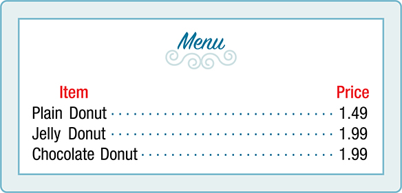
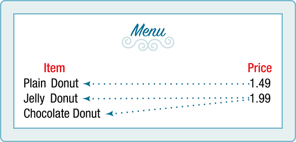

## Trước khi học {#vi-prerequisites}

Bạn cần biết đọc một cặp có thứ tự, phân biệt hai số và nhận biết một tập hợp.
Trong cặp $(x,y)$, thứ tự có ý nghĩa: thành phần thứ nhất là đầu vào, thành
phần thứ hai là đầu ra. Chưa cần học đạo hàm hoặc lập trình.

Sau bài này, bạn có thể xác định tập xác định và tập giá trị của một quan
hệ hữu hạn; quyết định quan hệ đó có phải là hàm số hay không; và giải thích
vì sao đổi chiều đầu vào–đầu ra có thể làm thay đổi câu trả lời.

Đây là **một phần của mục 1.1**, không phải toàn bộ mô-đun `m49301` hay toàn
bộ chương. Phần hướng dẫn tự học, lời giải bổ sung và bài thực hành Python
được ghi rõ là phần biên soạn thêm. Số tiền, tên riêng và dữ liệu nguồn được
giữ nguyên; không coi ví dụ nước ngoài là quy định áp dụng tại Việt Nam.

## Xác định một quan hệ có biểu diễn hàm số hay không {#fs-id1165133394710}

::: {#fs-id1165137431376}
Độ cao của một máy bay phản lực thay đổi khi khoảng cách tính từ điểm khởi
hành tăng lên. Cân nặng của một em bé đang lớn tăng theo thời gian. Trong
mỗi trường hợp, một đại lượng phụ thuộc vào đại lượng kia. Ta có thể mô tả,
phân tích và dùng mối quan hệ giữa hai đại lượng để dự đoán. Trong bài này,
ta sẽ phân tích những mối quan hệ như vậy.
:::

::: {#fs-id1165137781542}
Một **quan hệ** là một tập hợp các **cặp có thứ tự**. Tập hợp các thành phần
thứ nhất được gọi là **tập xác định**; tập hợp các thành phần thứ hai được
gọi là **tập giá trị**. Xét tập hợp sau: thành phần thứ nhất lần lượt là
năm số $1,2,3,4,5$, còn thành phần thứ hai bằng hai lần thành phần thứ nhất.
:::

::: {#fs-id1165137676332}
{{math:fs-id1165137676332:0}}
:::

::: {#fs-id1165133155834}
Tập xác định là {{math:fs-id1165133155834:0}}
Tập giá trị là {{math:fs-id1165133155834:1}}
:::

::: {#fs-id1165134234609}
Mỗi giá trị thuộc tập xác định còn được gọi là một giá trị **đầu vào**,
tương ứng với **biến độc lập**, thường ký hiệu bằng chữ thường $x$.
Mỗi giá trị thuộc tập giá trị còn được gọi là một giá trị **đầu ra**,
tương ứng với **biến phụ thuộc**, thường ký hiệu bằng chữ thường $y$.
:::

::: {#fs-id1165137748300}
Một hàm số $f$ là một quan hệ gán cho mỗi giá trị trong tập xác định đúng
một giá trị trong tập giá trị. Nói cách khác, trong tập các cặp có thứ tự,
hai cặp phân biệt không có cùng thành phần thứ nhất. Quan hệ nhân đôi ở
trên là một hàm số: mỗi phần tử của tập xác định
{{math:fs-id1165137748300:1}} được ghép với đúng một phần tử của tập giá trị
{{math:fs-id1165137748300:2}}
:::

::: {#fs-id1165135421564}
Bây giờ xét quan hệ ghép các từ “chẵn” và “lẻ” với năm số tự nhiên vừa nêu:
:::

::: {#fs-id1165133192963}
{{math:fs-id1165133192963:0}}
:::

::: {#fs-id1165135419796}
Các phần tử của tập xác định {{math:fs-id1165135419796:0}} không được ghép
với đúng một phần tử của tập giá trị {{math:fs-id1165135419796:1}}
Cụ thể, “lẻ” ứng với ba giá trị {{math:fs-id1165135419796:2}}, còn “chẵn”
ứng với hai giá trị {{math:fs-id1165135419796:3}}
Điều này trái với định nghĩa hàm số, nên quan hệ này không phải là hàm số.
:::

::: {#fs-id1165135176295}
[Hình 1](#Figure_01_01_001) so sánh các quan hệ là hàm số và không là hàm số.
:::

::: {#Figure_01_01_001}


Hình 1. (a) Quan hệ này là hàm số vì mỗi đầu vào chỉ gắn với một đầu ra.
Chú ý: cả $q$ và $r$ đều cho đầu ra $n$. (b) Quan hệ này cũng là hàm số:
mỗi đầu vào gắn với một đầu ra. (c) Quan hệ này không phải là hàm số vì
đầu vào $q$ gắn với hai đầu ra khác nhau. Nhãn trong hình được giữ nguyên;
*Input* nghĩa là đầu vào và *Output* nghĩa là đầu ra.
:::

### Định nghĩa: hàm số {#fs-id1165137533627}

::: {#fs-id1165135173375}
**Hàm số** là một quan hệ trong đó mỗi giá trị đầu vào thuộc tập xác định
tương ứng với đúng một giá trị đầu ra. Ta nói: “đầu ra là một hàm số của đầu vào”.
:::

::: {#fs-id1165137661589}
Các giá trị đầu vào tạo thành **tập xác định**; các giá trị đầu ra tạo
thành **tập giá trị**.
:::

*Lưu ý thuật ngữ của bản dịch:* Theo cách dùng của nguồn OpenStax, trong bài
này “hàm số” được dùng theo nghĩa rộng của một **ánh xạ**: đầu vào và đầu ra
có thể là số hoặc nhãn. Khi nói đến hàm số nhận giá trị thực trong các bài
sau, đầu ra là số thực. “Tập xác định” cũng thường được gọi là “miền xác định”.

### Cách làm {#fs-id1165137445319}

Cho một mối quan hệ giữa hai đại lượng, hãy xác định nó có phải là hàm số
hay không:

1. Xác định các giá trị đầu vào.
2. Xác định các giá trị đầu ra.
3. Nếu mỗi đầu vào chỉ dẫn tới một đầu ra, quan hệ là hàm số. Nếu có bất
   kỳ đầu vào nào dẫn tới hai đầu ra trở lên, quan hệ không phải là hàm số.

### Ví dụ 1 — Bảng giá có phải là hàm số? {#Example_01_01_01}

::: {#fs-id1165137414052}
::: {#fs-id1165137559269}
Thực đơn của một quán cà phê trong [Hình 2](#Figure_01_01_004) gồm các món
và giá tương ứng.

a. Giá có phải là hàm số của món ăn không?
b. Món ăn có phải là hàm số của giá không?

::: {#Figure_01_01_004}


Hình 2. Giữ nguyên giá bằng đô la Mỹ của ví dụ nguồn: *plain donut* là
bánh vòng thường; *jelly donut* là bánh vòng nhân mứt; *chocolate donut*
là bánh vòng sô-cô-la. Dấu chấm thập phân trong hình thuộc dữ liệu nguồn.
:::
:::

::: {#fs-id1165135419802}
**Lời giải.**

a. Lấy các món trong thực đơn làm đầu vào. Khi đó các mức giá là đầu ra,
   như [Hình 3](#Figure_01_01_027). Mỗi món chỉ có một giá, nên giá là hàm
   số của món ăn.

::: {#Figure_01_01_027}


Hình 3. Hai đầu vào khác nhau được phép có cùng một đầu ra.
:::

b. Hai món có cùng một giá. Nếu lấy giá làm đầu vào và món ăn làm đầu ra,
   thì một đầu vào có thể gắn với nhiều đầu ra; xem
   [Hình 4](#Figure_01_01_028). Vì vậy, món ăn không phải là hàm số của giá.

::: {#Figure_01_01_028}


Hình 4. Đầu vào 1.99 đô la có hai đầu ra khác nhau.
:::
:::
:::

### Ví dụ 2 — Quy tắc quy đổi điểm có phải là hàm số? {#Example_01_01_02}

::: {#fs-id1165137437773}
::: {#fs-id1165135620873}
Trong một lớp toán, điểm phần trăm tổng kết được quy đổi sang một điểm
trung bình trên thang 4. Điểm quy đổi có phải là hàm số của điểm phần trăm
không? Ngược lại, điểm phần trăm có phải là hàm số của điểm quy đổi không?
[Bảng 1](#Table_01_01_01) cho một quy tắc quy đổi có thể dùng.

::: {#Table_01_01_01}
| Điểm phần trăm | Điểm quy đổi |
|---|---:|
| 0–56 | 0.0 |
| 57–61 | 1.0 |
| 62–66 | 1.5 |
| 67–71 | 2.0 |
| 72–77 | 2.5 |
| 78–86 | 3.0 |
| 87–91 | 3.5 |
| 92–100 | 4.0 |

Bảng 1. Dữ liệu nguồn được giữ nguyên, chuyển từ bảng ngang sang bảng dọc
để dễ đọc. Ví dụ xét điểm phần trăm nguyên từ 0 đến 100; nguồn không nêu
cách làm tròn điểm lẻ. Đây không phải quy định chấm điểm của Việt Nam.
:::
:::

::: {#fs-id1165135424616}
**Lời giải.** Mỗi điểm phần trăm trong bảng ứng với một điểm quy đổi, nên
điểm quy đổi là hàm số của điểm phần trăm. Khi nhập điểm phần trăm, ta nhận
được một điểm quy đổi xác định.

Ngược lại, nhiều điểm phần trăm cùng ứng với một điểm quy đổi. Chẳng hạn,
điểm quy đổi 3.0 có thể xuất phát từ bất kỳ điểm phần trăm nguyên nào từ
78 đến 86. Vì vậy, điểm phần trăm không phải là hàm số của điểm quy đổi.
:::
:::

### Tự thử 1 {#fs-id1165137588587}

::: {#ti_01_01_01}
::: {#fs-id1165135667843}
[Bảng 2](#Table_01_01_02) liệt kê năm cầu thủ bóng chày được xếp hạng cao
nhất trong danh sách mà bản gốc sử dụng.[^baseball]

::: {#Table_01_01_02}
| Cầu thủ | Thứ hạng |
|---|---:|
| Babe Ruth | 1 |
| Willie Mays | 2 |
| Ty Cobb | 3 |
| Walter Johnson | 4 |
| Hank Aaron | 5 |

Bảng 2. Danh sách xếp hạng trong ví dụ lịch sử của nguồn.
:::

a. Thứ hạng có phải là hàm số của tên cầu thủ không?
b. Tên cầu thủ có phải là hàm số của thứ hạng không?

Hãy tự trả lời rồi xem [lời giải](#fs-id1165137724415).
:::
:::

[^baseball]: Giữ nguyên dẫn nguồn của OpenStax: [Baseball Almanac](http://www.baseball-almanac.com/legendary/lisn100.shtml), truy cập ngày 24/03/2014. Không phải một khẳng định xếp hạng hiện thời của bản dịch.

## Bài tập chọn lọc từ mục 1.1 {#vi-exercises}

Các số B1–B5 là số thứ tự trong bài thử nghiệm này, không thay thế mã bài
tập nguồn. Chưa cần dùng ký hiệu hàm số hoặc đồ thị. Tự giải trước khi mở
[phần đáp án](#vi-answers).

### B1 {#fs-id1165137432993}

Quan hệ và hàm số khác nhau ở điểm nào?

### B2 {#fs-id1165137870912}

Đầu vào và đầu ra của một hàm số khác nhau ở điểm nào?

### B3 {#fs-id1165133324915}

Quan hệ sau có biểu diễn một hàm số không?

{{math:fs-id1165133324920:0}}

### B4 {#fs-id1165135245507}

Quan hệ sau có biểu diễn một hàm số không?

{{math:fs-id1165135245511:0}}

### B5 {#fs-id1165135381342}

Quan hệ sau có biểu diễn một hàm số không?

{{math:fs-id1165137724839:0}}

## Đáp án và lời giải từng bước {#vi-answers}

### Tự thử 1 — Lời giải {#fs-id1165137724415}

a. Có. Trong Bảng 2, mỗi tên cầu thủ chỉ xuất hiện với một thứ hạng.
b. Có. Mỗi thứ hạng từ 1 đến 5 chỉ ứng với một tên cầu thủ. Nếu hai cầu
   thủ đồng hạng, chẳng hạn cùng hạng 4, thì tên cầu thủ sẽ không còn là
   hàm số của thứ hạng.

Hai câu trả lời “có” và nhận xét về đồng hạng có trong đáp án nguồn; cách
giải thích theo từng đầu vào là phần bổ sung của bản dịch.

### B1 — Lời giải {#fs-id1165137667225}

Một quan hệ là một tập hợp các cặp có thứ tự. Hàm số là một loại quan hệ
đặc biệt: hai cặp phân biệt không có cùng thành phần thứ nhất. Vì vậy, mỗi
đầu vào có đúng một đầu ra.

*Giải thích bổ sung:* Nếu ta gặp $(7,11)$ và $(7,9)$ thì cùng đầu vào 7
cho hai đầu ra khác nhau. Ngược lại, việc hai đầu vào khác nhau cho cùng
đầu ra không làm mất tính chất hàm số.

### B2 — Lời giải bổ sung {#vi-sol-B2}

Đầu vào là giá trị được đưa vào quy tắc, thuộc tập xác định. Đầu ra là
giá trị mà quy tắc gán cho đầu vào ấy, thuộc tập giá trị. Trong một cặp
$(x,y)$ biểu diễn hàm số, $x$ là đầu vào và $y$ là đầu ra. Ví dụ, cặp
$(3,6)$ trong quan hệ nhân đôi cho biết đầu vào 3 dẫn tới đầu ra 6.

Nguồn không kèm lời giải cho bài này; lời giải trên được biên soạn cho
bản tiếng Việt.

### B3 — Lời giải bổ sung {#vi-sol-B3}

Có. Các đầu vào là $-1,-2,-3$; mỗi đầu vào chỉ có một đầu ra tương ứng.
Tập xác định là $\{-1,-2,-3\}$ và tập giá trị cũng là $\{-1,-2,-3\}$.
Việc đầu ra bằng đầu vào không gây mâu thuẫn với định nghĩa hàm số.
Nguồn không kèm lời giải cho bài này.

### B4 — Lời giải {#fs-id1165135381334}

Đáp án nguồn: **là hàm số**.

*Lời giải bổ sung:* Các đầu vào $3,4,5$ lần lượt cho các đầu ra $4,5,6$.
Không có đầu vào nào cho hai đầu ra khác nhau. Tập xác định là
$\{3,4,5\}$; tập giá trị là $\{4,5,6\}$.

### B5 — Lời giải bổ sung {#vi-sol-B5}

Không. Đầu vào 7 xuất hiện trong hai cặp $(7,11)$ và $(7,9)$, nên có hai
đầu ra khác nhau là 11 và 9. Chỉ cần một đầu vào vi phạm tính duy nhất là
đủ kết luận quan hệ không phải là hàm số. Tập xác định vẫn là
$\{2,7,15\}$, còn tập giá trị là $\{5,11,8,9\}$; việc có tập xác định và
tập giá trị không tự động khiến một quan hệ trở thành hàm số.
Nguồn không kèm lời giải cho bài này.

## Cầu nối sang tính toán — kiểm tra một quan hệ hữu hạn {#vi-computing}

Phần biên soạn thêm, liên kết với cách kiểm tra có thể tái lập của B80.
Không cần lập trình để hoàn thành phần toán ở trên. Nếu có Python 3,
bạn có thể chạy mã sau hoặc tệp `computing/check_relations.py`.

```python
def is_function(pairs):
    outputs = {}
    for x, y in pairs:
        if x in outputs and outputs[x] != y:
            return False
        outputs[x] = y
    return True

print(is_function([(-1, -1), (-2, -2), (-3, -3)]))  # True
print(is_function([(3, 4), (4, 5), (5, 6)]))         # True
print(is_function([(2, 5), (7, 11), (15, 8), (7, 9)]))  # False
```

Từ điển `outputs` ghi lại đầu ra đã gặp của mỗi đầu vào. Nếu cùng đầu vào
lại đi cùng một đầu ra khác, chương trình trả về `False`. Cặp lặp lại y
hệt không tạo ra đầu ra mới: một tập hợp không tính hai lần cùng phần tử.
Mã chỉ kiểm tra danh sách cặp hữu hạn với đầu vào dùng được làm khóa từ
điển. Nó không chứng minh tính chất của một công thức trên vô hạn giá trị.

## Tự đánh giá và phần tiếp theo {#vi-next}

Bạn sẵn sàng học tiếp khi tự giải thích được cả ba điều sau:

- Một đầu vào phải có đúng một đầu ra.
- Hai đầu vào khác nhau có thể có cùng đầu ra.
- Đổi chiều quan hệ không nhất thiết cho một hàm số.

Tiếp theo: **Sử dụng ký hiệu hàm số** (*Using Function Notation*), vẫn
trong mô-đun `m49301`, bắt đầu tại `fs-id1165134474160`.

## Nguồn và ghi công {#vi-attribution}

Bản dịch và phần bổ sung tiếng Việt độc lập, địa phương hóa `vi-Latn-VN`.
Nguồn: Jay Abramson và các cộng tác viên OpenStax, *Precalculus 2e*,
mô-đun `m49301`, UUID `11f4eacc-c348-4836-8c5b-747577d249ca`;
[nguồn được ghim](https://github.com/openstax/osbooks-college-algebra-bundle/tree/789b54099106b071d1d32bfcee454fed72eb4768).
Đối chiếu với [ấn bản Bahasa Indonesia](https://github.com/KokunoYumeto/openstax-precalculus-2e-id)
`0.1.0-alpha.58-reader.1`. Giữ nguyên quyền ghi công của Jay Abramson,
OpenStax và các tác giả, cộng tác viên được liệt kê trong nguồn.

Văn bản, hình nguồn và bản dịch A30 này theo
[CC BY-NC-SA 4.0](https://creativecommons.org/licenses/by-nc-sa/4.0/).
Các thông báo nguồn được giữ trong thư mục `notices/`; các tác phẩm B40
và B80 giữ giấy phép riêng, không bị đổi giấy phép bởi bài này.
Không phải ấn bản chính thức hoặc được các tác giả hay tổ chức nguồn bảo trợ.
Bản dịch, lời giải bổ sung và kiểm tra được thực hiện với sự hỗ trợ của
OpenAI Codex theo yêu cầu người dùng; thông tin quy trình này không thay
thế tên tác giả gốc. Chưa có thẩm định độc lập của người bản ngữ.
