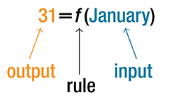

## Trước khi học {#vi-prerequisites}

Bạn đã biết: một hàm số gán cho mỗi đầu vào trong tập xác định đúng một
đầu ra. Bài này giúp bạn đọc và viết ký hiệu của mối quan hệ đó.
Chưa cần tính đạo hàm hoặc lập trình.

Bài dịch trọn tiểu mục **Using Function Notation** của mô-đun `m49301`,
không phải toàn bộ mục 1.1. Các lưu ý hỗ trợ tự học được ghi rõ là phần
bổ sung. Theo quy ước đã giải thích ở Bài 001, “hàm số” ở đây có thể
được dùng theo nghĩa rộng của ánh xạ, với đầu vào là số hoặc nhãn.

## Đọc và viết ký hiệu hàm số {#fs-id1165134474160}

::: {#fs-id1165133359348}
Sau khi xác định một mối quan hệ là hàm số, ta cần biểu diễn và xác định
rõ mối quan hệ ấy để hiểu, sử dụng, và đôi khi đưa nó vào chương trình
máy tính. Có nhiều cách biểu diễn hàm số. **Ký hiệu hàm số** là một cách
viết thông dụng giúp ta làm việc với hàm số thuận tiện hơn.
:::

::: {#fs-id1165137453971}
Để biểu diễn ý “chiều cao là một hàm số của tuổi”, trước hết ta chọn
{{math:fs-id1165137453971:0}} để chỉ chiều cao và
{{math:fs-id1165137453971:1}} để chỉ tuổi. Các chữ
{{math:fs-id1165137453971:2}} và {{math:fs-id1165137453971:3}}
thường được dùng làm tên hàm số, giống như
{{math:fs-id1165137453971:4}} và {{math:fs-id1165137453971:5}}
thường biểu diễn các số, còn {{math:fs-id1165137453971:6}} và
{{math:fs-id1165137453971:7}} thường biểu diễn các tập hợp.
:::

*Lưu ý bổ sung về mô hình:* Ở đây ta xét chiều cao của **một người xác
định** theo tuổi. Không thể chỉ biết tuổi mà xác định duy nhất chiều cao
của mọi người khác nhau.

::: {#fs-id1165135332760}
Ta gọi hàm số là $f$. Ý “chiều cao $h$ là giá trị của hàm số $f$ tại
tuổi $a$” được viết thành

$$h=f(a).$$

Dấu ngoặc trong $f(a)$ chỉ ra đầu vào của hàm số. Chữ $f$ là **tên hàm
số**; biểu thức $f(a)$ chỉ **giá trị của hàm số $f$ tại đầu vào $a$**.

*Ghi chú trình bày:* Bảng ký hiệu ba dòng của nguồn được chuyển thành
các câu ngắn ở trên; các ký hiệu $h$, $f$, $a$ và $h=f(a)$ được giữ nguyên.
:::

::: {#fs-id1165137766965}
Ta có thể dùng chữ khác để đặt tên hàm số. Chẳng hạn, **nếu đổi tên hàm
số thành $h$**, ký hiệu {{math:fs-id1165137766965:0}} cho biết giá trị của
hàm số {{math:fs-id1165137766965:1}} phụ thuộc vào đầu vào $a$.
Để nhận được một kết quả, ta đưa giá trị {{math:fs-id1165137766965:3}}
vào hàm số {{math:fs-id1165137766965:4}}. Dấu ngoặc cho biết tuổi là đầu
vào; nó **không biểu thị phép nhân**.
:::

*Lưu ý bổ sung về chữ $h$:* Trong $h=f(a)$ ở trên, $h$ chỉ giá trị chiều
cao. Trong cách viết $h(a)$ vừa nêu, $h$ được chọn làm tên hàm số. Đây
là hai cách đặt ký hiệu; cần theo dõi vai trò của chữ trong từng cách viết.

::: {#fs-id1165135436660}
Đầu vào của hàm số cũng có thể là một biểu thức đại số. Ví dụ,
{{math:fs-id1165135436660:0}} có nghĩa là: trước hết cộng $a$ và $b$,
rồi dùng tổng vừa tìm được làm đầu vào của hàm số $f$. Cần thực hiện
theo thứ tự đó để nhận được kết quả đúng.
:::

*Lưu ý bổ sung:* Tổng $a+b$ phải thuộc tập xác định của $f$. Nói chung,
$f(a+b)$ không bằng $f(a)+f(b)$. Chẳng hạn, nếu $f(x)=x^2$ thì
$f(2+3)=25$, còn $f(2)+f(3)=4+9=13$. Đây là ví dụ bổ sung, không phải
một bài tập trích từ nguồn.

### Ký hiệu hàm số {#fs-id1165137444349}

::: {#eip-id1165135256026}
Ký hiệu {{math:eip-id1165135256026:0}} biểu diễn quan hệ đầu vào–đầu ra
của hàm số có tên $f$: “$y$ là một hàm số của $x$”. Chữ $x$ biểu diễn
giá trị đầu vào, hay **biến độc lập**. Chữ $y$, cũng chính là $f(x)$,
biểu diễn giá trị đầu ra, hay **biến phụ thuộc**.
:::

*Lưu ý bổ sung:* Chỉ viết $y=f(x)$ chưa cho ta toàn bộ quy tắc để tính
đầu ra. Muốn tìm giá trị cụ thể, còn cần biết hàm số được cho bằng công
thức, bảng, mô tả quy tắc hoặc cách biểu diễn thích hợp khác.

### Ví dụ 3 — Số ngày trong tháng {#Example_01_01_03}

::: {#fs-id1165135612059}
::: {#fs-id1165135705803}
Hãy dùng ký hiệu hàm số để biểu diễn một hàm số có đầu vào là tên tháng
và đầu ra là số ngày trong tháng đó. **Chỉ xét các tháng trong một năm
không nhuận.**
:::

::: {#fs-id1165137405547}
::: {#fs-id1165137657617}
**Lời giải.** Số ngày trong tháng là một hàm số của tên tháng. Nếu gọi
hàm số ấy là $f$, ta viết {{math:fs-id1165137657617:1}} hoặc
{{math:fs-id1165137657617:2}}
Tên tháng là đầu vào của một quy tắc gán cho mỗi đầu vào một số xác
định, tức là đầu ra.
:::

::: {#Image_01_01_005}

Hình 5. Giữ nguyên hình nguồn: *January* là tháng Một; *Output* là đầu
ra; *Rule* là quy tắc; *Input* là đầu vào. Tháng Một có 31 ngày.
:::

::: {#fs-id1165135417826}
Ví dụ, {{math:fs-id1165135417826:0}} vì tháng Ba có 31 ngày. Ký hiệu
{{math:fs-id1165135417826:1}} nhắc ta rằng số ngày
{{math:fs-id1165135417826:2}} — đầu ra — phụ thuộc vào tên tháng
{{math:fs-id1165135417826:3}} — đầu vào.
:::
:::

::: {#fs-id1165137544335}
**Phân tích.** Đầu vào của hàm số không nhất thiết phải là số. Đầu vào
có thể là tên người, nhãn của đối tượng hình học hoặc phần tử thuộc
loại khác mà từ đó xác định được một đầu ra. Tuy nhiên, phần lớn các
hàm số trong cuốn sách này có đầu vào và đầu ra là số.
:::
:::

*Lưu ý bổ sung:* Tập xác định trong ví dụ là các **tên tháng**, không
phải các năm. Điều kiện “năm không nhuận” cố định quy tắc số ngày để
tháng Hai không có hai đầu ra là 28 và 29 trong cùng mô hình.

### Ví dụ 4 — Hiểu ý nghĩa của ký hiệu {#Example_01_01_04}

::: {#fs-id1165137441910}
::: {#fs-id1165137527239}
::: {#fs-id1165137526811}
Một hàm số {{math:fs-id1165137526811:0}} cho biết số nhân viên cảnh sát
$N$ của một thị trấn trong năm $y$. Đẳng thức
{{math:fs-id1165137526811:3}} có ý nghĩa gì?
:::
:::

::: {#fs-id1165137834021}
::: {#fs-id1165137424675}
**Lời giải.** Khi đọc {{math:fs-id1165137424675:0}} ta thấy đầu vào là
năm 2005. Giá trị đầu ra, tức số nhân viên cảnh sát $N$, là 300. Nhớ
rằng {{math:fs-id1165137424675:2}} Đẳng thức
{{math:fs-id1165137424675:3}} cho biết: trong năm 2005, thị trấn đó
có 300 nhân viên cảnh sát.
:::
:::
:::

*Lưu ý bổ sung:* Trong ví dụ này, $y$ được dùng cho **năm**, là đầu vào;
$N$ là đầu ra. Vai trò của biến phụ thuộc vào mô tả của từng ví dụ,
không chỉ vào tên chữ. Dữ liệu 2005 và 300 được giữ nguyên từ tình
huống của nguồn, không phải một thống kê hiện thời do bản dịch xác minh.

### Tự thử 2 {#fs-id1165134257606}

::: {#fs-id1165137564344}
::: {#fs-id1165137564345}
Hãy dùng ký hiệu hàm số để biểu thị cân nặng của một con lợn, tính bằng
**pound (lb)**, theo tuổi $d$ tính bằng ngày.

*Gợi ý bổ sung:* Hãy xác định đầu vào và đầu ra trước, rồi xem
[lời giải](#fs-id1165137871618).
:::
:::

### Tự thử 2 — Lời giải {#fs-id1165137871618}

Đáp án nguồn: {{math:fs-id1165137619935:0}}

*Giải thích bổ sung:* $d$ là tuổi tính bằng ngày; $w$ là cân nặng tính
bằng pound (lb); $f$ là tên hàm số. Khi tuổi $d$ được đưa vào, $f(d)$
cho giá trị cân nặng $w$ của con lợn đang xét. Giữ nguyên đơn vị của
nguồn; không đổi sang kilôgam.

### Hỏi và đáp — Có thể viết y = y(x) không? {#fs-id1165137740780}

::: {#eip-id1165132005171}
**Hỏi.** Thay vì viết {{math:eip-id1165132005171:0}} ta có thể dùng
cùng một chữ cho đầu ra và tên hàm số, chẳng hạn
{{math:eip-id1165132005171:1}} với ý “$y$ là một hàm số của $x$” không?
:::

::: {#fs-id1165137605080}
**Đáp.** Có. Cách viết này thường gặp, nhất là trong những lĩnh vực
ứng dụng toán học bậc cao như vật lý và kỹ thuật. Tuy nhiên, khi học
toán, ta thường muốn phân biệt hàm số $f$ — một quy tắc hay quy trình —
với đầu ra $y$ nhận được khi áp dụng $f$ cho một đầu vào cụ thể $x$.
Vì vậy, ta thường dùng những ký hiệu như
{{math:fs-id1165137605080:4}} và các ký hiệu tương tự.
:::

*Lưu ý bổ sung:* Trong $y=y(x)$, chữ $y$ đứng riêng ở vế trái chỉ giá
trị đầu ra; chữ $y$ trong $y(x)$ là tên hàm số. Toàn bộ biểu thức $y(x)$
cũng chỉ giá trị đầu ra tại $x$. Ngữ cảnh giúp phân biệt hai vai trò
của chữ $y$; không nên hiểu đây là khẳng định một con số và một quy
tắc là cùng một đối tượng.

## Tự đánh giá và phần tiếp theo {#vi-next}

Bạn sẵn sàng học tiếp nếu giải thích được:

- $f$ và $f(a)$ khác nhau như thế nào.
- Vì sao dấu ngoặc trong $f(a)$ không biểu thị phép nhân.
- Trong $N=f(y)$ của Ví dụ 4, chữ nào biểu diễn đầu vào và chữ nào
  biểu diễn đầu ra.

Tiếp theo: **Biểu diễn hàm số bằng bảng**, vẫn trong mô-đun `m49301`,
bắt đầu tại `fs-id1165137804204`.

## Nguồn và ghi công {#vi-attribution}

Bản dịch độc lập `vi-Latn-VN` từ Jay Abramson và các cộng tác viên
OpenStax, *Precalculus 2e*, mô-đun `m49301`, UUID
`11f4eacc-c348-4836-8c5b-747577d249ca`;
[nguồn được ghim](https://github.com/openstax/osbooks-college-algebra-bundle/tree/789b54099106b071d1d32bfcee454fed72eb4768).
Đối chiếu với [ấn bản Bahasa Indonesia](https://github.com/KokunoYumeto/openstax-precalculus-2e-id)
`0.1.0-alpha.58-reader.1`.

Văn bản, hình và bản dịch A30 này theo
[CC BY-NC-SA 4.0](https://creativecommons.org/licenses/by-nc-sa/4.0/).
Giữ nguyên ghi công tác giả và các thông báo trong `notices/`; các
thành phần của những sách khác giữ giấy phép riêng. Các lưu ý được
đánh dấu “bổ sung” và cách bố trí lại bảng ký hiệu là phần thay đổi
của bản dịch. Không phải ấn bản chính thức hay được tác giả nguồn
bảo trợ. Được thực hiện với sự hỗ trợ của OpenAI Codex theo yêu cầu
người dùng; chưa có thẩm định của người bản ngữ.
