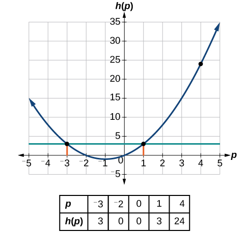
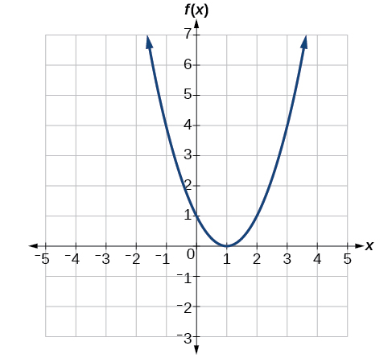
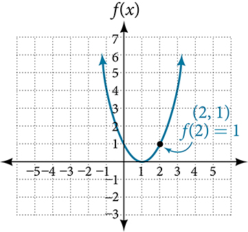
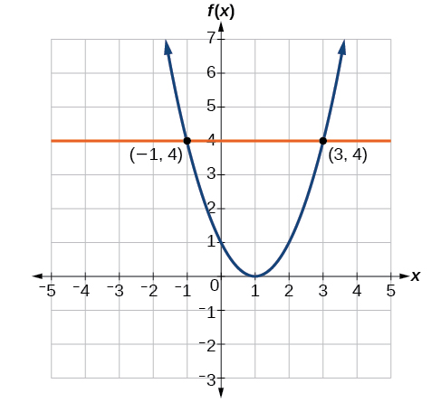

## Trước khi học {#vi-prerequisites}

Bạn đã biết cách đọc ký hiệu hàm số và biểu diễn hàm số bằng bảng.
Bài này dịch trọn mục **Finding Input and Output Values of a Function**
của mô-đun `m49301`, gồm bốn tiểu mục, Ví dụ 6–12 và năm bài Tự thử.
Các giải thích hoặc điều kiện được thêm để hỗ trợ tự học đều được ghi
rõ là phần bổ sung. Đây chưa phải toàn bộ mục 1.1 hay toàn bộ cuốn sách.

## Tìm giá trị đầu vào và đầu ra {#fs-id1165137503241}

::: {#fs-id1165137470651}
Khi biết một giá trị đầu vào và muốn xác định giá trị đầu ra tương ứng
của hàm số, ta **tính giá trị của hàm số**. Việc này luôn cho một kết
quả, vì mỗi giá trị đầu vào của hàm số tương ứng với đúng một giá trị
đầu ra.
:::

::: {#fs-id1165137735634}
Khi biết một giá trị đầu ra và muốn tìm những giá trị đầu vào tạo ra
đầu ra đó, ta đặt công thức của hàm số bằng giá trị đầu ra đã biết rồi
**giải phương trình để tìm đầu vào**. Phương trình có thể có nhiều
nghiệm, vì các đầu vào khác nhau có thể cho cùng một đầu ra.
:::

*Lưu ý bổ sung:* Khi tính giá trị, đầu vào phải thuộc tập xác định.
Khi tìm đầu vào, có thể không có nghiệm nếu đầu ra yêu cầu không thuộc
tập giá trị. Không nên nhầm “tính giá trị của hàm số tại một đầu vào”
với “tìm mọi đầu vào cho một đầu ra đã biết”.

### Tính giá trị hàm số ở dạng đại số {#fs-id1165137425943}

::: {#fs-id1165137655584}
Khi hàm số được cho bằng công thức, việc tính giá trị thường khá đơn
giản. Chẳng hạn, với hàm số {{math:fs-id1165137655584:0}}, ta bình
phương giá trị đầu vào, nhân với 3, rồi lấy 5 trừ đi tích vừa tìm được.
:::

#### Cách làm — Tính giá trị từ công thức {#fs-id1165135613610}

::: {#fs-id1165137767182}
Cho công thức của một hàm số, hãy tính giá trị của hàm số tại đầu vào
đã cho.
:::

::: {#fs-id1165137629040}
1. Thay biến đầu vào trong công thức bằng giá trị đã cho.
2. Tính kết quả.
:::

#### Ví dụ 6 — Tính giá trị tại các đầu vào cụ thể {#Example_01_01_06}

::: {#fs-id1165137742220}
::: {#fs-id1165137455592}
::: {#fs-id1165134193005}
Cho {{math:fs-id1165134193005:0}}. Tính giá trị của hàm số tại:
:::

::: {#fs-id1165137648008}
- ⓐ {{math:fs-id1165137648008:0}}
- ⓑ {{math:fs-id1165137648008:1}}
- ⓒ {{math:fs-id1165137648008:2}}
- ⓓ Sau đó tính {{math:fs-id1165137648008:3}}.
:::
:::

::: {#fs-id1165135397244}
::: {#fs-id1165137936905}
**Lời giải.** Thay {{math:fs-id1165137936905:0}} trong công thức hàm
số bằng từng giá trị được yêu cầu.
:::

::: {#fs-id1165137778273}
ⓐ Vì đầu vào là số 2, ta có thể dùng các phép tính đại số đơn giản
để thu gọn.

::: {#fs-id1165135160774}
{{math:fs-id1165135160774:0}}
:::

ⓑ Trong trường hợp này, đầu vào được ký hiệu bằng một chữ, nên ta
giữ kết quả dưới dạng biểu thức sau.

::: {#fs-id1165137638318}
{{math:fs-id1165137638318:0}}
:::

ⓒ Với đầu vào {{math:fs-id1165137778273:2}} ta cần dùng tính chất
phân phối.

::: {#fs-id1165137911654}
{{math:fs-id1165137911654:0}}
:::

ⓓ Trong trường hợp này, ta tính giá trị của hàm số tại nhiều đầu vào,
rồi thực hiện các phép biến đổi đại số trên kết quả. Ở trên ta đã có

::: {#fs-id1165135154122}
{{math:fs-id1165135154122:0}}
:::

::: {#fs-id1165135632109}
và biết rằng
:::

::: {#fs-id1165137471110}
{{math:fs-id1165137471110:0}}
:::

::: {#fs-id1165137767461}
Ghép các kết quả lại rồi thu gọn:
:::

::: {#fs-id1165137573884}
{{math:fs-id1165137573884:0}}
:::
:::
:::
:::

*Điều kiện bổ sung:* Ở câu ⓓ phải có $h\ne 0$, vì $h$ nằm ở mẫu.
Đặt $h$ làm nhân tử chung rồi rút gọn cho $h$ chỉ hợp lệ dưới điều
kiện này. Khi $h=0$, phân thức ban đầu không xác định, dù biểu thức
$2a+h+3$ vẫn có giá trị.

#### Ví dụ 7 — Tính giá trị của hàm số {#Example_01_01_07}

::: {#fs-id1165134043756}
::: {#fs-id1165137705537}
::: {#fs-id1165137731385}
Cho hàm số {{math:fs-id1165137731385:0}} hãy tính
{{math:fs-id1165137731385:1}}
:::
:::

::: {#fs-id1165137433651}
::: {#fs-id1165137433653}
**Lời giải.** Để tính {{math:fs-id1165137433653:0}} ta thay biến đầu
vào {{math:fs-id1165137433653:1}} bằng 4 trong công thức đã cho.
:::

::: {#fs-id1165137444745}
{{math:fs-id1165137444745:0}}
:::

::: {#fs-id1165137785006}
Vậy với đầu vào 4, ta nhận được đầu ra 24.
:::
:::
:::

#### Tự thử 4 {#fs-id1165137704746}

[Đáp án và giải thích](#fs-id1165137441862)

::: {#ti_01_01_08}
::: {#fs-id1165134039322}
::: {#fs-id1165134039323}
Cho hàm số {{math:fs-id1165134039323:0}} hãy tính
{{math:fs-id1165134039323:1}}
:::
:::

::: {#fs-id1165137441862}
::: {#fs-id1165134037488}
**Đáp án nguồn:** {{math:fs-id1165134037488:0}}.
:::

*Giải thích bổ sung:* Thay $m=5$ vào công thức:
$g(5)=\sqrt{5-4}=\sqrt{1}=1$. Trong các số thực, công thức này có
tập xác định $m\ge 4$; đầu vào 5 thỏa điều kiện đó.
:::
:::

#### Ví dụ 8 — Tìm đầu vào khi biết đầu ra {#Example_01_01_08}

::: {#fs-id1165137459747}
::: {#fs-id1165137459749}
::: {#fs-id1165137460826}
Cho hàm số {{math:fs-id1165137460826:0}} hãy tìm $p$ sao cho
{{math:fs-id1165137460826:1}}
:::
:::

::: {#fs-id1165132971707}
**Lời giải.**

::: {#fs-id1165135195145}
{{math:fs-id1165135195145:0}}
:::

::: {#fs-id1165137770370}
Nếu {{math:fs-id1165137770370:0}} thì
{{math:fs-id1165137770370:1}} hoặc {{math:fs-id1165137770370:2}}
(theo quy tắc tích bằng 0, ít nhất một thừa số bằng 0). Ta cho từng
thừa số bằng 0 và tìm {{math:fs-id1165137770370:3}} trong mỗi trường hợp.
:::

::: {#fs-id1165134114001}
{{math:fs-id1165134114001:0}}
:::

::: {#fs-id1165134468906}
Ta thu được hai nghiệm. Đầu ra là {{math:fs-id1165134468906:0}}
khi đầu vào là {{math:fs-id1165134468906:1}} hoặc
{{math:fs-id1165134468906:2}} Ta cũng có thể kiểm tra bằng đồ thị
trong [Hình 6](#Figure_01_01_006). Đồ thị xác nhận
{{math:fs-id1165134468906:3}} và {{math:fs-id1165134468906:4}}
:::

::: {#Figure_01_01_006}

Hình 6. Giữ nguyên bảng và đồ thị nguồn. Hai đầu vào −3 và 1 cùng cho
đầu ra 3; đầu vào 4 cho đầu ra 24.
:::
:::
:::

#### Tự thử 5 {#fs-id1165133056923}

::: {#ti_01_01_09}
::: {#fs-id1165134170173}
::: {#fs-id1165134170174}
Cho hàm số {{math:fs-id1165134170174:0}} hãy giải phương trình
{{math:fs-id1165134170174:1}}
:::
:::

::: {#fs-id1165135664055}
::: {#fs-id1165135664056}
**Đáp án nguồn:** {{math:fs-id1165135664056:0}}.
:::

*Giải thích bổ sung:* Từ $\sqrt{m-4}=2$, bình phương hai vế được
$m-4=4$, nên $m=8$. Kiểm tra lại: $\sqrt{8-4}=2$. Đầu vào này
thuộc tập xác định $m\ge 4$.
:::
:::

### Tính giá trị hàm số được biểu diễn bằng công thức {#fs-id1165137591827}

::: {#fs-id1165137598337}
Một số hàm số được xác định bởi quy tắc hoặc quy trình toán học viết
dưới dạng **phương trình**. Nếu có thể biểu diễn đầu ra bằng một
**công thức** chứa đại lượng đầu vào, ta có thể cho hàm số ở dạng đại
số. Chẳng hạn, phương trình {{math:fs-id1165137598337:0}} biểu diễn
một quan hệ hàm số giữa {{math:fs-id1165137598337:1}} và
{{math:fs-id1165137598337:2}} Ta có thể viết lại phương trình để xét
xem {{math:fs-id1165137598337:3}} có phải là một hàm số của
{{math:fs-id1165137598337:4}}
:::

#### Cách làm — Viết công thức đại số {#fs-id1165137827882}

::: {#fs-id1165132034236}
Cho một hàm số dưới dạng phương trình, hãy viết công thức đại số của nó.
:::

::: {#fs-id1165134544989}
1. Giải phương trình để đưa riêng biến đầu ra về một vế của dấu bằng;
   vế còn lại là biểu thức chỉ chứa biến đầu vào.
2. Dùng những phép biến đổi đại số thông thường khi giải phương trình,
   chẳng hạn cộng hoặc trừ cùng một đại lượng ở hai vế, hoặc nhân hay
   chia hai vế cho cùng một đại lượng.
:::

*Điều kiện bổ sung:* Khi chia hai vế, đại lượng dùng làm số chia phải
khác 0. Khi nhân hai vế và cần giữ phép biến đổi tương đương, thừa số
cũng phải khác 0. Luôn kiểm tra các điều kiện xác định.

#### Ví dụ 9 — Tìm công thức đại số của hàm số {#Example_01_01_09}

::: {#fs-id1165137634899}
::: {#fs-id1165137560474}
::: {#fs-id1165137452465}
Hãy biểu diễn quan hệ {{math:fs-id1165137452465:0}}
dưới dạng hàm số {{math:fs-id1165137452465:1}} nếu có thể.
:::
:::

::: {#fs-id1165137832865}
::: {#fs-id1165137832868}
**Lời giải.** Để biểu diễn quan hệ ở dạng này, ta cần viết
{{math:fs-id1165137832868:0}} như một hàm số của
{{math:fs-id1165137832868:1}} tức là viết thành
{{math:fs-id1165137832868:2}}
:::

::: {#fs-id1165131920640}
{{math:fs-id1165131920640:0}}
:::

::: {#fs-id1165135513733}
Vậy {{math:fs-id1165135513733:0}}, xem như một hàm số của
{{math:fs-id1165135513733:1}}, được viết là
:::

::: {#fs-id1165135187787}
{{math:fs-id1165135187787:0}}
:::
:::

::: {#fs-id1165135161336}
::: {#fs-id1165137870972}
**Phân tích.** Cần lưu ý rằng không phải mọi quan hệ được cho bằng
phương trình đều có thể được biểu diễn thành một hàm số bằng công thức.
:::
:::
:::

#### Ví dụ 10 — Biểu diễn phương trình đường tròn dưới dạng hàm số {#Example_01_01_10}

::: {#fs-id1165137758151}
Phương trình {{math:fs-id1165137758151:0}} có biểu diễn một hàm số
với {{math:fs-id1165137758151:1}} là đầu vào và
{{math:fs-id1165137758151:2}} là đầu ra không? Nếu có, hãy viết quan
hệ dưới dạng hàm số {{math:fs-id1165137758151:3}}
:::

::: {#fs-id1165135424684}
::: {#fs-id1165137937536}
**Lời giải.** Trước hết, trừ {{math:fs-id1165137937536:0}} ở cả hai vế.
:::

::: {#fs-id1165134054911}
{{math:fs-id1165134054911:0}}
:::

::: {#fs-id1165133437258}
Bây giờ ta tìm cách giải phương trình này theo
{{math:fs-id1165133437258:0}}.
:::

::: {#fs-id1165137416396}
{{math:fs-id1165137416396:0}}
:::

::: {#fs-id1165135369156}
Ta nhận được hai đầu ra ứng với cùng một đầu vào, nên toàn bộ quan
hệ này không thể được biểu diễn bằng một hàm số duy nhất
{{math:fs-id1165135369156:0}}
:::
:::

*Giải thích bổ sung:* Chẳng hạn, đầu vào $x=0$ cho hai đầu ra khác nhau,
$y=1$ và $y=-1$. Như vậy đã đủ để kết luận quan hệ không phải là hàm
số của $x$. Chính xác hơn, có hai đầu ra khác nhau khi $-1<x<1$;
tại $x=\pm1$ chỉ có $y=0$, còn với $|x|>1$ không có đầu ra thực.
Mỗi nhánh $y=\sqrt{1-x^2}$ hoặc $y=-\sqrt{1-x^2}$ riêng lẻ là một
hàm số trên $[-1,1]$, nhưng một nhánh không biểu diễn toàn bộ quan hệ.

#### Tự thử 6 {#fs-id1165137647659}

::: {#fs-id1165137698725}
::: {#fs-id1165137698726}
::: {#fs-id1165137698727}
Nếu {{math:fs-id1165137698727:0}} hãy biểu diễn
{{math:fs-id1165137698727:1}} dưới dạng một hàm số của
{{math:fs-id1165137698727:2}}
:::
:::

::: {#fs-id1165137677194}
::: {#fs-id1165135344102}
**Đáp án nguồn:** {{math:fs-id1165135344102:0}}.
:::

*Giải thích bổ sung:* Ta có $8y^3=x$, nên
$y=\sqrt[3]{x/8}=\sqrt[3]{x}/2$. Căn bậc ba thực xác định với mọi
$x\in\mathbb{R}$ và chỉ cho một giá trị thực; ở đây không thêm dấu
$\pm$ như khi giải phương trình bình phương ở Ví dụ 10.
:::
:::

#### Hỏi và đáp — Một hàm số có nhất thiết có công thức đại số không? {#fs-id1165135581166}

::: {#eip-id1165135547539}
**Hỏi.** Có quan hệ nào được cho bằng phương trình, thực sự biểu diễn
một hàm số, nhưng vẫn không biểu diễn được bằng công thức đại số không?
:::

::: {#fs-id1165137627784}
**Đáp.** Có. Chẳng hạn, với phương trình {{math:fs-id1165137627784:0}}
nếu muốn biểu diễn {{math:fs-id1165137627784:1}} như một hàm số của
{{math:fs-id1165137627784:2}} thì không có công thức đại số đơn giản
chỉ chứa {{math:fs-id1165137627784:3}} mà bằng
{{math:fs-id1165137627784:4}} Tuy nhiên, mỗi giá trị
{{math:fs-id1165137627784:5}} đều xác định duy nhất một giá trị
{{math:fs-id1165137627784:6}} và có những quy trình toán học để tìm
{{math:fs-id1165137627784:7}} với độ chính xác tùy ý. Trong trường hợp
này, ta nói phương trình cho một **quy tắc ẩn** xác định
{{math:fs-id1165137627784:8}} như một hàm số của
{{math:fs-id1165137627784:9}} dù không viết được công thức một cách
tường minh bằng một công thức đại số đơn giản.
:::

*Lưu ý bổ sung:* Không tìm được một công thức đại số đơn giản không
có nghĩa là không có hàm số. “Ẩn” ở đây nói về cách phương trình xác
định đầu ra, không nói rằng đầu ra không duy nhất.

### Tính giá trị hàm số được cho bằng bảng {#fs-id1165137648450}

*Lưu ý bổ sung về dữ liệu:* Tình huống về trí nhớ vật nuôi dưới đây
và các số liệu trong bảng được giữ lại từ nguồn để luyện cách đọc
hàm số. Bản dịch chưa kiểm chứng độc lập các khẳng định sinh học này;
không nên xem chúng là kết luận khoa học hiện thời.

::: {#fs-id1165135186424}
Như đã thấy ở trên, ta có thể biểu diễn hàm số bằng bảng. Ngược lại,
ta cũng có thể dùng thông tin trong bảng để xác định hàm số và tính
giá trị của hàm số. Chẳng hạn, vật nuôi nhớ những kỷ niệm ta cùng
trải qua tốt đến mức nào? Trong tình huống minh họa, nguồn nhắc đến
lời đồn rằng cá vàng chỉ nhớ được 3 giây rồi gọi đó là một ngộ nhận.
Nguồn nêu thời gian ghi nhớ của cá vàng có thể đến 3 tháng, của cá
betta đến 5 tháng; của chó con không quá 30 giây, của chó trưởng thành
là 5 phút. Nguồn so sánh những khoảng thời gian ấy với 16 giờ ở mèo.
:::

::: {#fs-id1165135186427}
Hàm số liên hệ loại vật nuôi với thời gian ghi nhớ được trình bày rõ
hơn bằng một bảng. Xem [Bảng 10](#Table_01_01_10).
:::

::: {#fs-id1165135434830}
*Chú thích của nguồn:*
[KGB Answers — How long is a dog's memory span?](http://www.kgbanswers.com/how-long-is-a-dogs-memory-span/4221590).
Ngày truy cập được nguồn ghi: 24-03-2014. Đây là dẫn chiếu gốc, không
phải một nguồn được bản dịch xác minh lại.
:::

::: {#Table_01_01_10}
Bảng 10. Dữ liệu minh họa về vật nuôi và thời gian ghi nhớ trong nguồn.

| Vật nuôi | Thời gian ghi nhớ (giờ) |
|---|---:|
| Chó con | 0.008 |
| Chó trưởng thành | 0.083 |
| Mèo | 16 |
| Cá vàng | 2160 |
| Cá betta | 3600 |
:::

*Ghi chú bổ sung về cách giữ dữ liệu:* Nguồn tiếng Anh viết “beta
fish”; bản dịch dùng tên cá betta. Dấu chấm thập phân được giữ theo
bảng nguồn. Hai số 0.008 và 0.083 giờ là các giá trị làm tròn tương
ứng với 30 giây và 5 phút. Các số 2160 và 3600 giờ tương ứng với 3
và 5 tháng nếu quy ước mỗi tháng có 30 ngày. Phần mô tả hỗ trợ tiếp
cận của bảng tiếng Anh ghi nhầm 2100 cho cá vàng; bản dịch giữ 2160
theo ô dữ liệu hiển thị và công thức trong lời văn.

::: {#fs-id1165137584852}
Đôi khi, tính giá trị từ bảng có thể hữu ích hơn dùng phương trình.
Ở đây, gọi hàm số là {{math:fs-id1165137584852:0}} Tập xác định gồm
các loại vật nuôi trong bảng; mỗi giá trị đầu ra là một số thực biểu
thị thời gian ghi nhớ, tính bằng giờ. Ta có thể tính giá trị của
{{math:fs-id1165137584852:1}} tại đầu vào “cá vàng” và viết
{{math:fs-id1165137584852:2}} Chú ý rằng để tính giá trị từ bảng, ta
xác định đầu vào và đầu ra tương ứng trên cùng hàng dữ liệu. Cách
biểu diễn bằng bảng của hàm số {{math:fs-id1165137584852:3}} phù hợp
với tình huống này hơn việc viết thành đoạn văn hay công thức hàm số.
:::

*Làm rõ bổ sung về tập giá trị:* Nguồn viết chưa chính xác rằng
“tập giá trị là một số thực”. Một đầu ra là một số; **tập giá trị**
của hàm số trong bảng là tập hợp
$\{0.008,\,0.083,\,16,\,2160,\,3600\}$, không phải một số đơn lẻ
hay toàn bộ tập số thực. Đầu vào là nhãn loại vật nuôi, theo quy ước
“hàm số” theo nghĩa rộng đã nêu ở Bài 001.

#### Cách làm — Đọc đầu vào và đầu ra từ bảng {#fs-id1165137838337}

::: {#fs-id1165137870786}
Cho một hàm số được biểu diễn bằng bảng, hãy xác định các giá trị
đầu ra và đầu vào được yêu cầu.
:::

::: {#fs-id1165137870791}
1. Tìm đầu vào đã cho trong hàng hoặc cột chứa các giá trị đầu vào.
2. Xác định giá trị đầu ra tương ứng được ghép với đầu vào đó.
3. Khi đã biết đầu ra, tìm giá trị ấy trong hàng hoặc cột chứa các
   giá trị đầu ra; chú ý mọi lần giá trị ấy xuất hiện.
4. Xác định tất cả giá trị đầu vào tương ứng với đầu ra đã cho.
:::

#### Ví dụ 11 — Tính giá trị và tìm đầu vào từ bảng {#Example_01_01_11}

::: {#fs-id1165137619419}
::: {#fs-id1165137619421}
::: {#fs-id1165133356033}
Dùng [Bảng 11](#Table_01_01_11) để thực hiện các yêu cầu sau.
:::

::: {#fs-id1165137653327}
- ⓐ Tính {{math:fs-id1165137653327:0}}
- ⓑ Giải phương trình {{math:fs-id1165137653327:1}}
:::

::: {#Table_01_01_11}
Bảng 11. Các cặp đầu vào–đầu ra của hàm số $g$.

Đầu vào: {{math:Table_01_01_11:0}}. Đầu ra: {{math:Table_01_01_11:1}}.

| Đầu vào $n$ | Đầu ra $g(n)$ |
|---:|---:|
| 1 | 8 |
| 2 | 6 |
| 3 | 7 |
| 4 | 6 |
| 5 | 8 |
:::
:::

::: {#fs-id1165137748378}
**Lời giải.**

::: {#fs-id1165137725812}
ⓐ Tính {{math:fs-id1165137725812:0}} nghĩa là xác định đầu ra của
hàm số {{math:fs-id1165137725812:1}} tại đầu vào
{{math:fs-id1165137725812:2}} Trong bảng, đầu ra tương ứng với
{{math:fs-id1165137725812:3}} là 7, nên
{{math:fs-id1165137725812:4}}

ⓑ Giải phương trình {{math:fs-id1165137725812:5}} nghĩa là tìm các
giá trị đầu vào {{math:fs-id1165137725812:6}} cho đầu ra bằng 6.
Bảng dưới cho thấy hai nghiệm: {{math:fs-id1165137725812:7}} và
{{math:fs-id1165137725812:8}}

::: {#Table_01_01_12}
Bảng dùng trong lời giải — lặp lại dữ liệu của Bảng 11.

Đầu vào: {{math:Table_01_01_12:0}}. Đầu ra: {{math:Table_01_01_12:1}}.

| Đầu vào $n$ | Đầu ra $g(n)$ |
|---:|---:|
| 1 | 8 |
| 2 | 6 |
| 3 | 7 |
| 4 | 6 |
| 5 | 8 |
:::

::: {#fs-id1165137448125}
Khi đưa 2 vào hàm số {{math:fs-id1165137448125:0}} ta nhận được
đầu ra 6. Khi đưa 4 vào hàm số {{math:fs-id1165137448125:1}} ta
cũng nhận được đầu ra 6.
:::
:::
:::
:::

*Ghi chú trình bày bổ sung:* Hai bảng của Ví dụ 11 được chuyển từ
hai hàng sang hai cột; thứ tự và giá trị của mọi cặp dữ liệu đều
được giữ nguyên. Bảng lặp lại trong lời giải vốn không đánh số
hiển thị ở nguồn; mã `Table_01_01_12` vẫn được bảo toàn.

#### Tự thử 7 {#fs-id1165137584384}

::: {#ti_01_01_06}
::: {#fs-id1165137557816}
::: {#fs-id1165137557817}
Dùng bảng trong [Ví dụ 11](#Example_01_01_11) ở trên để tính
{{math:fs-id1165137557817:0}}
:::
:::

::: {#fs-id1165137423936}
::: {#fs-id1165137423937}
**Đáp án nguồn:** {{math:fs-id1165137423937:0}}.
:::

*Giải thích bổ sung:* Tìm đầu vào 1 trong cột thứ nhất, rồi đọc đầu
ra tương ứng 8 trong cột thứ hai.
:::
:::

### Tìm giá trị hàm số từ đồ thị {#fs-id1165135696152}

::: {#fs-id1165137779152}
Tính giá trị của hàm số bằng đồ thị cũng là tìm đầu ra tương ứng
với một đầu vào đã cho; trong trường hợp này, ta đọc đầu ra trên
đồ thị. Giải phương trình hàm số bằng đồ thị là tìm mọi điểm trên
đồ thị có giá trị đầu ra đã cho, rồi đọc các giá trị đầu vào tương ứng.
:::

#### Ví dụ 12 — Đọc giá trị hàm số trên đồ thị {#Example_01_01_12}

::: {#fs-id1165134212105}
::: {#fs-id1165134212107}
::: {#fs-id1165137469316}
Cho đồ thị trong [Hình 7](#Figure_01_01_007).
:::

::: {#fs-id1165137604039}
- ⓐ Tính {{math:fs-id1165137604039:0}}
- ⓑ Giải phương trình {{math:fs-id1165137604039:1}}
:::

::: {#Figure_01_01_007}

Hình 7. Đồ thị nguồn dùng cho Ví dụ 12 và Tự thử 8.
:::
:::

::: {#fs-id1165137849160}
**Lời giải.**

::: {#fs-id1165137871522}
ⓐ Để tính {{math:fs-id1165137871522:0}} tìm điểm trên đường cong
có {{math:fs-id1165137871522:1}} rồi đọc tung độ $y$ của điểm đó.
Điểm này có tọa độ {{math:fs-id1165137871522:2}} nên
{{math:fs-id1165137871522:3}} Xem [Hình 8](#Figure_01_01_008).

::: {#Figure_01_01_008}

Hình 8. Đọc đầu ra 1 ứng với đầu vào 2.
:::

ⓑ Để giải {{math:fs-id1165137871522:4}} ta tìm giá trị đầu ra
{{math:fs-id1165137871522:5}} trên trục tung. Di chuyển theo phương
ngang dọc đường thẳng {{math:fs-id1165137871522:6}} ta tìm thấy hai
điểm trên đường cong có đầu ra {{math:fs-id1165137871522:7}}
{{math:fs-id1165137871522:8}} và {{math:fs-id1165137871522:9}}
Hai điểm này cho hai nghiệm của {{math:fs-id1165137871522:10}}
{{math:fs-id1165137871522:11}} hoặc {{math:fs-id1165137871522:12}}
Điều đó có nghĩa là {{math:fs-id1165137871522:13}} và
{{math:fs-id1165137871522:14}} hay khi đầu vào là
{{math:fs-id1165137871522:15}} hoặc {{math:fs-id1165137871522:16}}
thì đầu ra là {{math:fs-id1165137871522:17}}
Xem [Hình 9](#Figure_01_01_009).

::: {#Figure_01_01_009}

Hình 9. Hai đầu vào khác nhau cùng cho đầu ra 4. Phần mô tả hỗ trợ
tiếp cận của nguồn tiếng Anh ghi nhầm đỉnh là $(0,1)$; mô tả tiếng
Việt dùng đỉnh đúng $(1,0)$ theo hình gốc.
:::
:::
:::
:::

#### Tự thử 8 {#fs-id1165135149263}

::: {#ti_01_01_05}
::: {#fs-id1165137695207}
::: {#fs-id1165137695208}
Dùng [Hình 7](#Figure_01_01_007) để giải phương trình
{{math:fs-id1165137695208:0}}
:::
:::

::: {#fs-id1165137598286}
::: {#fs-id1165137598287}
**Đáp án nguồn:** {{math:fs-id1165137598287:0}} hoặc
{{math:fs-id1165137598287:1}}.
:::

*Giải thích bổ sung:* Đường ngang $y=1$ cắt đồ thị tại $(0,1)$ và
$(2,1)$. Đọc hoành độ của hai giao điểm ta được hai nghiệm trên.
:::
:::

## Tự đánh giá và phần tiếp theo {#vi-next}

*Câu hỏi tự đánh giá bổ sung:*

- Khi cần tính $g(3)$ và khi cần giải $g(n)=6$, bạn tìm hai loại thông tin
  khác nhau như thế nào?
- Vì sao cần điều kiện $h\ne0$ trong câu ⓓ của Ví dụ 6?
- Vì sao việc có hai đầu vào cho cùng một đầu ra không vi phạm định
  nghĩa hàm số, nhưng một đầu vào có hai đầu ra lại vi phạm?
- Từ bảng hoặc đồ thị, bạn có tìm được **mọi** đầu vào cho đầu ra đã
  cho hay mới tìm được một đầu vào?

Tiếp theo: **Xác định xem một hàm số có phải là đơn ánh hay không**,
bắt đầu tại `fs-id1165135422920` trong mô-đun `m49301`.

## Nguồn và ghi công {#vi-attribution}

Bản dịch độc lập `vi-Latn-VN` từ Jay Abramson và các cộng tác viên
OpenStax, *Precalculus 2e*, mô-đun `m49301`, UUID
`11f4eacc-c348-4836-8c5b-747577d249ca`;
[nguồn được ghim](https://github.com/openstax/osbooks-college-algebra-bundle/tree/789b54099106b071d1d32bfcee454fed72eb4768).
Đối chiếu với [ấn bản Bahasa Indonesia](https://github.com/KokunoYumeto/openstax-precalculus-2e-id)
`0.1.0-alpha.58-reader.1`.

Văn bản, hình và bản dịch A30 này theo
[CC BY-NC-SA 4.0](https://creativecommons.org/licenses/by-nc-sa/4.0/).
Hình nguồn: Copyright Rice University, OpenStax, under CC BY-NC-SA 4.0.
Giữ nguyên ghi công tác giả và các thông báo trong `notices/`; các
thành phần của những sách khác giữ giấy phép riêng. Phần ghi rõ
“bổ sung”, việc chuyển hướng hai bảng, và việc sửa mô tả hỗ trợ tiếp
cận là các thay đổi của bản dịch. Không phải ấn bản chính thức hay
được tác giả nguồn bảo trợ. Được thực hiện với sự hỗ trợ của OpenAI
Codex theo yêu cầu người dùng; chưa có thẩm định của người bản ngữ.
