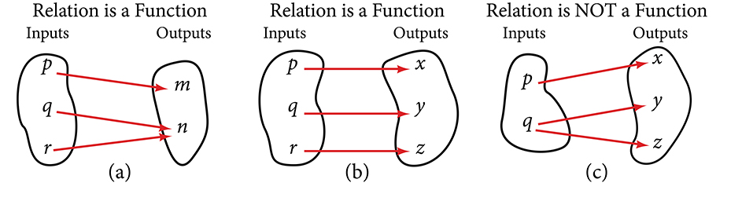

## Trước khi học {#vi-prerequisites}

*Hướng dẫn bổ sung:* Bạn đã biết mỗi đầu vào của một hàm số có đúng
một đầu ra. Trong bài này, ta thêm một yêu cầu: **hai đầu vào khác nhau
phải cho hai đầu ra khác nhau**. Một hàm số thỏa mãn yêu cầu này được
gọi là **đơn ánh**, hay **một-một**.

Đây là bản dịch trọn tiểu mục *Determining Whether a Function is
One-to-One* trong mô-đun `m49301`, không phải toàn bộ mục 1.1.
Các giải thích và điều kiện làm rõ được ghi là phần bổ sung.

## Khi nào một hàm số là đơn ánh? {#fs-id1165135422920}

::: {#fs-id1165135678633}
Có những hàm số mà một giá trị đầu ra tương ứng với hai hoặc nhiều
giá trị đầu vào. Chẳng hạn, trong biểu đồ cổ phiếu ở phần mở đầu chương
của nguồn, mức giá 1000 đô la xuất hiện vào năm ngày khác nhau. Như
vậy, năm đầu vào khác nhau cùng cho đầu ra là 1000 đô la.
:::

::: {#fs-id1165135245630}
Tuy nhiên, có những hàm số mà mỗi đầu ra chỉ tương ứng với một đầu vào,
bên cạnh điều kiện mỗi đầu vào chỉ có một đầu ra. Ta gọi đó là
**hàm số đơn ánh**. Ví dụ, xét một trường học chỉ dùng điểm chữ và
điểm quy đổi tương ứng như trong [Bảng 13](#Table_01_01_13).
:::

::: {#Table_01_01_13}
**Bảng 13. Điểm chữ và điểm quy đổi trong ví dụ của nguồn.**

| Điểm chữ | Điểm quy đổi |
|:---:|---:|
| A | 4.0 |
| B | 3.0 |
| C | 2.0 |
| D | 1.0 |
:::

::: {#fs-id1165137561844}
Hệ thống quy đổi này biểu diễn một hàm số đơn ánh: mỗi điểm chữ đầu
vào cho đúng một điểm quy đổi đầu ra, và mỗi điểm quy đổi chỉ tương
ứng với một điểm chữ đầu vào.
:::

*Lưu ý bổ sung:* Bảng chỉ dùng bốn cặp dữ liệu của nguồn; không thêm
điểm F hay các mức khác. Đây không phải một quy định chấm điểm của Việt Nam.

::: {#fs-id1165137628999}
Để hình dung, hãy xem lại hai hàm số trong
[Hình 1(a) và Hình 1(b)](#Figure_01_01_001). Hàm số ở phần (a) không
đơn ánh vì hai đầu vào {{math:fs-id1165137628999:0}} và
{{math:fs-id1165137628999:1}} đều cho đầu ra
{{math:fs-id1165137628999:2}}
Hàm số ở phần (b) là đơn ánh: các đầu vào khác nhau cho các đầu ra khác nhau.
:::

::: {#Figure_01_01_001}

Hình 1. Lặp lại hình nguồn để bài có thể đọc độc lập. *Inputs* là
đầu vào, *Outputs* là đầu ra. Phần (c) không phải hàm số nên không
được xếp là hàm số đơn ánh.
:::

*Lưu ý làm rõ bản dịch:* Chỉ biết “mỗi đầu vào có một đầu ra” chưa
đủ kết luận đơn ánh. Lý do ở phần (b) được nêu rõ bằng điều kiện
**các đầu vào khác nhau có các đầu ra khác nhau**, đúng như sơ đồ.

### Định nghĩa — Hàm số đơn ánh {#fs-id1165135261974}

::: {#fs-id1165137387348}
**Hàm số đơn ánh** là một hàm số trong đó mỗi giá trị đầu ra tương
ứng với đúng một giá trị đầu vào.
:::

*Lưu ý bổ sung:* “Giá trị đầu ra” ở đây là phần tử của **tập giá trị**,
tức là giá trị thực sự đạt được. Định nghĩa không đòi hỏi hàm số phải
nhận mọi giá trị thuộc một tập đích lớn hơn.

### Ví dụ 13 — Diện tích hình tròn và bán kính {#Example_01_01_13}

::: {#fs-id1165137755749}
::: {#fs-id1165137755752}
Diện tích hình tròn có phải là một hàm số của bán kính không? Nếu có,
hàm số đó có đơn ánh không?
:::

::: {#fs-id1165137892391}
::: {#fs-id1165134148470}
**Lời giải.** Hình tròn có bán kính $r$ có một diện tích duy nhất cho
bởi công thức {{math:fs-id1165134148470:1}} nên mỗi đầu vào $r$ chỉ
cho một đầu ra $A$. Vì vậy, diện tích là một hàm số của bán kính.
:::

::: {#fs-id1165137892326}
Để hàm số là đơn ánh, mỗi giá trị đầu ra — diện tích — phải tương
ứng với một giá trị đầu vào duy nhất — bán kính. Theo công thức
{{math:fs-id1165137892326:1}} và vì diện tích, bán kính đều dương,
bán kính có đúng một giá trị là {{math:fs-id1165137892326:2}} Do đó,
diện tích hình tròn là một
hàm số đơn ánh của bán kính.
:::
:::
:::

*Lưu ý bổ sung:* Ta đang xét bán kính $r>0$. Nghiệm căn bậc hai âm
không phải bán kính. Nếu thay tập xác định bằng toàn bộ số thực,
quy tắc $r\mapsto \pi r^2$ không còn đơn ánh vì $r$ và $-r$ cho cùng
một giá trị. Tập xác định là một phần quan trọng của kết luận.

### Tự thử — Số dư tài khoản {#fs-id1165137579363}

[Lời giải](#fs-id1165137456018)

::: {#ti_01_01_10}
::: {#fs-id1165134079641}
::: {#fs-id1165134079644}
a. Số dư có phải là một hàm số của số tài khoản ngân hàng không?
b. Số tài khoản ngân hàng có phải là một hàm số của số dư không?
c. Số dư có phải là một hàm số đơn ánh của số tài khoản ngân hàng không?
:::
:::
:::

*Điều kiện bổ sung để đọc ví dụ:* Xét một thời điểm cố định, cùng
một ngân hàng, mỗi số tài khoản xác định một tài khoản và dùng cùng
một loại số dư, đơn vị tiền tệ. Bài xét quy tắc nói chung, có thể có
những tài khoản khác nhau cùng số dư; không khẳng định mọi bộ dữ
liệu cụ thể đều có số dư trùng nhau.

### Số dư tài khoản — Lời giải {#fs-id1165137456018}

::: {#eip-idm552643792}
a. Có, vì tại một thời điểm, mỗi tài khoản có một số dư xác định.
b. Không, vì nhiều số tài khoản khác nhau có thể có cùng số dư.
c. Không, vì cùng một đầu ra có thể tương ứng với nhiều đầu vào.
:::

*Giải thích bổ sung:* Hai câu “không” là đáp án của nguồn cho quy
tắc nói chung: không bảo đảm tính duy nhất khi đi từ số dư về số
tài khoản. Chỉ cần có hai tài khoản khác nhau cùng số dư thì quy
tắc số tài khoản → số dư không đơn ánh.

### Tự thử — Điểm phần trăm và điểm chữ {#fs-id1327356}

::: {#ti_01_01_11}
::: {#fs-id1165137737576}
::: {#eip-id1166399990268}
a. Nếu mỗi điểm phần trăm đạt được trong một môn học được đổi thành
   đúng một điểm chữ, điểm chữ có phải là một hàm số của điểm phần trăm không?
b. Nếu có, hàm số này có đơn ánh không?
:::
:::
:::

### Điểm phần trăm và điểm chữ — Lời giải {#fs-id1165137655289}

::: {#fs-id1165137655291}
a. Có, điểm chữ là một hàm số của điểm phần trăm.
b. Không, hàm số không đơn ánh. Nguồn nêu 100 mức điểm phần trăm
   khác nhau nhưng chỉ có khoảng năm điểm chữ, nên không thể chỉ
   có một mức điểm phần trăm ứng với mỗi điểm chữ.
:::

*Lưu ý bổ sung về cách đếm:* Nếu xét tất cả điểm nguyên từ 0 đến
100 và tính cả hai đầu mút, ta có **101** mức, không phải 100.
Điều này không làm thay đổi kết luận: số mức điểm phần trăm lớn
hơn số điểm chữ, nên phải có hai mức khác nhau cùng một điểm chữ.

## Tự đánh giá và phần tiếp theo {#vi-next}

*Câu hỏi bổ sung:* Vì sao một hàm số có thể không đơn ánh? Trong
Ví dụ 13, tại sao không lấy cả nghiệm bán kính âm? Khi tìm số tài
khoản từ số dư, điều gì có thể làm mất tính duy nhất?

Tiếp theo: **Kiểm tra bằng đường thẳng đứng**, bắt đầu tại
`fs-id1165135435781` trong mô-đun `m49301`.

## Nguồn và ghi công {#vi-attribution}

Bản dịch độc lập `vi-Latn-VN` từ Jay Abramson và các cộng tác viên
OpenStax, *Precalculus 2e*, mô-đun `m49301`, UUID
`11f4eacc-c348-4836-8c5b-747577d249ca`;
[nguồn được ghim](https://github.com/openstax/osbooks-college-algebra-bundle/tree/789b54099106b071d1d32bfcee454fed72eb4768).
Đối chiếu với [ấn bản Bahasa Indonesia](https://github.com/KokunoYumeto/openstax-precalculus-2e-id)
`0.1.0-alpha.58-reader.1`.

Văn bản, hình và bản dịch A30 theo
[CC BY-NC-SA 4.0](https://creativecommons.org/licenses/by-nc-sa/4.0/).
Các thông báo nguồn được giữ trong `notices/`; các sách khác giữ giấy
phép riêng. Phần bổ sung được đánh dấu; lý do đơn ánh ở Hình 1(b)
được làm rõ, và số 100 trong lời giải nguồn được giữ lại kèm ghi
chú về cách đếm 0–100. Không phải ấn bản chính thức hay được tác
giả nguồn bảo trợ. Có sự hỗ trợ của OpenAI Codex theo yêu cầu người
dùng; chưa có thẩm định của người bản ngữ.
