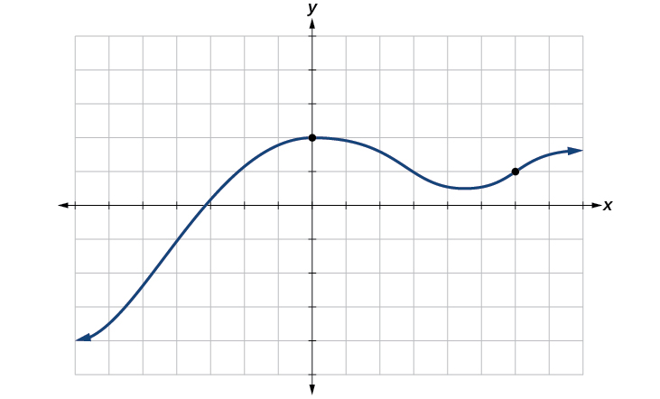
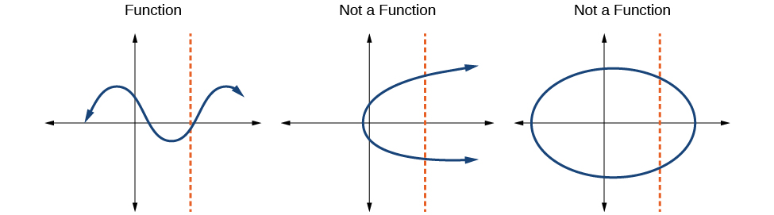
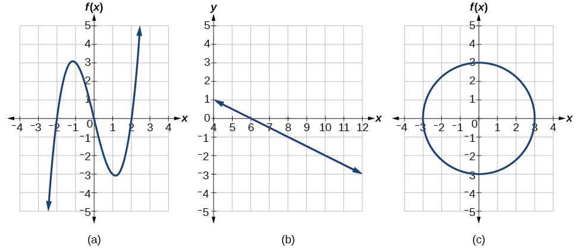
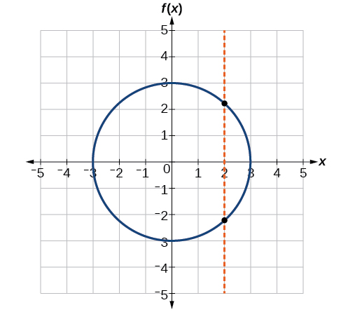
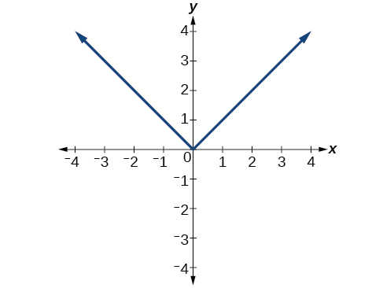
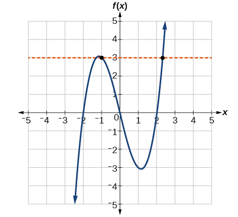

## Trước khi học {#vi-prerequisites}

*Hướng dẫn bổ sung:* Bạn đã biết mỗi đầu vào của một hàm số phải có
đúng một đầu ra, còn hàm số đơn ánh phải cho các đầu ra khác nhau
khi nhận các đầu vào khác nhau. Bài này dùng giao điểm với đường
thẳng để kiểm tra hai điều kiện ấy trên đồ thị.

Bài dịch trọn hai tiểu mục *Using the Vertical Line Test* và *Using
the Horizontal Line Test* của mô-đun `m49301`, gồm Ví dụ 14–15 và
hai bài Tự thử; không phải toàn bộ mục 1.1. Các phần bổ sung được
đánh dấu. Hình gốc, mã định danh và số hình được giữ nguyên, kể cả
thứ tự xuất hiện không tăng dần của số hình.

## Kiểm tra bằng đường thẳng đứng {#fs-id1165135435781}

::: {#fs-id1165135435786}
Như đã thấy trong các ví dụ trước, ta có thể biểu diễn một hàm số
bằng đồ thị. Đồ thị thể hiện rất nhiều cặp đầu vào–đầu ra trong một
khoảng không gian nhỏ. Thông tin trực quan ấy thường giúp ta dễ
hiểu mối quan hệ giữa các đại lượng hơn. Theo quy ước thông dụng,
các giá trị đầu vào được biểu diễn trên trục ngang, còn các giá trị
đầu ra được biểu diễn trên trục đứng.
:::

::: {#fs-id1165137637786}
Thông thường, ta ký hiệu đầu vào là {{math:fs-id1165137637786:0}}
và đầu ra là {{math:fs-id1165137637786:1}} rồi nói
{{math:fs-id1165137637786:2}} là một hàm số của
{{math:fs-id1165137637786:3}} hoặc viết
{{math:fs-id1165137637786:4}} khi đặt tên hàm số là
{{math:fs-id1165137637786:5}}
Đồ thị của hàm số là tập hợp tất cả các điểm
{{math:fs-id1165137637786:6}} trong mặt phẳng thỏa mãn phương trình
{{math:fs-id1165137637786:7}}

Nếu hàm số chỉ được xác định tại một vài giá trị đầu vào, đồ thị
của nó chỉ gồm một vài điểm. Hoành độ $x$ của mỗi điểm là đầu vào,
còn tung độ $y$ là đầu ra tương ứng. Chẳng hạn, các chấm đen trên
đồ thị trong [Hình 11](#Figure_01_01_011) cho biết
{{math:fs-id1165137637786:8}} và {{math:fs-id1165137637786:9}}
Trong hình này, toàn bộ tập hợp các điểm
{{math:fs-id1165137637786:10}} thỏa mãn
{{math:fs-id1165137637786:11}} tạo thành đường cong được vẽ.
Đường cong chứa hai điểm {{math:fs-id1165137637786:12}} và
{{math:fs-id1165137637786:13}} vì nó đi qua hai điểm ấy.
:::

*Lưu ý làm rõ bản dịch:* Nhận xét của nguồn về một đường cong được
hiểu cho **hình đang xét**, không phải mọi hàm số. Đồ thị có thể gồm
các điểm rời rạc; không được tự nối các điểm dữ liệu nếu chưa có
thông tin xác định những giá trị ở giữa.

::: {#Figure_01_01_011}
::: {#fs-id1165137572613}

:::

Hình 11. Hai điểm được đánh dấu cho biết hai cặp đầu vào–đầu ra
trên đồ thị.
:::

::: {#fs-id1165137737620}
Ta có thể dùng **kiểm tra bằng đường thẳng
đứng** để xác định xem một đồ thị có biểu diễn hàm số hay
không. Nếu có thể vẽ một đường thẳng đứng giao với đồ thị tại nhiều
hơn một điểm, đồ thị đó **không** xác định một hàm số: mỗi đầu vào
của hàm số chỉ được có một giá trị đầu ra. Xem
[Hình 12](#Figure_01_01_012).
:::

::: {#Figure_01_01_012}
::: {#fs-id1165135533149}

:::

Hình 12. Giữ nguyên chữ tiếng Anh trong hình: *Function* là “hàm
số”; *Not a Function* là “không phải hàm số”.
:::

### Cách làm — Dùng đường thẳng đứng {#fs-id1165135460884}

::: {#fs-id1165137452182}
**Cho một đồ thị, hãy dùng đường thẳng đứng để kiểm tra xem đồ thị
có biểu diễn hàm số hay không.**
:::

::: {#fs-id1165133277614}
1. Quan sát đồ thị để xem có đường thẳng đứng nào giao với đồ thị
   tại nhiều hơn một điểm hay không.
2. Nếu có một đường thẳng như vậy, kết luận đồ thị không biểu diễn
   một hàm số.
:::

*Giải thích bổ sung:* Đường thẳng đứng có dạng $x=a$, tức là giữ
nguyên đầu vào. Đồ thị biểu diễn một hàm số trên tập hợp các hoành độ
của nó khi **mọi** đường thẳng đứng có nhiều nhất một giao điểm với
đồ thị. Nếu $a$ thuộc tập xác định thì phải có đúng một giao điểm;
nếu $a$ nằm ngoài tập xác định thì không có giao điểm. Chỉ thử một
vài đường thẳng mà không tìm thấy vi phạm chưa đủ chứng minh điều
kiện này cho toàn bộ đồ thị.

### Ví dụ 14 — Áp dụng cách kiểm tra bằng đường thẳng đứng {#Example_01_01_14}

::: {#fs-id1165134541166}
::: {#fs-id1165137571591}
::: {#fs-id1165137761111}
Những đồ thị nào trong [Hình 13](#Figure_01_01_013) biểu diễn một
hàm số {{math:fs-id1165137761111:0}}
:::

::: {#Figure_01_01_013}
::: {#fs-id1165137786563}

:::

Hình 13. Ba đồ thị dùng cho Ví dụ 14, Ví dụ 15 và bài Tự thử cuối.
*Lưu ý bổ sung:* Nhãn $f(x)$ trên trục đứng của hình (c) được giữ
nguyên từ nguồn. Khi đọc đường tròn, hãy hiểu trục ấy là tọa độ $y$;
nhãn có sẵn không chứng minh rằng đồ thị là một hàm số.
:::
:::

::: {#fs-id1165135190052}
::: {#fs-id1165137629350}
**Lời giải.** Nếu có một đường thẳng đứng giao với đồ thị tại nhiều
hơn một điểm, quan hệ được biểu diễn không phải là hàm số. Đối với
mỗi đồ thị ở [Hình 13(a) và (b)](#Figure_01_01_013), mọi đường
thẳng đứng đều có nhiều nhất một giao điểm. Vì vậy, hai đồ thị này
biểu diễn các hàm số. Đồ thị thứ ba không biểu diễn hàm số: tại
mỗi hoành độ thuộc khoảng $(-3,3)$, đường thẳng đứng có hai giao
điểm với đường tròn.
[Hình 16](#Figure_01_01_016) minh họa một đường thẳng như vậy.
:::

::: {#Figure_01_01_016}
::: {#fs-id1165133201929}

:::

Hình 16. Cùng đầu vào $x=2$ cho hai đầu ra khác nhau. Nhãn $f(x)$
trên trục đứng được giữ nguyên như ở Hình 13(c), nhưng đường tròn
không biểu diễn một hàm số của $x$.
:::
:::
:::

*Làm rõ bổ sung:* Nguồn nói “chỉ một điểm” với (a), (b) và “phần
lớn các giá trị $x$” với đường tròn; bản dịch nêu chính xác điều
kiện cần dùng. Với đường tròn $x^2+y^2=9$, có hai giao điểm khi
$-3<x<3$, một giao điểm khi $x=\pm3$, và không có giao điểm thực
khi $|x|>3$. Riêng $x=2$ cho $y=\sqrt5$ và $y=-\sqrt5$; một đầu
vào này đã đủ bác bỏ tính chất hàm số.

### Tự thử — Đồ thị hình chữ V {#fs-id1165134544969}

::: {#ti_01_01_04}
::: {#fs-id1165135600805}
::: {#fs-id1165135210137}
Đồ thị trong [Hình 17](#Figure_01_01_017) có biểu diễn một hàm số không?
:::

::: {#Figure_01_01_017}
::: {#fs-id1165135519277}

:::

Hình 17. Đồ thị của hàm số giá trị tuyệt đối trong nguồn.
:::

*Gợi ý bổ sung:* Hãy giữ nguyên một hoành độ rồi đếm số giao điểm;
sau đó xem [lời giải](#fs-id1165134258608).
:::
:::

### Đồ thị hình chữ V — Lời giải {#fs-id1165134258608}

::: {#fs-id1165134258609}
**Đáp án nguồn:** Có.
:::

*Giải thích bổ sung:* Mỗi đường thẳng đứng giao với đồ thị tại đúng
một điểm. Tại $x=0$, hai nhánh gặp nhau ở cùng một điểm $(0,0)$;
đó không phải hai đầu ra khác nhau. Đồ thị vẫn biểu diễn một hàm số,
dù có những đầu vào khác nhau cho cùng một đầu ra.

## Kiểm tra bằng đường thẳng ngang {#fs-id1165137610952}

::: {#fs-id1165137871503}
**Sau khi đã xác định đồ thị biểu diễn một hàm số**, ta có thể dùng
**kiểm tra bằng đường thẳng ngang**
để dễ dàng xét xem hàm số đó có đơn ánh hay không. Vẽ các đường
thẳng ngang qua đồ thị. Nếu có một đường thẳng ngang giao với đồ
thị tại nhiều hơn một điểm, hàm số không đơn ánh.
:::

### Cách làm — Dùng đường thẳng ngang {#fs-id1165137736232}

::: {#fs-id1165133437255}
**Cho đồ thị của một hàm số, hãy dùng đường thẳng ngang để kiểm tra
xem hàm số có đơn ánh hay không.**
:::

::: {#fs-id1165137611853}
1. Quan sát đồ thị để xem có đường thẳng ngang nào giao với đồ thị
   tại nhiều hơn một điểm hay không.
2. Nếu có một đường thẳng như vậy, kết luận hàm số không đơn ánh.
:::

*Giải thích bổ sung:* Đường thẳng ngang có dạng $y=b$, tức là giữ
nguyên đầu ra. Hai giao điểm khác nhau cho hai đầu vào khác nhau
cùng một đầu ra $b$. Một hàm số là đơn ánh khi mọi đường thẳng
ngang có nhiều nhất một giao điểm với đồ thị. Đường nằm ngoài tập
giá trị không có giao điểm; điều đó không vi phạm tính đơn ánh.
Ở đây, một điểm chung vẫn được tính là giao điểm ngay cả khi đường
thẳng chỉ tiếp xúc với đồ thị tại điểm ấy.

### Ví dụ 15 — Áp dụng cách kiểm tra bằng đường thẳng ngang {#Example_01_01_15}

::: {#fs-id1165134389035}
::: {#fs-id1165134342668}
::: {#fs-id1165135434808}
Xét các hàm số trong [Hình 13(a)](#Figure_01_01_013) và
[Hình 13(b)](#Figure_01_01_013). Hàm số nào trong hai hàm số đó là
đơn ánh?
:::
:::

::: {#fs-id1165135521259}
::: {#fs-id1165135185190}
**Lời giải.** Hàm số trong [Hình 13(a)](#Figure_01_01_013) không
đơn ánh. Đường thẳng ngang trong [Hình 10](#Figure_01_01_010) có
hai giao điểm với đồ thị. Thậm chí có thể tìm được những đường
thẳng ngang có ba giao điểm với đồ thị này.
:::

::: {#Figure_01_01_010}
::: {#fs-id1165135255395}

:::

Hình 10. Hai điểm khác nhau trên cùng đường ngang cho hai đầu vào
khác nhau có cùng đầu ra 3.
:::

::: {#fs-id1165135151243}
Hàm số trong [Hình 13(b)](#Figure_01_01_013) là đơn ánh. Mỗi đường
thẳng ngang giao với đường thẳng xiên này tại nhiều nhất một điểm.
:::
:::
:::

### Tự thử — Đồ thị đường tròn {#fs-id1165135252051}

::: {#ti_01_01_12}
::: {#fs-id1165137749742}
::: {#fs-id1165137749744}
Đồ thị trong [Hình 13(c)](#Figure_01_01_013) có biểu diễn một hàm
số đơn ánh không?
:::
:::
:::

*Gợi ý bổ sung:* Trước hết kiểm tra điều kiện để là hàm số, rồi
xem [lời giải](#fs-id1165135255384).

### Đồ thị đường tròn — Lời giải {#fs-id1165135255384}

::: {#fs-id1165135255385}
**Đáp án nguồn:** Không, vì đồ thị không thỏa điều kiện kiểm tra
bằng đường thẳng ngang.
:::

*Giải thích bổ sung:* Chẳng hạn, đường ngang $y=0$ có hai giao điểm
với đường tròn là $(-3,0)$ và $(3,0)$. Tuy nhiên, trước đó đường
tròn đã không thỏa điều kiện kiểm tra bằng đường thẳng đứng, nên
nó **không biểu diễn một hàm số của $x$ ngay từ đầu**. Vì thế không
thể gọi nó là hàm số đơn ánh, và cũng không nên mô tả nó đơn thuần
là “một hàm số không đơn ánh”. Điều kiện đầu tiên của phép kiểm tra
bằng đường thẳng ngang không được bỏ qua.

## Tự đánh giá và phần tiếp theo {#vi-next}

*Câu hỏi bổ sung:* Khi dùng đường thẳng đứng, đại lượng nào được
giữ nguyên? Khi dùng đường thẳng ngang thì sao? Tại sao một đường
thẳng không có giao điểm chưa đủ bác bỏ tính chất hàm số hoặc đơn
ánh? Vì sao hai nhánh gặp nhau ở cùng một điểm không được tính là
hai đầu ra khác nhau?

Tiếp theo: **Nhận biết các hàm số cơ bản**, bắt đầu tại
`fs-id1165135545919` trong mô-đun `m49301`.

## Nguồn và ghi công {#vi-attribution}

Bản dịch độc lập `vi-Latn-VN` từ Jay Abramson và các cộng tác viên
OpenStax, *Precalculus 2e*, mô-đun `m49301`, UUID
`11f4eacc-c348-4836-8c5b-747577d249ca`;
[nguồn được ghim](https://github.com/openstax/osbooks-college-algebra-bundle/tree/789b54099106b071d1d32bfcee454fed72eb4768).
Đối chiếu với [ấn bản Bahasa Indonesia](https://github.com/KokunoYumeto/openstax-precalculus-2e-id)
`0.1.0-alpha.58-reader.1`.

Văn bản, hình và bản dịch A30 này theo
[CC BY-NC-SA 4.0](https://creativecommons.org/licenses/by-nc-sa/4.0/).
Hình nguồn: Copyright Rice University, OpenStax, under CC BY-NC-SA 4.0.
Giữ nguyên các thông báo trong `notices/`; những sách khác giữ giấy
phép riêng. Phần bổ sung, các chú thích và mô tả hình bằng tiếng
Việt, cùng những chỗ làm rõ phạm vi của phát biểu nguồn đều là
thay đổi của bản dịch. Không chỉnh sửa dữ liệu hình gốc. Không phải
ấn bản chính thức hay được tác giả nguồn bảo trợ. Có sự hỗ trợ của
OpenAI Codex theo yêu cầu người dùng; chưa có thẩm định của người
bản ngữ.
