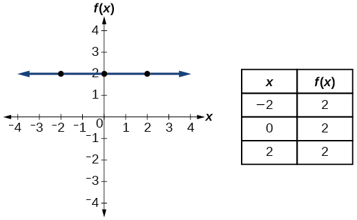
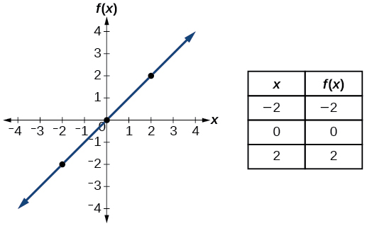
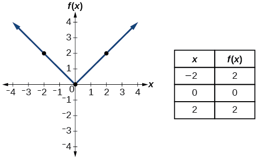
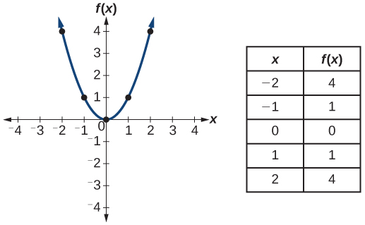
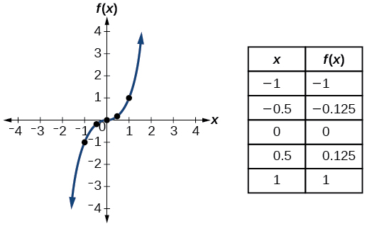
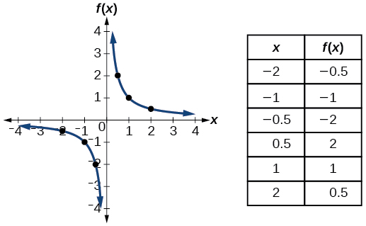
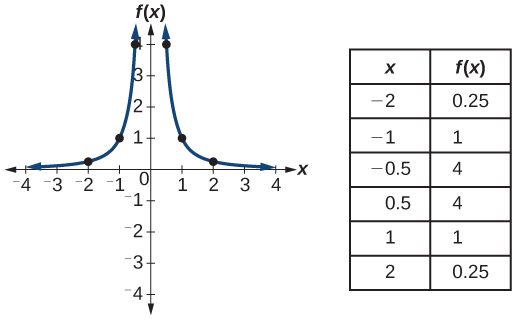
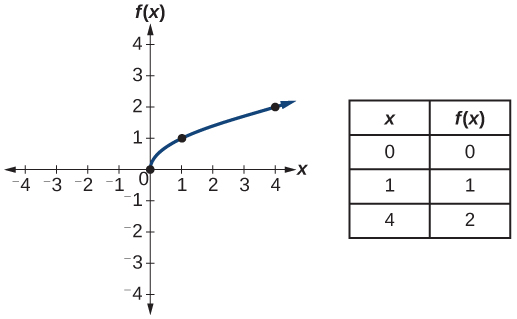
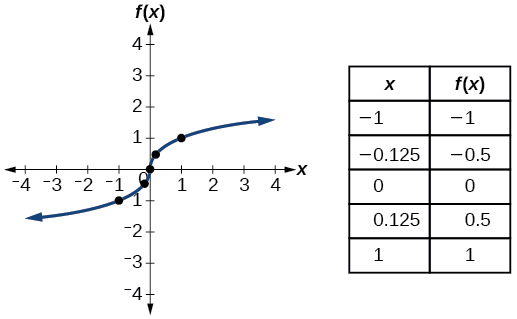

## Trước khi học {#vi-prerequisites}

*Hướng dẫn bổ sung:* Bạn đã biết đọc công thức, bảng và đồ thị của
một hàm số. Bài này giới thiệu chín hàm số thường dùng làm điểm
xuất phát để học các hàm số khác. Hãy liên hệ tên gọi với công
thức, hình dạng đồ thị và những cặp giá trị trong bảng.

Bài dịch trọn tiểu mục *Identifying Basic Toolkit Functions* của
mô-đun *m49301*, không phải toàn bộ mục 1.1. Các lưu ý về tập xác
định và tập giá trị được ghi rõ là phần bổ sung, và đều xét trong
**các số thực**. Không cần truy cập các liên kết trực tuyến ở cuối
bài để đọc nội dung chính.

## Nhận biết các hàm số cơ bản {#fs-id1165135545919}

::: {#fs-id1165137698132}
Trong cuốn sách này, ta sẽ tìm hiểu các hàm số: hình dạng đồ thị,
những đặc điểm riêng, công thức đại số và cách dùng hàm số để giải
quyết bài toán. Khi học đọc, ta bắt đầu từ bảng chữ cái. Khi học
số học, ta bắt đầu từ các số. Tương tự, khi học về hàm số, sẽ rất
hữu ích nếu có một tập hợp các hàm số làm nền tảng. Nguồn gọi chúng
là các “hàm số trong bộ công cụ”: những hàm số cơ bản có tên gọi,
đồ thị, công thức và các tính chất riêng mà ta biết rõ. Một số hàm
số này được gán cho các phím riêng trên nhiều máy tính cầm tay.
Trong các định nghĩa dưới đây, ta dùng
{{math:fs-id1165137698132:0}} làm biến đầu vào và viết đầu ra dưới
dạng {{math:fs-id1165137698132:1}}.
:::

::: {#fs-id1165135591070}
Ta sẽ thường xuyên gặp lại các hàm số cơ bản này, những cách kết
hợp chúng, đồ thị của chúng và các phép biến đổi đồ thị trong suốt
cuốn sách. Sẽ rất có ích nếu có thể nhanh chóng nhận biết các hàm
số cùng đặc điểm của chúng qua tên gọi, công thức, đồ thị và những
tính chất cơ bản thể hiện trong bảng. [Bảng 14](#Table_01_01_14)
kèm đồ thị và một số giá trị mẫu của từng hàm số.
:::

*Ghi chú trình bày:* Bảng 14 của nguồn có ba cột: tên gọi, công
thức và hình chứa đồ thị cùng bảng giá trị. Để dễ đọc trên màn hình
nhỏ, bản dịch xếp chín hàng thành chín mục liên tiếp, giữ nguyên
thứ tự. Mỗi hình gốc không bị chỉnh sửa; bảng số liệu trong hình
được chép lại thành văn bản bên dưới để dễ đọc và tra cứu. Dấu chấm
thập phân và mọi cặp giá trị được giữ theo hình nguồn.

::: {#Table_01_01_14}

### Bảng 14 — Các hàm số cơ bản

#### 1. Hàm số hằng {#vi-constant}

**Công thức:** {{math:Table_01_01_14:0}} trong đó
{{math:Table_01_01_14:1}} là một hằng số.

::: {#fs-id1165137643159}

:::

Dữ liệu trong hình — trường hợp $c=2$:

| $x$ | $f(x)$ |
|---:|---:|
| −2 | 2 |
| 0 | 2 |
| 2 | 2 |

*Lưu ý bổ sung:* Với một số thực $c$ **được giữ cố định**, công thức
$f(x)=c$ có tập xác định $\mathbb{R}$ và tập giá trị $\{c\}$.
Đồ thị là đường thẳng ngang $y=c$. Hình chỉ minh họa $c=2$, không
có nghĩa là mọi hàm số hằng đều bằng 2.

#### 2. Hàm số đồng nhất {#vi-identity}

**Công thức:** {{math:Table_01_01_14:2}}.

::: {#fs-id1165137811013}

:::

Dữ liệu trong hình:

| $x$ | $f(x)$ |
|---:|---:|
| −2 | −2 |
| 0 | 0 |
| 2 | 2 |

*Lưu ý bổ sung:* Mỗi đầu vào được giữ nguyên làm đầu ra. Tập xác
định và tập giá trị đều là $\mathbb{R}$. “Đồng nhất” không có nghĩa
là “hằng”: đầu ra của hàm số này thay đổi khi đầu vào thay đổi.

#### 3. Hàm số giá trị tuyệt đối {#vi-absolute-value}

**Công thức:** {{math:Table_01_01_14:3}}.

::: {#fs-id1165135195221}

:::

Dữ liệu trong hình:

| $x$ | $f(x)$ |
|---:|---:|
| −2 | 2 |
| 0 | 0 |
| 2 | 2 |

*Lưu ý bổ sung:* Tập xác định là $\mathbb{R}$; tập giá trị là
$[0,+\infty)$. Hai đầu vào đối nhau có cùng giá trị tuyệt đối.
Đồ thị hình chữ V biểu diễn một hàm số, nhưng hàm số ấy không đơn
ánh trên $\mathbb{R}$.

#### 4. Hàm số bậc hai cơ bản {#vi-quadratic}

**Công thức:** {{math:Table_01_01_14:4}}.

::: {#fs-id1165137501903}

:::

Dữ liệu trong hình:

| $x$ | $f(x)$ |
|---:|---:|
| −2 | 4 |
| −1 | 1 |
| 0 | 0 |
| 1 | 1 |
| 2 | 4 |

*Lưu ý bổ sung:* Tập xác định là $\mathbb{R}$; tập giá trị là
$[0,+\infty)$. Đây là hàm số bậc hai **cơ bản** $x\mapsto x^2$,
không phải công thức tổng quát của mọi hàm số bậc hai.

#### 5. Hàm số bậc ba cơ bản {#vi-cubic}

**Công thức:** {{math:Table_01_01_14:5}}.

::: {#fs-id1165137722123}

:::

Dữ liệu trong hình:

| $x$ | $f(x)$ |
|---:|---:|
| −1 | −1 |
| −0.5 | −0.125 |
| 0 | 0 |
| 0.5 | 0.125 |
| 1 | 1 |

*Lưu ý bổ sung:* Tập xác định và tập giá trị đều là $\mathbb{R}$.
Đây là hàm số bậc ba cơ bản $x\mapsto x^3$; tên gọi ở đây không
khẳng định rằng mọi hàm số bậc ba đều có cùng công thức hay hình
dạng cụ thể như trong hình.

#### 6. Hàm số lấy nghịch đảo {#vi-reciprocal}

**Công thức:** {{math:Table_01_01_14:6}}.

::: {#fs-id1165134544980}

:::

Dữ liệu trong hình:

| $x$ | $f(x)$ |
|---:|---:|
| −2 | −0.5 |
| −1 | −1 |
| −0.5 | −2 |
| 0.5 | 2 |
| 1 | 1 |
| 2 | 0.5 |

*Lưu ý bổ sung:* Đầu vào phải khác 0 vì không thể chia cho 0. Tập
xác định và tập giá trị đều là $\mathbb{R}\setminus\{0\}$.
“Lấy nghịch đảo” ở đây là lấy nghịch đảo **của số đầu vào**, tức
là tính $1/x$; không dùng tên này để chỉ khái niệm hàm số ngược
của một hàm số bất kỳ.

#### 7. Hàm số lấy nghịch đảo của bình phương {#vi-reciprocal-squared}

**Công thức:** {{math:Table_01_01_14:7}}.

::: {#fs-id1165137647610}

:::

Dữ liệu trong hình:

| $x$ | $f(x)$ |
|---:|---:|
| −2 | 0.25 |
| −1 | 1 |
| −0.5 | 4 |
| 0.5 | 4 |
| 1 | 1 |
| 2 | 0.25 |

*Lưu ý bổ sung:* Tập xác định là $\mathbb{R}\setminus\{0\}$;
tập giá trị là $(0,+\infty)$, **không chứa 0**. Với $x\ne0$, ta có
$1/x^2=(1/x)^2$: lấy nghịch đảo của bình phương cũng bằng bình
phương của nghịch đảo. Hai đầu vào đối nhau cho cùng một đầu ra.

#### 8. Hàm số căn bậc hai {#vi-square-root}

**Công thức:** {{math:Table_01_01_14:8}}.

::: {#fs-id1165137863670}

:::

Dữ liệu trong hình:

| $x$ | $f(x)$ |
|---:|---:|
| 0 | 0 |
| 1 | 1 |
| 4 | 2 |

*Lưu ý bổ sung:* Trong các số thực, phải có $x\ge0$. Ký hiệu
$\sqrt{x}$ chỉ căn bậc hai **không âm**, không phải đồng thời cả
hai dấu $\pm$. Tập xác định và tập giá trị đều là $[0,+\infty)$.
Đặc biệt, $\sqrt4=2$; điều này khác với việc giải phương trình
$y^2=4$, có hai nghiệm $y=2$ và $y=-2$.

#### 9. Hàm số căn bậc ba {#vi-cube-root}

**Công thức:** {{math:Table_01_01_14:9}}.

::: {#fs-id1165137838612}

:::

Dữ liệu trong hình:

| $x$ | $f(x)$ |
|---:|---:|
| −1 | −1 |
| −0.125 | −0.5 |
| 0 | 0 |
| 0.125 | 0.5 |
| 1 | 1 |

*Lưu ý bổ sung:* Mỗi số thực có đúng một căn bậc ba thực. Tập xác
định và tập giá trị đều là $\mathbb{R}$, kể cả các số âm. Ví dụ,
$\sqrt[3]{-1}=-1$. Giữ ký hiệu căn bậc ba của công thức nguồn để
tránh nhầm với căn bậc hai hoặc với một quy ước lũy thừa của phần
mềm khi đầu vào âm.

:::

## Tài nguyên trực tuyến tùy chọn {#fs-id1165134042311}

::: {#fs-id1165135549046}
Có thể truy cập các tài nguyên trực tuyến sau để học thêm và luyện
tập về hàm số.
:::

::: {#eip-id1165137846437}
- [Xác định xem một quan hệ có phải là hàm số không](https://openstax.org/l/relationfunction).
- [Kiểm tra bằng đường thẳng đứng](https://openstax.org/l/vertlinetest).
- [Giới thiệu về hàm số](https://openstax.org/l/introtofunction).
- [Kiểm tra bằng đường thẳng đứng trên đồ thị](https://openstax.org/l/vertlinegraph).
- [Hàm số đơn ánh](https://openstax.org/l/onetoone).
- [Nhận biết hàm số đơn ánh qua đồ thị](https://openstax.org/l/graphonetoone).
:::

*Ghi chú bổ sung:* Đây là các liên kết nguyên gốc, không phải tài
liệu tiếng Việt do bản dịch tạo ra. Nội dung bên ngoài không được
tải về, lưu kèm hay xác minh lại trong bài này. Chúng là tài nguyên
tùy chọn cần kết nối mạng; toàn bộ phần học chính và chín hình vẫn
có thể đọc ngoại tuyến.

## Tự đánh giá và phần tiếp theo {#vi-next}

*Câu hỏi bổ sung:* Bạn có phân biệt được hàm số hằng với hàm số
đồng nhất không? Vì sao $x=0$ không được dùng làm đầu vào của hai
hàm số lấy nghịch đảo? Vì sao $\sqrt{x}$ không cho đầu ra âm,
trong khi $\sqrt[3]{x}$ có thể cho đầu ra âm? Các bảng mẫu có cho
biết toàn bộ tập xác định của những hàm số này không?

Tiếp theo: **Các công thức và ý chính**, bắt đầu tại
*fs-id1165135203679* trong mô-đun *m49301*.

## Nguồn và ghi công {#vi-attribution}

Bản dịch độc lập *vi-Latn-VN* từ Jay Abramson và các cộng tác viên
OpenStax, *Precalculus 2e*, mô-đun *m49301*, UUID
*11f4eacc-c348-4836-8c5b-747577d249ca*;
[nguồn được ghim](https://github.com/openstax/osbooks-college-algebra-bundle/tree/789b54099106b071d1d32bfcee454fed72eb4768).
Đối chiếu với [ấn bản Bahasa Indonesia](https://github.com/KokunoYumeto/openstax-precalculus-2e-id)
*0.1.0-alpha.58-reader.1*.

Văn bản, hình và bản dịch A30 này theo
[CC BY-NC-SA 4.0](https://creativecommons.org/licenses/by-nc-sa/4.0/).
Hình nguồn: Copyright Rice University, OpenStax, under CC BY-NC-SA 4.0.
Giữ nguyên các thông báo trong thư mục *notices/*; những sách khác
giữ giấy phép riêng. Phần ghi “bổ sung”, việc xếp lại Bảng 14, chép
lại bảng số liệu trong hình và thêm mô tả hỗ trợ tiếp cận bằng
tiếng Việt là các thay đổi của bản dịch. Không chỉnh sửa dữ liệu
hình gốc. Không phải ấn bản chính thức hay được tác giả nguồn bảo
trợ. Có sự hỗ trợ của OpenAI Codex theo yêu cầu người dùng; chưa
có thẩm định của người bản ngữ.
