## Phạm vi và cách đọc {#vi-prerequisites}

Bài này dịch 15 bài liên tiếp đầu phần **Graphical** của mô-đun
`m49301`, mang số Bài 40–54 theo thứ tự bài tập của nguồn.
Bài 40–51 dùng kiểm tra bằng đường thẳng đứng; Bài 52–54 yêu cầu
đọc giá trị hàm số và tìm đầu vào trên đồ thị.
Giữ nguyên 15 ảnh nguồn. Nguồn có đáp án cho 7 bài; 8 bài còn lại
có đáp án mới được đánh dấu rõ là bổ sung.

*Hướng dẫn bổ sung:* Chỉ xét đường hoặc đường cong biểu diễn quan hệ,
không đếm các trục tọa độ, đường lưới hay đường tiệm cận nét đứt.
Vòng tròn rỗng không thuộc đồ thị. Một đồ thị biểu diễn hàm số trên
tập các đầu vào thực sự xuất hiện khi mỗi đường thẳng đứng cắt nó
tại nhiều nhất một điểm. Với một đầu vào thuộc tập xác định ấy,
phải có đúng một điểm. Nếu một tập đầu vào được quy định trước,
còn phải kiểm tra mọi phần tử trong tập đó đều có đầu ra.

*Mô tả hình bổ sung:* Những đoạn mô tả đi kèm giúp đọc ảnh bằng văn
bản và được biên soạn từ hình gốc. Chúng không phải là công thức do
nguồn cung cấp. Các tọa độ không được xác định rõ trên thang đo
được nêu là gần đúng; các sửa chữa văn bản thay thế được ghi chú
ngay tại hình liên quan.

## Bài tập đồ thị {#fs-id1165135664071}

::: {#fs-id1165135664077}

Với các bài tập sau, hãy dùng kiểm tra bằng đường thẳng đứng để
xác định đồ thị nào biểu diễn một quan hệ là hàm số.
:::

### Bài 40 {#fs-id1165135455987}

::: {#fs-id1165135455989}
::: {#fs-id1165135455994}

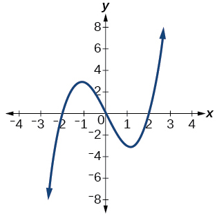

*Mô tả hình bổ sung:* Từ trái sang phải, đường cong tăng, giảm rồi tăng trở lại. Đỉnh nằm gần $(-1,3)$, đáy gần $(1,-3)$; các tọa độ gần đúng này chỉ giúp nhận ra hình, không xác định một công thức.
:::
:::

[Lời giải Bài 40](#vi-sol-40)

### Bài 41 {#fs-id1165137527641}

::: {#fs-id1165137847086}
::: {#fs-id1165137847091}

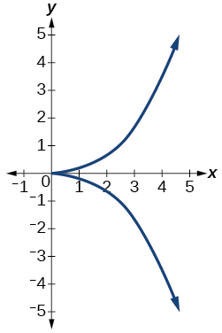

*Mô tả hình bổ sung:* Với một hoành độ dương, chẳng hạn $x=2$, đường thẳng đứng gặp cả nhánh trên lẫn nhánh dưới. Hai nhánh chỉ gặp nhau tại gốc tọa độ.
:::
:::

[Lời giải Bài 41](#fs-id1165135332505)

### Bài 42 {#fs-id1165135332512}

::: {#fs-id1165133336399}
::: {#fs-id1165133336405}

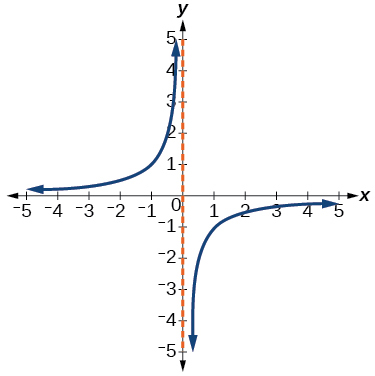

*Mô tả hình bổ sung:* Nhánh bên trái nằm phía trên trục $x$; nhánh bên phải nằm phía dưới. Đường nét đứt $x=0$ chỉ đường tiệm cận, không phải là một phần của đường cong xanh.
:::
:::

[Lời giải Bài 42](#vi-sol-42)

### Bài 43 {#fs-id1165137742393}

::: {#fs-id1165137742395}
::: {#fs-id1165137597394}

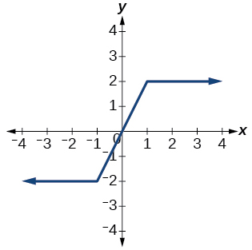

*Mô tả hình bổ sung:* Ba phần nối liền nhau: $y=-2$ khi $x\le-1$, đoạn tăng từ $(-1,-2)$ đến $(1,2)$, và $y=2$ khi $x\ge1$. Các điểm nối thuộc cùng một đường liên tục.
:::
:::

[Lời giải Bài 43](#fs-id1165137597406)

### Bài 44 {#fs-id1165135386379}

::: {#fs-id1165135386381}
::: {#fs-id1165135386387}

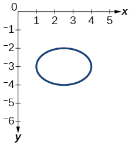

*Mô tả hình bổ sung:* Đường khép kín có phần trên và phần dưới. Đường thẳng $x=2$ đi qua hai phần ấy, tại hai tung độ khác nhau. Mép trái ở gần $x=1$, mép phải gần $x=4$.
:::
:::

*Ghi chú hiệu chỉnh mô tả nguồn:* Văn bản thay thế tiếng Indonesia ghi mép phải gần $x=5$, nhưng hình gốc cho thấy mép phải gần $x=4$. Bản mô tả này theo hình gốc; ảnh không bị sửa.

[Lời giải Bài 44](#vi-sol-44)

### Bài 45 {#fs-id1165137749974}

::: {#fs-id1165137439464}
::: {#fs-id1165137439470}

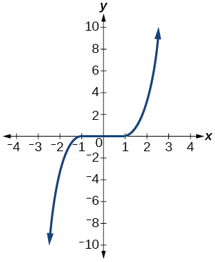

*Mô tả hình bổ sung:* Đường cong đi qua vùng quanh gốc tọa độ và rất phẳng gần trục $x$. Khi dịch một đường thẳng đứng từ trái sang phải, ta không thấy nó gặp hai điểm của đường cong cùng lúc.
:::
:::

*Ghi chú hiệu chỉnh mô tả nguồn:* Văn bản thay thế tiếng Anh gọi đây là $y=x^3$ và nêu các điểm $(-1,-1)$, $(1,1)$. Những chi tiết ấy không khớp hình gốc. Bản dịch chỉ mô tả hình dạng nhìn thấy, không gán một công thức khác; ảnh và đáp án nguồn được giữ nguyên.

[Lời giải Bài 45](#fs-id1165137399700)

### Bài 46 {#fs-id1165137399704}

::: {#fs-id1165137399706}
::: {#fs-id1165135704896}

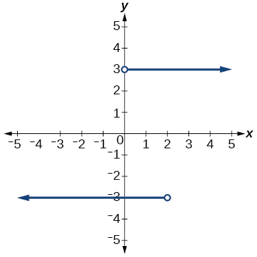

*Mô tả hình bổ sung:* Tia trên gồm các điểm $(x,3)$ với $x>0$; tia dưới gồm các điểm $(x,-3)$ với $x<2$. Hai vòng tròn rỗng loại riêng các đầu mút $(0,3)$ và $(2,-3)$.
:::
:::

[Lời giải Bài 46](#vi-sol-46)

### Bài 47 {#fs-id1165137883764}

::: {#fs-id1165137883767}
::: {#fs-id1165137883773}

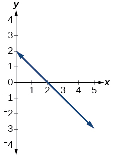

*Mô tả hình bổ sung:* Đường thẳng đi từ trên bên trái xuống dưới bên phải, cắt trục $y$ tại $(0,2)$ và trục $x$ tại $(2,0)$.
:::
:::

[Lời giải Bài 47](#fs-id1165135190490)

### Bài 48 {#fs-id1165134497159}

::: {#fs-id1165134497161}
::: {#fs-id1165134497168}

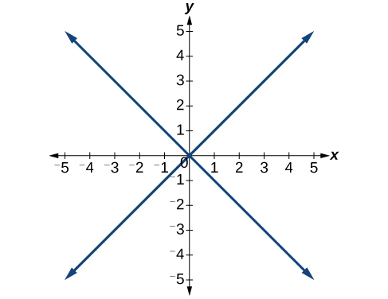

*Mô tả hình bổ sung:* Đường tăng đi qua $(1,1)$; đường giảm đi qua $(1,-1)$. Cả hai đường thuộc cùng quan hệ đang xét, không phải hai bài riêng biệt.
:::
:::

[Lời giải Bài 48](#vi-sol-48)

### Bài 49 {#fs-id1165135496435}

::: {#fs-id1165135496437}
::: {#fs-id1165134234204}

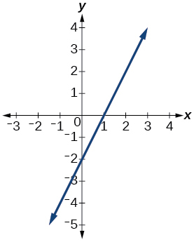

*Mô tả hình bổ sung:* Đường thẳng đi từ dưới bên trái lên trên bên phải; hai giao điểm với trục là $(0,-2)$ và $(1,0)$.
:::
:::

[Lời giải Bài 49](#fs-id1165137911649)

### Bài 50 {#fs-id1165137911653}

::: {#fs-id1165137911656}
::: {#fs-id1165137786191}

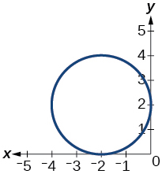

*Mô tả hình bổ sung:* Đường khép kín chạm trục $x$ tại $(-2,0)$ và trục $y$ tại $(0,2)$. Trên đường $x=-2$ có điểm thấp nhất $(-2,0)$ và điểm cao nhất $(-2,4)$.
:::
:::

[Lời giải Bài 50](#vi-sol-50)

### Bài 51 {#fs-id1165135593325}

::: {#fs-id1165135593327}
::: {#fs-id1165135593333}

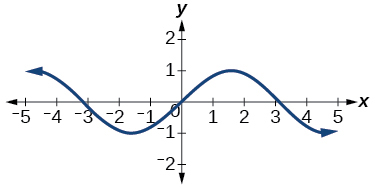

*Mô tả hình bổ sung:* Đường cong lên xuống nhưng không gập trở lại theo phương ngang. Đáy gần mức $y=-1$, đỉnh gần mức $y=1$; không có công thức nào được ghi trong hình.
:::
:::

[Lời giải Bài 51](#fs-id1165134240963)

## Đọc giá trị và tìm đầu vào từ đồ thị {#vi-graph-reading}

### Bài 52 {#fs-id1165134240968}

::: {#fs-id1165134054028}
::: {#fs-id1165134054030}

Cho đồ thị sau:

::: {#fs-id1165134054032}

ⓐ Tính {{math:fs-id1165134054032:0}}

ⓑ Giải phương trình {{math:fs-id1165134054032:1}}
:::
:::

::: {#fs-id1165137834413}

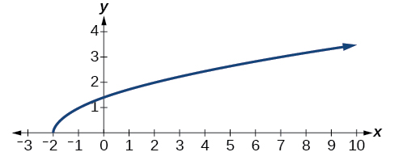

*Mô tả hình bổ sung:* Đường cong đi lên từ $(-2,0)$. Trên thang đo của hình, đường thẳng $x=-1$ gặp đường cong ở mức $y=1$; đường ngang $y=3$ gặp đường cong tại hoành độ $7$.
:::
:::

[Lời giải Bài 52](#vi-sol-52)

### Bài 53 {#fs-id1165135632092}

::: {#fs-id1165135632095}
::: {#fs-id1165137861992}

Cho đồ thị sau:

::: {#fs-id1165137861994}

ⓐ Tính {{math:fs-id1165137861994:0}}

ⓑ Giải phương trình {{math:fs-id1165137861994:1}}
:::
:::

::: {#fs-id1165135567425}

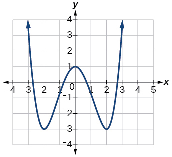

*Mô tả hình bổ sung:* Lưới chia theo từng đơn vị. Đồ thị đi qua $(0,1)$; hai điểm thấp nhất là $(-2,-3)$ và $(2,-3)$, rồi hai phía của đường cong đi lên.
:::
:::

[Lời giải Bài 53](#fs-id1165134108640)

### Bài 54 {#fs-id1165134325868}

::: {#fs-id1165134325870}
::: {#fs-id1165134325872}

Cho đồ thị sau:

::: {#fs-id1165134325875}

ⓐ Tính {{math:fs-id1165134325875:0}}

ⓑ Giải phương trình {{math:fs-id1165134325875:1}}
:::
:::

::: {#fs-id1165135575950}

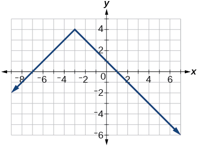

*Mô tả hình bổ sung:* Đỉnh của hai tia là $(-3,4)$. Trên lưới từng đơn vị, đường thẳng $x=4$ gặp nhánh phải tại $(4,-3)$. Đường ngang $y=1$ gặp hai nhánh tại $(-6,1)$ và $(0,1)$.
:::
:::

[Lời giải Bài 54](#vi-sol-54)

## Đáp án và lời giải {#vi-answers}

### Bài 40 — Lời giải {#vi-sol-40}

**Đáp án và lời giải bổ sung — nguồn không kèm lời giải:**

**Là hàm số.** Trên đồ thị đã cho, mỗi đường thẳng đứng cắt đường cong xanh tại nhiều nhất một điểm. Việc đường cong có chỗ tăng, chỗ giảm không tạo ra hai đầu ra ứng với cùng một đầu vào.

[Trở lại đề Bài 40](#fs-id1165135455987)

### Bài 41 — Lời giải {#fs-id1165135332505}

::: {#fs-id1165135332507}

**Đáp án nguồn:** Không phải là hàm số.
:::

*Lời giải bổ sung:* Đường thẳng $x=2$ cắt hai nhánh tại hai điểm có tung độ khác nhau. Vì vậy một đầu vào có hai đầu ra. Chỉ cần một đường thẳng đứng như vậy để bác bỏ tính chất hàm số.

[Trở lại đề Bài 41](#fs-id1165137527641)

### Bài 42 — Lời giải {#vi-sol-42}

**Đáp án và lời giải bổ sung — nguồn không kèm lời giải:**

**Là hàm số.** Mỗi đường thẳng đứng với $x\ne0$ gặp đúng một nhánh tại một điểm. Đường $x=0$ không gặp đường cong; đây là đầu vào không thuộc tập xác định của đồ thị, không phải một đầu vào có hai đầu ra. Không đếm đường tiệm cận nét đứt như một phần của quan hệ.

[Trở lại đề Bài 42](#fs-id1165135332512)

### Bài 43 — Lời giải {#fs-id1165137597406}

::: {#fs-id1165135386375}

**Đáp án nguồn:** Là hàm số.
:::

*Lời giải bổ sung:* Mỗi đường thẳng đứng cắt đồ thị đúng một điểm. Tại $x=-1$ và $x=1$, hai phần kề nhau gặp ở cùng một điểm, chứ không tạo hai đầu ra khác nhau. Các đoạn nằm ngang vẫn có thể thuộc đồ thị của một hàm số.

[Trở lại đề Bài 43](#fs-id1165137742393)

### Bài 44 — Lời giải {#vi-sol-44}

**Đáp án và lời giải bổ sung — nguồn không kèm lời giải:**

**Không phải là hàm số.** Đường thẳng $x=2$ cắt đường elip ở hai điểm phân biệt. Vì vậy cùng một đầu vào $2$ có hai đầu ra khác nhau. Không cần gán một công thức hay đọc chính xác hai tung độ để kết luận.

[Trở lại đề Bài 44](#fs-id1165135386379)

### Bài 45 — Lời giải {#fs-id1165137399700}

::: {#fs-id1165137399701}

**Đáp án nguồn:** Là hàm số.
:::

*Lời giải bổ sung:* Đồ thị đạt kiểm tra bằng đường thẳng đứng: một hoành độ cho nhiều nhất một tung độ. Không cần biết công thức của đường cong, và cũng không cần dựa vào tên công thức không chính xác trong văn bản thay thế tiếng Anh.

[Trở lại đề Bài 45](#fs-id1165137749974)

### Bài 46 — Lời giải {#vi-sol-46}

**Đáp án và lời giải bổ sung — nguồn không kèm lời giải:**

**Không phải là hàm số.** Khi $x=1$, cả $(1,3)$ lẫn $(1,-3)$ đều thuộc hai tia. Đường thẳng $x=1$ có hai giao điểm. Các đầu mút rỗng không loại hai điểm này; chúng chỉ loại $(0,3)$ và $(2,-3)$.

[Trở lại đề Bài 46](#fs-id1165137399704)

### Bài 47 — Lời giải {#fs-id1165135190490}

::: {#fs-id1165135190491}

**Đáp án nguồn:** Là hàm số.
:::

*Lời giải bổ sung:* Đây là đường thẳng không thẳng đứng. Mỗi đường thẳng đứng gặp nó tại đúng một điểm, nên mỗi đầu vào xác định đúng một đầu ra.

[Trở lại đề Bài 47](#fs-id1165137883764)

### Bài 48 — Lời giải {#vi-sol-48}

**Đáp án và lời giải bổ sung — nguồn không kèm lời giải:**

**Không phải là hàm số.** Đường thẳng $x=1$ đi qua hai điểm $(1,1)$ và $(1,-1)$. Hai nhánh gặp nhau ở gốc tọa độ không làm mất hai đầu ra khác nhau tại các đầu vào khác.

[Trở lại đề Bài 48](#fs-id1165134497159)

### Bài 49 — Lời giải {#fs-id1165137911649}

::: {#fs-id1165137911650}

**Đáp án nguồn:** Là hàm số.
:::

*Lời giải bổ sung:* Đường thẳng không thẳng đứng, nên mỗi đường thẳng đứng cắt nó đúng một điểm. Một đầu vào không thể có hai tung độ trên đường này.

[Trở lại đề Bài 49](#fs-id1165135496435)

### Bài 50 — Lời giải {#vi-sol-50}

**Đáp án và lời giải bổ sung — nguồn không kèm lời giải:**

**Không phải là hàm số.** Hai điểm $(-2,0)$ và $(-2,4)$ có cùng hoành độ nhưng khác tung độ. Đường thẳng $x=-2$ vì thế có hai giao điểm với đường tròn.

[Trở lại đề Bài 50](#fs-id1165137911653)

### Bài 51 — Lời giải {#fs-id1165134240963}

::: {#fs-id1165134240964}

**Đáp án nguồn:** Là hàm số.
:::

*Lời giải bổ sung:* Mỗi đường thẳng đứng cắt đường cong tại nhiều nhất một điểm, nên đây là đồ thị của một hàm số. Nhiều đầu vào có thể cho cùng một đầu ra; đó là câu hỏi về đơn ánh, không phải điều kiện định nghĩa hàm số.

[Trở lại đề Bài 51](#fs-id1165135593325)

### Bài 52 — Lời giải {#vi-sol-52}

**Đáp án và lời giải bổ sung — nguồn không kèm lời giải:**

ⓐ **$f(-1)=1$.** Từ $x=-1$ trên trục ngang, đi đến đường cong rồi đọc tung độ $1$.

ⓑ **$x=7$.** Đường ngang $y=3$ cắt đường cong tại $(7,3)$. Vì đường cong tăng trên phần được biểu diễn, đây là giao điểm duy nhất ở mức ấy. Các giá trị được đọc từ hình, không suy ra từ một công thức do bản dịch tự gán.

[Trở lại đề Bài 52](#fs-id1165134240968)

### Bài 53 — Lời giải {#fs-id1165134108640}

**Đáp án nguồn:**

::: {#eip-idm666464064}

ⓐ {{math:eip-idm666464064:0}}

ⓑ {{math:eip-idm666464064:1}} hoặc {{math:eip-idm666464064:2}}
:::

*Lời giải bổ sung:* Ở câu ⓐ, giao điểm với trục $y$ là $(0,1)$ nên $f(0)=1$. Ở câu ⓑ, đường ngang $y=-3$ gặp đồ thị tại hai đáy $(-2,-3)$ và $(2,-3)$. Do đó có hai đầu vào cần tìm, không được bỏ một trong hai.

[Trở lại đề Bài 53](#fs-id1165135632092)

### Bài 54 — Lời giải {#vi-sol-54}

**Đáp án và lời giải bổ sung — nguồn không kèm lời giải:**

ⓐ **$f(4)=-3$.** Đọc tung độ của điểm trên nhánh phải có hoành độ $4$.

ⓑ **$x=-6$ hoặc $x=0$.** Đường ngang $y=1$ có hai giao điểm, lần lượt ở nhánh trái và nhánh phải. Hai đáp án là đầu vào; không nhầm chúng với mức đầu ra $1$ đã cho.

[Trở lại đề Bài 54](#fs-id1165134325868)

## Tự kiểm tra và phần tiếp theo {#vi-next}

*Các câu hỏi bổ sung:* Vì sao một đoạn đồ thị nằm ngang vẫn có thể
thuộc một hàm số, còn một đường thẳng đứng có hai giao điểm thì
bác bỏ tính chất đó? Các vòng tròn rỗng trong Bài 46 loại những
điểm nào? Khi biết giá trị đầu ra trong Bài 53–54, vì sao phải
tìm tất cả giao điểm ở mức đó?

Tiếp theo là nhóm xác định đồ thị có biểu diễn **hàm số đơn ánh**
hay không, bắt đầu tại `fs-id1165135531627`.
Bài này chỉ bao phủ 15 bài đồ thị đã nêu, không đánh dấu hoàn
thành phần Graphical, mô-đun hay toàn bộ chương trình dịch.

## Nguồn và ghi công {#vi-attribution}

Bản dịch độc lập `vi-Latn-VN` từ Jay Abramson và các cộng tác viên
OpenStax, *Precalculus 2e*, mô-đun `m49301`, UUID
`11f4eacc-c348-4836-8c5b-747577d249ca`;
[nguồn được ghim](https://github.com/openstax/osbooks-college-algebra-bundle/tree/789b54099106b071d1d32bfcee454fed72eb4768).
Đối chiếu với [ấn bản Bahasa Indonesia](https://github.com/KokunoYumeto/openstax-precalculus-2e-id)
`0.1.0-alpha.58-reader.1`.

Văn bản, bản dịch và 15 ảnh nguồn trong bài này theo
[CC BY-NC-SA 4.0](https://creativecommons.org/licenses/by-nc-sa/4.0/).
Ảnh: Copyright Rice University, OpenStax. Giữ nguyên điểm ảnh,
ghi công, các thông báo thành phần và điều kiện chia sẻ tương tự;
các sách khác giữ giấy phép riêng. Các mô tả hình, hướng dẫn,
đáp án mới và lời giải được đánh dấu “bổ sung” là phần biên soạn
thêm. Hai hiệu chỉnh văn bản thay thế được công khai bên cạnh
hình; không sửa ảnh hay âm thầm thay đáp án nguồn. Không phải ấn
bản chính thức hay được tác giả nguồn bảo trợ. Được thực hiện với
sự hỗ trợ của OpenAI Codex theo yêu cầu người dùng; chưa có thẩm
định của người bản ngữ.
