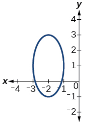
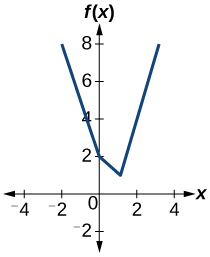
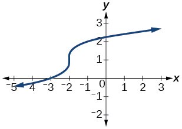
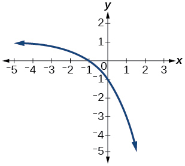
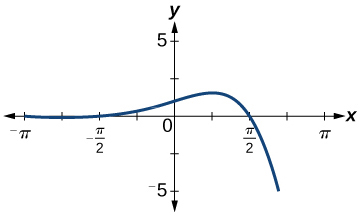

## Phạm vi và cách học {#vi-prerequisites}

Bài này dịch năm bài cuối nhóm *Graphical* trong phần bài tập mục 1.1
của mô-đun m49301. Số bài 55–59 giữ thứ tự của toàn bộ phần bài tập
nguồn. Phạm vi bắt đầu ở hướng dẫn chung fs-id1165135531627, sau
bài 54, và dừng trước nhóm *Numeric* fs-id1165135342204.

*Hướng dẫn bổ sung:* Trước hết phải xác định đồ thị có biểu diễn **hàm số**
hay không; chỉ sau đó mới xét hàm số có **đơn ánh** hay không. Có thể ôn
[kiểm tra bằng đường thẳng đứng](A30-U006-graph-tests.vi.html#fs-id1165135435781)
và [kiểm tra bằng đường thẳng ngang](A30-U006-graph-tests.vi.html#fs-id1165137610952).
Hai liên kết này cần tệp U006 nằm cùng thư mục với tệp đọc hiện tại.

Với các đồ thị đang xét, hoành độ là đầu vào và tung độ là đầu ra.
Đồ thị biểu diễn một hàm số trên tập hợp các hoành độ của nó khi mọi
đường thẳng đứng có nhiều nhất một giao điểm với đồ thị. Với một
đồ thị **đã biểu diễn hàm số**, hàm số là đơn ánh khi mọi đường thẳng
ngang có nhiều nhất một giao điểm với đồ thị. Đường thẳng không gặp
đồ thị không vi phạm điều kiện “nhiều nhất một”.

Năm hình gốc được giữ nguyên byte, nhãn trục và thứ tự. Các mô tả tiếng
Việt bên dưới dựa trên hình đã đối chiếu; một số mô tả ngắn trong nguồn
tiếng Anh không khớp với hình, được ghi chú rõ thay vì dùng để suy ra đáp án.
Nguồn có ba đáp án ngắn; hai lời giải còn thiếu và mọi lập luận mở rộng
đều được đánh dấu bổ sung.

## Bài tập {#vi-exercises}

::: {#fs-id1165135531627}
Trong các bài sau, hãy xác định đồ thị đã cho có biểu diễn một hàm số
đơn ánh hay không.
:::

### Bài 55 {#fs-id1165135541711}

::: {#fs-id1165135541713}
::: {#fs-id1165135541720}

:::
:::

*Ghi chú đối chiếu hình:* Mô tả tiếng Anh gọi hình này là đường tròn,
nhưng hình gốc có dạng elip đứng; mô tả của ấn bản Indonesia cũng ghi
là elip. Bản dịch mô tả hình nhìn thấy, không thay đổi hình.

[Xem lời giải bài 55](#fs-id1165133085670).

### Bài 56 {#fs-id1165133085674}

::: {#fs-id1165134380351}
::: {#fs-id1165134380356}

:::
:::

*Ghi chú đối chiếu hình:* Mô tả tiếng Anh gọi đây là parabol, nhưng
hình có một góc chữ V, phù hợp với mô tả của ấn bản Indonesia.
Không suy ra công thức hay tính đối xứng chỉ từ tên gọi trong mô tả.

[Xem lời giải bổ sung bài 56](#vi-sol-56).

### Bài 57 {#fs-id1165134037560}

::: {#fs-id1165134037562}
::: {#fs-id1165134037568}

:::
:::

*Ghi chú đối chiếu hình:* Nguồn tiếng Anh mô tả hình như một đồ thị
bậc ba được xoay. Bài không cho công thức hay góc xoay; hãy xét đường
cong thể hiện trong hình, không tự gán cho nó một phương trình.

[Xem lời giải bài 57](#fs-id1165137583859).

### Bài 58 {#fs-id1165134031248}

::: {#fs-id1165134031250}
::: {#fs-id1165134031257}

:::
:::

*Ghi chú đối chiếu hình:* Mô tả tiếng Anh gọi đây là “một nửa” đồ thị
$1/x$, nhưng hình và dữ kiện của bài không xác định công thức đó.
Bản dịch dùng mô tả hình dạng, phù hợp với mô tả của ấn bản Indonesia.
Không suy ra thêm tập xác định hay tiệm cận chính xác từ dòng mô tả này.

[Xem lời giải bổ sung bài 58](#vi-sol-58).

### Bài 59 {#fs-id1165134394579}

::: {#fs-id1165134394581}
::: {#fs-id1165135457089}

:::
:::

*Ghi chú đối chiếu hình:* Mô tả tiếng Anh gọi đây là đồ thị của một
hàm số đơn ánh, trái với hình và đáp án đi kèm của chính nguồn.
Bản dịch sửa mô tả để phản ánh đường cong; đáp án nguồn được giữ ở
phần lời giải.

[Xem lời giải bài 59](#fs-id1165135342197).

## Lời giải và giải thích {#vi-answers}

### Bài 55 — Lời giải nguồn {#fs-id1165133085670}

::: {#fs-id1165133085671}
Đồ thị không biểu diễn hàm số, nên cũng không biểu diễn hàm số đơn ánh.
:::

*Giải thích bổ sung:* Đường thẳng đứng $x=-2$ cắt đường elip tại hai
điểm, một ở phía trên và một ở phía dưới. Một đầu vào vì thế có hai
đầu ra khác nhau. Điều kiện để là hàm số đã không thỏa; không thể gọi
quan hệ này là hàm số đơn ánh.

### Bài 56 — Lời giải bổ sung {#vi-sol-56}

Nguồn không kèm lời giải cho bài này. Lời giải sau được biên soạn cho
bản tiếng Việt.

Đồ thị biểu diễn một hàm số, nhưng hàm số **không đơn ánh**.
Trên hình chữ V, mỗi đường thẳng đứng gặp đồ thị nhiều nhất một điểm.
Tuy nhiên, đường thẳng ngang $y=2$ gặp cả nhánh bên trái lẫn nhánh
bên phải, tại hai điểm phân biệt. Hai đầu vào khác nhau cùng cho
đầu ra 2, nên điều kiện đơn ánh không thỏa.

Không cần biết công thức hai nhánh hoặc giả sử hai nhánh đối xứng.
Hai giao điểm với cùng một đường thẳng ngang đã đủ bác bỏ tính đơn ánh.

### Bài 57 — Lời giải nguồn {#fs-id1165137583859}

::: {#fs-id1165137583860}
Đồ thị biểu diễn một hàm số đơn ánh.
:::

*Giải thích bổ sung:* Theo đường cong đã vẽ, khi đi từ trái sang phải,
đầu ra luôn tăng; đồ thị không quay lại cùng một độ cao. Mỗi đường
thẳng đứng và mỗi đường thẳng ngang đều gặp đường cong nhiều nhất
một điểm. Vì thế đồ thị vừa biểu diễn một hàm số, vừa thỏa điều kiện
đơn ánh.

Đoạn rất dốc ở giữa không tự động tạo ra hai đầu ra cho một đầu vào.
Ta xét giao điểm với toàn bộ đường cong, không biến bề dày nét vẽ hay
một vài điểm ảnh thành một đoạn thẳng đứng có nhiều giá trị.

### Bài 58 — Lời giải bổ sung {#vi-sol-58}

Nguồn không kèm lời giải cho bài này. Lời giải sau được biên soạn cho
bản tiếng Việt.

Đồ thị biểu diễn một hàm số **đơn ánh**. Theo hình, mỗi đầu vào ứng
với một đầu ra; khi đầu vào tăng thì đầu ra giảm. Đường cong không
đổi chiều để nhận lại một độ cao đã đi qua. Do đó, mỗi đường thẳng
đứng và mỗi đường thẳng ngang có nhiều nhất một giao điểm với đồ thị.

Hàm số giảm vẫn có thể đơn ánh; đơn ánh không có nghĩa là đồ thị phải
đi lên. Kết luận này dựa trên đường cong đã cho, không cần nhận dạng
nó bằng công thức $1/x$.

### Bài 59 — Lời giải nguồn {#fs-id1165135342197}

::: {#fs-id1165135342198}
Đồ thị biểu diễn một hàm số, nhưng hàm số không đơn ánh.
:::

*Giải thích bổ sung:* Mỗi đường thẳng đứng gặp đường cong nhiều nhất
một điểm, nên đồ thị biểu diễn một hàm số. Nhưng một đường thẳng
ngang nằm dưới đỉnh và gần đỉnh cắt đường cong ở cả hai phía của
đỉnh. Có hai đầu vào khác nhau cho cùng một đầu ra, nên hàm số
không đơn ánh. Không cần đọc chính xác tọa độ đỉnh hoặc suy ra
công thức của đường cong để đưa ra kết luận này.

## Tự kiểm tra và phần tiếp theo {#vi-next}

*Gợi ý bổ sung:* Phân biệt hai lý do dẫn đến câu trả lời “không”:
bài 55 không đạt điều kiện hàm số, còn bài 56 và bài 59 là hàm số
nhưng không đơn ánh. Bài 57 và bài 58 cho thấy cả đường cong đi lên
lẫn đường cong đi xuống đều có thể biểu diễn hàm số đơn ánh.

Mã kiểm tra đi kèm kiểm tra mã định danh, câu trả lời, các tệp hình
gốc và một số quan hệ hữu hạn minh họa. Nó không suy ra công thức
từ ảnh, không coi điểm ảnh là dữ liệu đồ thị và không dùng việc
thử hữu hạn đường thẳng để chứng minh tính chất của một đường cong.

Phần tiếp theo trong nguồn là nhóm *Numeric*, bắt đầu tại
fs-id1165135342204. Ba bài đầu nhóm ấy đã được chọn trong U001;
việc đó không có nghĩa là cả nhóm đã được dịch. Bài tự học này chỉ
khép lại nhóm bài tập đồ thị, không khép lại mô-đun hoặc sách.

## Nguồn và ghi công {#vi-attribution}

Bản dịch và phần bổ sung tiếng Việt độc lập, địa phương hóa vi-Latn-VN.
Nguồn: Jay Abramson và các cộng tác viên OpenStax, *Precalculus 2e*,
mô-đun m49301, UUID 11f4eacc-c348-4836-8c5b-747577d249ca;
[nguồn được ghim](https://github.com/openstax/osbooks-college-algebra-bundle/tree/789b54099106b071d1d32bfcee454fed72eb4768).
Đối chiếu với [ấn bản Bahasa Indonesia](https://github.com/KokunoYumeto/openstax-precalculus-2e-id)
0.1.0-alpha.58-reader.1. Giữ nguyên quyền ghi công của Jay Abramson,
OpenStax và các tác giả, cộng tác viên được liệt kê trong nguồn.

Văn bản, năm hình nguồn, bản dịch và phần bổ sung A30 này theo
[CC BY-NC-SA 4.0](https://creativecommons.org/licenses/by-nc-sa/4.0/).
Các thông báo nguồn được giữ trong thư mục notices/; các tác phẩm B40
và B80 giữ giấy phép riêng, không bị đổi giấy phép bởi bài này.
Năm hình được giữ nguyên; bản dịch thay mô tả thay thế, thêm ghi chú
đối chiếu và hai lời giải mới như đã đánh dấu.
Không phải ấn bản chính thức hoặc được các tác giả hay tổ chức nguồn bảo trợ.
Bản dịch, lời giải bổ sung và kiểm tra được thực hiện với sự hỗ trợ của
OpenAI Codex theo yêu cầu người dùng; thông tin quy trình này không thay
thế tên tác giả gốc. Chưa có thẩm định độc lập của người bản ngữ.
