## Phạm vi và cách dùng {#vi-prerequisites}

Bài này dịch trọn phần **Technology** của mô-đun `m49301`:
12 bài tập liên tiếp, mang số Bài 76–87 theo thứ tự nguồn.
Mỗi nhóm gồm ba tập xác định cho cùng một hàm số. Nguồn kèm
sáu đáp án về tập giá trị và sáu ảnh; sáu bài còn lại không có
lời giải nguồn. Mọi lời giải mở rộng và 12 đồ thị mới đều được
đánh dấu là bổ sung.

*Hướng dẫn bổ sung:* Có thể dùng máy tính hoặc phần mềm vẽ đồ thị,
nhưng hãy nhập đúng hàm số và giới hạn đầu vào vào đoạn đã cho.
Đoạn đóng lấy cả hai đầu mút. Cửa sổ hiển thị của phần mềm có thể
rộng hơn tập xác định; phần đường cong nằm ngoài tập xác định
không thuộc đồ thị đang được yêu cầu.

*Ghi chú về số:* Giữ dấu chấm thập phân và cách viết số của nguồn
trong mọi công thức nguồn. Chẳng hạn, `0.1` là một phần mười;
`1,000,000` là một triệu. Trong các đoạn viết thêm, dấu chấm phẩy
tách hai đầu mút để không nhầm với dấu phẩy nhóm hàng nghìn.

*Ghi chú về các hình:* Sáu ảnh nguồn có mũi tên ở mép cửa sổ.
Không dùng các mũi tên đó để kéo dài tập xác định ra ngoài đoạn
đóng đã cho. Bản dịch giữ nguyên ảnh, đồng thời thêm một đồ thị
riêng cho từng bài, dừng tại hai đầu mút được tô kín. Tỉ lệ của
hai trục và cửa sổ thay đổi giữa các bài; đọc nhãn trục trước khi
so sánh hình dáng hay độ dốc.

## Bài tập sử dụng công nghệ {#fs-id1165134373511}

### Hàm số bậc hai cơ bản {#vi-group-76}

::: {#fs-id1165135530586}

Với các bài tập sau, hãy vẽ đồ thị {{math:fs-id1165135530586:0}}
trên tập xác định đã cho. Xác định tập giá trị tương ứng.
Hãy trình bày từng đồ thị.
:::

### Bài 76 {#fs-id1165135530591}

::: {#fs-id1165135530593}
::: {#fs-id1165135530595}

{{math:fs-id1165135530595:0}}
:::
:::

[Lời giải và đồ thị Bài 76](#vi-sol-76)

### Bài 77 {#fs-id1165134087674}

::: {#fs-id1165134087676}
::: {#fs-id1165134087677}

{{math:fs-id1165134087677:0}}
:::
:::

[Lời giải và đồ thị Bài 77](#fs-id1165137809996)

### Bài 78 {#fs-id1165135695182}

::: {#fs-id1165135695184}
::: {#fs-id1165135695186}

{{math:fs-id1165135695186:0}}
:::
:::

[Lời giải và đồ thị Bài 78](#vi-sol-78)

### Hàm số bậc ba cơ bản {#vi-group-79}

::: {#fs-id1165135388446}

Với các bài tập sau, hãy vẽ đồ thị {{math:fs-id1165135388446:0}}
trên tập xác định đã cho. Xác định tập giá trị tương ứng.
Hãy trình bày từng đồ thị.
:::

### Bài 79 {#fs-id1165134060421}

::: {#fs-id1165134060424}
::: {#fs-id1165134060426}

{{math:fs-id1165134060426:0}}
:::
:::

[Lời giải và đồ thị Bài 79](#fs-id1165135634141)

### Bài 80 {#fs-id1165133195224}

::: {#fs-id1165133195226}
::: {#fs-id1165133195229}

{{math:fs-id1165133195229:0}}
:::
:::

[Lời giải và đồ thị Bài 80](#vi-sol-80)

### Bài 81 {#fs-id1165133402070}

::: {#fs-id1165133402072}
::: {#fs-id1165133402074}

{{math:fs-id1165133402074:0}}
:::
:::

[Lời giải và đồ thị Bài 81](#fs-id1165137833875)

### Hàm số căn bậc hai {#vi-group-82}

::: {#fs-id1165135634160}

Với các bài tập sau, hãy vẽ đồ thị {{math:fs-id1165135634160:0}}
trên tập xác định đã cho. Xác định tập giá trị tương ứng.
Hãy trình bày từng đồ thị.
:::

### Bài 82 {#fs-id1165137844302}

::: {#fs-id1165137844304}
::: {#fs-id1165137844306}

{{math:fs-id1165137844306:0}}
:::
:::

[Lời giải và đồ thị Bài 82](#vi-sol-82)

### Bài 83 {#fs-id1165137540730}

::: {#fs-id1165137540733}
::: {#fs-id1165137540735}

{{math:fs-id1165137540735:0}}
:::
:::

[Lời giải và đồ thị Bài 83](#fs-id1165135344910)

### Bài 84 {#fs-id1165137605840}

::: {#fs-id1165137605842}
::: {#fs-id1165137605844}

{{math:fs-id1165137605844:0}}
:::
:::

[Lời giải và đồ thị Bài 84](#vi-sol-84)

### Hàm số căn bậc ba {#vi-group-85}

::: {#fs-id1165137539207}

Với các bài tập sau, hãy vẽ đồ thị {{math:fs-id1165137539207:0}}
trên tập xác định đã cho. Xác định tập giá trị tương ứng.
Hãy trình bày từng đồ thị.
:::

### Bài 85 {#fs-id1165134031227}

::: {#fs-id1165134031229}
::: {#fs-id1165134031231}

{{math:fs-id1165134031231:0}}
:::
:::

[Lời giải và đồ thị Bài 85](#fs-id1165137928674)

### Bài 86 {#fs-id1165134087649}

::: {#fs-id1165134087651}
::: {#fs-id1165134087653}

{{math:fs-id1165134087653:0}}
:::
:::

[Lời giải và đồ thị Bài 86](#vi-sol-86)

### Bài 87 {#fs-id1165135251229}

::: {#fs-id1165135251230}
::: {#fs-id1165135251231}

{{math:fs-id1165135251231:0}}
:::
:::

[Lời giải và đồ thị Bài 87](#fs-id1165137686659)

## Lời giải và đồ thị {#vi-answers}

*Giải thích bổ sung dùng chung:* Trên đoạn đối xứng $[-a;a]$ với
$a>0$, hàm $y=x^2$ có giá trị nhỏ nhất $0$ tại $x=0$ và lớn nhất
$a^2$ tại hai đầu mút; tập giá trị là $[0;a^2]$.
Ba hàm còn lại trong bài đều tăng trên các đoạn đang xét.
Khi đầu vào chạy qua đoạn, đầu ra đi qua mọi giá trị giữa hai
giá trị ở đầu mút. Do đó tập giá trị cũng là một đoạn đóng.
Với căn bậc hai, chỉ lấy căn không âm; với căn bậc ba, dùng căn
bậc ba thực kể cả khi đầu vào âm.

### Bài 76 — Lời giải {#vi-sol-76}

**Đáp án và lời giải bổ sung — nguồn không kèm lời giải:**

Tập giá trị là $[0;0.01]$.

Giá trị nhỏ nhất là $0^2=0$. Hai đầu mút cho $(-0.1)^2=(0.1)^2=0.01$. Vì vậy các giá trị đạt được chạy từ $0$ đến $0.01$, kể cả hai đầu.

::: {#vi-plot-76}

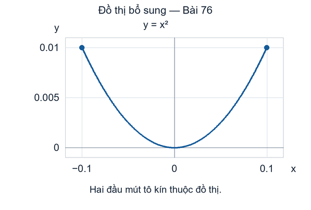

*Đồ thị bổ sung — không phải ảnh nguồn. Hai đầu mút kín đều thuộc đồ thị.*
:::

[Trở lại đề Bài 76](#fs-id1165135530591)

### Bài 77 — Lời giải {#fs-id1165137809996}

::: {#fs-id1165137809998}

**Đáp án nguồn — tập giá trị:** {{math:fs-id1165137809998:0}}
:::

::: {#fs-id1165133448050}

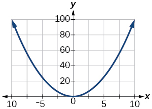

*Ảnh lời giải nguồn, giữ nguyên điểm ảnh. Mũi tên ở mép không thay đổi đoạn đóng trong đề.*
:::

*Lời giải bổ sung:* Đỉnh $(0,0)$ nằm trong tập xác định; hai đầu mút $x=-10$ và $x=10$ đều cho $y=100$. Vì vậy tập giá trị là $[0;100]$, không phải chỉ gồm hai giá trị ở đầu mút.

::: {#vi-plot-77}

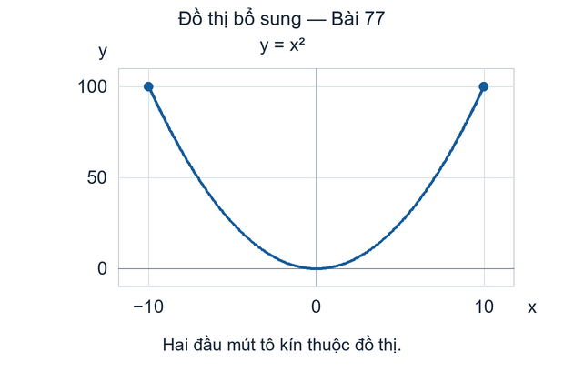

*Đồ thị bổ sung — không phải ảnh nguồn. Hai đầu mút kín đều thuộc đồ thị.*
:::

[Trở lại đề Bài 77](#fs-id1165134087674)

### Bài 78 — Lời giải {#vi-sol-78}

**Đáp án và lời giải bổ sung — nguồn không kèm lời giải:**

Tập giá trị là $[0;10\,000]$.

Giá trị nhỏ nhất vẫn là $0$ tại $x=0$, còn giá trị lớn nhất là $100^2=10\,000$ tại $x=\pm100$. Mọi giá trị ở giữa đều được đạt tới.

::: {#vi-plot-78}

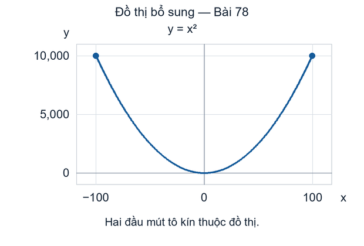

*Đồ thị bổ sung — không phải ảnh nguồn. Hai đầu mút kín đều thuộc đồ thị.*
:::

[Trở lại đề Bài 78](#fs-id1165135695182)

### Bài 79 — Lời giải {#fs-id1165135634141}

::: {#fs-id1165135634142}

**Đáp án nguồn — tập giá trị:** {{math:fs-id1165135634142:0}}
:::

::: {#fs-id1165135259631}

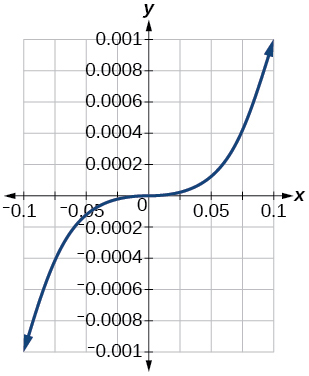

*Ảnh lời giải nguồn, giữ nguyên điểm ảnh. Mũi tên ở mép không thay đổi đoạn đóng trong đề.*
:::

*Ghi chú hiệu chỉnh mô tả nguồn:* Văn bản thay thế tiếng Anh gọi hình này là parabol, nhưng công thức và hình biểu diễn $y=x^3$. Bản dịch dùng mô tả hàm số bậc ba; ảnh và đáp án số của nguồn không thay đổi.

*Lời giải bổ sung:* Hàm số $y=x^3$ tăng trên đoạn đã cho. Hai đầu mút cho $(-0.1)^3=-0.001$ và $(0.1)^3=0.001$, nên tập giá trị là đoạn đóng nối hai số đó.

::: {#vi-plot-79}

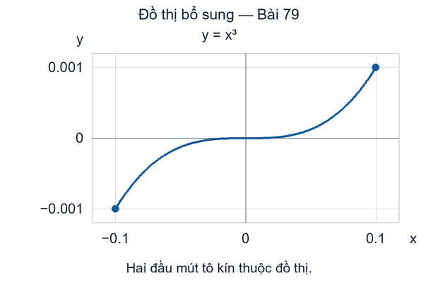

*Đồ thị bổ sung — không phải ảnh nguồn. Hai đầu mút kín đều thuộc đồ thị.*
:::

[Trở lại đề Bài 79](#fs-id1165134060421)

### Bài 80 — Lời giải {#vi-sol-80}

**Đáp án và lời giải bổ sung — nguồn không kèm lời giải:**

Tập giá trị là $[-1\,000;1\,000]$.

Vì hàm số bậc ba tăng, giá trị nhỏ nhất và lớn nhất lần lượt là $(-10)^3=-1\,000$ và $10^3=1\,000$. Đầu ra đi qua mọi giá trị giữa hai số đó.

::: {#vi-plot-80}

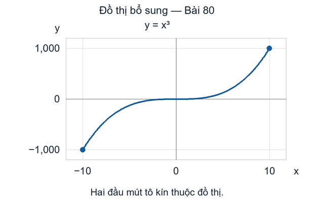

*Đồ thị bổ sung — không phải ảnh nguồn. Hai đầu mút kín đều thuộc đồ thị.*
:::

[Trở lại đề Bài 80](#fs-id1165133195224)

### Bài 81 — Lời giải {#fs-id1165137833875}

::: {#fs-id1165137833876}

**Đáp án nguồn — tập giá trị:** {{math:fs-id1165137833876:0}}
:::

::: {#fs-id1165135434747}

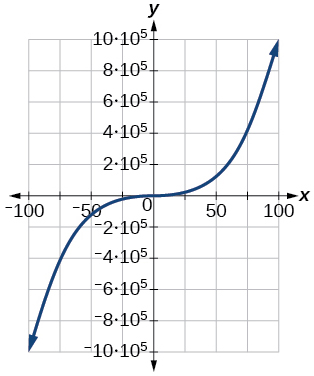

*Ảnh lời giải nguồn, giữ nguyên điểm ảnh. Mũi tên ở mép không thay đổi đoạn đóng trong đề.*
:::

*Chú thích thang đo bổ sung:* Nhãn $10\cdot10^5$ trong ảnh nguồn bằng $1\,000\,000$, không phải $100\,000$.

*Lời giải bổ sung:* Ta có $(-100)^3=-1\,000\,000$ và $100^3=1\,000\,000$. Trong đáp án nguồn, hai đầu của đoạn là âm một triệu và dương một triệu; các dấu phẩy bên trong mỗi số phân tách nhóm hàng nghìn.

::: {#vi-plot-81}

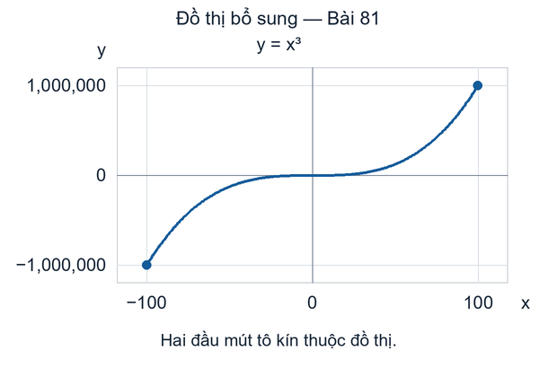

*Đồ thị bổ sung — không phải ảnh nguồn. Hai đầu mút kín đều thuộc đồ thị.*
:::

[Trở lại đề Bài 81](#fs-id1165133402070)

### Bài 82 — Lời giải {#vi-sol-82}

**Đáp án và lời giải bổ sung — nguồn không kèm lời giải:**

Tập giá trị là $[0;0.1]$.

Căn bậc hai không âm tăng trên đoạn $[0;0.01]$. Hai đầu mút cho $\sqrt{0}=0$ và $\sqrt{0.01}=0.1$. Không thêm các đầu ra âm.

::: {#vi-plot-82}

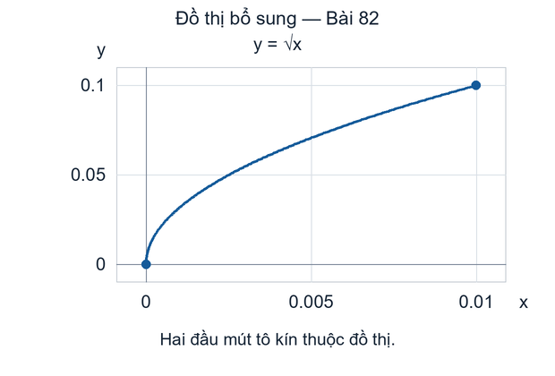

*Đồ thị bổ sung — không phải ảnh nguồn. Hai đầu mút kín đều thuộc đồ thị.*
:::

[Trở lại đề Bài 82](#fs-id1165137844302)

### Bài 83 — Lời giải {#fs-id1165135344910}

::: {#eip-id1963987}

**Đáp án nguồn — tập giá trị:** {{math:eip-id1963987:0}}
:::

::: {#fs-id1165137850247}

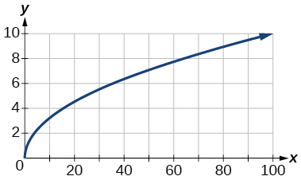

*Ảnh lời giải nguồn, giữ nguyên điểm ảnh. Mũi tên ở mép không thay đổi đoạn đóng trong đề.*
:::

*Lời giải bổ sung:* Với $0\le x\le100$, ta có $0\le\sqrt{x}\le10$. Hai đầu mút đều được lấy, và mọi giá trị giữa $0$ và $10$ đều xuất hiện.

::: {#vi-plot-83}

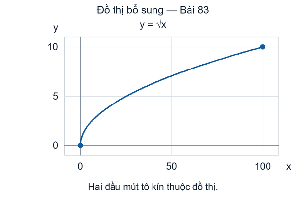

*Đồ thị bổ sung — không phải ảnh nguồn. Hai đầu mút kín đều thuộc đồ thị.*
:::

[Trở lại đề Bài 83](#fs-id1165137540730)

### Bài 84 — Lời giải {#vi-sol-84}

**Đáp án và lời giải bổ sung — nguồn không kèm lời giải:**

Tập giá trị là $[0;100]$.

Hai đầu mút cho $\sqrt{0}=0$ và $\sqrt{10\,000}=100$. Hàm căn bậc hai tăng nên tập giá trị tương ứng là $[0;100]$.

::: {#vi-plot-84}

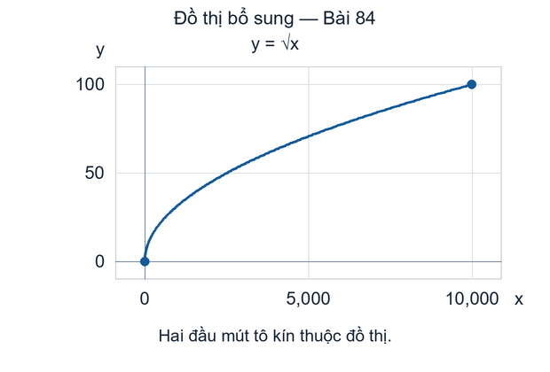

*Đồ thị bổ sung — không phải ảnh nguồn. Hai đầu mút kín đều thuộc đồ thị.*
:::

[Trở lại đề Bài 84](#fs-id1165137605840)

### Bài 85 — Lời giải {#fs-id1165137928674}

::: {#fs-id1165137928675}

**Đáp án nguồn — tập giá trị:** {{math:fs-id1165137928675:0}}
:::

::: {#fs-id1165135407024}

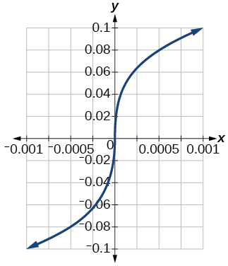

*Ảnh lời giải nguồn, giữ nguyên điểm ảnh. Mũi tên ở mép không thay đổi đoạn đóng trong đề.*
:::

*Ghi chú hiệu chỉnh mô tả nguồn:* Văn bản thay thế tiếng Anh gọi hình này là hàm căn bậc hai. Công thức có căn bậc ba và hình có nhánh ở đầu vào âm; bản dịch sửa phần mô tả thành căn bậc ba thực, không sửa ảnh hay đáp án nguồn.

*Lời giải bổ sung:* Xét căn bậc ba thực: $\sqrt[3]{-0.001}=-0.1$ và $\sqrt[3]{0.001}=0.1$. Hàm số tăng qua cả các đầu vào âm, qua $0$, rồi đến các đầu vào dương; không có dấu $\pm$.

::: {#vi-plot-85}

*Đồ thị bổ sung — không phải ảnh nguồn. Hai đầu mút kín đều thuộc đồ thị.*
:::

[Trở lại đề Bài 85](#fs-id1165134031227)

### Bài 86 — Lời giải {#vi-sol-86}

**Đáp án và lời giải bổ sung — nguồn không kèm lời giải:**

Tập giá trị là $[-10;10]$.

Vì $(-10)^3=-1\,000$ và $10^3=1\,000$, các căn bậc ba ở hai đầu mút là $-10$ và $10$. Tập giá trị là toàn bộ đoạn đóng $[-10;10]$.

::: {#vi-plot-86}

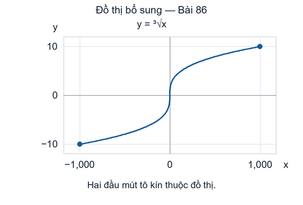

*Đồ thị bổ sung — không phải ảnh nguồn. Hai đầu mút kín đều thuộc đồ thị.*
:::

[Trở lại đề Bài 86](#fs-id1165134087649)

### Bài 87 — Lời giải {#fs-id1165137686659}

::: {#fs-id1165137686660}

**Đáp án nguồn — tập giá trị:** {{math:fs-id1165137686660:0}}
:::

::: {#fs-id1165135394245}

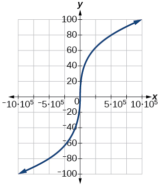

*Ảnh lời giải nguồn, giữ nguyên điểm ảnh. Mũi tên ở mép không thay đổi đoạn đóng trong đề.*
:::

*Chú thích thang đo bổ sung:* Hai nhãn $\pm10\cdot10^5$ trên trục $x$ có độ lớn một triệu.

*Lời giải bổ sung:* Ta có $(-100)^3=-1\,000\,000$ và $100^3=1\,000\,000$, nên căn bậc ba ở hai đầu của tập xác định lần lượt là $-100$ và $100$. Giữ cả hai đầu mút trong tập giá trị.

::: {#vi-plot-87}

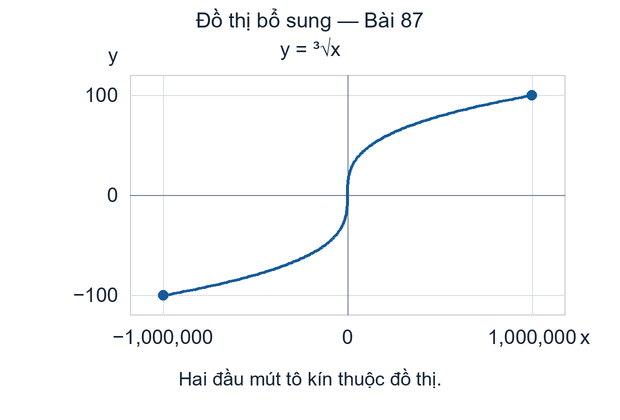

*Đồ thị bổ sung — không phải ảnh nguồn. Hai đầu mút kín đều thuộc đồ thị.*
:::

[Trở lại đề Bài 87](#fs-id1165135251229)

## Tái lập và tự kiểm tra {#vi-next}

*Phần bổ sung:* Các đồ thị mới được tạo bằng chương trình
`computing/plot_technology.py`; dữ liệu về hàm số, đoạn đầu vào,
tập giá trị, đầu mút và dấu kiểm toàn vẹn nằm trong
`computing/generated-A30-U015/manifest.json`.
Chương trình chỉ vẽ phần đường cong trên đoạn đã cho và không
thêm mũi tên vào đường cong. Hai trục được chia tỉ lệ độc lập.
Nối hữu hạn điểm tạo ra một hình xấp xỉ để xem; lý do về tập giá
trị ở trên không chỉ dựa vào việc lấy mẫu.

Bạn hãy kiểm tra: vì sao không thể tìm tập giá trị của $x^2$
trên một đoạn đối xứng chỉ bằng cách so sánh hai đầu mút?
Vì sao một mũi tên trong ảnh nguồn không cho phép dùng đầu vào
ngoài đoạn? Tại sao căn bậc ba nhận đầu vào âm, còn căn bậc hai
thực trong các bài này thì không?

Tiếp theo là phần **ứng dụng thực tế**, bắt đầu tại
`fs-id1165135580349`. Bài này chỉ hoàn tất bản dịch nháp của
12 bài công nghệ; không đánh dấu hoàn thành mô-đun hay toàn bộ
chương trình dịch.

## Nguồn và ghi công {#vi-attribution}

Bản dịch độc lập `vi-Latn-VN` từ Jay Abramson và các cộng tác viên
OpenStax, *Precalculus 2e*, mô-đun `m49301`, UUID
`11f4eacc-c348-4836-8c5b-747577d249ca`;
[nguồn được ghim](https://github.com/openstax/osbooks-college-algebra-bundle/tree/789b54099106b071d1d32bfcee454fed72eb4768).
Đối chiếu với [ấn bản Bahasa Indonesia](https://github.com/KokunoYumeto/openstax-precalculus-2e-id)
`0.1.0-alpha.58-reader.1`.

Văn bản, bản dịch và sáu ảnh nguồn trong bài này theo
[CC BY-NC-SA 4.0](https://creativecommons.org/licenses/by-nc-sa/4.0/).
Ảnh nguồn: Copyright Rice University, OpenStax. Các đồ thị bổ sung
là hình mới của bản dịch, được chia sẻ theo cùng giấy phép cho
thành phần A30 này; không phải hình do OpenStax cung cấp. Giữ
thông báo thành phần, ghi công, chia sẻ tương tự và ghi chú thay
đổi; các sách khác giữ giấy phép riêng. Hai lỗi tên hàm trong
văn bản thay thế tiếng Anh được công khai bên cạnh ảnh. Không
phải ấn bản chính thức hay được tác giả nguồn bảo trợ. Được thực
hiện với sự hỗ trợ của OpenAI Codex theo yêu cầu người dùng;
chưa có thẩm định của người bản ngữ.
