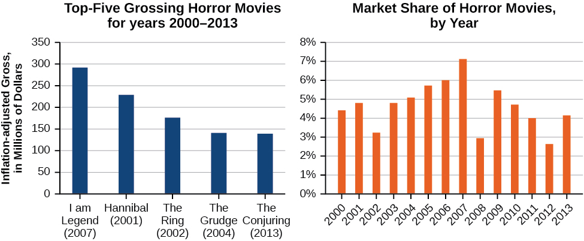
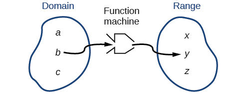
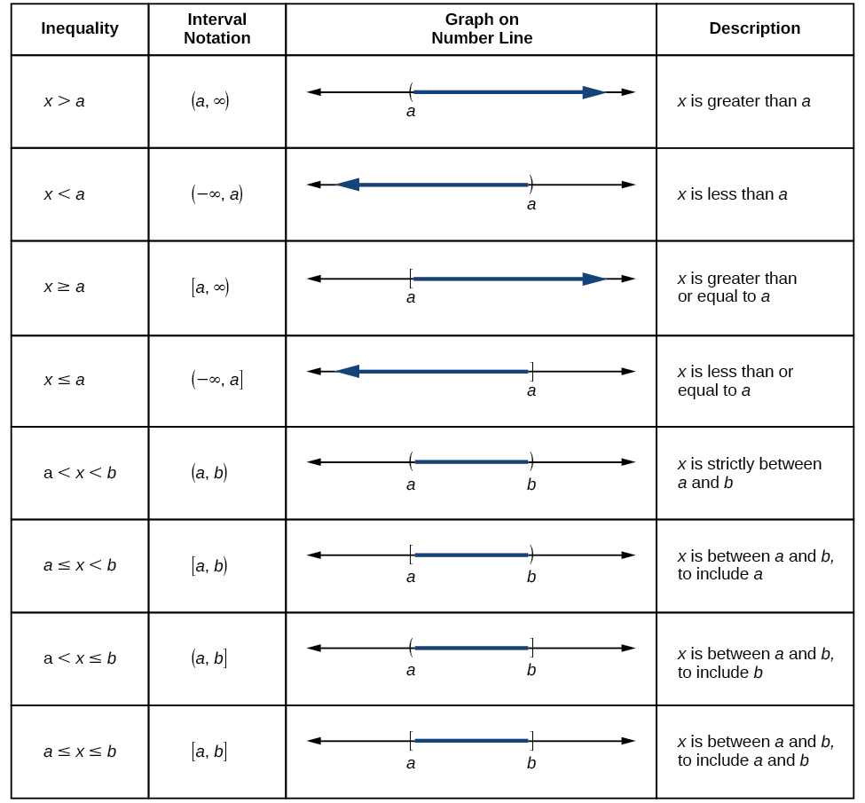
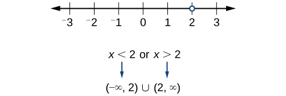

## Phạm vi và mục tiêu {#vi-prerequisites}

Bài này mở đầu mô-đun *Domain and Range* — **Tập xác định và tập
giá trị**. Bản dịch giữ phần dẫn nhập và trọn mục đầu tiên về tìm
tập xác định từ phương trình, gồm bốn ví dụ, bốn bài tự thử và
bốn hình nguồn. Các ghi chú làm rõ, mô tả hình dễ tiếp cận và lời
giải mở rộng đều được đánh dấu là bổ sung.

*Lưu ý bổ sung:* Hai mục tiêu ngay dưới đây là mục tiêu của
**toàn mô-đun**, được dịch từ nguồn. Bài hiện tại chủ yếu học mục
tiêu thứ nhất; hàm số cho bởi nhiều công thức sẽ được học ở phần
sau, không được coi là đã hoàn thành trong bài này.

::: {#para-00001}

Trong mục này, bạn sẽ:
:::

::: {#list-00001}

- Tìm tập xác định của một hàm số được cho bằng phương trình.
- Vẽ đồ thị hàm số cho bởi nhiều công thức.
:::

## Bối cảnh: dữ liệu phim kinh dị {#vi-context}

::: {#fs-id1165137404978}

Phim kinh dị và phim giật gân đều được ưa chuộng và thường đem lại
lợi nhuận rất cao. Tuy nhiên, khi tính đến thù lao diễn viên,
địa điểm quay và hiệu ứng đặc biệt tốn kém, các hãng phim cần
lượng khán giả lớn hơn nữa để thành công. Hãy xét năm phim kinh
dị hoặc giật gân nổi bật từ đầu những năm 2000: *I am Legend*,
*Hannibal*, *The Ring*, *The Grudge* và *The Conjuring*.
[Hình 1](#Figure_01_02_001) cho biết số tiền, tính bằng đô la,
mà mỗi phim thu được khi phát hành, cùng số liệu bán vé phim
kinh dị nói chung theo từng năm. Ta có thể dùng dữ liệu để tạo
hàm số về số tiền từng phim thu được hoặc tổng lượng vé phim
kinh dị bán ra theo năm. Khi xây dựng các hàm số từ dữ liệu,
ta có thể xác định những biến độc lập và biến phụ thuộc khác
nhau, rồi phân tích dữ liệu và hàm số để xác định
[tập xác định]{#term-00001} và tập giá trị. Trong mục này,
ta sẽ tìm hiểu cách xác định tập xác định và tập giá trị của
những hàm số như vậy.
:::

::: {#Figure_01_02_001}

::: {#fs-id1165135435537}

**Hình 1.** Dựa trên dữ liệu do www.the-numbers.com tổng hợp.
[Chú thích nguồn](#fs-id1165137758551).

*Mô tả hình bổ sung:* Biểu đồ trái ghi doanh thu đã điều chỉnh
lạm phát, đơn vị triệu đô la, trên thang từ 0 đến 350.
Năm nhãn là *I am Legend* (2007), *Hannibal* (2001), *The Ring*
(2002), *The Grudge* (2004), *The Conjuring* (2013). Các cột giảm
dần từ khoảng 290 triệu xuống khoảng 140 triệu; đây là số đọc
xấp xỉ từ hình, không phải bảng doanh thu chính xác. Biểu đồ phải
ghi **thị phần**, đơn vị phần trăm từ 0% đến 8%, cho 14 năm
2000–2013; cột 2007 cao nhất, hơn 7%, và cột 2012 thấp nhất,
dưới 3%.

*Ghi chú hiệu chỉnh mô tả nguồn:* Văn bản thay thế tiếng Anh
ghi nhầm 2000–2003; tiêu đề trong ảnh là **2000–2013**. Lời dẫn
nguồn nói đến lượng vé bán ra, nhưng trục đứng của biểu đồ phải
thực tế biểu diễn **thị phần theo phần trăm**; biểu đồ trái ghi
doanh thu **đã điều chỉnh lạm phát**. Bản dịch giữ nguyên ảnh
và lời dẫn nguồn, đồng thời làm rõ ba điểm này. Đây là dữ liệu
minh họa trong nguồn được truy cập năm 2014, không phải số liệu
thị trường hiện tại hay một kiểm chứng độc lập về lợi nhuận.
:::

:::

::: {#fs-id1165137758551}

**Chú thích nguồn:** The Numbers: Where Data and the Movie
Business Meet. “[Box Office History for Horror Movies](http://www.the-numbers.com/market/genre/Horror).”
Nguồn ghi ngày truy cập 24/3/2014.
:::

## Tìm tập xác định của hàm số được cho bằng phương trình {#fs-id1165135193832}

::: {#fs-id1165135445896}

Trong [Hàm số và ký hiệu hàm số](A30-U000-module-guide.vi.html#vi-objectives),
ta đã làm quen với [tập xác định và tập giá trị]{#term-00002}.
Ở đây, ta luyện tìm chúng cho những hàm số cụ thể. Trong các tình
huống thực tế, cần xét điều gì có thể xảy ra hoặc có ý nghĩa,
chẳng hạn số liệu bán vé và năm trong ví dụ phim kinh dị ở trên.
Đồng thời, phải xét những phép toán được phép thực hiện.
Nếu tập xác định và tập giá trị gồm các số thực, không được
lấy đầu vào khiến ta phải lấy căn bậc chẵn của một số âm.
Với hàm số cho bằng công thức, cũng không được nhận đầu vào làm
xuất hiện phép chia cho 0.
:::

::: {#fs-id1165135453892}

Ta có thể hình dung tập xác định là một “khu chứa nguyên liệu”
cho “máy hàm số”, còn tập giá trị là một “khu chứa sản phẩm”
của máy. Xem [Hình 2](#Figure_01_02_002).
:::

::: {#Figure_01_02_002}

::: {#fs-id1165137737552}

**Hình 2.** *Phần chữ trong hình — bản dịch:* Domain: tập xác định;
Function machine: máy hàm số; Range: tập giá trị.

*Mô tả bổ sung:* Hình chỉ vẽ một đường đi $b\mapsto y$, không
liệt kê toàn bộ quy tắc ứng với $a$ và $c$. Không suy ra các
đầu ra còn lại chỉ từ vị trí của những chữ trong hai vùng.
:::

:::

::: {#fs-id1165137761714}

Ta có thể viết [tập xác định và tập giá trị]{#term-00003}
bằng [ký hiệu khoảng]{#term-00004}: dùng các giá trị cùng
dấu ngoặc để mô tả một tập hợp số. Dấu ngoặc vuông $[$ cho biết
lấy đầu mút; dấu ngoặc tròn $($ cho biết không lấy đầu mút hoặc
khoảng không bị chặn ở phía ấy. Chẳng hạn, nếu có 100 đô la để
chi tiêu, ta có thể biểu diễn số tiền lớn hơn 0 và không vượt
quá 100 bằng {{math:fs-id1165137761714:0}}
Ký hiệu khoảng sẽ được trình bày kỹ hơn ở phần sau.
:::

*Làm rõ bổ sung:* “Ký hiệu khoảng” ở đây là tên gọi chung cho
cách ghi khoảng mở, đoạn đóng, nửa khoảng và các khoảng không
bị chặn. Ví dụ chi tiêu đang giả sử số tiền chi **dương**;
nếu cho phép không chi gì thì phải lấy thêm đầu mút 0.

::: {#fs-id1165135320406}

Bây giờ, hãy xét hàm số đã biết phương trình. Khi tìm tập xác
định, thường cần nhớ ba dạng. Thứ nhất, nếu công thức không có
mẫu số hoặc có căn bậc lẻ, hãy xét xem tập xác định có thể là
toàn bộ tập số thực hay không. Thứ hai, nếu phương trình có
mẫu số, loại những đầu vào làm mẫu bằng 0. Thứ ba, nếu có căn
bậc chẵn, xét việc loại những đầu vào làm biểu thức dưới dấu
căn âm.
:::

*Làm rõ bổ sung:* Ba gợi ý này không phải ba lựa chọn loại trừ
nhau và không thay thế việc xét toàn bộ công thức. Phải đồng
thời thỏa mãn mọi điều kiện. Căn bậc lẻ tự nó nhận được số thực
âm, nhưng các phép toán khác trong cùng công thức vẫn có thể
hạn chế tập xác định.

::: {#fs-id1165137552233}

Trước khi bắt đầu, hãy ôn lại quy ước về ký hiệu khoảng:
:::

::: {#fs-id1165135673417}

- Viết cận dưới trước.
- Viết cận trên sau, ngăn cách bằng dấu phẩy.
- Dấu ngoặc tròn, $($ hoặc $)$, cho biết không lấy đầu mút.
- Dấu ngoặc vuông, $[$ hoặc $]$, cho biết có lấy đầu mút.
:::

*Ghi chú hiệu chỉnh cách diễn đạt nguồn:* Nguồn gọi hai cận là
“phần tử nhỏ nhất” và “phần tử lớn nhất”. Cách gọi đó không đúng
cho mọi khoảng: khoảng mở có thể không chứa hai cận. Bản dịch
dùng “cận dưới” và “cận trên” khi nói về hai đầu được ghi.
Các ký hiệu $-\infty$ và $+\infty$ không phải số thực hay phần
tử của tập; luôn dùng ngoặc tròn ở phía vô cực.

::: {#fs-id1165137807384}

Xem [Hình 3](#Figure_01_02_029) để tổng hợp các cách ghi.
:::

::: {#Figure_01_02_029}

::: {#fs-id1165137406680}

**Hình 3.** *Bản chép chữ và dịch bảng trong hình nguồn:*

| Điều kiện | Ký hiệu khoảng trong nguồn | Ý nghĩa phần tô trên trục số |
|---|---|---|
| $x>a$ | $(a,\infty)$ | Bên phải $a$, không lấy $a$. |
| $x<a$ | $(-\infty,a)$ | Bên trái $a$, không lấy $a$. |
| $x\ge a$ | $[a,\infty)$ | Bên phải $a$, có lấy $a$. |
| $x\le a$ | $(-\infty,a]$ | Bên trái $a$, có lấy $a$. |
| $a<x<b$ | $(a,b)$ | Giữa $a$ và $b$, không lấy hai đầu. |
| $a\le x<b$ | $[a,b)$ | Giữa $a$ và $b$, chỉ lấy đầu $a$. |
| $a<x\le b$ | $(a,b]$ | Giữa $a$ và $b$, chỉ lấy đầu $b$. |
| $a\le x\le b$ | $[a,b]$ | Giữa $a$ và $b$, lấy cả hai đầu. |

*Làm rõ bổ sung:* Với bốn hàng cuối, xét $a<b$. Mũi tên trên
phần tô của bốn hàng đầu chỉ phía kéo dài không bị chặn. Bảng
chép giữ dấu phẩy của hình nguồn; dấu phẩy này tách hai cận.
:::

:::

### Ví dụ 1 — Hàm số cho bằng tập hợp các cặp có thứ tự {#Example_01_02_01}

::: {#fs-id1165137661548}

::: {#fs-id1165137772018}

::: {#fs-id1165137920768}

Tìm [tập xác định]{#term-00005} của hàm số sau:

{{math:fs-id1165137920768:0}}
:::

:::
::: {#fs-id1165135329797}

**Lời giải nguồn.**

::: {#fs-id1165135508343}

Trước hết, xác định các giá trị đầu vào. Đầu vào là tọa độ thứ
nhất trong một [cặp có thứ tự]{#term-00006}. Các cặp đã
được liệt kê, không có điều kiện hạn chế nào khác cần giải.
Tập xác định là tập hợp các tọa độ thứ nhất.
:::
::: {#fs-id1165137451888}

{{math:fs-id1165137451888:0}}
:::

:::

:::

### Tự thử 1 {#fs-id1165137569901}

::: {#fs-id1165135333722}

::: {#fs-id1165137852040}

::: {#fs-id1165137852041}

Tìm tập xác định của hàm số:
:::
::: {#fs-id1165137466017}

{{math:fs-id1165137466017:0}}
:::

:::
::: {#fs-id1165137501477}

**Đáp án nguồn:**

::: {#fs-id1165137704712}

{{math:fs-id1165137704712:0}}
:::

:::

:::

### Cách làm: tìm tập xác định từ phương trình {#fs-id1165134225655}

::: {#fs-id1165134355557}

Cho một hàm số viết dưới dạng phương trình, hãy tìm tập xác định.
:::
::: {#fs-id1165134187286}

1. Xác định các giá trị đầu vào.
2. Xác định những hạn chế đối với đầu vào và loại các giá trị không được phép.
3. Nếu có thể, viết tập xác định bằng ký hiệu khoảng.
:::

### Ví dụ 2 — Tìm tập xác định của một hàm số {#Example_01_02_02}

::: {#fs-id1165137767649}

::: {#fs-id1165137761307}

::: {#fs-id1165137645656}

Tìm tập xác định của hàm số {{math:fs-id1165137645656:0}}
:::

:::
::: {#fs-id1165135684349}

**Lời giải nguồn.**

::: {#fs-id1165137594433}

Đầu vào được biểu thị bởi biến {{math:fs-id1165137594433:0}}
trong phương trình. Ta bình phương đầu vào rồi trừ đi một.
Mọi số thực đều có thể được bình phương và sau đó trừ đi một,
nên không có hạn chế nào đối với tập xác định. Tập xác định là
tập hợp tất cả các số thực.
:::
::: {#fs-id1165135309759}

Dùng ký hiệu khoảng, tập xác định của {{math:fs-id1165135309759:0}}
là {{math:fs-id1165135309759:1}}
:::

:::

:::

### Tự thử 2 {#fs-id1165135639906}

::: {#fs-id1165137733850}

::: {#fs-id1165137871971}

::: {#fs-id1165137871972}

Tìm tập xác định của hàm số {{math:fs-id1165137871972:0}}
:::

:::
::: {#fs-id1165137809848}

**Đáp án nguồn:**

::: {#fs-id1165137809849}

{{math:fs-id1165137809849:0}}
:::

:::

:::

### Cách làm: công thức có phân thức {#fs-id1165137417188}

::: {#fs-id1165137473617}

Cho một hàm số viết dưới dạng phương trình có chứa phân thức, hãy tìm tập xác định.
:::
::: {#fs-id1165137463251}

1. Xác định các giá trị đầu vào.
2. Xác định những hạn chế đối với đầu vào. Nếu công thức có mẫu số, đặt mẫu bằng 0 rồi giải theo {{math:fs-id1165137463251:0}}. Nếu có căn bậc chẵn, đặt biểu thức dưới dấu căn lớn hơn hoặc bằng 0 rồi giải.
3. Viết tập xác định bằng ký hiệu khoảng, bảo đảm loại mọi giá trị không được phép.
:::

*Làm rõ bổ sung:* Nghiệm của phương trình “mẫu bằng 0” là các
giá trị **phải loại**, không phải tập xác định. Nếu có nhiều
điều kiện, lấy những đầu vào thỏa mãn đồng thời tất cả điều kiện.

### Ví dụ 3 — Tìm tập xác định khi có mẫu số {#Example_01_02_03}

::: {#fs-id1165137722406}

::: {#fs-id1165135484119}

::: {#fs-id1165137647592}

Tìm [tập xác định]{#term-00007} của hàm số {{math:fs-id1165137647592:0}}
:::

:::
::: {#fs-id1165135641743}

**Lời giải nguồn.**

::: {#fs-id1165137565519}

Khi có mẫu số, ta chỉ nhận những đầu vào không làm mẫu bằng 0.
Vì vậy, đặt mẫu bằng 0 rồi giải theo {{math:fs-id1165137565519:0}}
:::
::: {#fs-id1165137736620}

{{math:fs-id1165137736620:0}}
:::
::: {#fs-id1165135192763}

Bây giờ, loại 2 khỏi tập xác định. Các giá trị được phép là
mọi số thực thỏa mãn {{math:fs-id1165135192763:0}} hoặc
{{math:fs-id1165135192763:1}}
Ta dùng ký hiệu phép hợp, {{math:fs-id1165135192763:2}} để gộp
hai tập hợp. Dùng ký hiệu khoảng, ta viết kết quả:
{{math:fs-id1165135192763:3}}
:::
::: {#Image_01_02_028}

::: {#fs-id1165137434263}

**Hình 4.** *Mô tả hình bổ sung:* Điểm 2 không được lấy.
Mọi vị trí bên trái và bên phải điểm đó đều thuộc tập xác định.
Phần chữ của hình ghi $x<2$ **hoặc** $x>2$, tức
$(-\infty,2)\cup(2,\infty)$.
:::

:::
::: {#fs-id1165134036054}

Dùng ký hiệu khoảng, tập xác định của {{math:fs-id1165134036054:0}}
là {{math:fs-id1165134036054:1}}
:::

:::

:::

### Tự thử 3 {#fs-id1165133349280}

::: {#fs-id1165137437630}

::: {#fs-id1165137771815}

::: {#fs-id1165137442339}

Tìm tập xác định của hàm số {{math:fs-id1165137442339:0}}
:::

:::
::: {#fs-id1165137436024}

**Đáp án nguồn:**

::: {#fs-id1165135186314}

{{math:fs-id1165135186314:0}}
:::

:::

:::

### Cách làm: công thức có căn bậc chẵn {#fs-id1165135527005}

::: {#fs-id1165137733733}

Cho một hàm số viết dưới dạng phương trình có căn bậc chẵn, hãy tìm tập xác định.
:::
::: {#fs-id1165137820030}

1. Xác định các giá trị đầu vào.
2. Vì có căn bậc chẵn, loại những số thực làm biểu thức dưới dấu căn âm. Đặt biểu thức đó lớn hơn hoặc bằng 0 rồi giải theo {{math:fs-id1165137820030:0}}
3. Tập nghiệm cho tập xác định của hàm số; nếu có thể, viết bằng ký hiệu khoảng.
:::

*Làm rõ bổ sung:* Ở bước cuối vẫn phải kết hợp các điều kiện
khác của công thức nếu có. Đặc biệt, nếu căn nằm ở mẫu, giá trị
của mẫu còn phải khác 0; xem phần hỏi–đáp cuối bài.

### Ví dụ 4 — Tìm tập xác định khi có căn bậc chẵn {#Example_01_02_04}

::: {#fs-id1165135160109}

::: {#fs-id1165137735699}

::: {#fs-id1165137466144}

Tìm [tập xác định]{#term-00008} của hàm số {{math:fs-id1165137466144:0}}
:::

:::
::: {#fs-id1165137451129}

**Lời giải nguồn.**

::: {#fs-id1165137453224}

Khi công thức có căn bậc chẵn, ta loại mọi số thực làm biểu
thức dưới dấu căn âm.
:::
::: {#fs-id1165137749755}

Đặt biểu thức dưới dấu căn lớn hơn hoặc bằng 0 rồi giải theo {{math:fs-id1165137749755:0}}
:::
::: {#fs-id1165137727831}

{{math:fs-id1165137727831:0}}
:::
::: {#fs-id1165137422794}

Loại mọi số lớn hơn 7 khỏi tập xác định. Các giá trị được phép
là mọi số thực nhỏ hơn hoặc bằng {{math:fs-id1165137422794:0}}
hay {{math:fs-id1165137422794:1}}
:::

:::

:::

*Làm rõ bổ sung:* Khi chuyển từ $-x\ge-7$ sang $x\le7$, ta
chia hai vế cho $-1$, nên phải đổi chiều bất đẳng thức.
Đầu mút $x=7$ được lấy vì căn bậc hai của 0 có nghĩa.

### Tự thử 4 {#fs-id1165137737842}

::: {#fs-id1165137933139}

::: {#fs-id1165137933140}

::: {#fs-id1165137452448}

Tìm tập xác định của hàm số {{math:fs-id1165137452448:0}}
:::

:::
::: {#fs-id1165137832331}

**Đáp án nguồn:**

::: {#fs-id1165137832332}

{{math:fs-id1165137832332:0}}
:::

:::

:::

### Hỏi–đáp: hai tập có thể rời nhau không? {#fs-id1165134328219}

::: {#fs-id1165137659456}

Có thể có hàm số mà tập xác định và tập giá trị hoàn toàn không giao nhau không?
:::
::: {#fs-id1165137937737}

Có. Chẳng hạn, hàm số {{math:fs-id1165137937737:0}} có tập xác định
là tập hợp mọi số thực dương, nhưng tập giá trị là tập hợp mọi
số thực âm. Một trường hợp khác biệt hơn nữa: đầu vào và đầu
ra có thể thuộc hai loại đối tượng hoàn toàn khác nhau,
chẳng hạn đầu vào là tên các ngày trong tuần và đầu ra là số
người có mặt trong bảng điểm danh. Khi ấy, tập xác định và tập
giá trị không có phần tử chung.
:::

*Làm rõ bổ sung:* Trong ví dụ căn ở mẫu, phải có $x\ge0$ để
căn bậc hai có nghĩa và $\sqrt{x}\ne0$ để không chia cho 0,
nên $x>0$. Đầu ra luôn âm. Ngược lại, với mỗi $y<0$, chọn
$x=1/y^2>0$ thì $-1/\sqrt{x}=y$, nên mọi số âm đều đạt được.
Điều này giải thích cả tập xác định $(0,\infty)$ lẫn tập giá trị
$(-\infty,0)$, chứ không chỉ kiểm tra một vài đầu vào.

## Giải thích thêm cho các bài tự thử {#vi-try-reasoning}

*Phần bổ sung — không thay thế bốn đáp án nguồn ở trên:*

1. Lấy các tọa độ thứ nhất của năm cặp đã cho: $-5,0,5,10,15$.
2. Công thức $5-x+x^3$ là đa thức, có nghĩa với mọi số thực.
3. Mẫu $2x-1$ bằng 0 chỉ khi $x=1/2$, nên loại đúng giá trị đó.
4. Điều kiện $5+2x\ge0$ tương đương $x\ge-5/2$; tại đầu mút,
   căn bằng 0 nên đầu mút được lấy.

*Ghi chú bổ sung về kiểm tra bằng mã:* Chương trình đi kèm kiểm
tra việc giữ nguyên công thức, dữ liệu hình và các giá trị biên.
Kiểm tra hữu hạn đầu vào không thay thế lý do đại số cho toàn
bộ tập xác định.

## Nguồn và bước tiếp theo {#vi-attribution}

Nguồn: Jay Abramson và các cộng tác viên OpenStax, *Precalculus 2e*,
mô-đun m49304, UUID 1ca91f2c-f989-40da-b8cc-b930d5c0ad36;
[phiên bản được ghim](https://github.com/openstax/osbooks-college-algebra-bundle/tree/789b54099106b071d1d32bfcee454fed72eb4768).
Đối chiếu với [ấn bản Bahasa Indonesia](https://github.com/KokunoYumeto/openstax-precalculus-2e-id)
0.1.0-alpha.58-reader.1. Tên nguồn là *Domain and Range*;
tên Bahasa Indonesia là *Domain dan Range*.

Văn bản, bản dịch, phần bổ sung A30 và bốn hình nguồn theo
[CC BY-NC-SA 4.0](https://creativecommons.org/licenses/by-nc-sa/4.0/).
Hình nguồn: Copyright Rice University, OpenStax. Giữ ghi công,
chia sẻ tương tự và các thông báo trong notices/; các sách khác
giữ giấy phép riêng. Bản dịch độc lập, không được tác giả nguồn
bảo trợ; thực hiện với sự hỗ trợ của OpenAI Codex theo yêu cầu
người dùng, chưa có thẩm định của người bản ngữ.

Bài dừng trước mục dùng các ký hiệu để mô tả tập xác định và
tập giá trị, bắt đầu tại fs-id1165137677916. Các phần sau của
m49304, lời nói đầu m50919 và lời dẫn nhập chương m49299 không
được tính là đã dịch ở đây. Mô-đun, sách A30 và toàn bộ lộ trình
năm sách vẫn cần tiếp tục.
