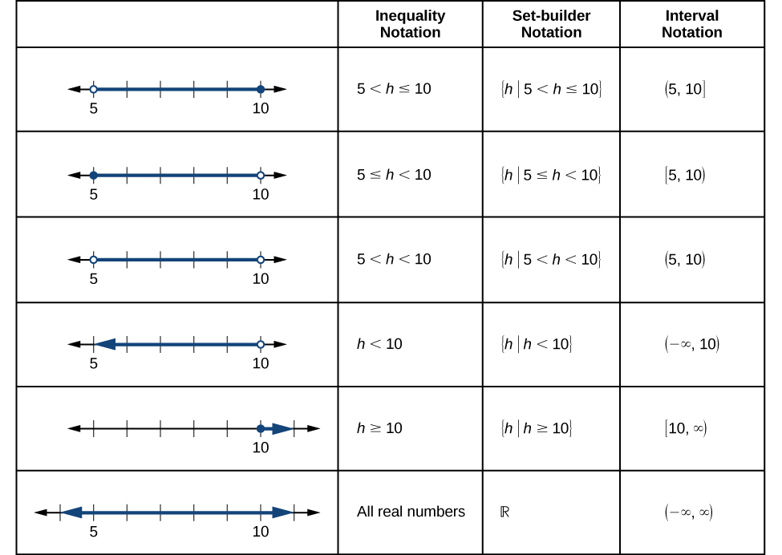
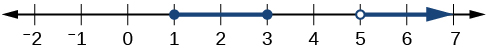
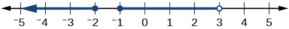

## Chuẩn bị đọc {#vi-prerequisites}

Bài này tiếp tục phần [tìm tập xác định từ phương trình](A30-U018-domain-equations.vi.html#fs-id1165135193832),
với một ví dụ, một bài tự thử và ba hình nguồn. Ta học cách
viết cùng một tập số bằng bất đẳng thức, bằng điều kiện của
phần tử và bằng ký hiệu khoảng. Các mô tả hình, lưu ý và giải
thích thêm được đánh dấu là bổ sung.

*Nhắc lại bổ sung:* “Ký hiệu khoảng” là cách gọi chung ở đây
cho ký hiệu của khoảng mở, đoạn đóng, nửa khoảng và khoảng
không bị chặn. Trong bài này, các biến biểu diễn số thực.

## Dùng ký hiệu để mô tả tập xác định và tập giá trị {#fs-id1165137677916}

::: {#fs-id1165137410091}

Trong các ví dụ trước, ta đã dùng bất đẳng thức và cách liệt kê
để mô tả tập xác định của hàm số. Ta cũng có thể dùng bất đẳng
thức hoặc những mệnh đề khác xác định một tập giá trị hay dữ
liệu để mô tả điều kiện của biến bằng
[ký hiệu tập hợp theo điều kiện]{#term-00009}.
Chẳng hạn, {{math:fs-id1165137410091:0}} mô tả điều kiện của
{{math:fs-id1165137410091:1}} bằng cách viết này.
Cặp ngoặc nhọn {{math:fs-id1165137410091:2}} được đọc là
“tập hợp các”, còn vạch đứng $|$ được đọc là “sao cho”.
Vì vậy, ta đọc {{math:fs-id1165137410091:3}} là “tập hợp các
giá trị $x$ sao cho 10 nhỏ hơn hoặc bằng
{{math:fs-id1165137410091:4}} và {{math:fs-id1165137410091:5}}
nhỏ hơn 30”.
:::

::: {#fs-id1165135207589}

[Hình 1](#Figure_01_02_003) so sánh cách viết bằng bất đẳng thức,
ký hiệu tập hợp theo điều kiện và ký hiệu khoảng.
:::

::: {#Figure_01_02_003}

::: {#fs-id1165135315543}

**Hình 1.** *Bản chép và dịch bảng trong hình nguồn:*

| Bất đẳng thức | Theo điều kiện | Ký hiệu khoảng |
|---|---|---|
| $5<h\le10$ | $\{h\mid5<h\le10\}$ | $(5,10]$ |
| $5\le h<10$ | $\{h\mid5\le h<10\}$ | $[5,10)$ |
| $5<h<10$ | $\{h\mid5<h<10\}$ | $(5,10)$ |
| $h<10$ | $\{h\mid h<10\}$ | $(-\infty,10)$ |
| $h\ge10$ | $\{h\mid h\ge10\}$ | $[10,\infty)$ |
| Mọi số thực | $\mathbb{R}$ | $(-\infty,\infty)$ |

*Điều chỉnh bố cục:* Để dễ đọc trên màn hình hẹp, phần mô tả
trục số được đặt riêng dưới đây, theo đúng thứ tự sáu hàng:

1. Giữa 5 và 10; bỏ 5, lấy 10.
2. Giữa 5 và 10; lấy 5, bỏ 10.
3. Giữa 5 và 10; bỏ cả hai đầu.
4. Mọi điểm bên trái 10; bỏ 10.
5. Mọi điểm bên phải 10 và cả 10.
6. Toàn bộ trục số.

*Mô tả bổ sung:* Điểm tô kín được lấy, vòng tròn rỗng không
được lấy. Mũi tên xanh chỉ phần tô tiếp tục không bị chặn;
mũi tên đen thuộc trục số nền, không tự nó biểu thị phần được
chọn. Hàng cuối của cột giữa ghi $\mathbb{R}$ trong nguồn,
không đổi thành một công thức liệt kê khác.
:::

:::

::: {#fs-id1165137911528}

Để gộp hai khoảng bằng bất đẳng thức hoặc bằng ký hiệu tập hợp
theo điều kiện, ta dùng từ “hoặc”. Như trong các ví dụ trước,
ta dùng ký hiệu phép hợp, {{math:fs-id1165137911528:0}} để gộp
hai khoảng rời nhau. Chẳng hạn, hợp của hai tập
{{math:fs-id1165137911528:1}} và {{math:fs-id1165137911528:2}}
là tập {{math:fs-id1165137911528:3}}
Đó là tập gồm mọi phần tử thuộc tập này **hoặc** tập kia
(hoặc thuộc cả hai tập ban đầu).
Với các tập hữu hạn như trên, không bắt buộc liệt kê phần tử
theo thứ tự số tăng dần. Nếu hai tập ban đầu có phần tử chung,
mỗi phần tử ấy chỉ được ghi một lần trong tập hợp kết quả.
Với các tập số thực cho bằng khoảng, một ví dụ khác về phép hợp là:
:::

::: {#fs-id1165135311695}

{{math:fs-id1165135311695:0}}
:::

*Giải thích bổ sung:* “Hoặc” ở đây không loại trừ trường hợp
thuộc cả hai tập. Phép hợp cũng dùng được khi hai khoảng có
phần chung, không chỉ khi chúng rời nhau. Trong biểu thức
vừa nêu, vạch đứng đầu tiên tách biến khỏi điều kiện;
hai vạch bao quanh $x$ biểu thị giá trị tuyệt đối.
Điều kiện $|x|\ge3$ nghĩa là $x\le-3$ hoặc $x\ge3$.

### Ký hiệu tập hợp theo điều kiện và ký hiệu khoảng {#fs-id1165137641795}

::: {#fs-id1165137663670}

**Ký hiệu tập hợp theo điều kiện** là cách xác định tập hợp
các phần tử thỏa mãn một điều kiện nhất định. Nó có dạng
{{math:fs-id1165137663670:0}}, được đọc là “tập hợp tất cả
{{math:fs-id1165137663670:1}} sao cho mệnh đề về
{{math:fs-id1165137663670:2}} là đúng”. Ví dụ:
:::

::: {#fs-id1165137543047}

{{math:fs-id1165137543047:0}}
:::

::: {#fs-id1165135190272}

**Ký hiệu khoảng** mô tả tập hợp gồm tất cả các số thực nằm
giữa một cận dưới và một cận trên; mỗi cận có thể được lấy
hoặc không được lấy. Các giá trị đầu mút được ghi giữa dấu
ngoặc vuông hoặc ngoặc tròn. Ngoặc vuông cho biết đầu mút
thuộc tập; ngoặc tròn cho biết đầu mút không thuộc tập.
Ví dụ:
:::

::: {#fs-id1165137443063}

{{math:fs-id1165137443063:0}}
:::

*Nhắc lại bổ sung:* Hai cách viết ngay trên biểu diễn cùng
một tập số: bỏ 4, lấy 12 và lấy mọi số thực giữa chúng.
Khi dùng $-\infty$ hoặc $+\infty$, luôn dùng ngoặc tròn ở
phía đó; vô cực không phải một phần tử số thực.

### Cách làm: đọc tập số trên trục số {#fs-id1165137805770}

::: {#fs-id1165137423878}

Cho một hình biểu diễn trên trục số, hãy mô tả tập giá trị
bằng ký hiệu khoảng.
:::

::: {#fs-id1165134032280}

1. Xác định những khoảng thuộc tập bằng cách xem phần nào của
   trục số thực được tô đậm.
2. Ở đầu trái mỗi khoảng, dùng $[$ nếu lấy giá trị đầu mút
   (điểm tô kín), hoặc $($ nếu không lấy đầu mút (điểm rỗng).
3. Ở đầu phải mỗi khoảng, dùng $]$ nếu lấy giá trị đầu mút
   (điểm tô kín), hoặc $)$ nếu không lấy đầu mút (điểm rỗng).
4. Dùng ký hiệu phép hợp {{math:fs-id1165134032280:0}} để
   gộp tất cả các khoảng thành một tập.
:::

### Ví dụ 5 — Mô tả tập số trên trục số thực {#Example_01_02_05}

::: {#fs-id1165134342702}

::: {#fs-id1165137803670}

::: {#fs-id1165137592069}

Mô tả các khoảng giá trị được biểu diễn trong
[Hình 2](#Figure_01_02_004) bằng bất đẳng thức, ký hiệu tập hợp
theo điều kiện và ký hiệu khoảng.
:::

::: {#Figure_01_02_004}

::: {#fs-id1165135177575}

**Hình 2.** *Mô tả bổ sung:* Đoạn $[1,3]$ được lấy trọn vẹn;
điểm 5 không được lấy và phần tô từ đó kéo dài sang phải.
Khoảng trống giữa 3 và 5 không thuộc tập.

*Ghi chú hiệu chỉnh mô tả nguồn:* Văn bản thay thế tiếng Anh
nối hai điều kiện bằng “and” (“và”). Hình vẽ và lời giải nguồn
biểu diễn **hợp**, nên phải đọc là “hoặc”; đây không phải
điều kiện đòi hỏi cả hai cùng đúng.
:::

:::

:::

::: {#fs-id1165135412904}

**Lời giải nguồn.**

::: {#fs-id1165135412905}

Để mô tả các giá trị {{math:fs-id1165135412905:0}} ta phát biểu điều kiện
thuộc các khoảng đã vẽ như sau: “{{math:fs-id1165135412905:1}} là số
thực lớn hơn hoặc bằng 1 và nhỏ hơn hoặc bằng 3, hoặc là số
thực lớn hơn 5”.
:::

::: {#fs-id1165137447518}

*Bảng nguồn — trình bày ba hàng theo chiều dọc:*

**Bất đẳng thức**

{{math:fs-id1165137447518:0}}

**Ký hiệu tập hợp theo điều kiện**

{{math:fs-id1165137447518:1}}

**Ký hiệu khoảng**

{{math:fs-id1165137447518:2}}
:::

::: {#fs-id1165135500794}

Hãy nhớ: khi viết hoặc đọc ký hiệu khoảng, ngoặc vuông cho
biết lấy đầu mút vào tập, còn ngoặc tròn cho biết không lấy
đầu mút vào tập.
:::

:::

:::

### Tự thử 5 {#fs-id1165137779165}

::: {#ti_01_02_03}

::: {#fs-id1165135175087}

::: {#fs-id1165135341412}

Dựa vào [Hình 3](#Figure_01_02_005), hãy mô tả tập được vẽ bằng:
:::

::: {#fs-id1165137595582}

- ⓐ Lời.
- ⓑ Ký hiệu tập hợp theo điều kiện.
- ⓒ Ký hiệu khoảng.
:::

::: {#Figure_01_02_005}

::: {#fs-id1165137424715}

**Hình 3.** *Mô tả bổ sung:* Các điểm $-2$ và $-1$ được lấy;
điểm 3 không được lấy. Khoảng trống $(-2,-1)$ không thuộc tập.
Mũi tên xanh ở phía trái cho biết phần tô tiếp tục về phía
các số nhỏ hơn.

*Ghi chú hiệu chỉnh mô tả nguồn:* Văn bản thay thế tiếng Anh
ghi nhầm $-2\le x$ ở phần đầu. Hình thực tế và đáp án nguồn
đều cho $x\le-2$. Bản dịch sửa mô tả này và giữ nguyên ảnh.
:::

:::

:::

::: {#fs-id1165135209390}

**Đáp án nguồn:**

::: {#fs-id1165135188577}

::: {#fs-id1165135528963}

- ⓐ Các giá trị nhỏ hơn hoặc bằng $-2$, hoặc các giá trị lớn hơn
  hoặc bằng $-1$ và nhỏ hơn 3.
- ⓑ {{math:fs-id1165135528963:0}}
- ⓒ {{math:fs-id1165135528963:1}}
:::

:::

:::

:::

## Giải thích thêm và tự kiểm tra {#vi-extra-reasoning}

*Phần bổ sung — không thay thế lời giải và đáp án nguồn:*

Ở Ví dụ 5, các điểm 1 và 3 thuộc tập, còn 5 không thuộc tập.
Chẳng hạn 2 và 6 thuộc tập nhưng 4 không thuộc tập.
Ở Tự thử 5, các điểm $-2$ và $-1$ thuộc tập, còn 3 không thuộc
tập; $-3$ và 0 thuộc tập nhưng $-3/2$ không thuộc tập.

Các điểm kiểm tra này giúp phát hiện nhầm dấu ngoặc hoặc
nhầm “và” với “hoặc”. Chúng không thay thế việc đọc toàn bộ
phần tô trên trục số và xác định đúng các khoảng.
Chương trình đi kèm kiểm tra dữ liệu nguồn, các đầu mút và
một số giá trị thử; các kiểm tra hữu hạn không phải chứng minh
hai tập vô hạn bằng nhau.

## Nguồn và bước tiếp theo {#vi-attribution}

Nguồn: Jay Abramson và các cộng tác viên OpenStax, *Precalculus 2e*,
mô-đun m49304, UUID 1ca91f2c-f989-40da-b8cc-b930d5c0ad36;
[phiên bản được ghim](https://github.com/openstax/osbooks-college-algebra-bundle/tree/789b54099106b071d1d32bfcee454fed72eb4768).
Đối chiếu với [ấn bản Bahasa Indonesia](https://github.com/KokunoYumeto/openstax-precalculus-2e-id)
0.1.0-alpha.58-reader.1.

Văn bản, bản dịch, phần bổ sung A30 và ba hình nguồn theo
[CC BY-NC-SA 4.0](https://creativecommons.org/licenses/by-nc-sa/4.0/).
Hình nguồn: Copyright Rice University, OpenStax. Giữ ghi công,
chia sẻ tương tự và các thông báo trong notices/; các sách khác
giữ giấy phép riêng. Bản dịch độc lập, không được tác giả nguồn
bảo trợ; thực hiện với sự hỗ trợ của OpenAI Codex theo yêu cầu
người dùng, chưa có thẩm định của người bản ngữ.

Bài dịch trọn mục fs-id1165137677916 và dừng trước mục tìm tập
xác định và tập giá trị từ đồ thị, fs-id1165137653855.
Mô-đun m49304, sách A30 và lộ trình năm sách vẫn còn các phần
cần tiếp tục.
