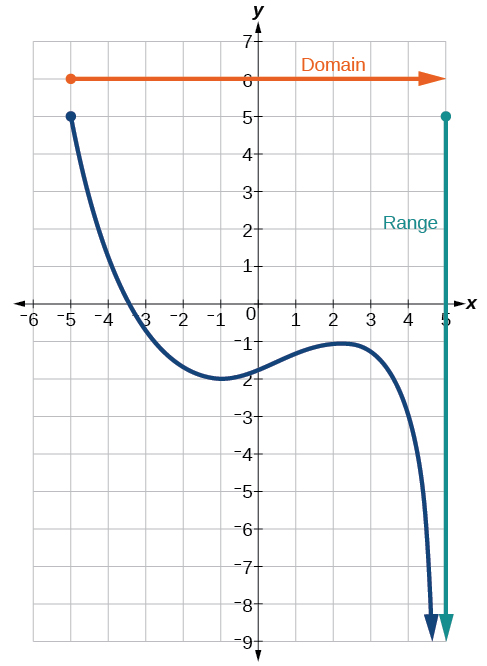
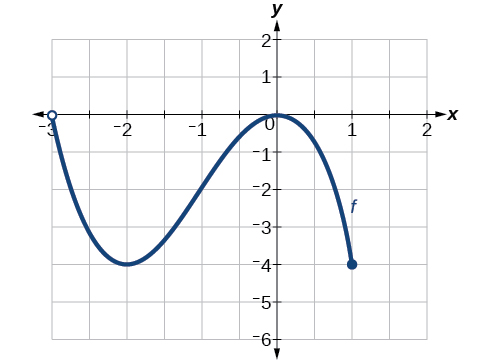
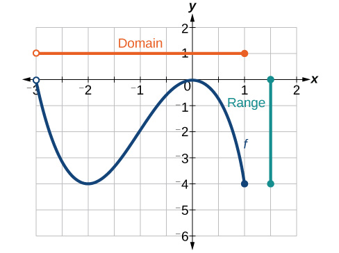
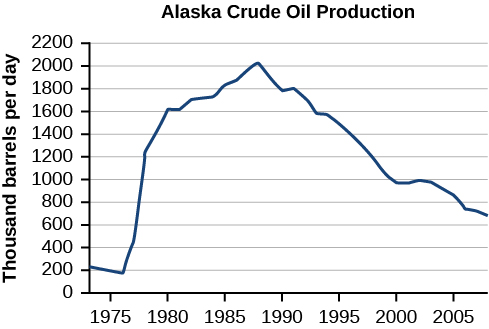
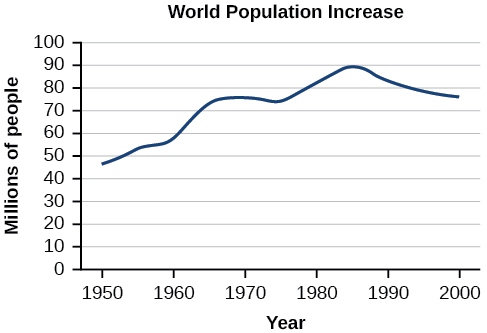

## Phạm vi bài học {#vi-prerequisites}

Bài này dịch trọn mục *Finding Domain and Range from Graphs*
trong mô-đun m49304: hai Ví dụ 6–7, một bài tự thử, một mục
hỏi–đáp và năm hình nguồn. Cần biết cách đọc tọa độ, dấu ngoặc
tròn và dấu ngoặc vuông trong ký hiệu khoảng.

Các lời giải và đáp án có sẵn được ghi là **nguồn**. Mô tả hình,
lời giải thích thêm và ghi chú về điểm không khớp trong nguồn
được đánh dấu riêng. Bài này không chứa bài tập cuối mô-đun.

## Tìm tập xác định và tập giá trị từ đồ thị {#fs-id1165137653855}

::: {#fs-id1165135161404}

Một cách khác để xác định tập xác định và tập giá trị của hàm
số là dùng đồ thị. Tập xác định gồm các giá trị đầu vào có thể
nhận, được đọc theo trục $x$; tập giá trị gồm các giá trị đầu
ra có thể nhận, được đọc theo trục $y$. Nếu đồ thị còn tiếp
tục ngoài phần ta nhìn thấy, hai tập này có thể rộng hơn những
giá trị đang thấy trong khung hình. Xem [Hình 6](#Figure_01_02_006).
:::

*Làm rõ bổ sung:* Chỉ lấy những hoành độ và tung độ thực sự
thuộc các điểm trên đồ thị, không lấy mọi số được ghi trên hai
trục. Có thể hình dung việc chiếu đồ thị lên từng trục. Một
khung nhìn bị cắt không tự xác định toàn bộ tập xác định hoặc
tập giá trị; cần đọc cả đầu mút, mũi tên và thông tin đi kèm.

::: {#Figure_01_02_006}

::: {#fs-id1165137432156}

**Hình 6.** *Phần chữ trong hình — bản dịch:* Domain: tập xác định;
Range: tập giá trị.

*Mô tả bổ sung:* Điểm $(-5,5)$ thuộc đường cong xanh đậm. Theo
mũi tên và mô tả của nguồn, đường cong còn tiếp tục ngoài khung.
Thanh cam nằm ngang ở phía trên và thanh xanh lục thẳng đứng
bên phải chỉ là các dấu chỉ dẫn cho hai tập, **không phải các
nhánh của đồ thị hàm số**. Không suy ra một công thức chính xác
cho đường cong chỉ từ hình này.
:::

:::

::: {#fs-id1165137597994}

Ta thấy đồ thị kéo dài theo phương ngang từ
{{math:fs-id1165137597994:0}} sang phải không bị chặn, nên tập
xác định là {{math:fs-id1165137597994:1}}
Theo phương đứng, đồ thị nhận mọi giá trị
{{math:fs-id1165137597994:2}} trở xuống, nên tập giá trị là
{{math:fs-id1165137597994:3}}
Khi viết ký hiệu khoảng, luôn ghi cận nhỏ trước, cận lớn sau:
đọc từ trái sang phải đối với tập xác định và từ dưới lên trên
đối với tập giá trị trên các trục đang dùng.
:::

*Làm rõ bổ sung:* Hai đầu mút hữu hạn $-5$ và $5$ đều được
lấy vì điểm $(-5,5)$ thuộc đồ thị. Phía vô cực luôn dùng dấu
ngoặc tròn. Cách nói “từ dưới lên trên” ở đây dùng quy ước trục
$y$ tăng lên trên; quy tắc chính là sắp cận theo giá trị số.

### Ví dụ 6 — Đọc tập xác định và tập giá trị {#Example_01_02_06}

::: {#fs-id1165137561401}

::: {#fs-id1165137599824}

::: {#fs-id1165135187604}

Tìm tập xác định và tập giá trị của hàm số
{{math:fs-id1165135187604:0}} có đồ thị trong [Hình 7](#Figure_01_02_007).
:::

::: {#Figure_01_02_007}

::: {#fs-id1165137805567}

**Hình 7.** *Mô tả bổ sung:* Đầu trái $(-3,0)$ không được
lấy; đầu phải $(1,-4)$ được lấy. Đường cong đi qua $(-2,-4)$
và $(0,0)$ trong phần ở giữa.
:::

:::

:::

::: {#fs-id1165137575085}

**Lời giải nguồn.**

::: {#fs-id1165137768165}

Đồ thị trải theo phương ngang từ $-3$ đến $1$, nên tập xác
định của {{math:fs-id1165137768165:0}} là
{{math:fs-id1165137768165:1}}
:::

::: {#fs-id1165131968670}

Đồ thị trải theo phương đứng từ $-4$ đến $0$, nên tập giá trị
là {{math:fs-id1165131968670:0}}
Xem [Hình 8](#Figure_01_02_008).
:::

::: {#Figure_01_02_008}

::: {#fs-id1165137937577}

**Hình 8.** *Phần chữ trong hình — bản dịch:* Domain: tập xác định;
Range: tập giá trị. Hai thanh màu là chú giải, không phải
những điểm bổ sung của đồ thị hàm số.
:::

:::

:::

:::

*Giải thích bổ sung:* Ta không lấy $x=-3$ nhưng lấy $x=1$,
nên tập xác định là $(-3,1]$. Tuy điểm $(-3,0)$ bị bỏ, giá trị
$y=0$ vẫn được nhận tại điểm $(0,0)$. Giá trị $y=-4$ cũng được
nhận, chẳng hạn tại $(1,-4)$. Vì thế cả hai đầu của tập giá trị
$[-4,0]$ đều đóng. Một vòng tròn rỗng ở một điểm không tự loại
tung độ đó khỏi tập giá trị nếu đồ thị còn nhận nó ở điểm khác.

### Ví dụ 7 — Đọc đồ thị sản lượng dầu {#Example_01_02_07}

::: {#fs-id1165134182686}

::: {#fs-id1165137461643}

::: {#fs-id1165137443324}

Tìm tập xác định và tập giá trị của hàm số
{{math:fs-id1165137443324:0}} có đồ thị trong [Hình 9](#Figure_01_02_009).
:::

::: {#Figure_01_02_009}

::: {#fs-id1165135186977}

**Hình 9.** Phỏng theo tác phẩm của U.S. Energy Information
Administration — Cơ quan Thông tin Năng lượng Hoa Kỳ.
[Chú thích nguồn](#fs-id1165135445728).

*Phần chữ trong hình — bản dịch:* Alaska Crude Oil Production:
sản lượng dầu thô Alaska; Thousand barrels per day: nghìn
thùng mỗi ngày. Trục ngang có các mốc năm 1975, 1980, 1985,
1990, 1995, 2000 và 2005. Trục đứng có các mốc từ 0 đến 2200,
cách nhau 200, theo đơn vị **nghìn thùng mỗi ngày**.

*Mô tả bổ sung:* Phần đường vẽ bắt đầu trước mốc 1975 và kết
thúc sau mốc 2005. Nó có điểm thấp gần mức 180 và điểm cao gần
mức 2000 trên thang này. Đây là cách đọc xấp xỉ một hình lịch
sử, không phải bảng số liệu gốc hay sản lượng hiện tại.
:::

:::

::: {#fs-id1165135445728}

**Chú thích nguồn:** [Đường dẫn EIA ghi trong nguồn](http://www.eia.gov/dnav/pet/hist/LeafHandler.ashx?n=PET&s=MCRFPAK2&f=A).
:::

:::

::: {#fs-id1165137444311}

**Lời giải nguồn.**

::: {#fs-id1165137476085}

Đại lượng đầu vào trên trục ngang là “năm”, được biểu thị bằng
biến {{math:fs-id1165137476085:0}} chỉ thời gian. Đại lượng đầu
ra là “nghìn thùng dầu mỗi ngày”, được biểu thị bằng biến
{{math:fs-id1165137476085:1}}. Đồ thị có thể còn tiếp tục về
hai phía ngoài phần đang thấy; nhưng nếu chỉ xét phần được
vẽ, ta có thể xác định tập xác định là
{{math:fs-id1165137476085:2}} và tập giá trị xấp xỉ là
{{math:fs-id1165137476085:3}}
:::

::: {#fs-id1165137747998}

Dùng ký hiệu khoảng, tập xác định là $[1973,2008]$ và tập
giá trị xấp xỉ là $[180,2010]$. Với cả hai tập, ta ước lượng
giá trị nhỏ nhất và lớn nhất vì chúng không nằm đúng trên
các đường lưới.
:::

:::

:::

*Làm rõ bổ sung:* Các cận $1973,2008,180,2010$ ở trên là cách
đọc của nguồn đối với phần hình được vẽ, không phải các giá trị
đo chính xác do bài này xác minh. Đặc biệt, $b=2010$ có nghĩa
là khoảng 2010 **nghìn** thùng mỗi ngày, không phải 2010 thùng
mỗi ngày và cũng không phải năm 2010. Các dấu ngoặc vuông chỉ
việc lấy hai đầu của phần được xét; không khẳng định rằng dữ
liệu ngoài khung hình không tồn tại.

### Tự thử — Đọc đồ thị mức tăng dân số {#fs-id1165135545972}

::: {#ti_01_02_04}

::: {#fs-id1165137644581}

::: {#fs-id1165137644582}

Dựa vào [Hình 10](#Figure_01_02_010), hãy xác định tập xác định
và tập giá trị bằng ký hiệu khoảng.
:::

::: {#Figure_01_02_010}

::: {#fs-id1165137827275}

**Hình 10.** *Phần chữ trong hình — bản dịch:* World Population
Increase: mức tăng dân số thế giới; Millions of people: triệu
người; Year: năm.

*Mô tả bổ sung:* Trục ngang ghi các mốc từ 1950 đến 2000,
cách nhau 10 năm; trục đứng ghi từ 0 đến 100 triệu người,
cách nhau 10 triệu. Đường vẽ bắt đầu ở mốc 1950, đạt đỉnh
khoảng giữa thập niên 1980 và kết thúc gần mốc 2000. Đây là
**mức tăng dân số**, không phải tổng dân số thế giới.
:::

:::

:::

::: {#fs-id1165137705252}

**Đáp án nguồn — giữ nguyên để đối chiếu:**

::: {#fs-id1165134079741}

Tập xác định: $[1950,2002]$.

Tập giá trị: $[47\,000\,000,89\,000\,000]$ người.
:::

:::

:::

#### Đối chiếu đáp án với hình {#vi-population-correction}

*Ghi chú hiệu chỉnh — phần bổ sung:* Cả đáp án tiếng Anh và
tiếng Indonesia đều ghi cận phải **2002**. Tuy nhiên, đường
vẽ trong hình nguồn kết thúc gần mốc **2000**; mô tả thay thế
tiếng Indonesia cũng nêu khoảng 1950–2000. Hình không cung
cấp căn cứ để kéo dài dữ liệu đến 2002.

Nếu trả lời theo **phần đồ thị nhìn thấy**, ta đọc tập xác
định xấp xỉ là $[1950,2000]$. Theo trục đứng, giá trị nhỏ nhất
vào khoảng 46–47 triệu người, còn giá trị lớn nhất vào khoảng
89 triệu người. Có thể ghi tập giá trị xấp xỉ là $[47,89]$
**triệu người** theo mức làm tròn của đáp án nguồn; không nên
coi các cận này là số liệu chính xác đến từng người.

Khoảng $[47,89]$ triệu người và khoảng
$[47\,000\,000,89\,000\,000]$ người dùng hai đơn vị khác nhau
để diễn tả cùng mức xấp xỉ. Dấu phẩy giữa hai cận tách cận
dưới và cận trên; khoảng cách trong mỗi số lớn tách nhóm chữ số.
Đáp án nguồn phía trên vẫn được giữ nguyên về giá trị, không
bị thay bằng cách đọc đã hiệu chỉnh.

### Hỏi–đáp: hai tập có thể bằng nhau không? {#fs-id1165137434590}

::: {#fs-id1165137812796}

Tập xác định và tập giá trị của một hàm số có thể bằng nhau không?
:::

::: {#fs-id1165137433394}

Có. Chẳng hạn, hàm số căn bậc ba có tập xác định và tập giá
trị đều là tập hợp tất cả các số thực.
:::

*Giải thích bổ sung:* Căn bậc ba thực $\sqrt[3]{x}$ có nghĩa
với mọi số thực $x$. Mỗi số thực $y$ đều là một đầu ra:
chọn đầu vào $x=y^3$ thì $\sqrt[3]{x}=y$. Vì vậy, cả hai tập
đều là $\mathbb{R}$, hay $(-\infty,\infty)$.

## Nguồn và bước tiếp theo {#vi-attribution}

Nguồn: Jay Abramson và các cộng tác viên OpenStax, *Precalculus 2e*,
mô-đun m49304, UUID 1ca91f2c-f989-40da-b8cc-b930d5c0ad36;
[phiên bản được ghim](https://github.com/openstax/osbooks-college-algebra-bundle/tree/789b54099106b071d1d32bfcee454fed72eb4768).
Đối chiếu với [ấn bản Bahasa Indonesia](https://github.com/KokunoYumeto/openstax-precalculus-2e-id)
0.1.0-alpha.58-reader.1. Giữ năm ảnh JPEG tiếng Anh nguyên trạng;
hai hình dữ liệu trong ấn bản Indonesia dùng bản SVG có chữ
được bản địa hóa. Chú thích EIA của Hình 9 được giữ ở trên.

Văn bản, bản dịch, phần bổ sung A30 và các Hình 6–8, 10 theo
[CC BY-NC-SA 4.0](https://creativecommons.org/licenses/by-nc-sa/4.0/),
với ghi công Rice University, OpenStax. Riêng Hình 9 được hồ sơ
nguồn ghi nhận thuộc phạm vi công cộng; giữ ghi công EIA và
đường dẫn nguồn của hình. Các thông báo riêng trong notices/
vẫn áp dụng. Bản dịch độc
lập, không được tác giả nguồn bảo trợ; thực hiện với sự hỗ trợ
của OpenAI Codex theo yêu cầu người dùng, chưa được người bản
ngữ thẩm định. Các đường dẫn ngoài được giữ để dẫn nguồn,
không phải tuyên bố đã truy cập hoặc cập nhật số liệu.

Kiểm tra bằng mã đi kèm đối chiếu công thức, đầu mút và đơn
vị; nó không biến số đọc từ ảnh thành dữ liệu đo chính xác và
không thay việc đọc đồ thị hay lập luận cho một tập vô hạn.

Bài dừng trước mục về tập xác định và tập giá trị của các
hàm số cơ bản, bắt đầu tại m49304/fs-id1165134384565. Các mục
sau, bài tập cuối mô-đun và bảng thuật ngữ không được tính
là đã dịch ở đây. Mô-đun, sách A30 và toàn bộ nhiệm vụ năm
sách vẫn cần tiếp tục.
