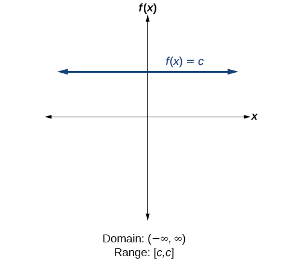
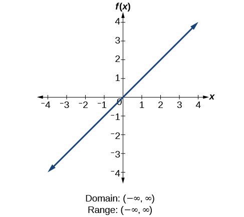
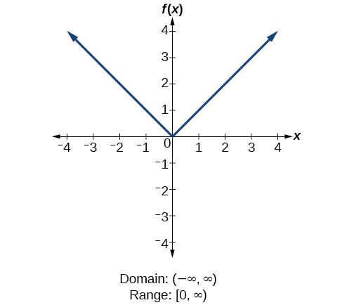
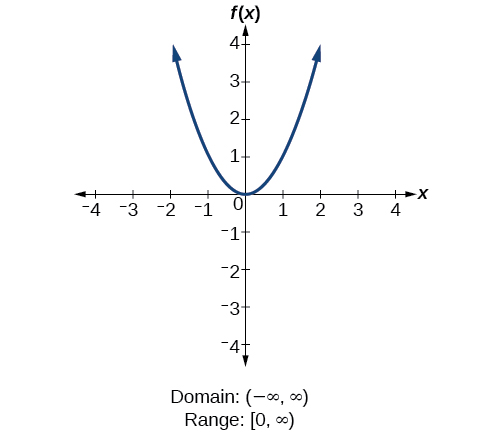
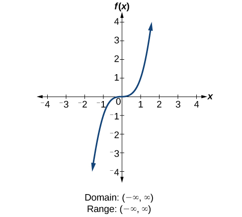
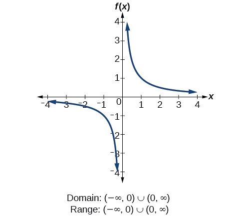
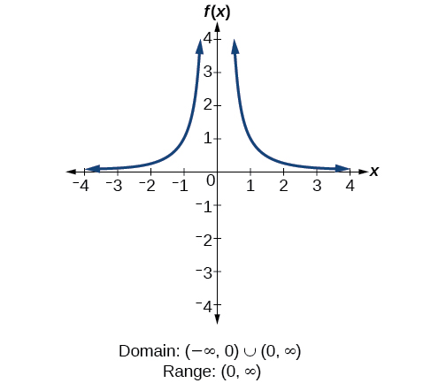
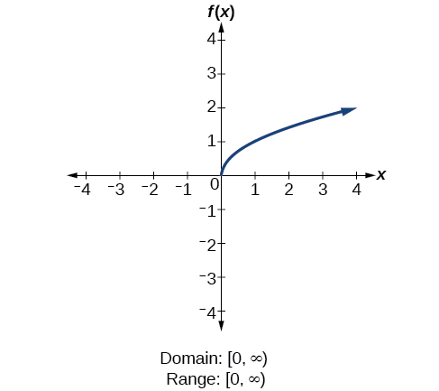
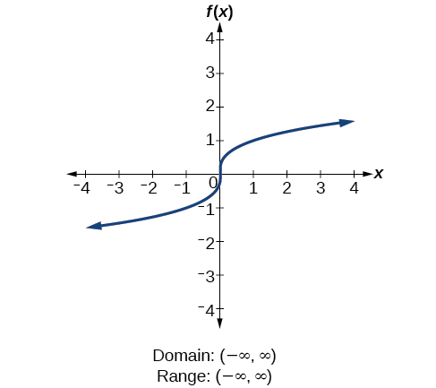
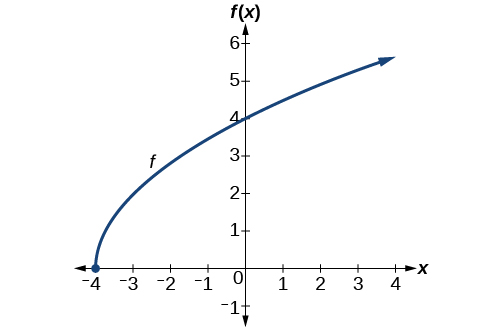

## Trước khi học {#vi-prerequisites}

*Hướng dẫn bổ sung:* Bài này xét các hàm số có đầu vào và đầu
ra là **số thực**. Khi nguồn chỉ cho công thức mà không nêu một
tập xác định khác, ta tìm tất cả đầu vào thực làm cho công thức
có nghĩa. Tập giá trị gồm các đầu ra thực **thực sự nhận được**
từ những đầu vào đó.

Bạn cần biết đọc dấu ngoặc trong ký hiệu khoảng, nhận ra phép
chia cho 0 và phân biệt căn bậc hai không âm với hai nghiệm của
một phương trình bình phương. Chín hàm số dưới đây là các mẫu
cơ bản đã gặp trước đó; chẳng hạn, hàng $x^2$ không đại diện cho
tập giá trị của mọi hàm số bậc hai.

Mười hình nguồn được giữ nguyên. Các dòng “Nhãn trong hình”
chép lại tập xác định và tập giá trị bằng văn bản để người đọc
không phải chỉ dựa vào chữ trong ảnh. *Domain* là tập xác định,
*Range* là tập giá trị. Những giải thích thêm được ghi rõ là
phần bổ sung, không phải lời giải có sẵn trong nguồn.

## Tập xác định và tập giá trị của các hàm số cơ bản {#fs-id1165134384565}

::: {#fs-id1165137419914}
Ta quay lại tập hợp các hàm số cơ bản để xác định tập xác định
và tập giá trị của từng hàm số.
:::

### 1. Hàm số hằng — Hình 11 {#Figure_01_02_011}

::: {#fs-id1165137661673}

:::

*Chú thích nguồn:* Với **hàm số hằng** {{math:Figure_01_02_011:0}}
tập xác định gồm tất cả các số thực; đầu vào không bị hạn chế.
Giá trị đầu ra duy nhất là hằng số {{math:Figure_01_02_011:1}}
nên tập giá trị là tập {{math:Figure_01_02_011:2}} chỉ chứa một
phần tử này. Theo ký hiệu khoảng, ta viết
{{math:Figure_01_02_011:3}} tức là đoạn bắt đầu và kết thúc cùng
tại {{math:Figure_01_02_011:4}}

Nhãn trong hình: tập xác định $(-\infty,\infty)$; tập giá trị
$[c,c]$.

*Lưu ý bổ sung:* $c$ là một số thực được giữ cố định. $[c,c]$
chính là tập một phần tử $\{c\}$, không phải tập rỗng. Hình
minh họa một đường thẳng nằm phía trên trục ngang; công thức
hàm số hằng cũng cho phép $c=0$ hoặc $c<0$.

### 2. Hàm số đồng nhất — Hình 12 {#Figure_01_02_012}

::: {#fs-id1165137543965}

:::

*Chú thích nguồn:* Với **hàm số đồng nhất**
{{math:Figure_01_02_012:0}} không có hạn chế nào đối với
{{math:Figure_01_02_012:1}} Tập xác định và tập giá trị đều là
tập hợp tất cả các số thực.

Nhãn trong hình: tập xác định $(-\infty,\infty)$; tập giá trị
$(-\infty,\infty)$.

### 3. Hàm số giá trị tuyệt đối — Hình 13 {#Figure_01_02_013}

::: {#fs-id1165137757797}

:::

*Chú thích nguồn:* Với **hàm số giá trị tuyệt đối**
{{math:Figure_01_02_013:0}} không có hạn chế nào đối với
{{math:Figure_01_02_013:1}} Tuy nhiên, giá trị tuyệt đối được
định nghĩa là khoảng cách đến 0, nên đầu ra chỉ có thể lớn hơn
hoặc bằng 0.

Nhãn trong hình: tập xác định $(-\infty,\infty)$; tập giá trị
$[0,\infty)$.

### 4. Hàm số bậc hai cơ bản — Hình 14 {#Figure_01_02_014}

::: {#fs-id1165137448012}

:::

*Chú thích nguồn:* Với **hàm số bậc hai**
{{math:Figure_01_02_014:0}} tập xác định là tất cả các số thực,
vì phạm vi của đồ thị theo phương ngang bao trùm toàn bộ trục
số thực. Đồ thị không nhận giá trị đầu ra âm; tập giá trị gồm
các số thực không âm.

Nhãn trong hình: tập xác định $(-\infty,\infty)$; tập giá trị
$[0,\infty)$.

### 5. Hàm số bậc ba cơ bản — Hình 15 {#Figure_01_02_015}

::: {#fs-id1165137660840}

:::

*Chú thích nguồn:* Với **hàm số bậc ba**
{{math:Figure_01_02_015:0}} tập xác định là tất cả các số thực,
vì phạm vi của đồ thị theo phương ngang bao trùm toàn bộ trục
số thực. Điều tương tự đúng theo phương đứng, nên cả tập xác
định lẫn tập giá trị đều gồm tất cả các số thực.

Nhãn trong hình: tập xác định $(-\infty,\infty)$; tập giá trị
$(-\infty,\infty)$.

*Ghi chú đối chiếu:* Mô tả thay thế tiếng Anh có lỗi gõ
“f(x)-x^3”. Bản mô tả tiếng Việt dùng $f(x)=x^3$, đúng với
công thức, hình và mô tả Indonesia. Không sửa ảnh nguồn.

### 6. Hàm số lấy nghịch đảo — Hình 16 {#Figure_01_02_016}

::: {#fs-id1165137582779}

:::

*Chú thích nguồn:* Với **hàm số lấy nghịch đảo**
{{math:Figure_01_02_016:0}} ta không thể chia cho 0, nên phải
loại 0 khỏi tập xác định. Hơn nữa, 1 chia cho bất kỳ đầu vào
hợp lệ nào cũng không bằng 0, nên tập giá trị cũng không chứa
0. Dùng ký hiệu tập hợp theo điều kiện, ta còn có thể
viết {{math:Figure_01_02_016:1}} tức là tập tất cả các số thực
khác 0.

Nhãn trong hình: tập xác định $(-\infty,0)\cup(0,\infty)$;
tập giá trị $(-\infty,0)\cup(0,\infty)$.

*Giải thích bổ sung:* Cần kiểm tra thêm rằng mọi số thực khác 0
đều thực sự là một đầu ra. Với $y\ne0$, chọn $x=1/y$ thì
$x\ne0$ và $1/x=y$. “Lấy nghịch đảo” ở đây là phép tính
$1/x$, không phải khái niệm hàm số ngược.

### 7. Hàm số lấy nghịch đảo của bình phương — Hình 17 {#Figure_01_02_017}

::: {#fs-id1165133004481}

:::

*Chú thích nguồn:* Với **hàm số lấy nghịch đảo của bình phương**
{{math:Figure_01_02_017:0}} ta không thể chia cho
{{math:Figure_01_02_017:1}} nên phải loại
{{math:Figure_01_02_017:2}} khỏi tập xác định. Cũng không có
{{math:Figure_01_02_017:3}} nào cho đầu ra bằng 0, nên 0 còn
bị loại khỏi tập giá trị. Do có bình phương ở mẫu số, đầu ra
của hàm số này luôn dương; tập giá trị chỉ gồm các số dương.

Nhãn trong hình: tập xác định $(-\infty,0)\cup(0,\infty)$;
tập giá trị $(0,\infty)$.

*Giải thích bổ sung:* Trên tập xác định, $x^2>0$ chứ không
chỉ $x^2\ge0$. Với mỗi $y>0$, đầu vào $x=1/\sqrt{y}$ là
hợp lệ và cho $1/x^2=y$. Vì vậy, mọi số dương đều được nhận,
nhưng 0 thì không.

### 8. Hàm số căn bậc hai — Hình 18 {#Figure_01_02_018}

::: {#fs-id1165137401809}

:::

*Chú thích nguồn:* Với **hàm số căn bậc hai**
{{math:Figure_01_02_018:0}} ta không thể lấy căn bậc hai thực
của một số thực âm, nên tập xác định chỉ gồm các số lớn hơn
hoặc bằng 0. Tập giá trị cũng loại các số âm: căn bậc hai
được ký hiệu bằng dấu căn của một số dương
{{math:Figure_01_02_018:1}} được quy ước là số dương, mặc dù
bình phương của số âm {{math:Figure_01_02_018:2}} cũng bằng
{{math:Figure_01_02_018:3}}

Nhãn trong hình: tập xác định $[0,\infty)$; tập giá trị
$[0,\infty)$.

*Giải thích bổ sung:* Ký hiệu $\sqrt{x}$ chỉ **một giá trị
không âm**, không phải hai giá trị $\pm\sqrt{x}$. Khi $x=0$,
ta có $\sqrt{0}=0$. Ngược lại, mỗi $y\ge0$ đều được nhận:
chọn $x=y^2$ thì $\sqrt{x}=y$.

### 9. Hàm số căn bậc ba — Hình 19 {#Figure_01_02_019}

::: {#fs-id1165137730429}

:::

*Chú thích nguồn:* Với **hàm số căn bậc ba**
{{math:Figure_01_02_019:0}} tập xác định và tập giá trị gồm tất
cả các số thực. Ta có thể lấy căn bậc ba, hoặc căn có bậc là
một số nguyên dương lẻ, của một số âm; đầu ra khi đó là số âm
(đây là một hàm số lẻ).

Nhãn trong hình: tập xác định $(-\infty,\infty)$; tập giá trị
$(-\infty,\infty)$.

*Giải thích bổ sung:* “Hàm số lẻ” nói về đẳng thức
$f(-x)=-f(x)$, không có nghĩa là đầu ra phải là số nguyên lẻ.
Với mọi số thực $y$, đầu vào $x=y^3$ cho $\sqrt[3]{x}=y$.

### Cách làm {#fs-id1165137462732}

::: {#fs-id1165137611181}
**Cho công thức của một hàm số, hãy tìm tập xác định và tập
giá trị.**
:::

::: {#fs-id1165137405229}

1. Loại khỏi tập xác định mọi đầu vào làm xuất hiện phép chia
   cho 0.
2. Loại khỏi tập xác định mọi đầu vào cho đầu ra không phải
   số thực hoặc không xác định.
3. Dùng các đầu vào hợp lệ để tìm tập giá trị của đầu ra.
4. Xem đồ thị và các giá trị trong bảng để kiểm tra xem hàm
   số thực sự biến thiên như thế nào.

:::

*Lưu ý bổ sung:* Một bảng hữu hạn hoặc một khung hình hữu hạn
không đủ để chứng minh tập xác định hay tập giá trị là một
tập vô hạn. Muốn khẳng định một số thuộc tập giá trị, cần có
đầu vào hợp lệ cho ra số ấy; muốn khẳng định mọi số trong một
tập đều được nhận, cần lập luận áp dụng cho cả tập đó.

### Ví dụ 8 — Dùng các hàm số cơ bản để tìm tập xác định và tập giá trị {#Example_01_02_08}

::: {#fs-id1165137558723}
::: {#fs-id1165137464274}
::: {#fs-id1165135613224}
Tìm tập xác định và tập giá trị của
{{math:fs-id1165135613224:0}}
:::
:::

::: {#fs-id1165135458670}

**Lời giải nguồn.**

::: {#fs-id1165137527861}
Không có hạn chế nào đối với tập xác định: mọi số thực đều
có thể được lập phương, nhân với 2, rồi trừ đi chính số thực
ban đầu.
:::

::: {#fs-id1165135208585}
Tập xác định là {{math:fs-id1165135208585:0}} và tập giá trị
cũng là {{math:fs-id1165135208585:1}}
:::
:::
:::

*Ghi chú đối chiếu:* Câu giải thích tiếng Anh viết tắt bước
nhân với 2. Bản dịch nêu đủ bước này, đúng với công thức và
câu giải thích trong bản Indonesia.

*Giải thích bổ sung:* Tập giá trị không tự động bằng
$\mathbb{R}$ chỉ vì tập xác định là $\mathbb{R}$. Ở đây ta
dùng tính chất sau của đa thức: đồ thị liên tục và nhận mọi
giá trị nằm giữa hai giá trị đầu ra của nó. “Liên tục” ở đây
có thể hình dung là đồ thị không bị đứt quãng; tính chất này
sẽ được học kỹ hơn về sau.

Với một số thực $y$ bất kỳ, lấy $M=|y|+1$. Khi đó $M\ge1$,
$M>|y|$ và

$$f(M)=M(2M^2-1)\ge M>y.$$

Mặt khác, $f(-M)=-f(M)<y$. Tính chất trên cho biết có một
đầu vào giữa $-M$ và $M$ có đầu ra bằng $y$. Vì $y$ tùy ý,
tập giá trị là $\mathbb{R}$. Lập luận này không giả định hàm
số đồng biến trên toàn bộ tập xác định và không dựa vào một
bảng hữu hạn.

### Ví dụ 9 — Tìm tập xác định và tập giá trị {#Example_01_02_09}

::: {#fs-id1165137448155}
::: {#fs-id1165137661316}
::: {#fs-id1165137419507}
Tìm tập xác định và tập giá trị của
{{math:fs-id1165137419507:0}}
:::
:::

::: {#fs-id1165137871182}

**Lời giải nguồn.**

::: {#fs-id1165137855321}
Không thể tính giá trị của hàm số tại
{{math:fs-id1165137855321:0}} vì phép chia cho 0 không xác
định. Tập xác định là {{math:fs-id1165137855321:1}}
Hàm số không bao giờ nhận giá trị 0, nên ta loại 0 khỏi tập
giá trị. Tập giá trị là {{math:fs-id1165137855321:2}}
:::
:::
:::

*Giải thích bổ sung:* Điều kiện của mẫu số là $x+1\ne0$,
tức $x\ne-1$. Tử số 2 khác 0 nên đầu ra không thể bằng 0.
Để kiểm tra rằng không thiếu đầu ra nào khác, với mỗi
$y\ne0$ ta chọn

$$x=\frac{2}{y}-1.$$

Khi đó $x+1=2/y\ne0$, nên đầu vào hợp lệ, và

$$f(x)=\frac{2}{2/y}=y.$$

Vậy mọi số thực khác 0 đều được nhận.

### Ví dụ 10 — Tìm tập xác định và tập giá trị {#Example_01_02_10}

::: {#fs-id1165137574740}
::: {#fs-id1165135641583}
::: {#fs-id1165137661054}
Tìm tập xác định và tập giá trị của
{{math:fs-id1165137661054:0}}
:::
:::

::: {#fs-id1165137584342}

**Lời giải nguồn.**

::: {#fs-id1165137596350}
Không thể lấy căn bậc hai thực của một số âm, nên biểu thức
dưới dấu căn phải không âm.
:::

::: {#eip-id1165137567088}
{{math:eip-id1165137567088:0}}
:::

::: {#fs-id1165137465335}
Tập xác định của {{math:fs-id1165137465335:0}} là
{{math:fs-id1165137465335:1}}
:::

::: {#fs-id1165137544393}
Tiếp theo, ta tìm tập giá trị. Ta biết
{{math:fs-id1165137544393:0}} và giá trị của hàm số tăng khi
{{math:fs-id1165137544393:1}} tăng, không bị chặn trên.
Vậy tập giá trị của {{math:fs-id1165137544393:2}} là
{{math:fs-id1165137544393:3}}
:::
:::

::: {#fs-id1165137572635}

**Phân tích nguồn.**

::: {#fs-id1165137437183}
[Hình 20](#Figure_01_02_020) biểu diễn hàm số
{{math:fs-id1165137437183:0}}
:::

#### Hình 20 {#Figure_01_02_020}

::: {#fs-id1165135582217}

:::
:::
:::

*Giải thích bổ sung:* Điểm $(-4,0)$ thuộc đồ thị, nên tập
xác định chứa $-4$ và tập giá trị chứa 0. Với mỗi $y\ge0$,
chọn

$$x=\left(\frac{y}{2}\right)^2-4.$$

Ta có $x\ge-4$ và $\sqrt{x+4}=y/2$, do $y/2\ge0$. Vì thế
$f(x)=y$. Điều này xác nhận rằng mọi đầu ra không âm đều
được nhận, không chỉ những giá trị nhìn thấy trong khung hình.

### Tự thử 7 {#fs-id1165137430800}

::: {#ti_01_02_05}
::: {#fs-id1165137475544}
::: {#fs-id1165137475545}
Tìm tập xác định và tập giá trị của
{{math:fs-id1165137475545:0}}
:::
:::
:::

Hãy tự làm trước khi xem [đáp án](#fs-id1165137833252).

#### Đáp án Tự thử 7 {#fs-id1165137833252}

::: {#fs-id1165137725047}
**Đáp án nguồn:** tập xác định {{math:fs-id1165137725047:0}}
tập giá trị {{math:fs-id1165137725047:1}}.
:::

*Lời giải bổ sung:* Điều kiện dưới dấu căn là $2-x\ge0$,
tức $x\le2$. Vậy tập xác định là $(-\infty,2]$. Do căn bậc
hai không âm và phía trước có dấu trừ, đầu ra không dương;
đặc biệt $f(2)=0$.

Với mỗi $y\le0$, chọn $x=2-y^2$. Đầu vào này thỏa $x\le2$,
và

$$f(x)=-\sqrt{y^2}=-|y|=y.$$

Đẳng thức cuối dùng điều kiện $y\le0$. Do đó tập giá trị
là $(-\infty,0]$.

## Nguồn và bước tiếp theo {#vi-attribution}

Nguồn: Jay Abramson và các cộng tác viên OpenStax, *Precalculus 2e*,
mô-đun m49304, UUID 1ca91f2c-f989-40da-b8cc-b930d5c0ad36;
[phiên bản được ghim](https://github.com/openstax/osbooks-college-algebra-bundle/tree/789b54099106b071d1d32bfcee454fed72eb4768).
Đối chiếu với [ấn bản Bahasa Indonesia](https://github.com/KokunoYumeto/openstax-precalculus-2e-id)
0.1.0-alpha.58-reader.1. Giữ nguyên mười ảnh nguồn; chữ mô tả
thay thế và phần chữ chép lại bên ngoài ảnh được dịch hoặc
viết bổ sung, không sửa điểm hay đường nét trong ảnh.

Văn bản, bản dịch, phần bổ sung A30 và mười hình nguồn theo
[CC BY-NC-SA 4.0](https://creativecommons.org/licenses/by-nc-sa/4.0/).
Hình nguồn: Copyright Rice University, OpenStax. Giữ ghi công,
thông báo thay đổi, chia sẻ tương tự và các thông báo riêng
trong notices/; các sách khác giữ giấy phép riêng. Đây là bản
dịch độc lập, không được tác giả nguồn bảo trợ; thực hiện với
sự hỗ trợ của OpenAI Codex theo yêu cầu người dùng, chưa có
thẩm định của người bản ngữ. Các đường dẫn ngoài là dẫn nguồn,
không cần truy cập để học nội dung bài.

Mã kiểm tra đi kèm đối chiếu cấu trúc nguồn và một số phép
tính chính xác. Các kiểm tra hữu hạn không thay cho lập luận
về toàn bộ một tập xác định hay tập giá trị vô hạn.

Bài dịch trọn mục m49304/fs-id1165134384565, gồm chín hàm số
cơ bản, Ví dụ 8–10 và Tự thử 7. Bài dừng trước mục về hàm số
cho bởi nhiều công thức, fs-id1165135440477. Các phần tiếp
theo của mô-đun, sách A30 và toàn bộ nhiệm vụ năm sách vẫn
cần tiếp tục.
