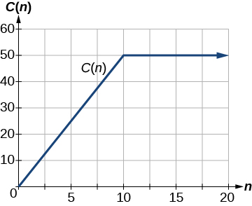
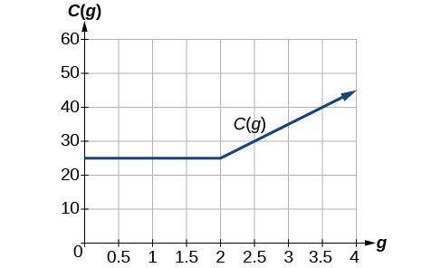
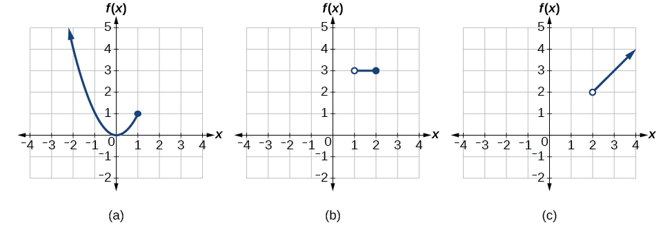
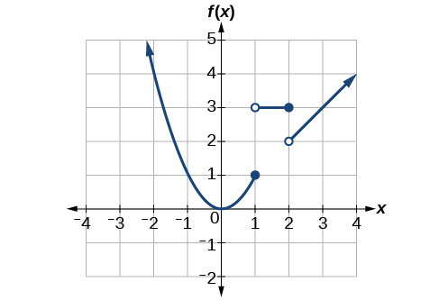
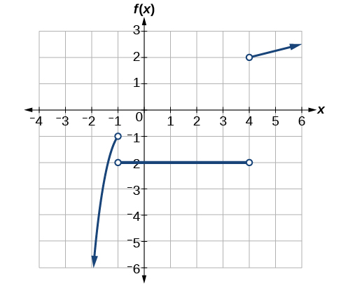

## Chuẩn bị đọc {#vi-prerequisites}

Bài này dịch trọn mục về hàm số cho bởi nhiều công thức:
ba ví dụ, một bài tự thử, năm ảnh nguồn và các liên kết học thêm.
Bạn cần biết tập xác định, tập giá trị, dấu ngoặc của khoảng
và những đồ thị hàm số cơ bản. Các mô tả hình, giải thích thêm
và hiệu chỉnh phát biểu nguồn đều được đánh dấu riêng.

*Làm rõ bổ sung:* Mỗi dòng của một công thức nhiều trường hợp
gồm một biểu thức và điều kiện áp dụng. Phải kiểm tra điều kiện
của đầu vào trước khi chọn dòng để tính giá trị.

## Vẽ đồ thị hàm số cho bởi nhiều công thức {#fs-id1165135440477}

::: {#fs-id1165137409262}

Đôi khi ta gặp một hàm số cần được mô tả bằng nhiều công thức
để xác định đầu ra. Chẳng hạn, trong các hàm số cơ bản, ta đã
giới thiệu hàm số giá trị tuyệt đối {{math:fs-id1165137409262:0}}
Tập xác định của hàm số là toàn bộ tập số thực, còn tập giá trị
gồm các số lớn hơn hoặc bằng 0.
[Giá trị tuyệt đối]{#term-00010} có thể được hiểu là
[độ lớn]{#term-00011}, hay [môđun]{#term-00012}, của một số thực,
không xét dấu của số đó. Đó là khoảng cách từ số ấy đến 0 trên
trục số. Mọi cách diễn đạt này đều yêu cầu đầu ra không âm.
:::

::: {#fs-id1165137558775}

Nếu đầu vào bằng 0 hoặc dương, đầu ra bằng chính đầu vào.
:::

::: {#fs-id1165135194329}

{{math:fs-id1165135194329:0}}
:::

::: {#fs-id1165137529947}

Nếu đầu vào âm, đầu ra là số đối của đầu vào.
:::

::: {#fs-id1165133112779}

{{math:fs-id1165133112779:0}}
:::

::: {#fs-id1165137863778}

Vì cách mô tả này dùng hai quy tắc, hay hai phần, hàm số giá trị
tuyệt đối là một ví dụ về hàm số cho bởi nhiều công thức.
Một [hàm số cho bởi nhiều công thức]{#term-00013} dùng nhiều
công thức để xác định đầu ra trên những phần khác nhau của
tập xác định.
:::

::: {#fs-id1165134042316}

Ta dùng những hàm số như vậy để mô tả tình huống mà quy tắc
hoặc quan hệ thay đổi khi đầu vào vượt qua một “ranh giới”
nhất định. Ví dụ, trong kinh doanh, giá mỗi đơn vị hàng có thể
được giảm khi số lượng đặt mua vượt một mức nào đó.
Các bậc thuế là một ví dụ thực tế khác.
Hãy xét một hệ thống thuế đơn giản: phần thu nhập đến
10 000 đô la chịu thuế 10%, còn phần thu nhập vượt mức ấy
chịu thuế 20%. Thuế tính trên tổng thu nhập
{{math:fs-id1165134042316:0}} sẽ là
{{math:fs-id1165134042316:1}} nếu `{{math:fs-id1165134042316:2}}`{=html},
và là `{{math:fs-id1165134042316:3}}`{=html} nếu
`{{math:fs-id1165134042316:4}}`{=html}
:::

*Lưu ý bổ sung:* Đây là mô hình thuế minh họa trong nguồn,
không phải quy định thuế hiện hành hay hướng dẫn tài chính.
Hiểu thu nhập đang xét là không âm. Thuế suất 20% chỉ áp dụng
cho **phần vượt 10 000 đô la**, không phải cho toàn bộ thu nhập.
Dấu phẩy trong số tiền của công thức nguồn tách hàng nghìn.

### Hàm số cho bởi nhiều công thức {#fs-id1165137531241}

::: {#fs-id1165135504970}

Hàm số cho bởi nhiều công thức dùng nhiều biểu thức để xác định
đầu ra. Mỗi công thức có phần tập xác định riêng; tập xác định
của hàm số là hợp của các phần nhỏ ấy. Ta ghi ý tưởng này như sau:
:::

*Gợi ý đọc bổ sung:* Trên màn hình hẹp, cuộn ngang khung công
thức để đọc đủ các điều kiện. Khi dùng bàn phím, đặt tiêu
điểm vào khung rồi dùng phím mũi tên.

::: {#fs-id1165137482244}

::: {#vi-piecewise-definition-scroll role="region" tabindex="0" aria-label="Định nghĩa nhiều công thức; cuộn ngang khi cần" style="overflow-x: auto; max-width: 100%;"}

::: {style="min-width: 30rem;"}

{{math:fs-id1165137482244:0}}
:::

:::

:::

*Làm rõ bổ sung:* “Phần tập xác định” ở đây là tập đầu vào
được **chỉ định cho nhánh**, không nhất thiết là toàn bộ tập
số thực mà riêng biểu thức ấy có nghĩa. Quy ước của các ví dụ
trong bài là chia các nhánh không chồng lấn; xem phần hỏi–đáp
cuối bài để phân biệt quy ước này với định nghĩa tổng quát
của hàm số.

::: {#fs-id1165137543841}

Dùng cách ghi nhiều trường hợp, hàm số giá trị tuyệt đối là:
:::

::: {#fs-id1165135190749}

{{math:fs-id1165135190749:0}}
:::

### Cách làm: viết công thức theo từng phần {#fs-id1165137768426}

::: {#fs-id1165137823161}

Cho một hàm số cần mô tả theo từng phần, hãy viết công thức
và xác định tập đầu vào áp dụng cho mỗi khoảng.
:::

::: {#fs-id1165135443772}

1. Xác định những khoảng có các quy tắc khác nhau.
2. Tìm công thức mô tả cách tính đầu ra từ đầu vào trên mỗi khoảng.
3. Dùng ngoặc nhọn cùng những điều kiện “nếu” để viết hàm số.
:::

### Ví dụ 11 — Viết hàm số cho bởi nhiều công thức {#Example_01_02_11}

::: {#fs-id1165137452506}

::: {#fs-id1165135321994}

::: {#fs-id1165137834905}

Một bảo tàng thu 5 đô la mỗi người cho chuyến tham quan có
hướng dẫn với nhóm từ 1 đến 9 người, hoặc thu cố định 50 đô la
cho nhóm từ 10 người trở lên. Viết một
[hàm số]{#term-00014} liên hệ số người,
{{math:fs-id1165137834905:0}} với chi phí,
{{math:fs-id1165137834905:1}}
Vì không thể có một phần lẻ của một người, đây thực chất là
hàm số có đầu vào rời rạc. Tuy nhiên, trong bài tập này,
ta sẽ xem nó như một hàm số liên tục.
:::

:::

*Làm rõ bổ sung:* Với nhóm người thật, $n$ là số nguyên dương.
Cách xét liên tục trong nguồn là mở rộng mô hình cho mọi
$n>0$ để minh họa cách vẽ đồ thị; không có nghĩa là số người
thực tế có thể là một phân số.

::: {#fs-id1165137807421}

**Lời giải nguồn.**

::: {#fs-id1165135331729}

Cần dùng hai công thức khác nhau. Với các giá trị $n$ nhỏ hơn 10,
{{math:fs-id1165135331729:0}} Với các giá trị
{{math:fs-id1165135331729:1}} bằng 10 hoặc lớn hơn,
{{math:fs-id1165135331729:2}}
:::

::: {#fs-id1165135208951}

{{math:fs-id1165135208951:0}}
:::

:::

::: {#fs-id1165135436578}

**Phân tích nguồn.**

::: {#fs-id1165135196985}

Hàm số được biểu diễn trong [Hình 1](#Figure_01_02_021).
Đồ thị là một đường thẳng xiên từ
{{math:fs-id1165135196985:0}} đến
{{math:fs-id1165135196985:1}}, rồi có giá trị không đổi.
Trong ví dụ này, hai công thức cho cùng giá trị tại chỗ nối
{{math:fs-id1165135196985:2}} nhưng không phải mọi hàm số cho
bởi nhiều công thức đều có tính chất đó.
:::

::: {#Figure_01_02_021}

::: {#fs-id1165137419948}

**Hình 1.** *Mô tả bổ sung:* Trục ngang đánh dấu 0, 5, 10, 15,
20; trục đứng có các mức từ 0 đến 60. Đoạn xiên tiến đến gốc
tọa độ ở phía trái, còn mũi tên phải nằm trên đường $C=50$.

*Lưu ý về biên của hình nguồn:* Hình và câu phân tích nói đến
$n=0$ nhưng không vẽ vòng tròn rỗng ở gốc. Công thức nguồn
quy định **$n>0$**, nên không lấy điểm $(0,0)$ vào đồ thị.
Với mô hình nhóm người thật, chỉ giữ các điểm có hoành độ
nguyên dương.
:::

:::

:::

:::

### Ví dụ 12 — Tính giá trị hàm số cho bởi nhiều công thức {#Example_01_02_12}

::: {#fs-id1165135436662}

::: {#fs-id1165135436664}

::: {#fs-id1165137938645}

Một công ty điện thoại di động dùng hàm số dưới đây để tính
chi phí {{math:fs-id1165137938645:0}} bằng đô la khi truyền
{{math:fs-id1165137938645:1}} gigabyte dữ liệu.
:::

::: {#fs-id1165137660470}

{{math:fs-id1165137660470:0}}
:::

::: {#fs-id1165135193798}

Tìm chi phí sử dụng 1,5 gigabyte dữ liệu và chi phí sử dụng
4 gigabyte dữ liệu.
:::

:::

::: {#fs-id1165135177567}

**Lời giải nguồn.**

::: {#fs-id1165134373545}

Để tìm chi phí sử dụng 1,5 gigabyte dữ liệu,
{{math:fs-id1165134373545:0}} trước hết ta xét đầu vào thuộc
phần nào của tập xác định. Vì 1,5 nhỏ hơn 2, ta dùng công thức
thứ nhất.
:::

::: {#fs-id1165134300204}

{{math:fs-id1165134300204:0}}
:::

::: {#fs-id1165135440213}

Để tìm chi phí sử dụng 4 gigabyte dữ liệu,
{{math:fs-id1165135440213:0}} ta thấy đầu vào 4 lớn hơn 2,
nên dùng công thức thứ hai.
:::

::: {#fs-id1165135383665}

{{math:fs-id1165135383665:0}}
:::

:::

::: {#fs-id1165137634432}

**Phân tích nguồn.**

::: {#fs-id1165137601265}

Hàm số được biểu diễn trong [Hình 2](#Figure_01_02_022).
Ta thấy tại {{math:fs-id1165137601265:0}} hàm số chuyển từ
giá trị không đổi sang một hàm số đồng nhất đã được tịnh tiến
và kéo dãn. Ta vẽ các công thức trên cùng một hệ trục, bảo đảm
mỗi công thức chỉ được áp dụng trên đúng phần tập xác định
của nó.
:::

::: {#Figure_01_02_022}

::: {#fs-id1165135453346}

**Hình 2.** *Mô tả bổ sung:* Hai phần gặp nhau tại $(2,25)$.
Hình gốc kéo đường ngang đến trục đứng mà không đánh dấu
đầu rỗng. Tuy nhiên, công thức nguồn quy định **$g>0$**,
nên không được tự thêm $g=0$ vào tập xác định.
Tại $g=2$, dùng nhánh thứ hai và được $C(2)=25$.

*Lưu ý bổ sung về ký hiệu số:* Phần lời dùng dấu phẩy thập phân
1,5; công thức nguồn giữ dấu chấm 1.5. Hai cách ghi biểu thị
cùng một giá trị.
:::

:::

:::

:::

### Cách làm: phác họa đồ thị theo từng phần {#fs-id1165137600493}

::: {#fs-id1165135532516}

Cho một hàm số được viết bằng nhiều công thức, hãy phác họa đồ thị.
:::

::: {#fs-id1165137588539}

1. Đánh dấu trên trục $x$ những ranh giới do các khoảng của
   từng phần tập xác định quy định.
2. Với mỗi phần, vẽ đồ thị trên khoảng ấy bằng phương trình
   tương ứng. Theo cách chia nhánh không chồng lấn của bài này,
   không áp dụng hai công thức trên cùng một khoảng.
:::

*Ghi chú hiệu chỉnh phát biểu nguồn:* Nguồn nói rộng hơn rằng
vẽ hai công thức trên một khoảng sẽ vi phạm điều kiện của hàm số.
Điều thực sự bị cấm là một đầu vào có **hai đầu ra khác nhau**.
Nếu các công thức trùng nhau về giá trị trên phần giao,
việc chồng lấn không làm mất tính chất hàm số.
Phần hỏi–đáp cuối bài làm rõ thêm điểm này.

### Ví dụ 13 — Vẽ đồ thị hàm số cho bởi nhiều công thức {#Example_01_02_13}

::: {#fs-id1165137781618}

::: {#fs-id1165135412870}

::: {#fs-id1165137838785}

Phác họa đồ thị của hàm số.
:::

::: {#fs-id1165137475346}

{{math:fs-id1165137475346:0}}
:::

:::

::: {#fs-id1165135487148}

**Lời giải nguồn.**

::: {#fs-id1165135487150}

Mỗi hàm số thành phần đều thuộc danh mục hàm số cơ bản đã học,
nên ta biết hình dạng đồ thị. Có thể hình dung vẽ đồ thị từng
hàm số rồi chỉ giữ phần ứng với tập xác định đã chỉ định.
Ở các đầu mút, vẽ vòng tròn rỗng nếu không lấy đầu mút do dấu
nhỏ hơn hoặc lớn hơn; vẽ điểm tô kín nếu lấy đầu mút do dấu
nhỏ hơn hoặc bằng, hoặc lớn hơn hoặc bằng.
:::

::: {#fs-id1165137642848}

[Hình 3](#Figure_01_02_023) cho thấy ba thành phần được vẽ
trên ba hệ tọa độ riêng.
:::

::: {#Figure_01_02_023}

::: {#fs-id1165137439226}

:::

**Hình 3 — Chú thích nguồn:**

(a) {{math:Figure_01_02_023:0}}

(b) {{math:Figure_01_02_023:1}}

(c) {{math:Figure_01_02_023:2}}

*Mô tả bổ sung:* Ở (a), parabol đi qua $(0,0)$ và có mũi tên
kéo dài về phía trái trên; chỉ lấy phần $x\le1$.
Ở (b), đường ngang ứng với $1<x\le2$.
Ở (c), mũi tên kéo dài đường thẳng về phía phải trên;
chỉ lấy $x>2$.
:::

::: {#fs-id1165137676209}

Sau khi phác họa riêng từng phần, ta gộp chúng vào cùng
một mặt phẳng tọa độ. Xem [Hình 4](#Figure_01_02_026).
:::

::: {#Figure_01_02_026}

::: {#fs-id1165137646696}

**Hình 4.** *Mô tả bổ sung:* Mỗi đường thẳng đứng cắt đồ thị
ở đúng một điểm. Tại $x=1$, lấy điểm $(1,1)$, không lấy
$(1,3)$; tại $x=2$, lấy $(2,3)$, không lấy $(2,2)$.
:::

:::

:::

::: {#fs-id1165135188517}

**Phân tích nguồn.**

::: {#fs-id1165134389893}

Lưu ý rằng đồ thị vẫn thỏa phép kiểm tra bằng đường thẳng đứng,
ngay cả tại {{math:fs-id1165134389893:0}} và
{{math:fs-id1165134389893:1}}, vì các điểm
{{math:fs-id1165134389893:2}} và {{math:fs-id1165134389893:3}}
không thuộc đồ thị, còn {{math:fs-id1165134389893:4}} và
{{math:fs-id1165134389893:5}} thì thuộc đồ thị.
:::

:::

:::

### Tự thử 8 {#fs-id1165137762558}

::: {#ti_01_02_06}

::: {#fs-id1165137692562}

::: {#fs-id1165137692563}

Vẽ đồ thị hàm số cho bởi nhiều công thức sau.
:::

::: {#fs-id1165137433350}

{{math:fs-id1165137433350:0}}
:::

:::

::: {#fs-id1165137784656}

**Đáp án nguồn — đồ thị:**

::: {#fs-id1165134302462}

**Hình 5.** *Mô tả bổ sung cho đáp án bằng hình:* Nhánh
$x^3$ chỉ lấy $x<-1$; nhánh hằng $-2$ chỉ lấy $-1<x<4$;
nhánh $\sqrt{x}$ chỉ lấy $x>4$. Bốn điểm rỗng là
$(-1,-1)$, $(-1,-2)$, $(4,-2)$ và $(4,2)$.
Mũi tên ở nhánh trái hướng xuống và về trái; mũi tên ở nhánh
căn bậc hai hướng lên và về phải.
:::

:::

:::

*Giải thích bổ sung — không thay thế đáp án nguồn:* Không có
nhánh nào nhận $x=-1$ hoặc $x=4$. Tập xác định là
$\mathbb{R}\setminus\{-1,4\}$.
Nhánh lập phương cho các giá trị trong $(-\infty,-1)$;
giá trị hằng $-2$ đã nằm trong tập ấy.
Nhánh căn bậc hai với $x>4$ cho đúng các giá trị trong
$(2,\infty)$. Do đó tập giá trị là
$(-\infty,-1)\cup(2,\infty)$.
Không được nối các điểm rỗng để lấp những đầu vào bị loại.

### Hỏi–đáp: có thể áp dụng nhiều công thức cho một đầu vào không? {#fs-id1165137810682}

::: {#fs-id1165137527804}

Có thể áp dụng nhiều hơn một công thức của hàm số cho bởi
nhiều công thức tại cùng một giá trị trong tập xác định không?
:::

::: {#fs-id1165137464467}

**Lời đáp nguồn:** Không. Mỗi giá trị tương ứng với một phương
trình trong cách viết nhiều công thức.
:::

**Hiệu chỉnh bổ sung:** Lời đáp trên đúng theo quy ước chia
các nhánh không chồng lấn mà nguồn đang dùng, nhưng không phải
mệnh đề tổng quát. Định nghĩa hàm số yêu cầu mỗi đầu vào trong
tập xác định có đúng một **giá trị đầu ra**, không yêu cầu
chỉ có một công thức có thể tính ra giá trị ấy.
Các nhánh được phép chồng lấn nếu chúng cho cùng đầu ra
tại mọi đầu vào thuộc phần giao.

*Ví dụ bổ sung:* Nhánh $f(x)=x$ cho $x\le0$ và nhánh
$f(x)=2x$ cho $x\ge0$ cùng áp dụng tại 0, nhưng đều cho 0.
Vì vậy hai nhánh vẫn xác định một hàm số.

### Học thêm qua tài liệu trực tuyến {#fs-id1165135190393}

::: {#fs-id1165137627040}

Có thể truy cập các tài liệu trực tuyến sau để học và luyện
tập thêm về tập xác định và tập giá trị.
:::

::: {#fs-id1165135189954}

- [Tập xác định và tập giá trị của hàm số căn bậc hai](https://openstax.org/l/domainsqroot).
- [Xác định tập xác định và tập giá trị](https://openstax.org/l/determinedomain).
- [Tìm tập xác định và tập giá trị từ đồ thị](https://openstax.org/l/drgraph).
- [Tìm tập xác định và tập giá trị từ bảng](https://openstax.org/l/drtable).
- [Tìm tập xác định và tập giá trị từ các điểm trên mặt phẳng tọa độ](https://openstax.org/l/drcoordinate).
:::

*Lưu ý bổ sung:* Đây là năm liên kết học thêm được giữ từ nguồn;
cần có mạng để mở. Nội dung hiện tại của các trang đích chưa
được kiểm tra trong lần dịch này và không được đóng gói vào
bản đọc ngoại tuyến.

## Tự kiểm tra và nguồn {#vi-attribution}

*Phần bổ sung:* Khi đọc mỗi nhánh, hãy kiểm tra cả biểu thức
lẫn dấu bất đẳng thức. Một vòng tròn rỗng không phải một điểm
thuộc đồ thị. Chương trình đi kèm kiểm tra việc giữ dữ liệu
nguồn, điều kiện biên và một số giá trị; kiểm tra hữu hạn
không thay thế lập luận cho toàn bộ tập xác định.

Nguồn: Jay Abramson và các cộng tác viên OpenStax, *Precalculus 2e*,
mô-đun m49304, UUID 1ca91f2c-f989-40da-b8cc-b930d5c0ad36;
[phiên bản được ghim](https://github.com/openstax/osbooks-college-algebra-bundle/tree/789b54099106b071d1d32bfcee454fed72eb4768).
Đối chiếu với [ấn bản Bahasa Indonesia](https://github.com/KokunoYumeto/openstax-precalculus-2e-id)
0.1.0-alpha.58-reader.1.

Văn bản, bản dịch, phần bổ sung A30 và năm ảnh nguồn theo
[CC BY-NC-SA 4.0](https://creativecommons.org/licenses/by-nc-sa/4.0/).
Hình nguồn: Copyright Rice University, OpenStax. Giữ ghi công,
chia sẻ tương tự và các thông báo trong notices/; các sách khác
giữ giấy phép riêng. Bản dịch độc lập, không được tác giả nguồn
bảo trợ; thực hiện với sự hỗ trợ của OpenAI Codex theo yêu cầu
người dùng, chưa có thẩm định của người bản ngữ.

Bài dịch trọn mục fs-id1165135440477 và dừng trước phần
tổng kết khái niệm fs-id1165134077347. Mô-đun m49304,
sách A30 và toàn bộ lộ trình năm sách vẫn còn các phần cần tiếp tục.
