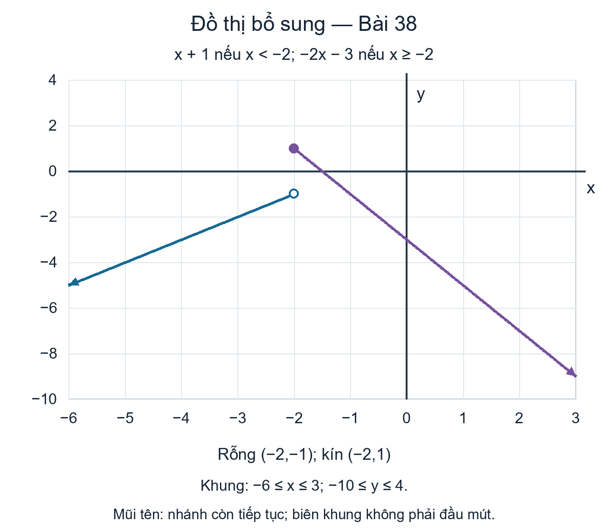
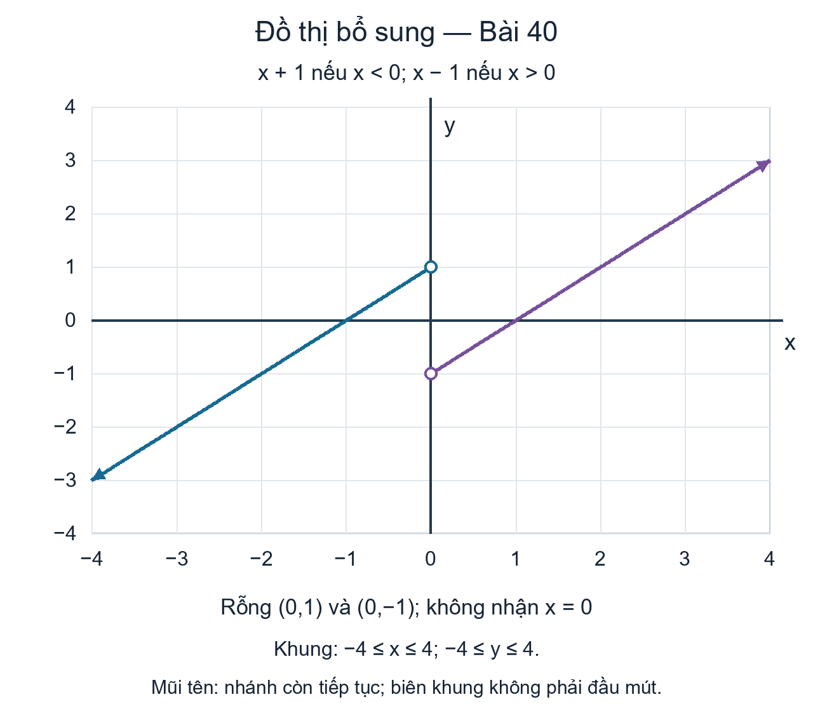
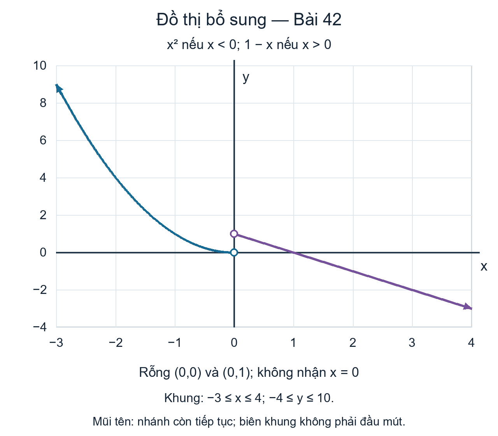
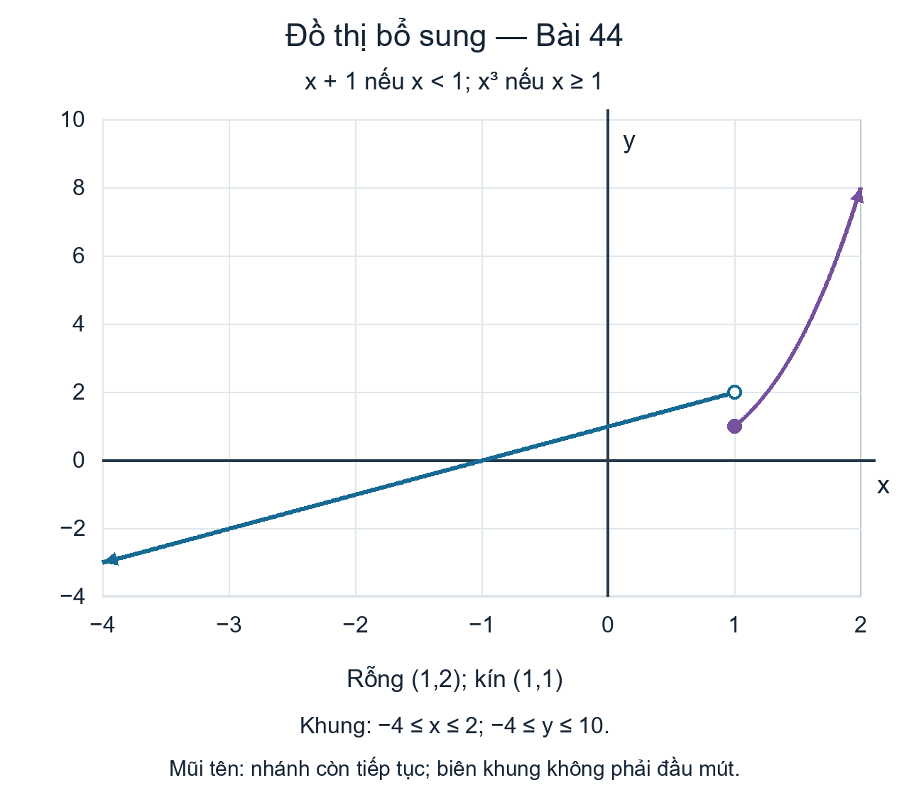

## Phạm vi và cách đọc {#vi-prerequisites}

Bài này tiếp tục nhóm bài tập đồ thị của mô-đun m49304,
gồm tám bài theo thứ tự nguồn là Bài 38–45.
Bốn bài có sẵn đáp án và hình nguồn; bốn bài còn lại có
lời giải cùng hình vẽ mới, được ghi rõ là **bổ sung**.
Không lặp lại tiêu đề chung của nhóm đã giữ ở Bài 026.

*Nhắc lại bổ sung:* Mỗi nhánh chỉ áp dụng trên phần tập
xác định được chỉ định. Tập xác định của hàm số là **hợp**
các tập đầu vào hợp lệ của từng nhánh, không phải giao các
điều kiện của những nhánh khác nhau. Tuy vậy, trong một nhánh,
phải đồng thời thỏa điều kiện của nhánh và điều kiện để
biểu thức của nó có nghĩa.

Một vòng tròn rỗng không thuộc đồ thị; điểm tô kín thuộc đồ thị.
Các hình mới chỉ dùng một cửa sổ hữu hạn để hiển thị.
Mũi tên biểu thị nhánh tiếp tục theo công thức, không biến
biên cửa sổ thành đầu mút của tập xác định.

## Các bài tập tiếp theo {#vi-exercises}

::: {#fs-id1165137785119}

Với các bài tập sau, hãy phác họa đồ thị của hàm số cho bởi
nhiều công thức. Viết tập xác định bằng ký hiệu khoảng.
:::

### Bài 38 {#fs-id1165137462167}

::: {#fs-id1165137408525}

::: {#fs-id1165137408527}

{{math:fs-id1165137408527:0}}
:::

:::

**Lời giải bổ sung — nguồn không kèm đáp án.**

Với $x<-2$, vẽ tia trên đường $y=x+1$, có đầu $(-2,-1)$
rỗng và kéo dài về phía trái dưới. Với $x\ge-2$, vẽ tia
trên đường $y=-2x-3$, có đầu $(-2,1)$ kín và kéo dài về
phía phải dưới. Vì $-2$ thuộc nhánh thứ hai, $f(-2)=1$,
không phải $-1$.

Hai phần đầu vào hợp lại là $(-\infty,-2)\cup[-2,\infty)$,
nên tập xác định là $(-\infty,\infty)$.

**Hình bổ sung — tạo mới cho Bài 38, không phải hình nguồn.**
Cửa sổ $-6\le x\le3$, $-10\le y\le4$ chỉ là vùng hiển thị.
Không nối hai đầu tại $x=-2$ bằng một đoạn thẳng đứng.

### Bài 39 {#fs-id1165137562309}

::: {#fs-id1165134328320}

::: {#fs-id1165134328322}

{{math:fs-id1165134328322:0}}
:::

:::

::: {#fs-id1165135481131}

**Đáp án nguồn.**

::: {#fs-id1165135481133}

Tập xác định: {{math:fs-id1165135481133:0}}
:::

::: {#fs-id1165137662700}

*Mô tả bổ sung cho hình nguồn:* Nhánh trái đi qua $(0,-1)$
và có mũi tên hướng trái dưới; nhánh phải đi qua $(2,3)$
và tiếp tục về phải trên. Tại $x=1$, chỉ lấy điểm $(1,2)$.
Mũi tên cho thấy các phần thẳng tiếp tục, không phải các
đoạn thẳng hữu hạn.
:::

:::

*Giải thích bổ sung:* Hợp của $x<1$ và $x\ge1$ là toàn bộ
tập số thực. Cả hai biểu thức đều là đa thức, nên không có
điều kiện loại trừ nào khác.

### Bài 40 {#fs-id1165137628033}

::: {#fs-id1165137658060}

::: {#fs-id1165137658062}

{{math:fs-id1165137658062:0}}
:::

:::

**Lời giải bổ sung — nguồn không kèm đáp án.**

Với $x<0$, vẽ tia $y=x+1$, có đầu $(0,1)$ rỗng, đi về
phía trái dưới. Với $x>0$, vẽ tia $y=x-1$, có đầu $(0,-1)$
rỗng, đi về phía phải trên.

Không nhánh nào nhận $x=0$. Vì vậy tập xác định là
$(-\infty,0)\cup(0,\infty)$; không được tự gán $f(0)$
bằng 1 hoặc $-1$.

**Hình bổ sung — tạo mới cho Bài 40, không phải hình nguồn.**
Cửa sổ $-4\le x\le4$, $-4\le y\le4$ không giới hạn các tia.
Hai vòng tròn rỗng cùng có hoành độ 0; không nối chúng để
lấp đầu vào bị loại.

### Bài 41 {#fs-id1165135641679}

::: {#fs-id1165135641681}

::: {#fs-id1165133402089}

{{math:fs-id1165133402089:0}}
:::

:::

::: {#fs-id1165137500956}

**Đáp án nguồn.**

::: {#fs-id1165135532432}

Tập xác định: {{math:fs-id1165135532432:0}}
:::

::: {#fs-id1165137474386}

*Mô tả bổ sung cho hình nguồn:* Nhánh hằng kéo dài sang trái;
nhánh căn bậc hai kéo dài sang phải, với đầu ra không âm.
Tại 0, lấy $(0,0)$ chứ không lấy $(0,3)$.
:::

:::

*Giải thích bổ sung:* Nhánh thứ nhất nhận mọi $x<0$.
Điều kiện của nhánh thứ hai là $x\ge0$, đồng thời cũng là
điều kiện để $\sqrt{x}$ có nghĩa. Hợp hai phần là
$(-\infty,\infty)$. Sự có mặt của căn bậc hai trong **một
nhánh** không loại các đầu vào âm đã được nhánh hằng nhận.

### Bài 42 {#fs-id1165135192719}

::: {#fs-id1165135192721}

::: {#fs-id1165137400953}

{{math:fs-id1165137400953:0}}
:::

:::

**Lời giải bổ sung — nguồn không kèm đáp án.**

Với $x<0$, lấy phần bên trái của parabol $y=x^2$, có đầu
$(0,0)$ rỗng và tiếp tục về trái trên. Với $x>0$, vẽ tia
$y=1-x$, có đầu $(0,1)$ rỗng và đi về phải dưới.

Cả hai điều kiện đều loại $x=0$, nên tập xác định là
$(-\infty,0)\cup(0,\infty)$. Không thêm điểm kín nào trên
trục đứng để nối các nhánh.

**Hình bổ sung — tạo mới cho Bài 42, không phải hình nguồn.**
Cửa sổ $-3\le x\le4$, $-4\le y\le10$ chỉ dùng để hiển thị.
Điểm $(0,0)$ bị loại, nhưng điều này không cấm giá trị đầu ra
0: điểm $(1,0)$ vẫn thuộc nhánh thứ hai.

### Bài 43 {#fs-id1165137594981}

::: {#fs-id1165135210029}

::: {#fs-id1165135210031}

{{math:fs-id1165135210031:0}}
:::

:::

::: {#fs-id1165137667233}

**Đáp án nguồn.**

::: {#fs-id1165135382142}

Tập xác định: {{math:fs-id1165135382142:0}}
:::

::: {#fs-id1165135188662}

*Mô tả bổ sung cho hình nguồn:* Phần parabol chỉ dùng công thức
$x^2$ khi $x<0$; phần thẳng chỉ dùng $x+2$ khi $x\ge0$.
Tại 0, lấy $(0,2)$, không lấy $(0,0)$.
Mũi tên trên phần thẳng chỉ sự tiếp tục của một tia, không
phải đầu mút hữu hạn của một đoạn thẳng.
:::

:::

*Giải thích bổ sung:* Hai phần đầu vào là $(-\infty,0)$
và $[0,\infty)$; hợp của chúng là toàn bộ tập số thực.
Các biểu thức đều có nghĩa trên phần đã chỉ định.

### Bài 44 {#fs-id1165137571389}

::: {#fs-id1165137433000}

::: {#fs-id1165137433002}

{{math:fs-id1165137433002:0}}
:::

:::

**Lời giải bổ sung — nguồn không kèm đáp án.**

Với $x<1$, vẽ tia trên đường $y=x+1$, có đầu $(1,2)$
rỗng và kéo dài về trái dưới. Với $x\ge1$, lấy phần
đồ thị $y=x^3$ bắt đầu ở điểm kín $(1,1)$ và tăng về
phía phải trên. Nhánh thứ hai là một đường cong bậc ba,
không phải tia thẳng.

Vì nhánh thứ hai nhận $x=1$, ta có $f(1)=1$.
Hợp của $(-\infty,1)$ và $[1,\infty)$ là
$(-\infty,\infty)$, chính là tập xác định.

**Hình bổ sung — tạo mới cho Bài 44, không phải hình nguồn.**
Cửa sổ $-4\le x\le2$, $-4\le y\le10$ không phải tập xác
định của hàm số. Không nối hai đầu tại $x=1$.

### Bài 45 {#fs-id1165137407891}

::: {#fs-id1165137554125}

::: {#fs-id1165137554127}

{{math:fs-id1165137554127:0}}
:::

:::

::: {#fs-id1165137401041}

**Đáp án nguồn.**

::: {#fs-id1165134252896}

Tập xác định: {{math:fs-id1165134252896:0}}
:::

::: {#fs-id1165135432997}

*Mô tả bổ sung cho hình nguồn:* Với $x<2$, phải giữ cả phần
$x<0$ lẫn phần $0\le x<2$ của đồ thị giá trị tuyệt đối;
đỉnh $(0,0)$ thuộc đồ thị. Với $x\ge2$, dùng nhánh hằng 1.
Tại $x=2$, lấy $(2,1)$ chứ không lấy $(2,2)$.
:::

:::

*Giải thích bổ sung:* Hợp của $(-\infty,2)$ và $[2,\infty)$
là toàn bộ tập số thực. Dấu giá trị tuyệt đối không đặt ra
điều kiện loại trừ đầu vào thực nào.

## Tự kiểm tra và nguồn {#vi-attribution}

*Phần bổ sung:* Sau khi chọn nhánh, hãy tính tung độ đầu mút
bằng chính biểu thức của nhánh đó rồi xét dấu bất đẳng thức
để chọn điểm kín hay rỗng. Một đầu mút rỗng của nhánh này
không quyết định đầu vào ấy có được nhánh khác nhận hay không.

Chương trình đi kèm kiểm tra việc giữ nguồn, điều kiện nhánh,
các đầu mút và những giá trị mẫu. Các phép thử hữu hạn không
thay thế lập luận cho toàn bộ tập xác định.
Bốn hình mới được tạo bằng mã chương trình có thể tạo lại
cùng hình; những hình này được đánh dấu riêng với bốn ảnh
đáp án nguồn không thay đổi.

Nguồn: Jay Abramson và các cộng tác viên OpenStax, *Precalculus 2e*,
mô-đun m49304, UUID 1ca91f2c-f989-40da-b8cc-b930d5c0ad36;
[phiên bản được ghim](https://github.com/openstax/osbooks-college-algebra-bundle/tree/789b54099106b071d1d32bfcee454fed72eb4768).
Đối chiếu với [ấn bản Bahasa Indonesia](https://github.com/KokunoYumeto/openstax-precalculus-2e-id)
0.1.0-alpha.58-reader.1.

Văn bản, bản dịch, phần bổ sung, bốn ảnh nguồn và bốn hình
tạo mới A30 theo [CC BY-NC-SA 4.0](https://creativecommons.org/licenses/by-nc-sa/4.0/).
Ảnh nguồn: Copyright Rice University, OpenStax. Giữ ghi công,
chia sẻ tương tự và các thông báo trong notices/; các sách
khác giữ giấy phép riêng. Bản dịch độc lập, không được tác
giả nguồn bảo trợ; thực hiện với sự hỗ trợ của OpenAI Codex
theo yêu cầu người dùng, chưa có thẩm định của người bản ngữ.

Bài này bắt đầu ở chỉ dẫn fs-id1165137785119, dịch tám bài
đến fs-id1165137407891 và dừng trước nhóm bài tập số
fs-id1165134118450. Không lặp lại phần đồ thị đã dịch trong
Bài 026. Mô-đun m49304, sách A30 và toàn bộ lộ trình năm sách
vẫn còn các phần cần tiếp tục.
